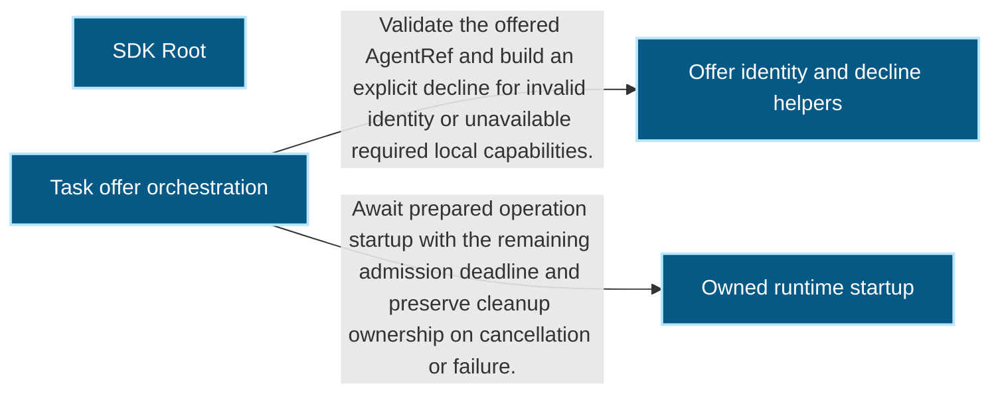
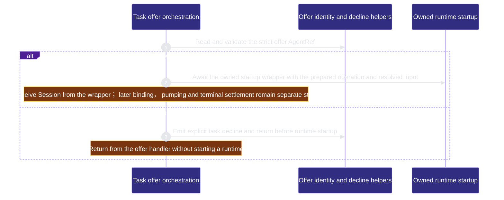

# sdk/sdk-root 架構文檔

<!-- BEGIN ARCHCONTEXT:generated target="projection_target.entity.capability-sdk-sdk-root" sourceDigest="sha256:b529778eefbc69b17bb089e832735ad1e7f2df5d56b635619f6d4b074941f00b" rendererVersion="archcontext.docs-renderer/v4" outputDigest="sha256:8222fcd9af4f9c98f517da7bef7d2e7d4598d5b86469f723f04a6d54ce6f0f53" -->
> **狀態**:`active`
> **Capability ID**:`capability.sdk.sdk-root`(kind `capability`)
> **Matched Prefixes**:`packages/**`
> **Local Contracts**:`packages/AGENTS.md`、`packages/CLAUDE.md`
> **事實優先級**:倉庫當前狀態 > 本文檔機器區 > 本文檔人工區。機器區(引言、§1、§2)由 ArchContext 從架構模型與源碼度量投影生成,手改會在下次投影被覆蓋。本文檔不記錄出處;本次投影所驗證的 commit 見 `docs/architecture/.projection-manifest.json`。

Owns the existing SDK packages and their public namespace documentation and tests.

## 1. P1:能力架構地圖

### 1.1 架構圖

- Proof: `proven` (`sha256:30b54e202b5c6fed844ccf2cb53375674947246b514d7db9886000e60fb1d069`).
- Semantic nodes: `4`; declared relations: `2`.

### 1.2 模組職責表

- 未宣告 `source.entrypoints`,入口清單無法從架構模型推導。

### 1.3 規模信號

- 規模量級:`1000–2000` 個文件 / `200k–500k` 行
- 匹配前綴:`packages/**`
- 推導:掃描 `source.include` 減 `source.exclude`,跳過 `.git/` 與 `node_modules/`,再按 1–2–5 階梯分桶。精確計數不入本文檔:量級足以回答「這個能力有多大」,而逐行計數會讓覆蓋範圍內任何一次源碼改動都改寫本文檔。

### 1.4 依賴邊界

出向關係:

- 無。

入向關係:

- 無。

## 2. P2:端到端數據流

> **Proof**: `proven` (`sha256:30b54e202b5c6fed844ccf2cb53375674947246b514d7db9886000e60fb1d069`); selectors `3/3`.

<!-- END ARCHCONTEXT:generated target="projection_target.entity.capability-sdk-sdk-root" -->

## 3. P3:設計決策與不變量

The existing `packages/**` capability is retained as repository-level SDK ownership. It is broader than the published `byok-sdk` umbrella package: `packages/sdk/src/index.ts` exports dispatch namespaces and deliberately excludes the independently scoped credential plane `@byok-sdk/keys`. Package and runtime responsibilities remain documented in [the SDK architecture](../../sdk-architecture.md) and [the authority ADRs](../../adr-2026-09-03-domain-model-and-authority.md); this adoption does not repartition public packages.

The generated map is a representative local execution slice, not an exhaustive diagram of every SDK subsystem. `TaskRunner.handleOffer` calls the same-file AgentRef/decline helpers and the owned runtime-start wrapper. The helper component shares its source file with the orchestrator; it is not another service or admission implementation. The three selectors prove those direct calls and their declared branches. Dynamic adapter preparation/start, network delivery, persistence and model generation require their separate tests and runtime evidence.

`handleOffer` deduplicates an already-owned task, checks strict Agent identity, prepares the selected adapter, seals its manifest before claim, resolves input, then awaits owned startup. Invalid Agent identity is declined before startup. A startup timeout withdraws admission and retains disposal responsibility; it is not a quiescence receipt. At higher concurrency the real constraints remain runtime ownership, workspace leases and bounded task resources, rather than an additional execution state machine.

C07's proposed pre-Execution full-request preparation API remains a separate unimplemented contract. This flow begins after an SDK offer exists. The offline preparation/consume spike proves its controlled native request seam only; it does not authorize production budget configuration.

## 4. 歷史決策記錄(append-only)

## Optimization Backlog
