# BYOK SDK 架构文档

> 状态：基于 `main` 工作树的架构复核稿。
> Verified against: main@880e69f（2026-08-08）
> Verification scope: CURRENT sections + package graph + completed-slice status
> Volatile workflow status: see tasks/current.md; not duplicated here
> 面向对象：嵌入 BYOK 能力的 SaaS 开发者、SDK 维护者、安全审计与部署人员。
> 事实优先级：实际源码与 package public surface > `docs/protocol.md` / `docs/security.md` > `docs/spec.md` > 最终平台提案。RAFT 只作为受限参考，不是产品真相源。

## 0. 阅读约定与结论

本文刻意把四种状态分开，避免把规划画成现状：

| 标记 | 含义 |
| --- | --- |
| **已实现、已接线** | 当前源码存在，并位于真实 runtime path |
| **已实现、隔离** | 当前源码存在，但没有进入主 dispatch runtime path |
| **已实现、保留字段** | schema/API 已存在，但当前没有生产消费者 |
| **目标设计** | 只存在于最终平台提案，尚未成为 workspace package 或部署实现 |
| **RAFT 参考** | 从官方资料或静态拆解得到的外部实现事实；只用于设计对位 |

当前系统有两条安全模型完全不同的产品线：

- Agent dispatch plane：`@byok/protocol` + `@byok/server` + `@byok/client`。SaaS 只提出任务，本机 daemon 才是执行权威；这条链承诺 credential isolation。
- Provider key plane：`@byok-sdk/keys`。它主动保管 provider API key 并直连 model provider；当前已实现，但在仓库内没有任何 dispatch 包或 example import 它。

目标平台新增的 `@byok/core` 与 `@byok/cloud` 已落地，把可组装契约、mailbox、board、truth record 与多租户边界独立出来。`@byok/core` 于 2026-08-07（S2）成为 zod-only、protocol-free、Node-free workspace package；`@byok/cloud` 消费其 hosted contracts，S6-c 再让 `@byok/client` 消费同一个 proof canonicalizer 与 truth selector types，避免两份签名字节权威。`server`/`keys` 尚未接线到 core。`@byok/cloud` 已具无状态 device surface、board/presence/activity、proof-only truth routes；本机 durable journal 位于 client，生产 durable composition 位于 `@byok/cloud-postgres`。本文在第 12 节记录执行状态。

## 1. P1：全局架构地图

### 1.1 当前运行时系统边界

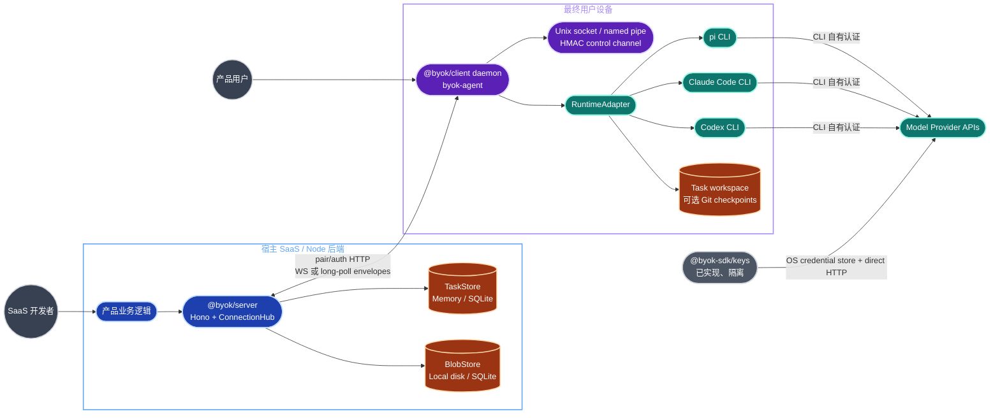

真实入口与权威面：

| 边界 | 入口 | 权威或最终副作用 |
| --- | --- | --- |
| SaaS embed | `createByokServer(options)` | 生成 Hono app、WS attach、dispatch/task/device/event/stats API |
| 本机 library | `createDaemon()` / `createDaemonWithAdapters()` | 配对、连接、任务执行、observer、service lifecycle |
| 本机 CLI | `byok-agent` | pair/start/status/runtimes/tasks/workspaces/unpair/approval/service commands |
| Approval helper | `byok-approval-mcp` | Claude confirm 模式的 stdio MCP 子进程，经 control socket 回调 daemon |
| Wire contract | `@byok/protocol` public index | envelope、17 类消息、HTTP schema、状态机、capability flags |
| Key custody | `ProviderRegistry` | profile 与 secret 分库存储，构造 OpenAI-compatible / Anthropic client |

### 1.2 Monorepo 与依赖图

仓库是 Node `>=20`、pnpm workspace。六个 package（`client`/`cloud`/`core`/`keys`/`protocol`/`server`）都可独立 build/package，但仓库本身不能证明它们已经发布到 npm。下图画 dispatch、key 与 hosted cloud 三条线；`@byok/core` 当前有 `cloud` 与 `client` 两个 runtime consumer，`server`/`keys` 的目标边见 §12.1。

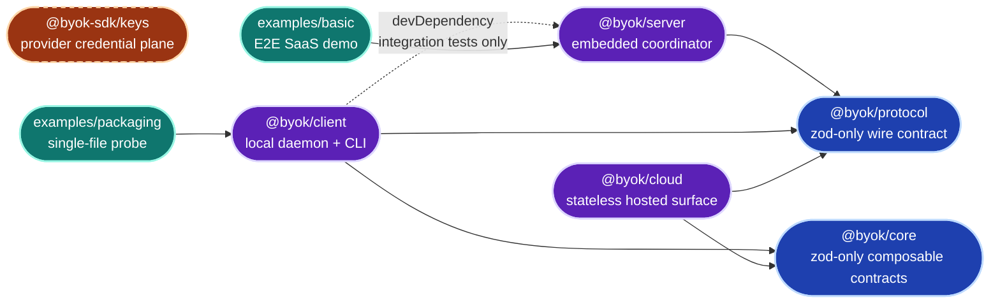

规模信号来自当前 TypeScript 源码：

| package | 生产 TS files / LOC | test files / LOC | 设计压力 |
| --- | ---: | ---: | --- |
| protocol | 11 / 1,389 | 9 / 2,246 | 小而冻结；跨端契约变化风险最高 |
| server | 16 / 4,926 | 26 / 6,638 | `ConnectionHub` 集中持有 embedded authority |
| client | 75 / 21,313 | 101 / 23,655 | 最大模块；runtime、IPC、service、Git、transport 与 S6 local truth path 都在此包 |
| keys | 18 / 2,718 | 15 / 2,958 | 独立 key-custody 安全模型 |
| core | 23 / 3,467 | 5 / 1,019 | S2 契约层；InMemory 参考实现，consumer 是 `cloud` 与 `client`；共享 conformance 已移到独立 package |
| cloud | 42 / 5,045 | 10 / 3,003 | stateless hosted surface；device/board/truth handlers + InMemory 组合，消费 `core` 与 `protocol` |

统计口径：生产列排除 `*.test.ts`、`*.spec.ts` 与 `src/__tests__/` 整棵子树；test 列取 `src/*.test.ts`、`*.spec.ts` 与 `src/__tests__/` 下的全部 `.ts`，因此 `server` 的 test 列含 `src/__tests__/test-support.ts`、`client` 的含 `src/__tests__/fixtures/*.ts` 这类不含断言的测试支撑文件。六个 package 的复算命令：

```bash
SDK_SRC=packages/server/src
find "$SDK_SRC" -type f -name '*.ts' ! -name '*.test.ts' ! -name '*.spec.ts' ! -path '*/__tests__/*' -print | sort
find "$SDK_SRC" -type f \( -name '*.test.ts' -o -name '*.spec.ts' -o -path '*/__tests__/*.ts' \) -print | sort -u
```

对两组结果分别执行 `wc -l` 得 file count，执行 `xargs wc -l` 取合计 LOC；替换 `SDK_SRC` 即可复算其余五个 package。

强依赖是 `server → protocol`、`client → protocol/core` 与 `cloud → core/protocol`；弱依赖是 `client -dev→ server`。当前的依赖 invariant 清单：

- `core !→ protocol`、`core !→ node`：core 必须保持 protocol-free、Node-free，由包内 constraint test 执行（ADR-003）。
- `client → core`（S6-c 当前事实）：只消费 proof canonicalizer 与 truth selector contracts，不依赖 cloud implementation。
- `server/keys !→ core`（当前事实）：尚未接线，不是永久禁令，其目标边见 §12.1。
- `cloud → core`、`cloud → protocol`（当前事实）：`packages/cloud/src/**` 真实 import 这两个包。
- `keys` 与 dispatch 三包之间的零边是安全 invariant，不是尚未整理的偶然状态。

### 1.3 交付与非运行时表面

| 位置 | 角色 | 当前状态 |
| --- | --- | --- |
| `examples/basic` | 嵌入 `@byok/server` 的 Hono demo + browser API/SSE UI | 已实现；可用 `BYOK_STORE=sqlite` 切换持久层 |
| `examples/packaging` | 单文件打包 probe | 已实现；只做 daemon status 与 Pi detection，不 pair/start/network |
| `templates/packaging/bun` | `bun build --compile` copy-out recipe | 已实现；含 build/smoke |
| `templates/packaging/sea` | Node SEA + esbuild/postject recipe | 已实现；含跨平台边界说明与 smoke |
| `templates/service` | launchd/systemd/WinSW reference recipes | 已实现；真正执行逻辑在 `packages/client/src/lifecycle/*` |
| `deploy/` | env/release/runbook/scripts/sql/submissions 骨架 | 只有 README + 6 个 `.gitkeep`，无可部署实现 |
| `.github/workflows/ci.yml` | Node 20/22 build/typecheck/test + 专项 smoke/audit | 已实现 |

## 2. `@byok/protocol`：唯一 wire 契约

### 2.1 模块与公开功能


| 文件 | 主要 exports / 功能 |
| --- | --- |
| `version.ts` | `PROTOCOL_VERSION = 1`、`CAPABILITY_FLAGS` |
| `messages.ts` | runtime info、17 个 payload schemas、direction type lists、`MESSAGE_PAYLOAD_SCHEMAS` 单一来源 |
| `envelope.ts` | discriminated union；所有 `task.*` 必须有 `task_id`，server→daemon 必须有 envelope `seq` |
| `codec.ts` | `parseMessage`、`decodeEnvelope`、`encodeEnvelope`、`createEnvelope` |
| `agent-event.ts` | 8 个已知 event、unknown wrapper、`isKnownAgentEvent`、`partitionAgentEvents` |
| `permission.ts` | `auto/confirm/readonly/plan` 与 `.strict()` policy schema |
| `task-state.ts` | 7 态、合法转移表、`canTransition` |
| `blob.ts` | `sha256:<64hex>` 内容地址 |
| `http-api.ts` | pair/challenge/token/blob/events/messages DTO；消息 POST batch 上限 256 |
| `errors.ts` | parse、unknown type、validation 三类错误 |

### 2.2 17 个消息类型

| 分组 | 类型 |
| --- | --- |
| connection | `conn.hello`、`conn.ack` |
| server → daemon | `task.offer`、`task.approve`、`task.reject`、`task.cancel`、`task.steer` |
| daemon → server lifecycle | `task.claim`、`task.started`、`task.decline`、`task.await_approval`、`task.complete`、`task.fail`、`task.cancelled` |
| daemon → server data | `task.progress`、`task.artifact`、`task.approval_resolved` |

`task.offer.workspaceHint` 是**已实现、保留字段**：protocol schema 已有，但 public `DispatchInput`、TaskRunner 与 adapters 都没有消费它，不能把它描述成工作区选择能力。S0 已就此做出决策——维持 reserved，wire 上保留（删除是 breaking 的 v1 变更，留着的成本只是一个被忽略的 optional key），并禁止任何文档、SDK surface 或 UI 声称它能选工作区。接线需要另立 ADR 先定 resolver 设计：与 `sessionRef` 派生映射的优先级、路径校验与 confinement、设备无法满足 hint 时的行为（附录 A 的 ADR-023）。

### 2.3 执行状态机

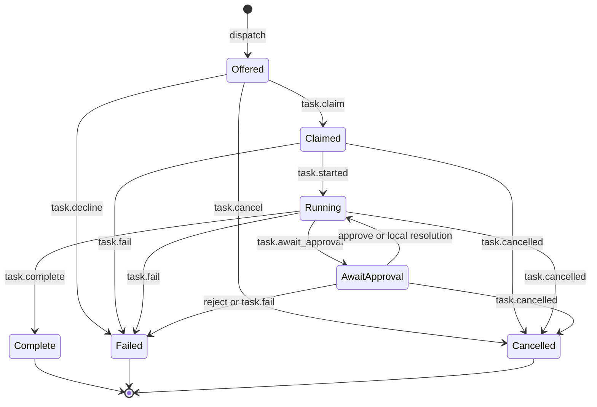

`Claimed` 与 `Running` 分离，防止“认领成功”掩盖 runtime 启动失败。`task.decline` 语义独立，但状态落到 `Offered → Failed`；`reason/retryable` 决定是否可以换设备重试。`Complete/Failed/Cancelled` 都是终态。

### 2.4 Freeze 与兼容边界

- wire `v1` 已冻结，freeze 由两道门禁分别执行，不是一句"golden 不漂移"：
  - **wire corpus**（`packages/protocol/src/__tests__/golden/v1.envelopes.ndjson`）byte-for-byte 冻结，任何 diff 都是回归。
  - **schema fingerprint**（`packages/protocol/src/__tests__/golden/v1.frozen.json`）只能经显式批准的 additive amendment 更新；历史上已发生一次：`ac92acb` 加入 additive 的 `task.claim.capabilities`。
- breaking shape change 必须升 major，不允许靠改 fingerprint 就地放行。
- 普通 optional field、新 message type、新 `AgentEvent`、新 capability flag 可 additive 增加。
- 例外：`PermissionPolicySchema` 与 instruction blob-ref 是 `.strict()` control/security shape；增加字段本身就是 breaking。
- observability unknown 可忽略；control/security unknown 必须 fail-closed。
- server 支持 N 与 N-1 major。当前只有 v1，所以该能力目前是 no-op。

## 3. `@byok/server`：embedded coordinator

### 3.1 组成与所有权

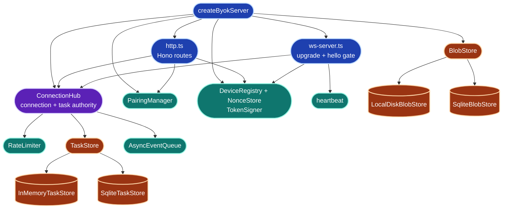

`createByokServer()` 返回：

- `hono` 与 `attachWebSocket(server)`；
- `pairing.createPairingCode()`；
- `dispatch(input) → Promise<TaskHandle>`；
- `tasks.get/list`、`machines.list`、`events.subscribe`；
- `devices.revoke`、`stop`、`stats`。

默认是 `InMemoryTaskStore + LocalDiskBlobStore`；SQLite variants 是可注入持久层。`TaskStore` 是同步接口，`BlobStore` 是 async 接口。SQLite 只能恢复记录，不能恢复 hub 内的 promise、event queue、connection map 与 in-flight runtime。

### 3.2 HTTP、WS 与内核职责

| 模块 | 已实现功能 |
| --- | --- |
| `http.ts` | pair/challenge/token、blob upload/download/content、events poll、messages POST、可选 healthz |
| `ws-server.ts` | Bearer upgrade、首帧 `conn.hello`、protocol/product/device 校验、heartbeat |
| `hub.ts` | per-device transport、outbox/redelivery、inbound ownership/dedup/type gate、task transitions、approval/cancel/steer、lease reaper、stats |
| `auth.ts` | HMAC JWT、Ed25519 signature verify、device revoke、single-use nonce |
| `pairing.ts` | 约 10 分钟 TTL 的 single-use code |
| `rate-limiter.ts` | per-device in-process token bucket |
| `task-store.ts` | transition CAS-like validation 与 pending approval id |
| `blob-store.ts` | signed URL、content write/read、size/hash boundary |

`ConnectionHub` 是 embedded 部署的真正权威；Hono 与 WS 层都把合法输入收敛到它。它不是可水平扩展的 cloud runtime：连接、outbox、dedup window、waiter、task activity 与 event queue 都在单进程内。

### 3.3 已知边界

- M0/M5 embedded 模式不支持 queue-until-connect；设备从未连上时 `dispatch` 直接失败。
- task lease 只在设备已 dark 且 `Claimed/Running/AwaitApproval` 自最后活动满 `taskLeaseMs` 后触发，结果是 retryable failure。
- `steer` 已是 **task-level gate（已实现、已接线）**：claim 时 hub 把 `task.claim.capabilities`——claiming adapter 在拿下这个 task 那一刻的自报——快照写入 task record（`TaskSnapshot.claimedRuntimeCapabilities`，SQLite 以 `claimed_runtime_capabilities_json` 列持久化），`steerTask()` 按 unknown task → 终态 `task_terminal` → 非 Running `task_not_running` → 快照 `steer !== true` 的顺序判定，最后一档抛 typed `SteerRejectedError`（code `steer_unsupported_runtime`），在构造 envelope 之前就拒绝，unsupported 时零 envelope 上 wire。
- 快照**只有这一个来源**。hub 在 claim 和 steer 两处都不读任何 connection 状态：不读 `getDeviceCapabilities()` 的 connection-level flag，不读 `ConnectionState.runtimes`，claim 没带 capabilities 时也不回头去查。`conn.hello.runtimes[].capabilities` 退回纯 discovery——它描述的是设备而不是 task，而且是 transport-shaped：`conn.hello` 只有 WS transport 发（`ws-transport.ts`），long-poll-only daemon 从不发送，拿它当 gate 输入等于对整条 long-poll 部署面结构性失明（sprint D-4 的成因，机检守卫见 `steer-runtime-capability-gate.test.ts` 的「connection-advertised capabilities cannot feed the steer gate」块与 client 侧 `real-server-longpoll-steer.test.ts`）。
- 快照缺失一律 fail-closed，不造默认值：pre-D-4 daemon 的 claim 不带 `capabilities`（wire 上是 additive optional 字段），S0 之前 claim 的旧 record 同样没有，两者都判为 unknown 而拒绝 steer。这是 fail-closed，不是 fallback——undefined 意为「本 server 不知道」，绝不等价于 true，也不按 runtime id 猜。
- client 侧对仍然收到的 unsupported steer（伪造或 pre-gate 消息）记为非重试性 protocol/authority 错误并正常 ack，cursor 照常推进，不再冻结重放。

## 4. `@byok/client`：本机 daemon、CLI 与 runtime boundary

### 4.1 分层地图

```mermaid
flowchart TB
  classDef cli fill:#1e40af,stroke:#bfdbfe,stroke-width:2px,color:#fff
  classDef daemon fill:#5b21b6,stroke:#ddd6fe,stroke-width:2px,color:#fff
  classDef adapter fill:#0f766e,stroke:#99f6e4,stroke-width:2px,color:#fff
  classDef local fill:#9a3412,stroke:#fed7aa,stroke-width:2px,color:#fff
  classDef utility fill:#374151,stroke:#d1d5db,stroke-width:2px,color:#fff

  subgraph Entry["Public entrypoints"]
    direction LR
    API(["index.ts<br/>library surface"]):::cli
    AgentCLI(["byok-agent CLI"]):::cli
    ApprovalCLI(["byok-approval-mcp"]):::cli
  end

  subgraph Core["Daemon orchestration"]
    direction TB
    Create(["create-daemon.ts"]):::daemon
    Auth(["AuthManager"]):::daemon
    Conn(["ConnectionManager"]):::daemon
    Runner(["TaskRunner"]):::daemon
    Observer(["DaemonObserver"]):::daemon
    Control(["control server + protocol"]):::daemon
    Approval(["ApprovalRegistry"]):::daemon
    Batch(["ProgressBatcher"]):::daemon
  end

  subgraph Runtime["Runtime adapters"]
    direction LR
    Pi(["PiAdapter<br/>RPC session"]):::adapter
    Claude(["ClaudeAdapter<br/>stream-json + MCP approval"]):::adapter
    Codex(["CodexAdapter<br/>codex exec per turn"]):::adapter
  end

  subgraph Local["Local state and OS integration"]
    direction LR
    Stores[("device / cursor / session stores")]:::local
    Git[("Git workspace + private ledger")]:::local
    IPC[("Unix socket / named pipe")]:::local
    Service(["launchd / systemd / WinSW"]):::local
    Secure(["secure dir + atomic write"]):::utility
  end

  API --> Create
  AgentCLI --> Create
  AgentCLI --> Service
  ApprovalCLI --> Control
  Create --> Auth
  Create --> Conn
  Create --> Runner
  Create --> Observer
  Create --> Control
  Runner --> Approval
  Runner --> Batch
  Runner --> Pi
  Runner --> Claude
  Runner --> Codex
  Auth --> Stores
  Conn --> Stores
  Runner --> Git
  Control --> IPC
  Stores --> Secure
  Git --> Secure

  style Entry fill:none,stroke:#60a5fa,stroke-width:2px,color:#60a5fa
  style Core fill:none,stroke:#a78bfa,stroke-width:2px,color:#a78bfa
  style Runtime fill:none,stroke:#2dd4bf,stroke-width:2px,color:#2dd4bf
  style Local fill:none,stroke:#fb923c,stroke-width:2px,color:#fb923c
```

### 4.2 Public surface 与 CLI

Library exports 分成六组：

| 组 | 主要 public API |
| --- | --- |
| daemon | `createDaemon`、`createDaemonWithAdapters`、`Daemon*`、`AuthManager`、`DeviceRevokedError`、`BlobClient` |
| adapter contract | `RuntimeAdapter`、`Session`、`TaskContext`、`RuntimeCapabilities`、`PolicyUnsupportedError` |
| bundled adapters | `PiAdapter`、`ClaudeAdapter`、`CodexAdapter` 与 options |
| observability | `DaemonObserver`、event/task projection types |
| Git workspace | `GitWorkspaceManager`、`GitWorkspaceStore`、ledger/lease/observation types |
| OS integration | service lifecycle factories/generators、`ensureSecureDir`、Windows DACL error |

`byok-agent` 命令面：

| 类别 | 命令 |
| --- | --- |
| identity/runtime | `pair`、`unpair`、`status`、`runtimes` |
| task/operator | `tasks`、`workspaces`、`approvals`、`approve`、`reject` |
| daemon | `start` |
| OS service | `install`、`uninstall`、`service-start`、`service-stop`、`service-status` |

`@byok/client` 的 runtime dependencies 是 `@byok/protocol`、`@byok/core` 与 `ws`；core 只提供 frozen proof bytes 与 truth contract types，client 不依赖 `@byok/cloud`。另有 optional `@earendil-works/pi-coding-agent`，并被 tsup 标记 external。Claude/Codex 永远依赖用户本机已安装且已登录的 official CLI。

### 4.3 Daemon 模块清单

| 模块族 | 职责 |
| --- | --- |
| `create-daemon.ts` | config validation、adapter build/detect、stores、TaskRunner/ConnectionManager/control server 组装、统一 shutdown |
| `auth-manager.ts` / `device-keys.ts` / `http-client.ts` | pair、challenge/token renew、Ed25519 key、401 revocation |
| `connection-manager.ts` | 单一 client outbox、WS↔long-poll mode、ack/cursor、chunking、shutdown drain |
| `ws-transport.ts` / `long-poll-transport.ts` | WebSocket heartbeat/reconnect 与 HTTP poll/post transport |
| `task-runner.ts` | offer admission、runtime selection、policy、workspace、Session event pump、approval/cancel/steer、resource limits |
| `policy.ts` / `environment.ts` | device ceiling 合并、per-runtime env allowlist、`BYOK_*` hard deny |
| `progress-batcher.ts` | normalized `AgentEvent` 批次与 task-level sequence |
| `approvals.ts` | bounded pending approval registry、first resolution wins |
| `control-server.ts` / `control-protocol.ts` | HMAC mutual auth、local RPC、endpoint/token derivation |
| `observer.ts` | local task/connection/runtime event projection；为 CLI follow 提供数据 |
| `store.ts` / `cursor-store.ts` / `session-workspace-store.ts` | device identity/token、redelivery cursor、sessionRef→workspace mapping |
| `git-workspace.ts` / `git-workspace-store.ts` | optional local checkpoints、one-writer lease、private recovery ledger |
| `blob-client.ts` | signed URL 方式上传/下载 instruction/artifact |
| `device-proof-signer.ts` / `truth-memory-client.ts` | 显式 tenant/product/key proof、metadata-only manifest、本地 selector、selected fetch/rehash/filter 与 truth write |
| `url.ts` | HTTP/WS URL conversion；remote plaintext 默认拒绝 |
| `util/*` | bounded async queue、atomic write、POSIX mode / Windows DACL hardening |

### 4.4 Runtime adapter capability matrix

| 能力 | Pi | Claude | Codex |
| --- | --- | --- | --- |
| session model | 长驻 RPC | 长驻 stream-json process | 每 turn 一次 `codex exec`，resume 开新进程 |
| resume | yes | yes | yes |
| mid-turn steer | **yes** | no，写 stdin 只会排成 follow-up | no |
| permission modes | `auto`,`readonly` | `auto`,`readonly`,`plan`,`confirm` | `auto`,`readonly` |
| confirm/approval | no，fail-closed | **已接线**：permission-prompt-tool → MCP → control socket | no，fail-closed |
| allow/deny tools | 支持 | 条件支持 | 不支持，相关 policy fail-closed |
| network control | `network:false` 不可保证 | `network:false` 不可保证 | `network:true` 不可保证 |
| usage event | 无 | input/cache/output | input/cache/output/reasoning |

Runtime policy 不做跨 runtime 的语义翻译：tool name 是 runtime-local vocabulary。adapter 无法精确表达 policy 时必须 decline，不能选择“接近的”参数继续执行。

原先已确认的 capability honesty gap（`approvalInteractive` 对所有 adapter 硬编码 `false`）**已收口**：client `RuntimeCapabilities` 的 `approvalInteractive` 改为 required 字段，由各 adapter 自己声明（Claude `true`——confirm 路径真实已接线；Pi、Codex `false`），wire `RuntimeInfo.capabilities` 由 adapter 实例生成、纯 passthrough，`create-daemon.ts` 里那张硬编码表已删除。`approvalInteractive` 与 `permissionModes` 出自同一次 `capabilities()` 调用，因而结构上一致；connection flag `interactive-approval` 仍是 reserved，无人 advertise、无人消费，不作为路由信号。

#### 三层 capability 模型

capability 至少要分三层才能表达准确。三层现在都已接线：

| 层 | 语义 | 消费者 | 状态 |
| --- | --- | --- | --- |
| device capabilities | 这台设备装了哪些 adapter | 连接握手、派工前的设备筛选 | 已实现、已接线 |
| runtime capabilities | 某个 adapter 能精确表达哪些 policy | 派工时的 runtime 选择 | 已实现、已接线（S0 起为 adapter 实际能力，不再硬编码） |
| task capabilities | 本 task 的 claimed runtime 与 effective policy 落定后，还剩哪些操作可执行 | `task.steer` 等 task 级控制面 | 已实现、已接线（claim 时快照 + steer gate） |

connection-level 的“至少一个 adapter 支持 steer”不能代表任意 running task 支持 steer，所以第三层不读任何连接级数据，而读 claim 时落在 task record 上的 `claimedRuntimeCapabilities` 快照（§3.3），其唯一来源是 `task.claim.capabilities`。gate 的输入必须与它裁决的对象同生命周期：claim 正是建立 task↔runtime 绑定的那条消息，每种 transport 都会发，所以快照对 WS 与 long-poll 一视同仁；connection 层则既错 scope（描述设备不描述 task）又缺 reach（long-poll 无 `conn.hello`）。快照而非实时查询同样是刻意的：设备重连换了一套 adapter，也不能追溯改变一个 running task 的可 steer 性。

### 4.5 启动与关闭


统一 graceful shutdown 顺序是：停止接收新 offer → bounded teardown active tasks → bounded drain outbox → stop connection/auth → close control socket。取消、shutdown RPC 与 library `stop()` 共用同一条序列，避免三套不同清理语义。

## 5. Local control plane 与 approval

### 5.1 Control socket 信任边界

Unix 使用 domain socket，Windows 使用 named pipe。client/server 各自对对方 nonce 做带 domain label 的 HMAC，shared token 只存在 `<storeDir>/control.token`，不在 socket 上明文传输。RPC 在 mutual auth 完成前结构上不可达。

RPC 面据实是 6 个方法（`packages/client/src/daemon/create-daemon.ts:979-1038`）：

| 类型 | 方法 |
| --- | --- |
| unary | `status`、`approvals.list`、`approvals.resolve`、`approvals.request`、`shutdown` |
| stream | `tasks.subscribe` |

没有 `workspaces` 方法——`bin/commands/workspaces.ts` 直接读本机 ledger，不经 control client；也没有独立的 `unpair` 方法，`bin/commands/unpair.ts` 复用 `shutdown` RPC 再清理本地身份。POSIX 依赖 0700/0600；Windows 通过 `icacls` 设置 restrictive DACL，失败抛 `SecureDirHardeningError`，不会继续写入未保护的 device/control secrets。

### 5.2 Claude confirm 真实路径

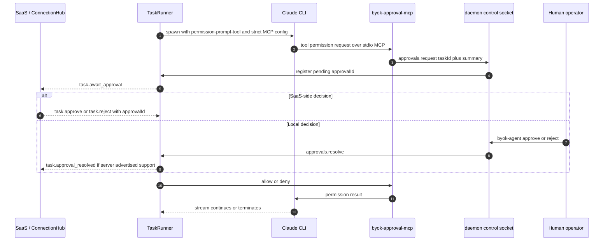

server `approve/reject` 会先改变自己的 task record，再 best-effort 通知 daemon；`approvalId` 防止迟到 decision 误命中下一笔 pending approval。Pi/Codex 的 `resolveApproval()` 直接 throw，这个 failure 不能被 fallback 隐藏。

## 6. Local Git checkpoint workspace

该功能默认关闭；唯一启用形状是：

```ts
{ gitWorkspace: { mode: 'local-checkpoints' } }
```


Git 只记录 code state，不改变 wire task state。daemon 不自动 commit、不改 identity、不执行 network Git、不 reset/stash/clean/rebase/merge/切分支，也不删除 workspace。重启只把遗留 `preparing/active` 记录标成 `interrupted`；它不会伪造协议恢复。operator view 默认隐藏路径，只有 `workspaces --show-paths` 才显示。

## 7. `@byok-sdk/keys`：独立 provider credential plane

### 7.1 架构与模块

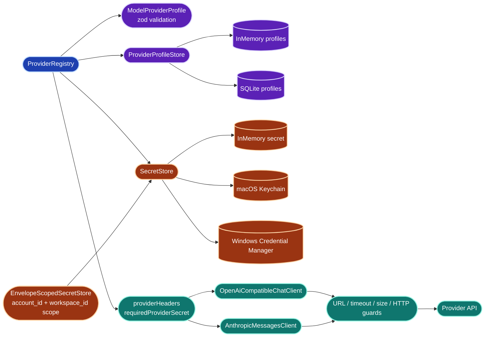

| 模块 | 已实现功能 |
| --- | --- |
| `provider-profile.ts` | provider kind、adapter、auth mode 组合验证；custom URL normalization |
| `registry.ts` | configure/remove/status/resolve；profile 与 secret 的唯一汇合点 |
| `secret-store.ts` | generic async port、memory store、secret name/value validation |
| `macos-keychain.ts` / `windows-credential-manager.ts` | OS-native secret persistence |
| `secret-scope.ts` | `SecretScope = { account_id, workspace_id }`（`packages/keys/src/secret-scope.ts:12-15`）；`secretScopeId()` 把两者 sha256 成不泄露租户标识的 namespace，`EnvelopeScopedSecretStore` 按该 id 分区。scope 里没有 tenant/product 维度 |
| `profile-store.ts` / `sqlite-profile-store.ts` | non-secret profile memory/SQLite persistence |
| `headers.ts` | bearer / x-api-key / none；缺 secret fail-closed |
| `openai-client.ts` / `anthropic-client.ts` | direct provider transports |
| `http.ts` / `url.ts` | 15s timeout、2MiB response cap、HTTP error classification、loopback/private-host guards |
| `errors.ts` | stable key-management error taxonomy |

### 7.2 数据流与隔离

`ProviderRegistry.configure()` 的顺序是先写 secret，再验证 secret 已存在，最后写 profile；status 只暴露 `secret_configured` boolean，不返回 secret。`resolve()` 只对 enabled、valid、secret-complete 的 profile 构造 transport。

`@byok-sdk/keys` 不是 daemon 的 runtime credential source。当前没有任何 `client/server/protocol/examples/templates` import site；把它画进 agent spawn environment 会直接破坏 dispatch plane 的 credential-isolation claim。

## 8. P2：端到端数据流

### 8.1 Pairing、renewal 与连接握手

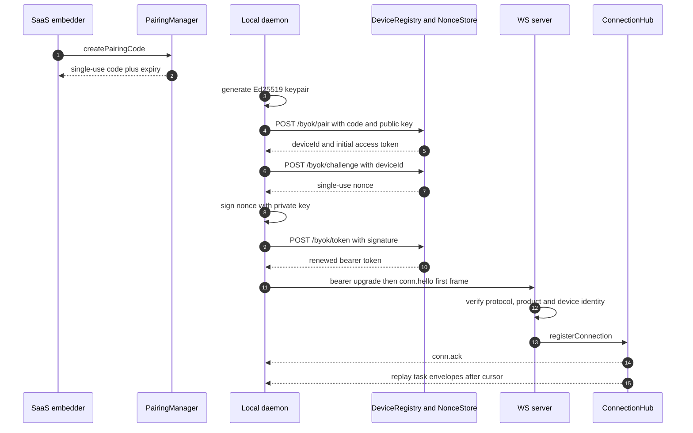

认证错误路径：无效/过期 pairing code、nonce replay、签名不符、token claims 不符都拒绝。device revoke 后 challenge/token/WS/authed HTTP 返回 401；daemon 清理本地身份并进入 `revoked`，不会无限重试。

### 8.2 Dispatch 到 terminal result

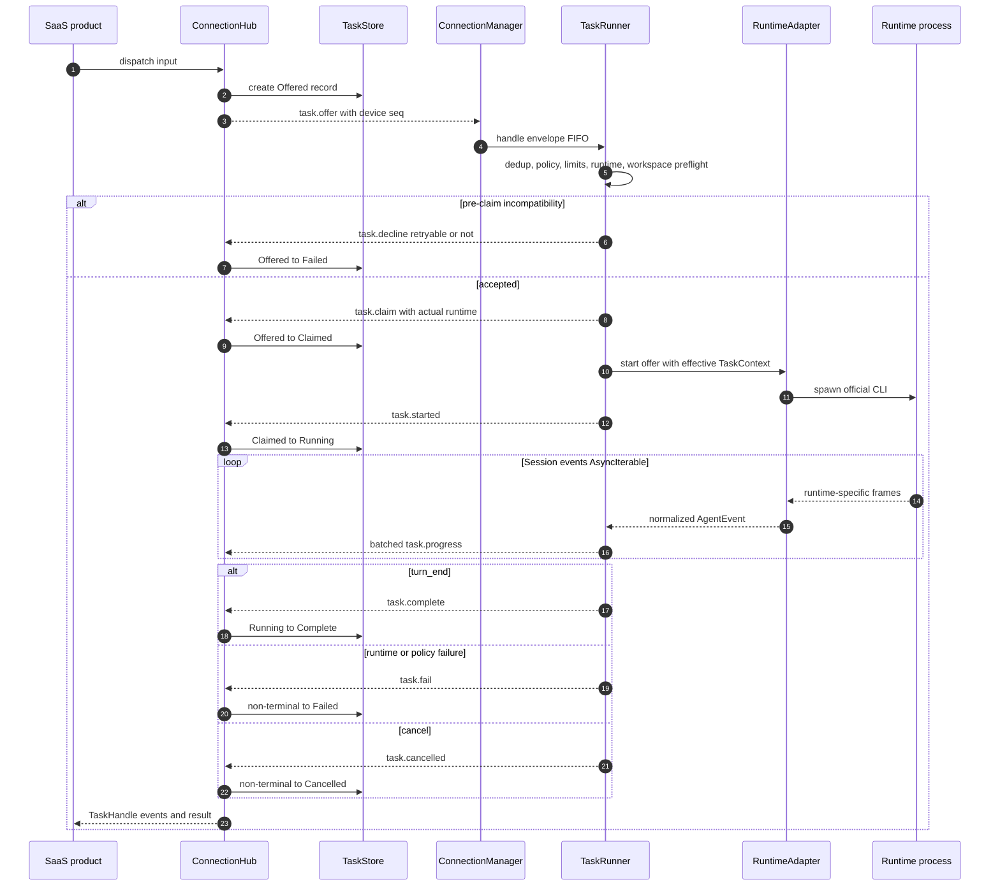

关键 ownership 变化：SaaS 创建 task；Hub 持有 embedded task record；TaskRunner 决定是否能安全执行；adapter 只拿 effective policy 与 daemon-owned workspace；runtime process 产生原始事件；adapter 归一化；server 只接受 owner device 的 daemon→server envelopes。

### 8.3 WS、long-poll 与 redelivery


两种 transport 对同一 device 互斥，last successfully connected transport wins。long-poll 是完整双向 transport，不是只读降级。cursor 只在 `task.*` handler 成功后推进；`conn.ack.seq` 不推进 cursor。失败时 watermark 冻结并 backoff，后续重放依靠 TaskRunner 与 Hub 的 idempotency。

## 9. 安全边界与资源治理

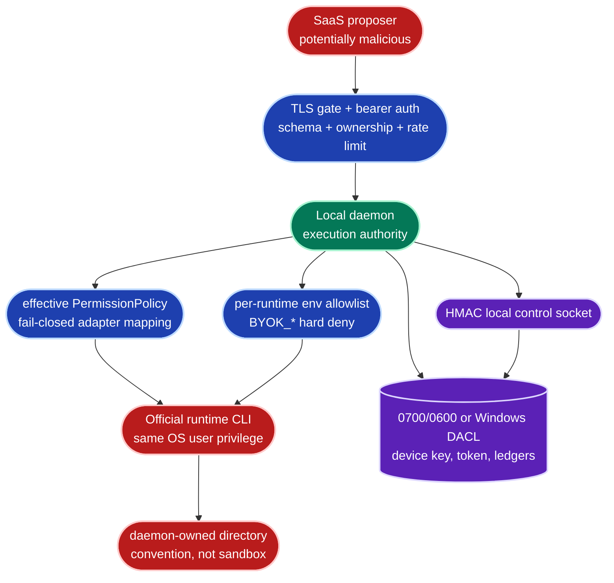

| 控制 | 保证 | 不保证 |
| --- | --- | --- |
| device auth | pairing single-use、Ed25519 nonce proof、bearer claims、revoke | 同一 OS user 读取本地 `device.json` |
| transport gate | remote plaintext 默认拒绝；WSS/HTTPS 默认路径 | SDK 自己提供 TLS termination |
| policy | device ceiling 合并；adapter 无法表达则 decline | kernel-level sandbox 或强制 filesystem confinement |
| runtime credentials | dispatch daemon 不读 runtime credential stores；ambient env 按 allowlist | 被显式 allow 的 env value 不含 secret |
| control socket | mutual HMAC、endpoint permission/DACL、method pre-auth unreachable | 同一 user 且能读 token 的恶意进程 |
| audit/observer | 只记录 task id、event type、tool/runtime name、counts/sizes | 保存完整 tool input/output 作为审计证据 |
| resource limits | max duration、max output bytes、bounded queues/collections、shutdown deadlines | cgroup/rlimit；恶意 child 一定会响应 interrupt |
| workspace | daemon-owned path、optional one-writer Git lease | runtime 无法访问 workspace 之外的路径 |

`limits.maxTokens` 当前不能由任一 bundled adapter 精确执行，因此必须在 pre-claim fail-closed，而不是估算。`workspaceRoot` 是 convention，不应被 UI 描述成 sandbox。

### 9.1 Credential isolation 的具体承诺

dispatch daemon 当前的 credential 边界由六条构成，前五条是已实现行为，第六条是 CI 层的实证（§10 第 6 层的 `strace` audit）：

- 不读取 model provider key；
- 不读取 runtime 自己的 login store；
- 不把 host/server token 注入 runtime 子进程；
- 不 import `@byok-sdk/keys`（package graph 的零边，§1.2）；
- task environment 走 per-runtime allowlist，`BYOK_*` hard deny；
- credential-isolation audit 是 release gate，不是可选检查。

**目标设计**：若未来真的出现 managed agent credential 需求，它必须独立立 ADR，并同时满足——per-launch scoped token；真 credential 不进 child env；loopback proxy 的 token file 0600；scope 最小化；mint 失败即 fail-closed。它不得改变现有 dispatch 默认的安全承诺，即默认形状仍是"daemon 不持有任何 runtime credential"。

### 9.2 Permission bypass：REJECTED

外部产品常见的 runtime bypass / yolo flag 在本项目属**明确拒绝**。BYOK 的安全边界同时保护本机与 SaaS 两侧权限，而 API scope 不能替代 filesystem/tool permission——前者管"能调哪个接口"，后者管"能碰哪个文件"。任何"为了迁就某个 runtime 而自动附加跳过核准参数"的改动一律 REJECTED，除非另立新产品模式，并配套独立的安全模型、包边界与用户明示同意。这条是 §4.4 "adapter 无法表达 policy 时必须 decline"的同一条约束在发布面的投影。

### 9.3 更新链的信任根（目标设计，宿主产品责任）

SDK 不自带 updater（§10）。宿主产品自建 updater 时，最低要求是：

- manifest 由离线或独立的 signing key 签名；
- binary hash 被该签名 manifest 覆盖；
- channel 与 pinned version policy；
- atomic swap 加 rollback；
- 平台 codesign / notarization 验证；
- anti-downgrade policy；
- audit log；
- staging quarantine；
- updater base URL 本身不能成为唯一信任根。

最后一条是拒绝 hash-only updater trust 的理由（§13）：upgrade manifest 与 binary 同源时，manifest 里的 sha256 只能证明"下载完整"，不能证明"来源可信"，二者必须来自不同的信任根。

## 10. 打包、服务与验证面

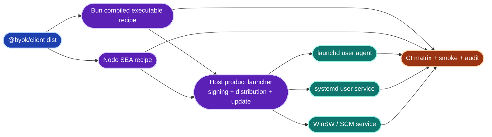

SDK 只交付 npm library 与 reference recipes。host product 拥有 binary signing、notarization、download hosting、installer、release channel 与 auto-update。service lifecycle 直接委托 OS supervisor；SDK 不在 daemon 内再造 supervisor。

CI 验证层次：

1. Node 20/22：build → typecheck → test；build 必须先跑，因为 workspace exports 指向 `dist`。
2. Windows Git workspace/store/security tests，含特殊字符路径。
3. Bun/SEA packageability smoke。
4. WinSW real service install/start/stop/uninstall smoke。
5. macOS/Linux/Windows control socket smoke。
6. Ubuntu `strace` credential-isolation audit。

## 11. 缺口帐本

优先级记号用 `Pri-0`/`Pri-1`，**刻意不复用 `P0-P5`**——后者在本文中专指 §12.8 定义的交付阶段编号，两套记号撞名会制造歧义。`Pri-0` = 阻塞其所在阶段的入口闸；`Pri-1` = 该阶段内必须收口但不阻塞进入。交付落点列的 `S0-S7` 见 §12.8 的 S↔P crosswalk。

### 11.1 当前源码缺口（已实证）

| ID | 缺口 | 架构影响 | 证据 | 当前正确表述 / 修复原则 | 优先级 | 落点 |
| --- | --- | --- | --- | --- | --- | --- |
| GAP-001 | `approvalInteractive=false` 硬编码 | wire capability 与 Claude confirm 实际能力不一致 | §4.4 | **已修复（S0）**：修复形状是 adapter-generated `RuntimeInfo`——`approvalInteractive` 成为 client `RuntimeCapabilities` 的 required 字段并由各 adapter 声明（Claude `true`），`create-daemon.ts` 的硬编码表删除；connection flag `interactive-approval` 仍 reserved | 已收口 | S0（已交付） |
| GAP-002 | task-level steer 未按 claimed runtime gate | Claude/Codex 收到 steer 会 throw，并可能 stall cursor | §3.3 | **已修复（S0）**：修复形状是 claimed-runtime snapshot gate——claim 时把所选 runtime 的 capabilities 快照写入 task record，`steerTask()` 在构造 envelope 前按快照拒绝并抛 typed `SteerRejectedError` / `steer_unsupported_runtime`（快照缺失 fail-closed）；client 侧把 unsupported inbound steer 记为非重试性错误并 ack，cursor 不冻结 | 已收口 | S0（已交付） |
| GAP-003 | `workspaceHint` 无消费者 | schema 与 public functionality 不一致 | §2.2 | **已决策（S0）**：维持 reserved 并已文档化（§2.2、`docs/protocol.md` §2、ADR-023）；wire 保留、禁止声称工作区选择能力，接线需另立 ADR 先定 resolver 设计 | 已收口 | S0（已交付） |
| GAP-004 | nonce 签名无 domain separation | 同一把 device 私钥未来要签第二种消息时，缺域分隔就打开跨协议签名重用的口子 | 原证据：`auth.ts` 发裸 `randomBytes(24)`，`http.ts` 直接 `verifyEd25519Signature(pubkey, nonce, sig)`，无前缀 | **已修复（S1）**：修复形状是单一域常数 `NONCE_SIGNING_DOMAIN = 'byok-nonce-v1\n'`（`auth.ts`），server 侧只有 `verifyNonceSignature` 一个 nonce 签名检查点、前缀在函数内部施加，client `device-keys.ts` 的 `signNonce` 签同一字面量；裸签名 401，无双模、无 flag、无过渡窗口，两端同批交付 | 已收口 | S1（已交付） |
| GAP-005 | `DeviceRecord` 无 structural tenant 绑定 | 设备身份不带租户维度，隔离只能靠 handler 自觉补条件 | 原证据：`auth.ts` 的 `DeviceRecord` 只有 `deviceId/deviceName/devicePublicKey/revoked` | **已修复（S1）**：修复形状是 required tenant——`DeviceRecord` 增加 required `tenantId`/`productId`（无 optional、无默认值），值只来自 server 铸造的 pairing claims；`DeviceRegistry` 按 `(tenantId, deviceId)` 复合键查找且公开面 tenant-first（`get`/`revoke` 均带 tenantId），naked deviceId 查找不从包入口导出 | 已收口 | S1（已交付） |
| GAP-007 | **已收口（S4A/S4B）**：`deploy/sql` forward-only migrations、Postgres+R2 composition、compose substrate 与 hosted env/runbook 已落地 | 平台设计已有 real Postgres+MinIO 实证 | §12.7 | 保留 SQL order/checksum、hard env 与 deploy runbook gate | 已收口 | S4 |
| GAP-010 | reconnect 缺确定性种子 | fleet 同时重连时退避不可复现，也无法按设备错峰 | `ws-transport.ts:248-254` 已有 `delay * (0.8 + Math.random() * 0.4)`，即 ±20% random jitter | 已有 random jitter，缺的是 device-id 派生的确定性种子；不要描述成"无 jitter" | Pri-1 | S7 |

GAP-001/002/003 在 S0 已收口，GAP-004/005 在 S1 已收口，GAP-007 在 S4A/S4B 已收口；这些行保留在表内是为了留下修复轨迹，不再是待办。GAP-010 仍未修。

以下两条列在缺口表里是历史记法，实为**已公开的设计约束**，不是待关闭的缺陷：

| 条目 | 架构影响 | 当前正确表述 |
| --- | --- | --- |
| `@byok-sdk/keys` 零主链 import | key custody 与 dispatch 尚未组合 | 标为“已实现、隔离”，不是 placeholder，也不是 daemon secret source；这条零边是安全 invariant（§1.2、§14.3） |
| embedded SQLite 不恢复 in-flight | record persistence 不等于 runtime recovery | 只承诺 task/blob record 跨重启，不承诺 live handle/session；应作为 self-hosted 的公开契约而非隐藏实现细节 |

### 11.2 目标平台缺口（尚未实现，非当前缺陷）

| ID | 缺口 | 优先级 | 落点 |
| --- | --- | --- | --- |
| GAP-006 | **已收口（S3b，2026-08-08）**：hosted mailbox 的无状态 device 面与 InMemory 组合（S3a，既有 daemon long-poll 零改动跑通）＋本机 durable journal（S3b，`SqliteLocalTaskJournal` 与 append-then-ack 顺序）合并闭环 | Pri-0（平台线） | S3a + S3b |
| GAP-008 | **已收口（S5）**：board / presence / activity 与 SSE/poll reconciliation 已实现 | Pri-1 | S5 |
| GAP-009 | **实现已收口（S6-a/S6-b/S6-c）**：device proof row authority/verifier、proof-only truth routes、Postgres atomic commit、daemon signer 与 selector/fetch/rehash/filter 均已实现；default-on 仍受独立 security acceptance gate 约束 | Pri-1 | S6 |
| GAP-011 | doctor / quarantine / crash budget 不完整 | Pri-1 | S7 |
| GAP-012 | K4/K4.1 跨仓库 swap 未完成 | Pri-0（key 线） | 并行，不阻塞平台线 |
| GAP-013 | 默认 secret-store factory、data-scope manifest、`testConnection` 三项 deferred | Pri-1（key UX） | K4/K4.1 |
| GAP-014 | hosted release/signing/update owner 尚未形成 production runbook | Pri-1 | S7 |
| GAP-015 | **已收口（S3b，2026-08-08）**：`SqliteLocalTaskJournal` 为 hosted canonical（单库 `daemon.db`、八表、`BEGIN IMMEDIATE`）、`LocalStoragePolicy` 水位状态机与型别级 never-delete 的分类 GC 均已落地 | Pri-0（平台可靠性） | S3b |
| GAP-016 | **已收口（S4A/S4B）**：Postgres + R2 entitlement/usage/reservation/quota/GC 与 reconciliation 已实现 | Pri-0（hosted storage） | S4A/S4B |

## 12. 目标平台架构（core/cloud/Postgres+R2 与 S6 implementation 已落地，S7 仍在执行）

本节沿用 `ARCHITECTURE-PROPOSAL-byok-platform.md` 的 final 裁定并记录执行状态。`@byok/core`（S2）已实现并被 cloud/client 消费；`@byok/cloud` 已具无状态 device surface、board/presence/activity、S6 proof verifier 与 proof-only truth routes；`@byok/cloud-postgres` 已具 Postgres+R2 数据面、quota/GC 与 atomic truth authority；S6-c 已在 client 侧落 proof signer、manifest selector、selected fetch/rehash/filter 与 proof-bound write。S7 operations/release 尚未收口，wire v1 保持冻结。

### 12.1 目标 package graph

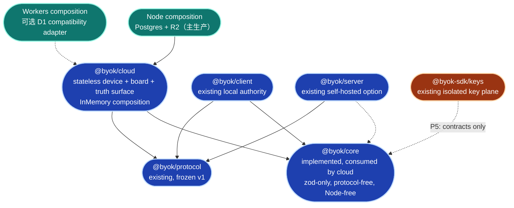

`Core` 节点是实线：该 package 已于 2026-08-07（S2）落地，protocol-free、Node-free（tsup `platform: 'neutral'`）、runtime 依赖只有 `zod`。`Cloud` 节点也是实线：S3a 落 stateless frozen device surface，S5 落 board/presence/activity，S6-a/S6-b 落 proof/truth；durable local journal 由 S3b 落在 client。`Cloud → Core/Protocol` 与 `Client → Core/Protocol` 都是真实 import edge；client 的 core edge 只用于 canonical proof bytes 与 truth contracts。`server/keys → core` 仍是虚线目标边。

关键 invariant：`core` 必须 protocol-free，才能让 future `keys → core` 不产生 `keys → protocol` 的间接依赖（S2 已把这条约束落成包内可执行的 constraint test）。`@byok/server` 留作 self-hosted embedded coordinator；`@byok/cloud` 才是 stateless hosted surface。主生产 composition 已裁定为 **Postgres + R2**（§12.7），D1 只保留为可选 compatibility adapter，不承担主线的容量、计费与 GC 语义。

### 12.2 `@byok/core` 与 `@byok/cloud` 职责与状态

core 各行已于 S2（2026-08-07）落地为 `@byok/core` 的契约 + InMemory 参考实现；cloud device handlers 与 InMemory composition 已于 S3a（2026-08-07）落地，cloud 其余各行仍是目标设计。

| 目标模块 | 责任 | 状态 |
| --- | --- | --- |
| core `attestation.ts` | `DeviceProofEnvelopeV1`、canonical bytes、注入式 verify | **已实现（S2）** |
| core `tenant.ts` | `TenantId`、device/control-plane principal | **已实现（S2）** |
| core `board.ts` | 5-state board、合法转移、claim conflict snapshot | **已实现（S2）** |
| core `quota.ts` | tenant storage entitlement、usage、reservation、retention policy 与稳定 quota 错误码 | **已实现（S2）** |
| core store ports | Truth/Mailbox/Board/Presence/Blob/Quota/StorageUsage async contracts；首参数永远是 tenant | **已实现（S2）**；tenant-scoped store 组装留给 S3 |
| cloud device handlers | pair/challenge/token 与 frozen events/messages/blob HTTP surface，外加 hosted-only `GET /byok/capabilities` | **已实现（S3a）**：九条 device 路由无状态重现，既有 daemon 零改动跑通 long-poll |
| cloud board handlers | list/incremental、SSE、claim/unclaim/status CAS | **已实现（S5）**：device bearer 只写非 `done` 协调态；host `acceptBoardItem` 独占 review acceptance |
| cloud truth handlers | immutable terminal、profile/memory records、rev CAS、object refs | **已实现（S6-b）**：proof-only routes + Postgres atomic authority；client local path 于 S6-c 实现 |
| cloud storage handlers | storage entitlement/usage/reservation 的执行面；reservation → presign → finalize/abort | 目标设计 |
| cloud cleanup workers | retention、tombstone、orphan GC 与 Postgres/R2 reconciliation | 当前实现（S4B-c） |
| cloud hints | device presence TTL、task activity tail + explicit dropped count | **已实现（S5）**：store-authoritative minimum interval、ProgressBatcher-shaped bounded batch、cumulative producer/capacity dropped |
| compositions | InMemory、Postgres + R2（主生产）、self-hosted server contract suites；可选 D1 adapter 另跑同一套件 | core 侧 InMemory composition 与参数化 conformance 套件**已实现（S2）**；cloud 侧 InMemory composition 与 tenant facade **已实现（S3a/S5）**；Postgres core/cloud ports 与 R2 主生产 adapter **已实现（S4A/S4B）**；D1 仍是 optional post-RC |

### 12.3 三套状态词汇 + 一套 truth concurrency model

Wire execution state、board coordination state、presence level 是三套独立状态词汇，不得复用命名；truth record 不是第四个状态机，而是一致性/版本模型（immutable hash + rev CAS）。四者的命名与权威面都必须分开：

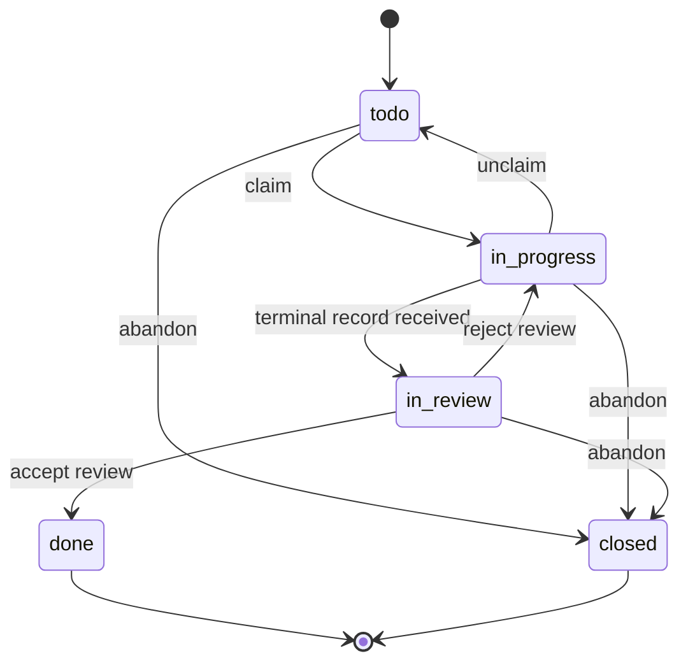

| vocabulary | 值 | 权威 | 语义 |
| --- | --- | --- | --- |
| wire execution | `Offered/Claimed/Running/AwaitApproval/Complete/Failed/Cancelled` | local execution path；frozen protocol | 一次运行尝试 |
| board coordination | `todo/in_progress/in_review/done/closed` | cloud SQL | 人与多 device 的离散协作生命周期 |
| presence | `online/thinking/working/error/offline` | TTL hint，无持久权威 | device 当前在线/活动提示 |
| truth record | `kind + record_key + rev + immutable hash` | cloud truth store，内容由 device 签名或 revision CAS 保护 | terminal / profile / memory 事实 |

`AwaitApproval` 是执行中暂停；`in_review` 是执行结束后人工验收。二者不能互相触发。`Running` 不得由 presence 推断；`done` 不代表某个 runtime process 仍存活。`closed` 在 final proposal 中暂取“终止未验收”，RAFT 原义仍需标为 unverified。

三套状态词汇与 truth record 形状的 core 侧契约（board 5 态与合法转移、presence level、truth record 的 rev/hash 形状、以及它们与 wire execution 的隔离）连同 InMemory 参考实现已于 S2 落地（`@byok/core`），并由包内的 vocabulary-isolation 约束测试守住。board 的 Postgres 组合在 S4A 落地，S5 已补齐 hosted handler、SSE/轮询、terminal/progress 单向投影与提示限流；truth/proof endpoint 仍是 S6 目标。

#### wire execution 规则（当前已实现，此处只重申跨层约束）

- claim 与 start 分离；`decline` 保留 retryable 语义；terminal 不可逆。
- workspace / Git 状态不得触发 wire transition。
- server 与 cloud 都不得依据 presence 合成 execution state。
- hosted mailbox 只运输 envelope，**不是** execution-state authority。

#### board coordination 规则（当前实现）

- assignee 与 status 分离，是两个字段而非一个枚举。
- claim 用 CAS；status update 必须带 `expectedStatus`。
- 冲突返回 holder / current snapshot，不做 silent last-write-wins。
- `closed` 暂定义为“终止、未验收”；未来若改为归档语义，用 `archived_at` 字段表达，**不新增第六个状态**。
- `task.complete` 可以把工作项推到 `in_review`，但不能自动变成 `done`——`done` 需要人工验收。
- host 必须显式提供 bounded `channel`/`title`；cloud 不从 instruction/result 派生 label。
- poll 与 SSE 共享 `BoardStore.list`；`board_seq` 是 per-tenant current-state cursor，不是完整事件历史。SSE 以 heartbeat 保活、以 120s `reconcile` 信号要求 full poll，且每轮 query 返回后才 sleep。
- `BoardFeedClient` 只按 `GET /byok/capabilities` 的 `board.sse` 选择 transport；temporary 5xx/idle watchdog 是 retryable SSE failure，不会永久降级。401/revocation 与其他永久 non-5xx failure 则停止。

#### presence 与 activity 规则（当前实现）

presence 是设备级最近提示，activity 是 task 级有损尾部。两者共同的约束：

- 都带 TTL，过期即等于不存在；
- activity 必须显式携带 `dropped` 计数，把"有损"写进数据而不是假装流完整；
- 不签名、不进入 truth；
- 不用于授权、billing、终态判断或恢复；
- 写入频率必须 bounded；
- 可以独立从 SQL 迁往 KV/DO，不影响 truth 与 mailbox。
- presence minimum interval 在 store 内原子裁决，不依赖单 instance handler timer；activity 以 batch event count + UTF-8 byte ceiling 入场，capacity eviction 与 producer dropped 累加到同一计数。

#### truth record 写入与冲突模型（目标设计）

| kind | 写入模型 | 冲突模型 |
| --- | --- | --- |
| `task.terminal` | 同一 task 第一份 immutable | 不同 hash → `409 terminal_conflict`，不覆写第一份事实 |
| `profile` | key 粒度 snapshot | `expectedRev` CAS |
| `memory` | key 粒度 snapshot | `expectedRev` CAS |
| future audit | append-only | `requestId` 幂等 |

cloud 可以按 tenant/kind/key/rev/hash 精确查找、排序与返回，但不能理解内容后做摘要、合并或相关性排序。

### 12.4 Cloud data categories

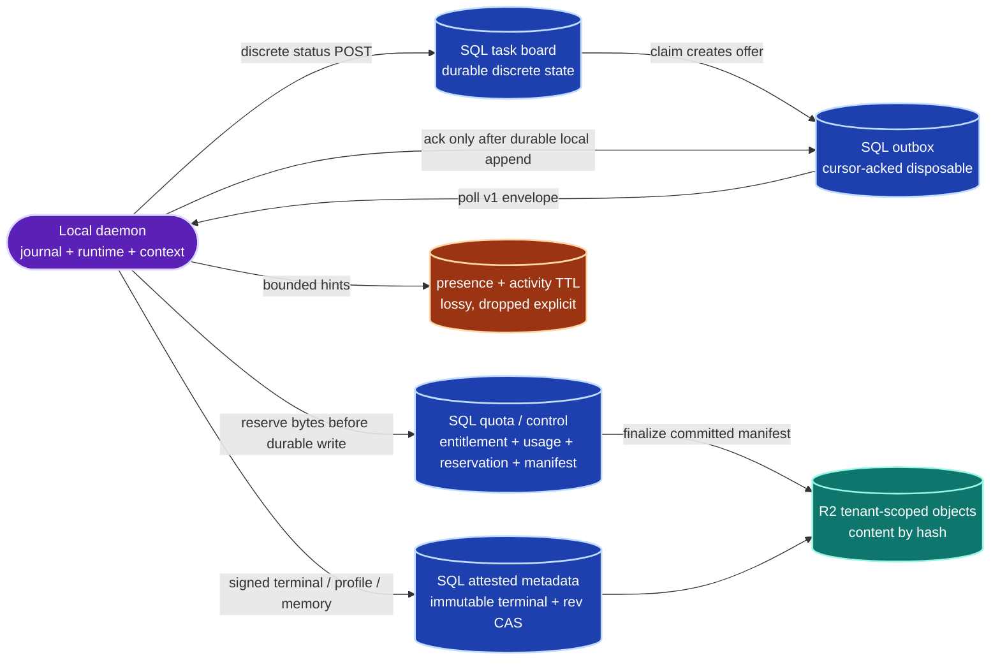

cloud 可以按 producer 给定的 tenant/channel/status/seq/hash 做精确匹配与排序，但不能做摘要、相关性、分类、memory merge 等语义推导。连续变化的 workspace、context、runtime session 与逐轮产物留在 local daemon。

quota/control 是第五类云端数据：它是 operational metadata，不是用户 truth，但它与 object bytes 之间没有跨系统 transaction，因此 durable write 必须走 §12.7.7 的 reservation/finalize，而不是假设 Postgres 与 R2 会一起成功。

### 12.5 目标 end-to-end path

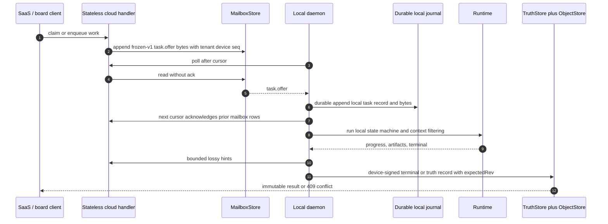

load-bearing 顺序是 durable local append 后才 ack mailbox。append 前 crash 由 redelivery 恢复；append 后 crash 由 local journal 恢复。cloud 不需要持有 Running record 才能保证任务不丢。

状态：S3 已全部闭环。S3a 证明这条路径的 in-memory 半程——host → cloud → mailbox → daemon → terminal receipt 在既有 daemon 零改动下跑通；S3b（2026-08-08）落地图中的 durable local append 与「append 后才 ack」的顺序（上一段那句 load-bearing），ack 挂在 journal commit 的 promise gate 上是结构性的而非流程约定，由十二点 crash + 磁盘压力矩阵证明。

### 12.6 身份、多租户与设备证明

#### 12.6.1 正规身份模型

| ID | 语义 | 权威来源 | 状态 |
| --- | --- | --- | --- |
| `tenant_id` | 宿主账户/组织，**唯一**安全隔离边界 | control plane 铸造 pairing code 时绑定 | 已实现（S1）：`PairingCodeClaims` / `DeviceRecord.tenantId` / token claims 三处均 required |
| `product_id` | 宿主产品 audience | pairing claims + device record | 已实现（S1）：required；`conn.hello.productId` 另按 device row 校验 |
| `device_id` | tenant/product 下的设备成员 | pair handler | 已实现（S1）：与 tenant 组成 registry 复合键 |
| `scope_id` | tenant 内的业务键空间 | 宿主语义；**不是**安全边界 | 目标设计 |
| `task_id` | board 与 wire attempt 的关联 id | host / board | 目标设计 |
| `key_id` / `key_epoch` | device signing key 的身份与轮换代次 | device registry | 目标设计（S6） |

设备不能在 `PairRequest` 里自报 tenant。pairing code 在服务端绑定 `{tenantId, productId}`，redeem 与 device insert 必须在同一个 transaction 内完成。S1 已把这些字段补进 `DeviceRecord`（required，无 optional 形态），参考实现的 in-memory registry 里 redeem 与 row write 是同一个同步步骤、由 pairing code 的单次使用语义保证排他；落库形态的事务边界随 P2 的 Postgres 实现一起兑现。

#### 12.6.2 结构性 tenant isolation：六层同时成立


隔离不是一层措施，是六层必须同时成立：

1. **类型层**：`TenantId` 是 branded type，且只有唯一铸造点。
2. **API 层**：handler 只拿得到 tenant-closed facade，够不到裸 store。
3. **schema 层**：tenant-prefixed 复合键；**不存在**裸 device/task unique index。
4. **测试层**：路由库存量穷举，每条 route 都跑跨 tenant 矩阵。
5. **proof 层**：claims 只用于构造带 tenant 的 DB lookup，DB 里的 device row 才是权威。
6. **错误层**：unknown / wrong-tenant / revoked 统一返回 401 或 404，避免制造存在性 oracle。

第 5 层的关键在于把等值检查做成查找的构造性结果，而不是可漏写的第二步：`claims.tenantId` 是查找键而非可信输入，设备声称不属于它的租户就查无此行、直接 401。禁止"先按裸 `deviceId` 反查、再比对租户"——那条路既需要一个 schema 里已被封掉的裸索引，又把单步裁决拆成两步纪律。

#### 12.6.3 Device proof

```mermaid
sequenceDiagram
  autonumber
  participant D as Daemon
  participant C as Cloud
  participant R as ReceiptStore
  participant T as TruthStore

  D->>D: hash body 并构造 protected claims
  D->>C: request + proof + requestId
  C->>C: 按 tenant 前缀载入 device / key row
  C->>C: 校验 product、epoch、clock skew、body hash、签名
  C->>R: 查询 (tenant, device, requestId) receipt
  alt 首次受理
    C->>T: 单事务 receipt + truth + reference/accounting
    T-->>C: committed record + receipt
  else 完全相同的重放
    R-->>C: 返回原结果
  else requestId 复用但 body 不同
    R-->>C: 409 conflict
  end
  C-->>D: 稳定结果
```

canonical bytes 用 **RFC 8785（JCS，JSON Canonicalization Scheme）** 正规化 protected 段，再前置 domain 前缀后签名。选 JCS 而非自定义固定顺序拼接，理由是 protected 段有嵌套结构且要在 Node 与 Workers 两个 runtime 产生逐字节一致的结果，JCS 的边角成本低于自定义拼接的实现分歧风险。JCS canonicalizer、`byok-device-proof-v1\n` 前缀与 `DeviceProofEnvelopeV1` 的契约已于 S2 落地（`@byok/core`，dependency-free 实现，canonical bytes 由 `packages/core/src/__tests__/golden/device-proof-v1.canonical.json` 冻结）。S6-a 接入 Workers-safe verifier与 device row authority；S6-b 接入 record routes 与 Postgres atomic authority；S6-c 的 `StoredDeviceProofSigner` 直接消费同一个 `deviceProofSigningInput`，只补 Node Ed25519 私钥操作，不复制 canonicalizer。

三个 domain 前缀（取一致小写形式，与 `schema: 'byok-device-proof-v1'` 自洽；第一个已在 S1 落地并冻结，第二个的 canonical bytes 已在 S2 冻结且 verifier 于 S6-a 落地，第三个仍是目标设计、位元组形状待冻结）：

| 用途 | 前缀 | 状态 |
| --- | --- | --- |
| token renewal | `byok-nonce-v1\n` + nonce | **已实现（S1）**：两端同字面量（server `auth.ts` 的 `NONCE_SIGNING_DOMAIN`、client `device-keys.ts` 的 `signNonce`），无前缀签名 401 |
| HTTP device proof | `byok-device-proof-v1\n` + JCS(protected claims) | **已实现（S2/S6-a/S6-b/S6-c）**：DB row 是 tenant/product/key/epoch authority；daemon signer 要求显式 identity config并从本地 paired store 逐次取 key |
| record 级 attest | `byok-attest-v1\n` | 保留，若最终启用 |

上表首行的字节形状已在 S1 冻结并两端同批切换（breaking，恢复路径是 forced re-pair，见 `docs/protocol.md` §6.2 与 `docs/security.md`）；第二行的 canonical bytes 已由 S2 的 core golden 冻结；`byok-attest-v1\n` 仍是目标设计，最终字节序列以 golden fixture 冻结为准。

#### 12.6.4 真相层端点（S6-b 已实现 cloud/Postgres 面）

| 端点 | 用途 |
| --- | --- |
| `GET /byok/records?kind=&prefix=` | 回 manifest（key/rev/hash/size/label），**不回 body** |
| `GET /byok/records/:kind/:key` | 回 presigned object GET URL，或小 payload 直接 inline |
| `PUT /byok/records/:kind/:key` | proof 在专用 header，raw JSON body 被 hash/size 绑定；snapshot `expectedRev` CAS，不符回 409 |

三条路由归类为 `proof`，不接受 bearer-only fallback。capability 只有在 composition 同时供应 atomic `TruthCommitter` 与 content-hash keyed object download authority 时才可声明；标准 InMemory composition 默认不声明，避免把顺序拼接伪装成跨 store atomicity。Postgres production path 在一个 transaction 内完成 receipt、terminal/snapshot precondition、committed manifest 检查、object reference replacement/recount 与 inline logical accounting；同 tenant 同 hash 多 reference 只计一次。

S6-c client 先取得 metadata-only manifest，本地 `MemorySelector` 只返回 `(kind, recordKey)`；client 只 fetch 这些 key，并要求 GET metadata 与 selector 所见 manifest 完全一致，再对 inline/object bytes 验 byte size 与 SHA-256。object grant 只能访问 host 显式配置的 credential-free HTTP(S) origin，redirect 固定为 `manual`，未列入 allowlist 的 relative/absolute URL 在网络访问前拒绝。任何 list/get race、同 size 字节替换或 grant URL confusion 都在 local filter 之前 fail-closed。>1 MiB snapshot 只发 metric，不拒绝、不切 delta。filter 的泛型返回值是唯一对外 context，runtime prompt shape 继续由 host 决定。

`terminal` body 对 cloud 是 opaque bytes/object ref；client 提供 proof-bound `writeTerminal`，caller/journal 负责选择要提交的 frozen-v1 terminal 来源，cloud 不做第二套 envelope 语义解析，S6-c 也不猜现有 task loop 的 prompt/flush policy。client 将成功 receipt 的 primary 与 ordered snapshots 逐项绑定到请求的 selector、next revision、content hash 与 byte size，结构合法但属于另一请求的 response 不能冒充提交成功。相同 `requestId + bodyHash` 重送回原结果；同 `taskId` 不同 terminal hash 回 `409 terminal_conflict`，不覆写第一份真相。

#### 12.6.5 Key rotation

- 用现行有效 key 签名注册新 key；
- `keyEpoch + 1`；
- tenant / product / device 三者不变；
- 旧 epoch 立即失效，或进入一条明确写下的 grace policy；
- **不提供**更新 tenant 的 API；
- 重新 pair 产生的 membership 由新 code 的 claims 决定，不继承旧值。

#### 12.6.6 Composition contracts

- 所有 store port 第一参数是 required `TenantId`；没有裸 `deviceId/taskId` lookup。
- pairing code 由 server-side claim 绑定 tenant/product；device record 不允许“无 tenant”。
- terminal record immutable；同 task 不同 hash 返回 conflict，不覆盖第一份事实。
- board claim 用 SQL CAS；N 个并发 claim 只允许 1 个成功，其余返回 holder snapshot。
- status transition 带 `expectedStatus`；不允许 last-write-wins。
- per-tenant `board_seq` 单调，不能跨 tenant 推进。
- 同一 store contract suite 跑 InMemory、Postgres + R2（主生产）与 self-hosted server 三种 composition；可选 D1 adapter 若启用，用同一份套件另跑一次，断言零改动。
- `committedBytes + reservedBytes` 不得超过有效 entitlement；所有直接上传 R2 的 durable write 先经 reservation（§12.7.7）。

### 12.7 数据与存储架构（云端面为目标设计；本机 journal 面已实现）

主生产 composition 固定为 **Postgres + R2**：Postgres 持有租户、mailbox、board、truth metadata、quota、usage、reservation 与 object manifest；R2 持有按 daemon 声明的 canonical hash 命名、且由 cloud 观测 size/content-type 的对象 bytes。Node API 与 R2 可以跨供应商组合——R2 只需要 S3-compatible 的 signing/client adapter，不要求 `@byok/cloud` 运行在 Workers。Postgres 是 quota reservation、usage 与 object manifest 的 transaction authority。D1 只保留为可选 contract adapter，不再影响主线的容量、计费或 GC 语义。

#### 12.7.1 五类云端数据与一类本地连续态

| 类别 | 典型内容 | 存储 | 生命周期 |
| --- | --- | --- | --- |
| mailbox | server→daemon 的 frozen-v1 envelope | Postgres | ack 且过 retention 后删除 |
| board | title/channel/status/assignee/`board_seq` | Postgres | 长期，或宿主配置的 archive policy |
| truth | terminal/profile/memory 的 metadata、hash、rev、proof | Postgres + R2 | durable；只按显式删除或 retention policy 回收 |
| hints | presence/activity/dropped | TTL Postgres 或 KV | 分钟级 |
| quota/control | entitlement、usage、reservation、object manifest、GC tombstone | Postgres | durable operational metadata |
| 本地连续态 | journal / workspace / session / context | daemon 本机 SQLite + 文件系统 | 由本机生命周期管理 |

前五类可以上云，最后一类不上云——这是 §14.3 第 3 条不变量的存储侧表述。

#### 12.7.2 Durable local journal：SQLite 为生产 canonical（已实现 S3b）

**已实现（S3b，2026-08-08）**：`LocalTaskJournal` port 与 `SqliteLocalTaskJournal` 落在 `packages/client/src/daemon/journal/`（`journal.ts` / `sqlite-journal.ts` / `sqlite-support.ts` / `storage-policy.ts`），单库 `<storeDir>/daemon.db` 与下述八表、PRAGMA 一致；no-silent-downgrade 由构造期 typed error 执行——当前 runtime 没有合格 `node:sqlite` 时 hosted journal 构造抛 `JournalUnavailableError`（Node 20 实测），不存在退回文件实现的路径。该 journal 是 opt-in 的 hosted 配置项（`DaemonConfig.hostedJournal`）：未配置时 daemon 不构造 journal，默认自托管路径零改动。

hosted production daemon **必须使用 SQLite，或使用满足同一 durability contract 的注入式实现**。默认实现命名为 `SqliteLocalTaskJournal`；普通 JSON/JSONL file store 只可用于迁移、开发或兼容模式，在未证明 fsync/transaction 语义前不能作为 hosted mailbox ack 的 authority。

单库 `<storeDir>/daemon.db`，八表：

- `journal_envelope`：tenant/product/device、seq、envelope id、task id、原始 bytes 与 hash、commit/ack 时间；
- `journal_task`：admission、claimed runtime、effective policy hash、workspace ref、当前本机状态、recovery marker；
- `journal_transition`：transition id、from/to、`occurred_at`，按 transition id 幂等；
- `journal_terminal`：terminal payload hash、truth 写入状态、最后一次 retry/error；
- `journal_idempotency`：outbound request / envelope / receipt ids；
- `local_artifact_ref`：文件系统对象的 path/hash/size/ref state，不保存大 payload；
- `local_cleanup_candidate`：`eligible_at`、reason、class、attempt/error，供安全 GC 使用；
- `local_storage_usage`：journal、cache、logs、workspace、quarantine 各自的近似或实测 bytes。

SQLite durability 设置（实现见 `sqlite-support.ts` 的 `openJournalDatabase`，PRAGMA 顺序是 load-bearing）：

- `PRAGMA auto_vacuum=INCREMENTAL`，且**必须先于建表**执行——schema 已存在后再设会被静默忽略，`compact()` 的 `PRAGMA incremental_vacuum` 就变成报告成功的 no-op；
- `PRAGMA journal_mode=WAL`；
- `PRAGMA foreign_keys=ON`；
- `PRAGMA synchronous=FULL`：语义上是 ack-critical transaction 的要求，实现上按 database-wide 施加——journal 存在的理由就是 ack-critical 写入，不需要 FULL 的维护路径（checkpoint、incremental vacuum）本来就不在热路径；
- 明确 `busy_timeout`（有界，锁竞争以 error 浮出而不是无界阻塞 envelope 路径）与单 writer queue；
- envelope append、idempotency receipt 与「可推进 cursor」的 receipt 必须落在同一个 transaction；多表事务统一用 `BEGIN IMMEDIATE`（开头就取写锁）＋ 任何抛出即 `ROLLBACK`；
- WAL checkpoint、batch delete 与 incremental vacuum 在后台维护，不在 active task 热路径执行。

SQLite driver 是 composition 细节，但不得静默降级：当前 Node/runtime 无法提供合格 SQLite backend 时，宿主必须注入一个通过 conformance 的实现，否则 hosted production mode 拒绝启动。为兼容 Node 20 而退回的普通文件实现不能冒充 production durability。

SQLite 只存可靠性 metadata 与小型 bounded bytes。以下继续留在文件系统：workspace、Git repository、artifact/blob cache、runtime session files、轮转日志与 quarantine。Provider secret 仍然只进 OS credential store，绝不进 SQLite。

最小 journal 事实集：

- tenant / product / device
- task id
- 原始 envelope bytes 与 hash
- received cursor
- admission result
- claimed runtime
- effective policy hash
- workspace reference
- execution state transitions
- terminal payload hash
- outbound idempotency ids
- recovery marker

journal 不是 debug log，它是 mailbox ack 的正确性前置条件。

#### 12.7.2.1 本地积压、磁盘水位与清理顺序（已实现 S3b）

**已实现（S3b，2026-08-08）**：`LocalStoragePolicy`、水位状态机与分类 GC 落在 `packages/client/src/daemon/journal/storage-policy.ts`；usage 按 journal/cache/log/workspace/quarantine 五类分别上报，hard pressure 由 TaskRunner 的 admission guard 变成对新 offer 的 retryable decline，状态与用量出现在 control-socket status 的 `storage*` 字段（与 `queueWatermarks` 是两个概念，命名不复用）。

`LocalStoragePolicy` 由 host/daemon config 注入，至少包含 `maxStoreBytes`、`minFreeBytes`、soft/hard watermark、各数据类别的 retention、workspace policy 与 log rotation。水位状态按**最坏优先**求值（emergency 不是「压力很大」，是另一个类别的失败）：

| 状态 | 触发 | 行为 |
| --- | --- | --- |
| normal | 低于 soft watermark | 常规低频 GC/compaction |
| pressure | 达到约 80% budget，或剩余空间低于 soft minimum | 发出告警；只清 expired temp 与 rotated logs 这类可重建物；加快 journal compaction |
| hard pressure | 达到约 90% budget，或剩余空间低于 hard minimum | 停止接收新的普通 task（retryable decline）；仍允许 terminal/truth flush、删除、导出、doctor 与恢复操作 |
| emergency | 一次 ack-critical 写入已经失败（latch，不自愈），或剩余空间低于 ack-critical reserve | fail-closed，不 ack 新 mailbox row；保留现有 recovery evidence |

自动清理的完整顺序是：

1. expired upload/download temp 与可重建 cache；
2. 已轮转且超过 retention 的日志；
3. 云端已确认 terminal/truth、且无 recovery marker 的旧 journal transitions/envelopes——先 compact 再 batch delete；
4. host 明确标记为 ephemeral、且 task 已终态的生成式 workspace；
5. orphan local artifacts，须经过 reference scan 加 grace period。

只有 `normal` 态跑完整五步。`pressure` 及以上把顺序**截断**到第 1–2 步而不是延长它：3–5 步要 reference scan、compact 与 grace period，磁盘快满时最贵、回收最慢，而 1–2 步是纯可重建垃圾、立刻还空间。这是实现的刻意选择（`cleanupOrderFor`），不是简化。

**永不自动删除**：未 ack envelope、`Running`/`AwaitApproval` task、truth 尚未确认的 terminal、带 recovery marker 的记录、用户指定的 workspace、provider secret、quarantine evidence。这一条由 `CleanableCategory` 型别构造性强制——保护类别在该型别里没有名字，清理执行器无法表达删除它们，不是运行期过滤。quarantine 只由明确的 `doctor --fix` 或 operator policy 清理（§14.3.3）。

#### 12.7.3 Mailbox read/ack 与 crash matrix

```mermaid
sequenceDiagram
  autonumber
  participant C as Cloud
  participant M as MailboxStore
  participant D as Daemon
  participant J as 本机 journal
  participant R as Runtime

  C->>M: append task.offer，带 tenant/device/seq
  D->>C: GET events after cursor
  C->>M: 只读取，不删除
  M-->>D: envelope batch
  D->>J: durable append 原始 envelope
  J-->>D: fsync/commit 成功
  D->>C: 下次 poll 的 cursor 即为 ack
  C->>M: 推进 ack，删除已过期行
  D->>R: admit 并执行
```

“领走即弃”是**游标推过即删**，不是**读到即删**。读到即删会直接打断已冻结的 at-least-once 语义：client 的整套 stall 机制建立在“未 ack 的 seq 会被反复重投”之上（§8.3）。删除的触发器是 client 下次带上来的 cursor，那才是它的持久化 ack。

对 `task.offer` 而言，“成功处理到可 ack”= v1 bytes 与本机 task record 已在同一个**本机** transaction durable append，且工作已交给本机 scheduler；**不是**等 agent 跑到终态。cursor 不承担 running-state recovery。

| Crash 位置 | 结果 |
| --- | --- |
| local append 前 | mailbox 未 ack，重投 |
| append 后、ack 前 | 重投；journal 与 idempotency 去重 |
| ack 后、runtime 前 | journal 恢复并继续，或给出明确失败 |
| terminal 生成后、truth 写入前 | journal 保存 terminal hash，重试写入 |
| truth 写入后、本地标记前 | immutable/幂等写入返回原结果 |

#### 12.7.4 Postgres + R2 object storage

对象 key 必须 tenant-scoped，例如 `tenants/<tenant_id>/objects/sha256/<hex>`。同一 tenant 内按 daemon 声明的 canonical hash 去重并只计一次 committed bytes；禁止用全局跨租户 key，那会把 object existence 变成跨租户 oracle。这里的 hash authority 是通过认证的配对 daemon（ADR-024）：cloud 验证 principal/tenant、声明格式与签入的 size/type，但不读回 bytes 重算摘要。

- 上传前校验 daemon 声明的 size、canonical hash、content type 与 per-object 上限；
- `HEAD` 只观测对象存在性、byte size 与 content type，不观测或验证 SHA-256；
- `object_manifest.state = committed` 只表示 tenant-scoped 对象存在、observed size/type 与声明匹配且 manifest/accounting transaction 已提交，不表示 cloud 验证过摘要；
- truth transaction 只引用 `object_manifest.state = committed` 的对象；
- presigned capability 绑定 tenant-scoped resource、最大 size/type 与 expiry；reservation/resource 绑定由 authenticated cloud finalize authority 持有，不伪装成 R2 可校验的 metadata；
- object key 不承载 secret，也不承载可读的 instruction 标题；
- inline payload 只用于小对象，并计入 tenant logical usage；
- 任何声称下载内容完整性的 consumer 必须自行对 bytes 重算 SHA-256，并与 daemon 声明的摘要比较；
- R2 与 Postgres 之间没有跨系统 transaction，因此必须用 reservation/finalize/reconcile，不能假设原子写入。

#### 12.7.5 Retention

| 数据 | 建议默认 | 自动删除条件 |
| --- | --- | --- |
| mailbox | time-bounded window，按 tenant/device 配置 | 已 ack；未 ack 的过期项先进入 expired/dead-letter 状态，不静默丢失 |
| inbound dedup | 至少覆盖 mailbox 最大重投窗口 | expiry 到期 |
| request receipts | 至少覆盖 proof clock skew 加 client retry horizon | expiry 到期 |
| pairing/auth nonce | 10 分钟量级 | used 或 expired |
| presence | 60–120 秒 | TTL |
| activity tail | 5–15 分钟 | TTL |
| 本机 journal terminal | 可配置长期 | truth 已确认、无 recovery marker、且超过 retention |
| R2 orphan | 24 小时以上 grace period | 无 reference、无 active reservation、且走完 tombstone flow |
| board/truth 用户数据 | 宿主套餐或用户 policy | 只按显式 retention、用户删除或合规流程；不因为「满了」直接删 |

容量有界的 ring 与时间有界的 SQL retention 行为不同——前者按条数丢最旧，后者按时间过期。这个差异必须在 self-hosted 与 hosted 的 runbook 中明示，不能让运维以为两者可以互换。

#### 12.7.6 套餐 entitlement、quota 与计量边界

免费/付费、价格、购买流程与套餐名称属于宿主 SaaS。SDK **不硬编码 `free`/`pro`**，只消费宿主签发的数值 entitlement。下面两个 interface 的契约（含 `bigint` 与 entitlement version CAS）与 InMemory 参考已于 S2 落地（`@byok/core` 的 `quota.ts`）；Postgres/R2 的执行面仍是目标设计：

```ts
interface TenantStorageEntitlement {
  tenantId: TenantId;
  version: bigint;
  hardLimitBytes: bigint;
  maxObjectBytes: bigint;
  maxInlineBytes: bigint;
  mailboxLimitBytes: bigint;
  retentionPolicyId: string;
  downgradeGraceUntil?: string;
}

interface TenantStorageUsage {
  committedObjectBytes: bigint;
  committedInlineBytes: bigint;
  reservedBytes: bigint;
  mailboxBytes: bigint;
  objectCount: bigint;
  updatedAt: string;
}
```

计量与展示的边界：

- 用户容量 = tenant-scoped R2 committed object bytes 加 Postgres inline payload bytes；
- 同 tenant 同 hash 多 reference 只计一次；跨 tenant 不共享计费对象；
- Postgres 的普通 metadata 不伪装成精确 byte billing，改用 record count、row size、mailbox bytes 与 rate limit 做平台保护；
- `storage_entitlement.version` 单调，套餐升级/降级由 control plane 更新；
- SDK 返回 usage、limit、reserved 与 grace 状态，宿主 UI 决定如何显示与售卖。

Postgres 至少新增：`storage_entitlement`、`storage_usage`、`storage_reservation`、`object_manifest`、`object_reference`、`tenant_retention_policy`、`gc_cursor` / `cleanup_job`。

#### 12.7.7 Reservation/finalize：防止并发超卖

reservation/finalize 的 port 契约与无超卖语义由 `@byok/core` 的 `QuotaStore` 持有。S4B-b 已把 R2 presign、显式 finalize 与 Postgres manifest/accounting transaction 接进 device surface；S4B-c 已交付 host-owned retention/dead-letter/R2 GC 与 reconciliation composition。

所有直接上传 R2 的 durable write 走两阶段流程：

1. daemon 计算 canonical hash，并以 `Idempotency-Key` 作 reservation/request id 调用 `POST /byok/blobs`；
2. Postgres transaction 锁定 tenant entitlement，检查 `committed + reserved + expected <= hardLimit`，写入 `storage_reservation.reserved`；
3. cloud 先建立 `object_manifest.pending`，再从 reservation 声明签发绑定 tenant key 与 resource shape 的 R2 presigned PUT；reservation/resource 绑定由 cloud finalize authority 校验，不向 R2 注入无消费者的 query metadata；
4. daemon PUT bytes 后，以同一 `Idempotency-Key` 调用 `POST /byok/blobs/:id/finalize`；R2 adapter 做 `HEAD`，只观测存在性、byte size 与 content type；
5. Postgres 单一 data-modifying CTE 同时把 manifest 与 reservation 转为 committed，并更新 usage；在此之前 download route 对 pending manifest 一律 404，不隐式 finalize；
6. reservation 过期后由下一次 tenant admission 的 bounded reap 释放 reserved bytes；对象缺失/shape mismatch 则由 finalize 立即释放；已上传 bytes 成为 S4B-c GC 的 orphan candidate；
7. create collision fail-closed；finalize response lost 以同 key/path 重放，返回同一结果且不重复计量。

S4B 的首个实现提交必须删除 `StorageFinalizeInput.observedContentHash`：reservation/manifest 保存的是 daemon 声明的 hash，不能把它回填成“观测值”；finalize 的 storage observation 只包含 `observedByteSize` 与 `observedContentType`。`object_manifest` 保留 `pending`、`committed`、`delete_pending`、`deleted` 四态，`0003` 不增加 `hash_verified` 字段或验证态。

task admission 必须按 `limits.maxOutputBytes` 或产品给定预算预留 terminal/artifact 空间。无法预留时应在 runtime 启动前 decline，而不是任务跑完才发现结果存不下。少量 terminal failure metadata 使用独立且严格有界的 system reserve，保证「quota 已满」仍能留下可诊断终态。

稳定错误码：

| code | HTTP | 含义 |
| --- | ---: | --- |
| `storage_object_too_large` | 413 | 单对象超过限制 |
| `storage_quota_exceeded` | 507 | tenant 的 committed + reserved 将超过硬限额 |
| `storage_reservation_expired` | 409 | reservation 已过期或已终结 |
| `storage_integrity_mismatch` | 422 | declaration 冲突，或 R2 对象缺失 / observed size/type 与声明不符 |
| `storage_write_suspended` | 423 | 降级 grace 结束后仍超限，进入只读保护 |

#### 12.7.8 云端满额行为与清理逻辑

| 状态 | 行为 |
| --- | --- |
| <80% | 正常；后台 TTL/GC |
| 80–100% | 发出 tenant warning metric/event；继续写入，但 task admission 必须有 reservation |
| 达 hard limit | 拒绝新的 durable object/inline write；允许读、删、导出、usage 查询、套餐更新与已预留的提交 |
| 套餐降级后超限 | 进入配置的 grace；不删现有数据；grace 结束后阻止新写，直到用户删除或扩容 |

自动 cleanup 只回收：expired hints/nonces/receipts、已 ack mailbox、expired reservation、R2 orphan，以及明确过期的 cache/temporary object。用户的 durable truth、board、memory、profile 与 terminal 不因为 quota 满而被自动删除。

R2 GC 使用 tombstone 加 reconcile：

1. Postgres 把 `ref_count = 0` 且超过 grace 的 manifest 标记为 `delete_pending`；
2. worker 删除 R2 object；
3. 成功后标记 `deleted` 并扣减 usage；
4. 任一步失败都可重试；reconciler 依据 tenant-scoped key、manifest、reservation、reference 与 grace 检查 Postgres/R2 是否漂移；
5. `HEAD` 可发现对象缺失与 observed size/type 漂移，但无法发现同 size/type 的字节替换；GC 不读回重算摘要，也不加入 checksum fallback；
6. 只靠 refcount 不够，周期性 reference scan 是第二道保护。

S4B-c 的 current implementation 是 `PostgresCloudCleanup` +
`R2ObjectMaintenanceStore`，schema authority 为 `0003_cloud_cleanup.sql`。
host 以 tenant/job id 显式调度；每 tenant advisory serialization、bounded
batch 与 `gc_cursor` 限制 10x 时的 LIST/HEAD 成本。`cleanup_job` 保存 quota/
retention/GC counters 供 metrics 与 support readback。未追踪但 key 合法的
R2 object 先投影为 `pending` witness 并重新等待 grace，绝不因 LIST 一次
观测而直接删除。完整 crash/rollback/usage rebuild 流程见
`deploy/runbooks/cloud-cleanup.md`。

#### 12.7.9 储存控制面端点（目标设计）

| 端点 | 主体 | 用途 | 交付状态 |
| --- | --- | --- | --- |
| `GET /byok/storage/usage` | tenant principal | committed / reserved / limit / grace 状态 | 目标设计，未路由 |
| `PUT /byok/admin/storage-entitlements/:tenantId` | control plane | 写入版本化数值 entitlement；不含套餐价格逻辑 | 目标设计，host 目前直接调用 port |
| `POST /byok/blobs` + `Idempotency-Key` | device bearer | 原子预留预计 bytes、建立 pending manifest 并签发 reservation-bound upload capability | S4B-b 已交付 |
| `POST /byok/blobs/:id/finalize` + 同一 `Idempotency-Key` | device bearer | R2 `HEAD` 观测存在性与 size/type 后，原子提交 manifest/reservation/usage；不验证摘要 | S4B-b 已交付 |
| `POST /byok/storage/reservations/:id/abort` | device proof / control | 幂等释放 reservation；已上传对象进入 orphan grace | 目标设计，尚未路由；host 可直接调用既有 `QuotaStore.abortReservation` |
| object presign 端点 | device proof / control | reservation-bound 的 upload/download capability | metadata route 已交付；content 由 signed URL 承载 |

能力降级同样由 `/capabilities` 声明，不用 404/405/501 嗅探推断（附录 A 的 ADR-010）。

### 12.8 交付路线与 S↔P crosswalk（目标设计）

完整执行切片见 `plans/sprints/20260807-byok-platform-raft-aligned.sprint.md`。

**P 线编号锚点。** 本文有两套互不相干的 P 记号，按出现位置区分：**章节标题**里的 `P1/P2/P3`（仅 §1、§8、§14 三处）是尽职调查框架的三层——P1 架构地图、P2 数据流追踪、P3 设计裁定，与交付无关；**正文**里的 `P0-P5` 一律取 `ARCHITECTURE-PROPOSAL-byok-platform.md:33-34,690-698` 的交付阶段语义，下表是这套记号的唯一定义处（§14.2 那格"P2 后再做 P3 board"属正文，按下表读）：

| 编号 | 语义 |
| --- | --- |
| T0 | 租户 breaking cut；先于 P 线任何数据落库 |
| P0 | 建 `@byok/core` 契约层，不改既有包；**已完成（S2，2026-08-07）**，交付含 InMemory 参考实现与 composition 参数化 conformance 套件 |
| P1 | `@byok/cloud`：无状态派工 handler + mailbox/journal/terminal 端到端 + store 的 in-memory 参考实现 |
| P2 | Postgres + R2 主生产实现，含 entitlement/usage/reservation/quota 与 GC；`deploy/sql/` migration |
| P3 | board 层：5 态 + claim CAS + `expectedStatus` CAS + `board_seq` 增量 + SSE/轮询双路径 + 两级提示；**已实现（S5）** |
| P4 | device proof + truth/memory：S6-a verifier/key/receipt、S6-b atomic truth routes、S6-c client signer/manifest selector/selected fetch/rehash/filter implementation 已交付；default-on 仍等独立 security acceptance；`signNonce` domain separation / GAP-004 已提前随 S1 交付 |
| P5 | `@byok-sdk/keys` 的 profile 持久化接上 core 的 `TruthStore`。**Deferred standalone plan，不在本 sprint program（S0-S7）内**；触发条件是 K4/K4.1 完成且 TruthStore 的 production composition 可用，两者都满足后单独立计划，不占 S 线任何 slot |

K 线（`K2/K3/K4`）是 key 管理线，独立闭环，不阻塞 P 线。

**S↔P crosswalk。** sprint 档用 `S0-S7` 切分执行，与上述 P 阶段的对应关系：

| Sprint | 内容 | 对应 P 线 |
| --- | --- | --- |
| S0 | 架构与当前缺口收口（GAP-001/002/003） | 先于 P0，不属任何 P 阶段 |
| S1 | Tenant identity cut | T0 |
| S2 | `@byok/core` contracts（已完成 2026-08-07） | P0 |
| S3 | Cloud mailbox + 本机 SQLite journal（含磁盘水位与安全 cleanup）（已完成 2026-08-08：S3a + S3b） | P1 |
| S4 | Postgres + R2 composition、quota/reservation 与 cloud GC | P2 |
| S5 | Board + presence + SSE/poll（已实现；PR gate 见 sprint ledger） | P3 |
| S6 | Device proof + memory | P4 |
| S7 | operations/release RC + keys dependency boundary（K4 parity 只对 Umbrella BYOK RC 生效） | 不对应 P5；P5 是独立 deferred plan |
| 并行 | K4/K4.1 aip swap | K 线，不阻塞 P0/P1 |
| — | P5：keys profile → `TruthStore` | Deferred standalone plan，触发条件见上表 |

```mermaid
flowchart LR
  classDef stage fill:#5b21b6,stroke:#ddd6fe,stroke-width:2px,color:#fff
  classDef parallel fill:#0f766e,stroke:#99f6e4,stroke-width:2px,color:#fff
  classDef deferred fill:#4b5563,stroke:#d1d5db,stroke-width:2px,color:#fff,stroke-dasharray:5 5

  S0(["S0 缺口收口"]):::stage
  S1(["S1 Tenant cut / T0"]):::stage
  S2(["S2 core / P0"]):::stage
  S3(["S3 mailbox + SQLite journal / P1"]):::stage
  S4(["S4 Postgres + R2 + quota / P2"]):::stage
  S5(["S5 board + presence / P3"]):::stage
  S6(["S6 device proof + memory / P4"]):::stage
  S7(["S7 operations / release"]):::stage
  K4(["K4/K4.1 aip swap"]):::parallel
  P5(["P5 keys profile → TruthStore<br/>deferred standalone plan"]):::deferred

  S0 --> S1 --> S2 --> S3 --> S4 --> S5 --> S6 --> S7
  K4 -.->|"umbrella RC parity only"| S7
  K4 -.->|"trigger"| P5
  S4 -.->|"TruthStore production composition"| P5
```

两个 RC profile 分开定义，避免用一条 release gate 绑死两条互不相干的线：

| RC profile | 范围 | 门禁 |
| --- | --- | --- |
| Dispatch Platform RC | `protocol` + `server` + `client` + `cloud` + `core` 的 hosted/self-hosted dispatch 面 | S7 的 operations/release 项；**不被 K4 阻塞**，keys 线的状态不进入这条 RC 的准出 |
| Umbrella BYOK RC | 上面全部 + `@byok-sdk/keys` 一起以单一 BYOK 套件发布 | 追加要求 K4 golden parity 通过；K4/K4.1 未闭环时只能发 Dispatch Platform RC |

排序原则：

- K4 是独立跨仓库闭环，不阻塞 P0/P1；
- tenant cut 必须在任何 hosted durable data 落库前完成；
- core 在 cloud 之前；
- mailbox/journal 在 board 之前；
- Postgres + R2 与 quota/reservation 在 board CAS 之前；
- device proof 在 truth/memory 的生产写入之前；
- 已知的 capability honesty 缺口（GAP-001/002）不拖到平台完成之后才修——S0 已先于任何平台线工作收口；
- 每个 sprint 都要有独立的 rollback 与 evidence。

## 13. RAFT 受限参考

完整证据与版本拓扑放在 `docs/researches/raft-architecture-reference.md`。SDK 架构只保留决策映射：

| RAFT 模式 | BYOK 决定 | 原因 |
| --- | --- | --- |
| agent-facing CLI + injected env/API context | **评估，不直接替换** | runtime-neutral callback 能解决 Pi/Codex approval gap，但会改变 frozen wire/control architecture |
| board 5 态、assignee/status 分离、claim conflict snapshot | **采纳语义** | 适合 `@byok/core` + cloud SQL，并与 wire execution state 分离 |
| SSE + periodic reconciliation + poll path | **采纳，改成 capability declaration** | 不使用 404/405/501 status sniffing heuristic |
| presence/activity + dropped count | **采纳** | 把高频有损信号与 durable truth 分开 |
| local agent shortcut API | **采纳能力，复用 control socket** | 现有 Unix socket/named pipe 边界比新增 loopback HTTP 更一致 |
| daemon/runtime driver unification | **参考 adapter shape** | BYOK 已有 RuntimeAdapter；无需搬入 RAFT 产品 workspace 语义 |
| credential proxy | **deferred** | BYOK dispatch plane 当前不持有 runtime credentials；引入会改变 credential-isolation claim |
| computer supervisor/updater 独立层 | **宿主产品责任 / deferred** | SDK 既定边界是 OS supervisor + host-owned release/update |
| hash-only updater trust | **拒绝照抄** | upgrade manifest 与 binary 同源不能形成独立签名信任根 |
| runtime bypass/yolo flags | **拒绝** | 会推翻 BYOK fail-closed PermissionPolicy 约束 |

两处归因必须写清，否则这张表会把外部证据的强度说高：

- **presence 五级词汇不是 RAFT 的。** `online/thinking/working/error/offline` 的来源是 `docs/researches/proposal-byok-platform-v2-opus.md:205`；`docs/researches/raft-architecture-reference.md` 全文 `presence` 零命中。上表"presence/activity + dropped"一行采纳的是 RAFT 的**有损提示带 dropped 计数**这个机制，五级词汇本身是本仓库提案的产物。
- **board 转移在 RAFT 侧是 `[unverified]`。** `raft-architecture-reference.md:1064` 原文明确：状态转移的约束在 server 侧 `[unverified]`，其转移图是依 status 语义绘制的合理路径，不是从实作提取的转移表。因此 §12.3 采纳的是 5 态**词汇与分权威**，不是一份已验证的转移表；`closed` 的原义同样仍标 unverified。

RAFT 是带自家 cloud/workspace 的完整产品；BYOK 是供宿主产品组合的 SDK。可参考其填满的 operational semantics，不能把产品所有权边界一起搬进 SDK。

## 14. P3：设计理由、10x 与不变量

### 14.1 为什么当前形状存在

- `protocol` 小而冻结：让 Node server 与本机 daemon 共享一份 schema，不把 transport implementation 混入 contract。
- `ConnectionHub` 集中：M0-M5 优先证明单节点 embedded lifecycle、reliability 与 runtime integration；代价是不能水平扩展。
- `client` 较大：它必须跨越 CLI process、local persistence、IPC、OS service 与三种 runtime 的真实差异；这些边界共享同一个 device authority。
- `keys` 独立：key custodian 与 credential-isolated dispatcher 是相反安全承诺，package graph 必须阻止误耦合。
- OS supervisor 而非 in-process supervisor：SDK 不拥有宿主机器的 release/update policy。

### 14.2 10x 时先失败的地方

| 压力 | 最先失败处 | 已有/目标缓解 |
| --- | --- | --- |
| 单节点更多 devices/tasks | Hub in-memory maps、outbox ring、poll waiter、event queues | embedded 模式承认单 owner；hosted 目标转 mailbox/store ports |
| fleet reconnect | backoff cohort 仍可能聚簇重试 | **已实现（S7-a）**：`productId + deviceId` 稳定 seed，按 reconnect/upload/maintenance domain 分离的 ±20% deterministic jitter；10,000-device production-function simulation 对 bucket peak 设硬界 |
| high-frequency UI hints | presence/activity SQL write amplification | bounded batch + TTL + dropped；必要时可单独换 KV/DO adapter |
| board concurrency | per-tenant `board_seq` 与 claim hot rows | SQL CAS、索引、contract suite；P2 后再做 P3 board |
| large memory | snapshot >1MiB 与 rev CAS conflict | 当前 key-granular snapshot；阈值触发 delta-chain deferred |
| many runtime kinds | closed `RuntimeIdSchema` 与 adapter-specific capability truth | 新 runtime id 是 protocol change；per-task capability honesty 已在 S0 修完（§3.3、§4.4），新 adapter 接入时按同一形状声明能力 |
| 本机磁盘增长 | journal / WAL / workspace / cache 填满磁盘 | **已实现（S3b）**：有界 WAL checkpoint/incremental vacuum、型别级 never-delete 的分类 GC、水位状态机、hard-pressure admission decline（§12.7.2.1） |
| tenant storage 增长 | 并发上传超卖、降级后超限、R2 orphan | **目标设计**：Postgres 作 reservation/usage authority、grace/只读、tombstone reconciler（§12.7.7、§12.7.8） |

### 14.3 可靠性、恢复与并发（S7-a 部分已实现）

#### 14.3.1 At-least-once 的完整链条

- server/cloud 可以重投；
- client cursor 只在 handler 成功、且 hosted 模式下本机 journal 已 durable 之后才推进；
- envelope id dedup 与语义幂等两者同时存在，不能只留一个；
- terminal 与 truth 写入必须幂等；
- long-poll 与 WS 共用同一个 inbound gate；
- transport 切换不得产生两个并行 owner。

#### 14.3.2 Reconnect：确定性 jitter

S7-a 已将 automatic retry 的 random/fixed fleet cadence 收敛到一个可复现 authority：

- seed 固定为已加载的 `productId + deviceId`；身份不存在就不构造 retry authority，不生成随机 fallback；
- reconnect、upload、maintenance 使用 domain-separated SHA-256 stream，exponential backoff / base cadence 加 bounded ±20% deterministic offset；
- automatic WS reconnect、long-poll failure/stall、outbox upload retry、long-poll→WS probe 与 storage maintenance 共用该 authority；显式 `connect({auto:false})` 不延迟；
- 10,000-device fleet simulation 直接调用 production function 并约束 peak bucket；同 seed/domain/sequence 重算逐字一致；
- revoked device 进入终态，不进入无限 reconnect；manual probe 也不接管 automatic scheduler；
- HTTP retryability 的细分仍沿用既有 transport 行为，不由 jitter authority 改写；若未来收窄到特定 5xx/network timeout，必须以独立行为契约落地，不能只改本节文字。

#### 14.3.3 Health、doctor 与 quarantine

S7-a 落 operational health/crash authority；S7-b 已把它与 runtime/control/journal/workspace/quarantine 汇成 operator diagnostics：

- daemon health 是独立于 transport/presence 的 `healthy/degraded/recovering` read model；默认 60s sliding window、3 failures degraded；
- automatic reconnect/upload/maintenance outcome 进入同一 bounded failure window；状态文件只保存时间、类别、run marker 与 bounded crash history，不保存 prompt、secret、token 或错误正文；
- start 写入 atomic+fsync run marker（temp file 先同步再 atomic rename；POSIX 随后同步 published target + parent directory；Windows 随后以 writable handle 同步 published target，因为 Node/libuv 不提供 directory flush），clean shutdown 在完整 teardown 后清除；下次启动只把遗留 marker 记为 unclean crash，clean stop 不计 crash；
- corrupt health JSON/shape 作为 typed `unavailable` 投影到 daemon/control/CLI status，原文件不删除、不覆写、不伪造 healthy；
- `byok-agent doctor` 默认只读，汇总 config protocol、bounded runtime detection、authenticated control reachability、health、workspace accessibility 与 bounded quarantine inventory；health 的 daemon loader 与 doctor 共用 closed、no-follow、1 MiB bounded read authority，超限只报 unavailable、不得冒充 confirmed corruption；SQLite `quick_check` 只对复制到 OS temp 的 bounded DB/WAL/SHM snapshot 执行，绝不直接打开 store 内数据库，因此 report-only 不会创建 `-wal`/`-shm` sidecar；snapshot 期间源 identity/size/mtime/ctime 漂移则诚实报告 unavailable；`--json` 只改变渲染，不改变 authority；
- malformed/corrupt health state 在 ordinary status/doctor 下保持 byte-identical；read/open/permission/oversize/race failure 单独投影为 `unavailable`，不得冒充 confirmed corruption；pair/start/auth renewal/unpair cleanup 到完整 writer teardown 受同一 cross-process store mutation lease 约束，daemon-level pair queue 覆盖每次 acquisition-through-release，pair/renewal 另由同一 in-process credential mutation queue 串行，failed start、并发 stop 或 late writer barrier 未闭合时继续 fail-closed 持有；`device.json` 的读/移除使用 bounded no-follow/non-blocking handle 与同 inode hard-link guard；owner/reclaim 只接受 bounded no-follow record 中完整的 PID + process-start identity，不接受 bare PID/missing-token compatibility authority，并可在 grace 后回收 malformed stale reclaim；self start identity 只由 Node process lifetime 计算，不依赖 `ps`/PowerShell，foreign live PID 在 portable Node 无法证明 start identity 时保持 fail-closed；只有 operator 明确给出 `doctor --fix --yes`、成功取得同一 lease，且由 no-follow/non-blocking handle 重新确认 bounded JSON/shape corruption 时才可搬进 quarantine；fix 以 cwd-pinned checked quarantine directory inode 同步复核 source 的 inode/size/mtime/ctime、复制 bounded bytes 到独立 evidence inode、按该 copy 计算 digest，再移除未漂移的 source name并 exclusive 写入 source path、reason、size/digest manifest，不创建伪造 healthy replacement；
- corrupt journal 继续由既有 `JournalCorruptError` 路径 quarantine；doctor 只做 read-only detection，不提供 rebuild、plain-file fallback 或自动清理；
- `byok-agent support-bundle --output <new-path>` 以 exclusive atomic publish 写 bounded JSON，POSIX 为 0600；Windows 先对同 filesystem 的空 private directory 施加 restrictive inherited DACL，敏感 bytes 只在该目录内产生，再对 inode 复核 DACL并 hard-link 到目标名；已存在路径拒绝覆盖；它复用同一 typed collector，不另造诊断真相；
- security-sensitive 的修复不静默降级；
- 进程重启仍归 OS supervisor，daemon 不再造第二层 supervisor（§10）。

#### 14.3.4 并发控制一览

| 场景 | 机制 |
| --- | --- |
| board claim | SQL CAS，失败返回 holder snapshot |
| board status | `expectedStatus` CAS |
| memory / profile | `expectedRev` CAS |
| terminal | 第一份 immutable hash 胜出 |
| request replay | `(tenant, device, requestId)` receipt |
| inbound envelope | `(tenant, device, envelopeId)` unique |
| 本机 workspace | one-writer lease |
| lifecycle 命令 | mutation lock |
| key rotation | epoch CAS |

### 14.4 必须保持的不变量

1. protocol freeze 走双门禁：wire corpus（`v1.envelopes.ndjson`）byte-for-byte 冻结；schema fingerprint（`v1.frozen.json`）只能经显式批准的 additive amendment 更新（历史上一次：`ac92acb`，additive `task.claim.capabilities`）。breaking shape 必须升 major。
2. `keys` 与 dispatch/platform dependency graph 保持所规定的零边。
3. unknown observability 可忽略；unknown control/security fail-closed。
4. device/server/task ownership 每次 crossing 都验证，不靠调用者自律。
5. mailbox read 不等于 ack；local durable append 后才推进 cursor。（已实现 S3b）
6. terminal truth immutable；TTL hint 不能覆盖 truth。
7. memory conflict 不由 cloud 语义 merge。
8. board claim/status 使用 CAS；不做 silent last-write-wins。
9. workspace/Git state 不驱动 protocol task transition。
10. runtime adapter 不把不支持的 policy 翻译成近似语义。
11. hosted production 的 mailbox ack authority 使用 SQLite（或同等 contract），不能退回未证明 durable 的普通文件。（已实现 S3b：`node:sqlite` 缺席时构造抛 `JournalUnavailableError`，不降级）
12. `committedBytes + reservedBytes` 不得超过有效 entitlement；所有直接上传先做 reservation。
13. quota 满只拒绝新的 durable write，不自动删除用户 durable truth。
14. R2 删除必须经过 Postgres tombstone / grace / reconcile，不能先删 bytes 再猜引用。

第 12–14 条仍是**目标设计**不变量：它们约束的是 §12.7 尚未落地的 hosted storage 面（Postgres + R2），不是当前 embedded runtime 的既有承诺。第 5 与第 11 条已随 S3b 从目标设计转为已实现，由 crash/压力矩阵与构造期 typed error 执行。

## 15. 可观测性与审计（目标设计）

当前 observer 只做本机 task/connection/runtime 投影（§4.3），下面是平台面成型后的目标形状。

### 15.1 三种数据，边界不可混

| 类型 | 目的 | 允许内容 |
| --- | --- | --- |
| operational metrics | 容量与健康 | counts、latency、queue depth、reconnect、drop |
| structured audit | 安全与操作事实 | actor、tenant、device、operation、resource、result、hash |
| debug trace | 本机诊断 | bounded events；默认不含 prompt、tool body 或 secret |

三者的保留期、访问权限与脱敏要求都不同，合并成一条日志流会让最宽松的那条策略拉平其余两条。

### 15.2 必备指标

- connected devices
- mailbox oldest age / depth
- poll latency / batch size
- cursor lag
- redelivery count
- dedup hits
- task admission decline reasons
- task terminal outcomes
- approval wait time
- runtime spawn / exit
- outbox drain duration
- 本机 journal fsync latency
- 本机 store bytes、free bytes、SQLite WAL bytes、compaction/GC duration
- tenant storage 的 committed / reserved / limit bytes
- storage reservation 的 success / expiry / quota rejection
- R2 orphan、`delete_pending` 与 reconcile drift 计数
- truth conflict rate
- board CAS conflict rate
- presence/activity writes 与 dropped
- provider key resolve errors
- quarantine events
- updater verification outcome（宿主产品侧）

### 15.3 隐私约束

- 不记录 provider secret；
- 不记录 bearer 或 control token；
- 默认不记录完整 prompt / tool input / output；
- path 默认脱敏；
- object 与 payload 只记录 hash、size、content type；
- tenant 维度的 metrics 避免高基数、形似 secret 的 label；
- support bundle 生成前先做逐字段 closed allowlist projection，并在 artifact 内列出 omitted/transformed class：server host/path/query、local paths、control/provider credential、task/prompt/tool/approval body、runtime version/raw identifiers 与 raw audit/quarantine contents 不进入 bundle；product/device/runtime/quarantine filename 只留 SHA-256，audit kind 必须属于 `DaemonEvent` closed set 后才保留 bounded kind/timestamp。

这组约束与 §9 审计控制表的“只记录 task id、event type、tool/runtime name、counts/sizes”是同一条线：审计要能证明发生过什么，但不以保存 tool input/output 原文为代价。

## 16. 事实来源与验证面

主要 authoritative surfaces：

| 主题 | 来源 |
| --- | --- |
| product truth（当前有限范围） | `docs/spec.md` |
| wire/state/auth/transport | `packages/protocol/src/*`、`docs/protocol.md` |
| current runtime behavior | `packages/server/src/*`、`packages/client/src/*`、tests |
| security posture | `docs/security.md`、`docs/security-review-m5-pilot-entry.md` |
| key plane | `packages/keys/src/index.ts`、registry/stores/transports/tests |
| target platform | `ARCHITECTURE-PROPOSAL-byok-platform.md` |
| RAFT reference | `docs/researches/raft-architecture-reference.md` |
| delivery proof | `.github/workflows/ci.yml`、`templates/*` smoke scripts |

文档验证要求：抽取并渲染每个 Mermaid fence；随后运行仓库必需检查：

```bash
pnpm -r run typecheck
pnpm -r run test
pnpm -r run build
repo-harness run check-task-workflow --strict
```

### 16.1 Tenant isolation 入口闸 I1-I9（目标设计）

hosted cloud 骨架（P1）合入前，下列九条全绿才算隔离真正落地；其中 I2/I5/I8/I9 随 T0 先行。这份清单与 `docs/researches/tenant-isolation-decision.md:235-243` 逐条对应，不作改写：

| # | 测试 | 断言 | 落点 |
| --- | --- | --- | --- |
| I1 | 跨租户路由穷举矩阵 | 迭代 router 全部已注册路由；tenant B 的 device principal 打 tenant A 的每种资源（board list/claim/status、mailbox pull/ack、records get/put、presence、activity、blob url 签发）→ 一律 401/404、零行；存在未分类路由 → 测试自身失败 | `@byok/cloud` isolation-matrix 测试；**已于 S3a 落地**：cloud route registry 双向闭合（注册表是唯一挂载路径）+ 跨租户矩阵，board/records/presence/activity 类资源随各自 slice 并入同一矩阵 |
| I2 | pairing 跨租户 | A 的 code 兑换 → 设备落 A 且仅 A；code 二次兑换 401；过期 401；无 claims 无法 mint（类型层拒 + runtime zod 拒） | `@byok/server` pairing 测试 |
| I3 | proof 租户不符 | 合法签名 + `claims.tenantId = B`（设备属 A）→ 401；签后篡改 tenantId → 签名败；requestId 重放 → 幂等原结果或 409；skew > 60s → 拒 | core/cloud proof 测试 |
| I4 | store conformance 跨租户不变式 | 每个 store port 方法：T1 写入、以 T2 读 → empty/undefined；port 不存在可变更 `tenant_id` 的方法；InMemory 与 SQL 后端跑同一份套件 | store conformance suite |
| I5 | bearer 交叉验证 | token `claims.tenantId` 与 registry 行不符 → 401；registry 为权威 | `@byok/server` auth 测试 |
| I6 | `board_seq` 隔离 | 并发双租户写入下，A 的 SSE/轮询流永不出现 B 的行；per-tenant 序列互不推进 | cloud board 测试（P3 并入矩阵） |
| I7 | 铸造点唯一 | `as TenantId` 只出现在 auth 模块与测试 fixture（grep/lint 测试）；store port 签名全部 tenant-first（类型测试） | repo 级 guard |
| I8 | golden 零漂 | `git diff --exit-code packages/protocol/src/__tests__/golden/` 加 freeze-guard 全绿——机检证明 pairing 绑定未碰 DTO | 既有机检 |
| I9 | `productId` 等值 | `conn.hello.productId` 与 device 行不符 → 拒连 | `@byok/server` hub 测试 |

### 16.2 平台线附加验证面（目标设计）

涉及 SQL 时追加 `pnpm run check:deploy-sql`；涉及协议时追加 `git diff --exit-code packages/protocol/src/__tests__/golden/`。涉及本架构文档时另需检查：canonical 文档唯一、无 dangling file reference、状态标记（已实现/目标设计/RAFT 参考）前后一致。

---

## 附录 A：ADR 帐本（目标设计）

下表是平台线已作出的架构裁定。状态列的 `Accepted` 指裁定已定，不指实现已落地——落地进度看 §11 缺口帐本与 §12.8 路线；`Deferred` 的触发条件写在同一行，没有触发条件的不列为 Deferred。表中不出现阶段编号，避免与 §12.8 的 P0-P5 锚点产生第二套语义。

| ADR | 决定 | 状态 |
| --- | --- | --- |
| ADR-001 | 双产品面、双安全模型（dispatch plane 与 key plane） | Accepted |
| ADR-002 | protocol v1 冻结，新能力一律走 wire 外的 HTTP 面 | Accepted |
| ADR-003 | `@byok/core` 保持 protocol-free 且 Node-free | Accepted |
| ADR-004 | `@byok/server` 留作 self-hosted，不演化为 hosted Hub | Accepted |
| ADR-005 | mailbox ack 之前必须先完成本机 durable append | Accepted |
| ADR-006 | board / wire / presence 分词并分权威 | Accepted |
| ADR-007 | tenant-first 结构性隔离（§12.6.2 六层） | Accepted |
| ADR-008 | terminal immutable；memory/profile 用 revision CAS | Accepted |
| ADR-009 | cloud 不做语义推导（摘要、合并、相关性排序） | Accepted |
| ADR-010 | 能力用 `/capabilities` 声明，不做 status code 嗅探 | Accepted |
| ADR-011 | runtime policy 必须精确表达，否则 fail-closed | Accepted |
| ADR-012 | key plane 与 dispatch/platform 之间保持零依赖边 | Accepted |
| ADR-013 | credential proxy | Deferred，仅在出现 managed agent credential 需求时触发（§9.1） |
| ADR-014 | updater 与 supervisor 归宿主产品所有 | Accepted |
| ADR-015 | runtime permission bypass / yolo flag | Rejected（§9.2） |
| ADR-016 | memory delta chain | Deferred，snapshot > 1 MiB 或 CAS 冲突率偏高时触发 |
| ADR-017 | `TaskStore` 改 async | Deferred，self-hosted 需要远端 async SQL 时触发 |
| ADR-018 | live / cold migration | Deferred，出现跨设备 workspace 迁移需求时触发 |
| ADR-019 | hosted production 的本机 journal 以 SQLite 为 canonical；大对象留文件系统 | Accepted |
| ADR-020 | 主生产云端 storage composition 为 Postgres + R2；D1 降为可选 adapter | Accepted |
| ADR-021 | 套餐与计费归宿主所有；SDK 只执行版本化数值 entitlement、reservation 与 usage | Accepted |
| ADR-022 | quota 满不自动删除 durable user truth；先拒绝新写，并保留删除/导出/扩容路径 | Accepted |
| ADR-023 | `workspaceHint` 维持 reserved，接线需另立 ADR 与明确 resolver 设计 | Accepted |
| ADR-024 | R2 object 的 canonical SHA-256 以通过认证的 daemon 声明为权威；cloud `HEAD` 只观测存在性与 size/type | Accepted |
