# BYOK SDK 架构文档

> 状态：基于 `main` 工作树的架构复核稿。
> 事实快照：2026-08-07（`a8c2732`）。
> 面向对象：嵌入 BYOK 能力的 SaaS 开发者、SDK 维护者、安全审计与部署人员。
> 事实优先级：实际源码与 package public surface > `docs/protocol.md` / `docs/security.md` > `docs/spec.md` > 最终平台提案。RAFT 只作为受限参考，不是产品真相源。

## 0. 阅读约定与结论

本文刻意把四种状态分开，避免把规划画成现状：

| 标记 | 含义 |
| --- | --- |
| **已实现、已接线** | 当前源码存在，并位于真实 runtime path |
| **已实现、隔离** | 当前源码存在，但没有进入主 dispatch runtime path |
| **已实现、保留字段** | schema/API 已存在，但当前没有生产消费者 |
| **目标设计** | 只存在于最终平台提案，尚未成为 workspace package 或部署实现 |
| **RAFT 参考** | 从官方资料或静态拆解得到的外部实现事实；只用于设计对位 |

当前系统有两条安全模型完全不同的产品线：

- Agent dispatch plane：`@byok/protocol` + `@byok/server` + `@byok/client`。SaaS 只提出任务，本机 daemon 才是执行权威；这条链承诺 credential isolation。
- Provider key plane：`@byok/keys`。它主动保管 provider API key 并直连 model provider；当前已实现，但在仓库内没有任何 dispatch 包或 example import 它。

目标平台会新增 `@byok/core` 与 `@byok/cloud`，把可组装契约、mailbox、board、truth record 与多租户边界独立出来。它们尚未落地，本文在第 12 节单独描述。

## 1. P1：全局架构地图

### 1.1 当前运行时系统边界

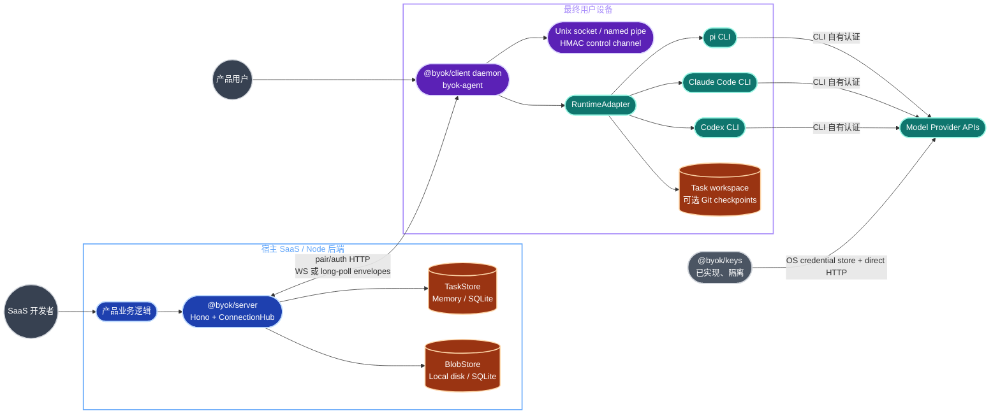

真实入口与权威面：

| 边界 | 入口 | 权威或最终副作用 |
| --- | --- | --- |
| SaaS embed | `createByokServer(options)` | 生成 Hono app、WS attach、dispatch/task/device/event/stats API |
| 本机 library | `createDaemon()` / `createDaemonWithAdapters()` | 配对、连接、任务执行、observer、service lifecycle |
| 本机 CLI | `byok-agent` | pair/start/status/runtimes/tasks/workspaces/unpair/approval/service commands |
| Approval helper | `byok-approval-mcp` | Claude confirm 模式的 stdio MCP 子进程，经 control socket 回调 daemon |
| Wire contract | `@byok/protocol` public index | envelope、17 类消息、HTTP schema、状态机、capability flags |
| Key custody | `ProviderRegistry` | profile 与 secret 分库存储，构造 OpenAI-compatible / Anthropic client |

### 1.2 Monorepo 与依赖图

仓库是 Node `>=20`、pnpm workspace。四个 package 都可独立 build/package，但仓库本身不能证明它们已经发布到 npm。

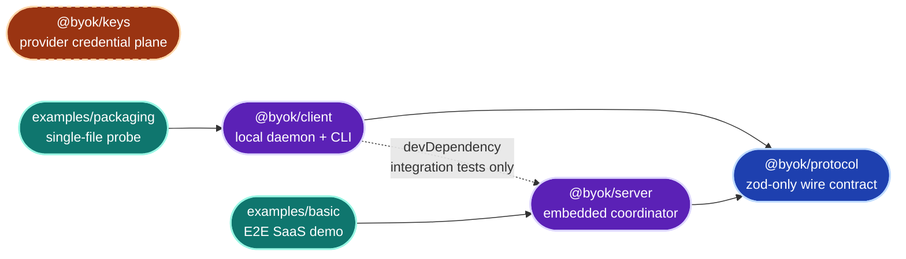

规模信号来自当前 TypeScript 源码：

| package | 生产 TS files / LOC | test files / LOC | 设计压力 |
| --- | ---: | ---: | --- |
| protocol | 11 / 1,372 | 9 / 2,149 | 小而冻结；跨端契约变化风险最高 |
| server | 16 / 4,409 | 24 / 5,494 | `ConnectionHub` 集中持有 embedded authority |
| client | 68 / 17,535 | 90 / 20,070 | 最大模块；runtime、IPC、service、Git、transport 都在此包 |
| keys | 18 / 2,697 | 15 / 2,934 | 独立 key-custody 安全模型 |

统计口径：生产列排除 `*.test.ts`、`*.spec.ts` 与 `src/__tests__/` 整棵子树；test 列取 `src/*.test.ts`、`*.spec.ts` 与 `src/__tests__/` 下的全部 `.ts`，因此 `server` 的 test 列含 `src/__tests__/test-support.ts`、`client` 的含 `src/__tests__/fixtures/*.ts` 这类不含断言的测试支撑文件。四个 package 的复算命令：

```bash
SDK_SRC=packages/server/src
find "$SDK_SRC" -type f -name '*.ts' ! -name '*.test.ts' ! -name '*.spec.ts' ! -path '*/__tests__/*' -print | sort
find "$SDK_SRC" -type f \( -name '*.test.ts' -o -name '*.spec.ts' -o -path '*/__tests__/*.ts' \) -print | sort -u
```

对两组结果分别执行 `wc -l` 得 file count，执行 `xargs wc -l` 取合计 LOC；替换 `SDK_SRC` 即可复算其余三个 package。

强依赖是 `server/client → protocol`；弱依赖是 `client -dev→ server`。`keys` 与 dispatch 三包之间的零边是安全 invariant，不是尚未整理的偶然状态。

### 1.3 交付与非运行时表面

| 位置 | 角色 | 当前状态 |
| --- | --- | --- |
| `examples/basic` | 嵌入 `@byok/server` 的 Hono demo + browser API/SSE UI | 已实现；可用 `BYOK_STORE=sqlite` 切换持久层 |
| `examples/packaging` | 单文件打包 probe | 已实现；只做 daemon status 与 Pi detection，不 pair/start/network |
| `templates/packaging/bun` | `bun build --compile` copy-out recipe | 已实现；含 build/smoke |
| `templates/packaging/sea` | Node SEA + esbuild/postject recipe | 已实现；含跨平台边界说明与 smoke |
| `templates/service` | launchd/systemd/WinSW reference recipes | 已实现；真正执行逻辑在 `packages/client/src/lifecycle/*` |
| `deploy/` | env/release/runbook/scripts/sql/submissions 骨架 | 只有 README + 6 个 `.gitkeep`，无可部署实现 |
| `.github/workflows/ci.yml` | Node 20/22 build/typecheck/test + 专项 smoke/audit | 已实现 |

## 2. `@byok/protocol`：唯一 wire 契约

### 2.1 模块与公开功能

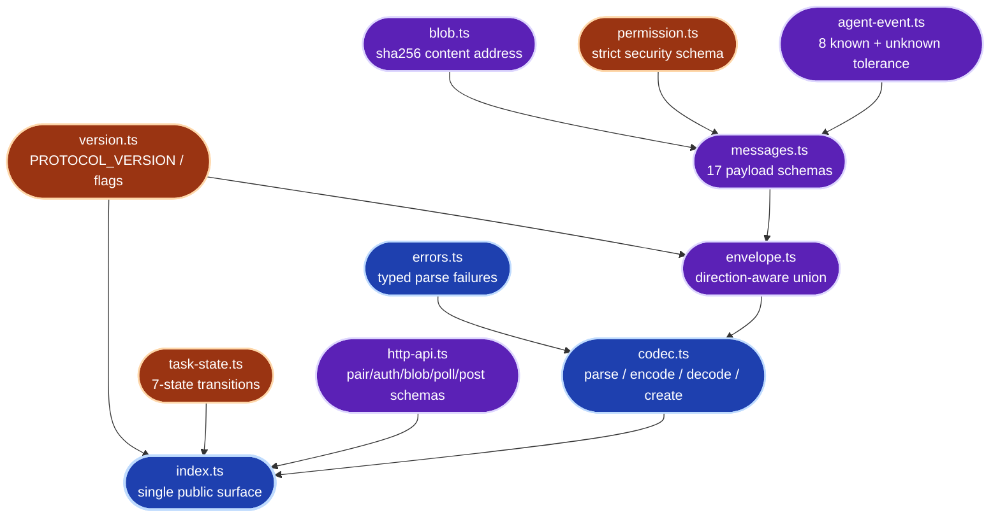

| 文件 | 主要 exports / 功能 |
| --- | --- |
| `version.ts` | `PROTOCOL_VERSION = 1`、`CAPABILITY_FLAGS` |
| `messages.ts` | runtime info、17 个 payload schemas、direction type lists、`MESSAGE_PAYLOAD_SCHEMAS` 单一来源 |
| `envelope.ts` | discriminated union；所有 `task.*` 必须有 `task_id`，server→daemon 必须有 envelope `seq` |
| `codec.ts` | `parseMessage`、`decodeEnvelope`、`encodeEnvelope`、`createEnvelope` |
| `agent-event.ts` | 8 个已知 event、unknown wrapper、`isKnownAgentEvent`、`partitionAgentEvents` |
| `permission.ts` | `auto/confirm/readonly/plan` 与 `.strict()` policy schema |
| `task-state.ts` | 7 态、合法转移表、`canTransition` |
| `blob.ts` | `sha256:<64hex>` 内容地址 |
| `http-api.ts` | pair/challenge/token/blob/events/messages DTO；消息 POST batch 上限 256 |
| `errors.ts` | parse、unknown type、validation 三类错误 |

### 2.2 17 个消息类型

| 分组 | 类型 |
| --- | --- |
| connection | `conn.hello`、`conn.ack` |
| server → daemon | `task.offer`、`task.approve`、`task.reject`、`task.cancel`、`task.steer` |
| daemon → server lifecycle | `task.claim`、`task.started`、`task.decline`、`task.await_approval`、`task.complete`、`task.fail`、`task.cancelled` |
| daemon → server data | `task.progress`、`task.artifact`、`task.approval_resolved` |

`task.offer.workspaceHint` 是保留字段：protocol schema 已有，但 public `DispatchInput`、TaskRunner 与 adapters 都没有消费它，不能把它描述成工作区选择能力。

### 2.3 执行状态机

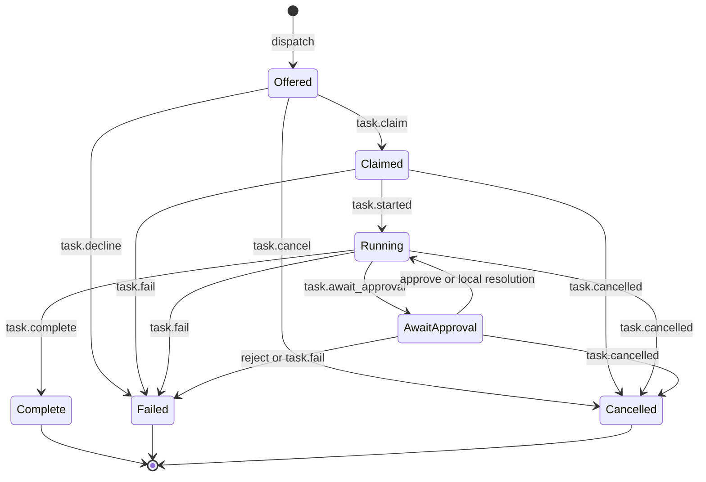

`Claimed` 与 `Running` 分离，防止“认领成功”掩盖 runtime 启动失败。`task.decline` 语义独立，但状态落到 `Offered → Failed`；`reason/retryable` 决定是否可以换设备重试。`Complete/Failed/Cancelled` 都是终态。

### 2.4 Freeze 与兼容边界

- wire `v1` 已冻结；breaking shape change 必须升 major，并刻意更新 golden fixtures。
- 普通 optional field、新 message type、新 `AgentEvent`、新 capability flag 可 additive 增加。
- 例外：`PermissionPolicySchema` 与 instruction blob-ref 是 `.strict()` control/security shape；增加字段本身就是 breaking。
- observability unknown 可忽略；control/security unknown 必须 fail-closed。
- server 支持 N 与 N-1 major。当前只有 v1，所以该能力目前是 no-op。

## 3. `@byok/server`：embedded coordinator

### 3.1 组成与所有权

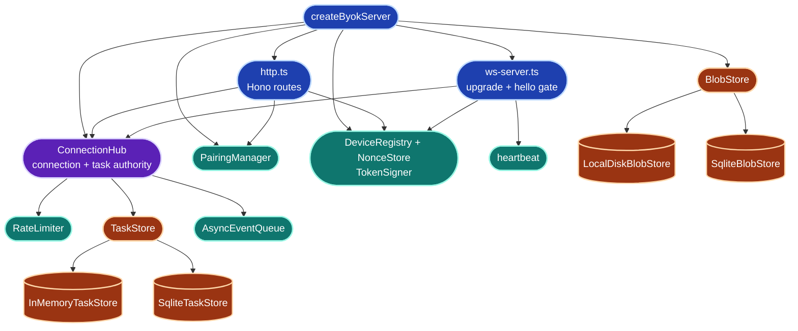

`createByokServer()` 返回：

- `hono` 与 `attachWebSocket(server)`；
- `pairing.createPairingCode()`；
- `dispatch(input) → Promise<TaskHandle>`；
- `tasks.get/list`、`machines.list`、`events.subscribe`；
- `devices.revoke`、`stop`、`stats`。

默认是 `InMemoryTaskStore + LocalDiskBlobStore`；SQLite variants 是可注入持久层。`TaskStore` 是同步接口，`BlobStore` 是 async 接口。SQLite 只能恢复记录，不能恢复 hub 内的 promise、event queue、connection map 与 in-flight runtime。

### 3.2 HTTP、WS 与内核职责

| 模块 | 已实现功能 |
| --- | --- |
| `http.ts` | pair/challenge/token、blob upload/download/content、events poll、messages POST、可选 healthz |
| `ws-server.ts` | Bearer upgrade、首帧 `conn.hello`、protocol/product/device 校验、heartbeat |
| `hub.ts` | per-device transport、outbox/redelivery、inbound ownership/dedup/type gate、task transitions、approval/cancel/steer、lease reaper、stats |
| `auth.ts` | HMAC JWT、Ed25519 signature verify、device revoke、single-use nonce |
| `pairing.ts` | 约 10 分钟 TTL 的 single-use code |
| `rate-limiter.ts` | per-device in-process token bucket |
| `task-store.ts` | transition CAS-like validation 与 pending approval id |
| `blob-store.ts` | signed URL、content write/read、size/hash boundary |

`ConnectionHub` 是 embedded 部署的真正权威；Hono 与 WS 层都把合法输入收敛到它。它不是可水平扩展的 cloud runtime：连接、outbox、dedup window、waiter、task activity 与 event queue 都在单进程内。

### 3.3 已知边界

- M0/M5 embedded 模式不支持 queue-until-connect；设备从未连上时 `dispatch` 直接失败。
- task lease 只在设备已 dark 且 `Claimed/Running/AwaitApproval` 自最后活动满 `taskLeaseMs` 后触发，结果是 retryable failure。
- `steer` 目前有 task-level capability gap：server 能对任何 Running task 排队 `task.steer`，但只有 Pi adapter 真正支持；Claude/Codex 收到后会 throw，使 client cursor 暂停推进并触发重放。connection-level `steer` 只是“设备至少有一个 adapter 支持”，不能安全代表本任务所选 runtime。

## 4. `@byok/client`：本机 daemon、CLI 与 runtime boundary

### 4.1 分层地图


### 4.2 Public surface 与 CLI

Library exports 分成六组：

| 组 | 主要 public API |
| --- | --- |
| daemon | `createDaemon`、`createDaemonWithAdapters`、`Daemon*`、`AuthManager`、`DeviceRevokedError`、`BlobClient` |
| adapter contract | `RuntimeAdapter`、`Session`、`TaskContext`、`RuntimeCapabilities`、`PolicyUnsupportedError` |
| bundled adapters | `PiAdapter`、`ClaudeAdapter`、`CodexAdapter` 与 options |
| observability | `DaemonObserver`、event/task projection types |
| Git workspace | `GitWorkspaceManager`、`GitWorkspaceStore`、ledger/lease/observation types |
| OS integration | service lifecycle factories/generators、`ensureSecureDir`、Windows DACL error |

`byok-agent` 命令面：

| 类别 | 命令 |
| --- | --- |
| identity/runtime | `pair`、`unpair`、`status`、`runtimes` |
| task/operator | `tasks`、`workspaces`、`approvals`、`approve`、`reject` |
| daemon | `start` |
| OS service | `install`、`uninstall`、`service-start`、`service-stop`、`service-status` |

`@byok/client` 的 runtime dependencies 是 `@byok/protocol` 与 `ws`；另有 optional `@earendil-works/pi-coding-agent`，并被 tsup 标记 external。Claude/Codex 永远依赖用户本机已安装且已登录的 official CLI。

### 4.3 Daemon 模块清单

| 模块族 | 职责 |
| --- | --- |
| `create-daemon.ts` | config validation、adapter build/detect、stores、TaskRunner/ConnectionManager/control server 组装、统一 shutdown |
| `auth-manager.ts` / `device-keys.ts` / `http-client.ts` | pair、challenge/token renew、Ed25519 key、401 revocation |
| `connection-manager.ts` | 单一 client outbox、WS↔long-poll mode、ack/cursor、chunking、shutdown drain |
| `ws-transport.ts` / `long-poll-transport.ts` | WebSocket heartbeat/reconnect 与 HTTP poll/post transport |
| `task-runner.ts` | offer admission、runtime selection、policy、workspace、Session event pump、approval/cancel/steer、resource limits |
| `policy.ts` / `environment.ts` | device ceiling 合并、per-runtime env allowlist、`BYOK_*` hard deny |
| `progress-batcher.ts` | normalized `AgentEvent` 批次与 task-level sequence |
| `approvals.ts` | bounded pending approval registry、first resolution wins |
| `control-server.ts` / `control-protocol.ts` | HMAC mutual auth、local RPC、endpoint/token derivation |
| `observer.ts` | local task/connection/runtime event projection；为 CLI follow 提供数据 |
| `store.ts` / `cursor-store.ts` / `session-workspace-store.ts` | device identity/token、redelivery cursor、sessionRef→workspace mapping |
| `git-workspace.ts` / `git-workspace-store.ts` | optional local checkpoints、one-writer lease、private recovery ledger |
| `blob-client.ts` | signed URL 方式上传/下载 instruction/artifact |
| `url.ts` | HTTP/WS URL conversion；remote plaintext 默认拒绝 |
| `util/*` | bounded async queue、atomic write、POSIX mode / Windows DACL hardening |

### 4.4 Runtime adapter capability matrix

| 能力 | Pi | Claude | Codex |
| --- | --- | --- | --- |
| session model | 长驻 RPC | 长驻 stream-json process | 每 turn 一次 `codex exec`，resume 开新进程 |
| resume | yes | yes | yes |
| mid-turn steer | **yes** | no，写 stdin 只会排成 follow-up | no |
| permission modes | `auto`,`readonly` | `auto`,`readonly`,`plan`,`confirm` | `auto`,`readonly` |
| confirm/approval | no，fail-closed | **已接线**：permission-prompt-tool → MCP → control socket | no，fail-closed |
| allow/deny tools | 支持 | 条件支持 | 不支持，相关 policy fail-closed |
| network control | `network:false` 不可保证 | `network:false` 不可保证 | `network:true` 不可保证 |
| usage event | 无 | input/cache/output | input/cache/output/reasoning |

Runtime policy 不做跨 runtime 的语义翻译：tool name 是 runtime-local vocabulary。adapter 无法精确表达 policy 时必须 decline，不能选择“接近的”参数继续执行。

已确认的 capability honesty gap：Claude `confirm` 已真实可用，但 `RuntimeInfo.capabilities.approvalInteractive` 仍对所有 adapter 硬编码 `false`，connection flag `interactive-approval` 仍 reserved。当前可靠信号是该 runtime 的 `permissionModes` 是否包含 `confirm`。

### 4.5 启动与关闭


统一 graceful shutdown 顺序是：停止接收新 offer → bounded teardown active tasks → bounded drain outbox → stop connection/auth → close control socket。取消、shutdown RPC 与 library `stop()` 共用同一条序列，避免三套不同清理语义。

## 5. Local control plane 与 approval

### 5.1 Control socket 信任边界

Unix 使用 domain socket，Windows 使用 named pipe。client/server 各自对对方 nonce 做带 domain label 的 HMAC，shared token 只存在 `<storeDir>/control.token`，不在 socket 上明文传输。RPC 在 mutual auth 完成前结构上不可达。

主要 RPC 面覆盖 status、task list/follow、approval request/resolve、unpair/shutdown 等 operator 能力。POSIX 依赖 0700/0600；Windows 通过 `icacls` 设置 restrictive DACL，失败抛 `SecureDirHardeningError`，不会继续写入未保护的 device/control secrets。

### 5.2 Claude confirm 真实路径

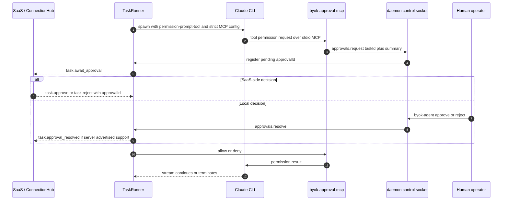

server `approve/reject` 会先改变自己的 task record，再 best-effort 通知 daemon；`approvalId` 防止迟到 decision 误命中下一笔 pending approval。Pi/Codex 的 `resolveApproval()` 直接 throw，这个 failure 不能被 fallback 隐藏。

## 6. Local Git checkpoint workspace

该功能默认关闭；唯一启用形状是：

```ts
{ gitWorkspace: { mode: 'local-checkpoints' } }
```

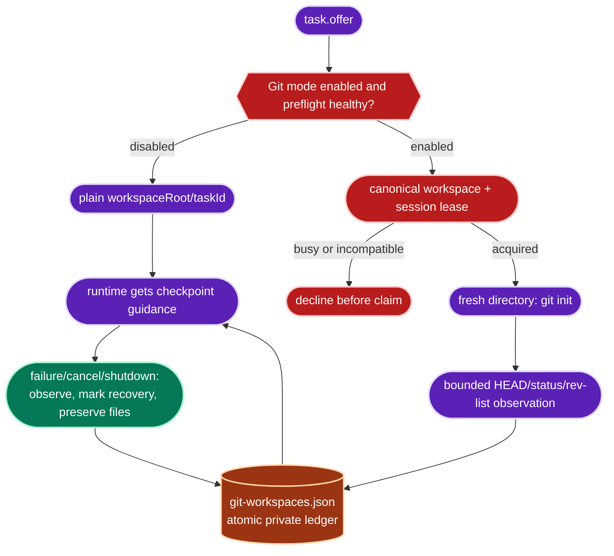

Git 只记录 code state，不改变 wire task state。daemon 不自动 commit、不改 identity、不执行 network Git、不 reset/stash/clean/rebase/merge/切分支，也不删除 workspace。重启只把遗留 `preparing/active` 记录标成 `interrupted`；它不会伪造协议恢复。operator view 默认隐藏路径，只有 `workspaces --show-paths` 才显示。

## 7. `@byok/keys`：独立 provider credential plane

### 7.1 架构与模块


| 模块 | 已实现功能 |
| --- | --- |
| `provider-profile.ts` | provider kind、adapter、auth mode 组合验证；custom URL normalization |
| `registry.ts` | configure/remove/status/resolve；profile 与 secret 的唯一汇合点 |
| `secret-store.ts` | generic async port、memory store、secret name/value validation |
| `macos-keychain.ts` / `windows-credential-manager.ts` | OS-native secret persistence |
| `secret-scope.ts` | tenant/product/account envelope scope |
| `profile-store.ts` / `sqlite-profile-store.ts` | non-secret profile memory/SQLite persistence |
| `headers.ts` | bearer / x-api-key / none；缺 secret fail-closed |
| `openai-client.ts` / `anthropic-client.ts` | direct provider transports |
| `http.ts` / `url.ts` | 15s timeout、2MiB response cap、HTTP error classification、loopback/private-host guards |
| `errors.ts` | stable key-management error taxonomy |

### 7.2 数据流与隔离

`ProviderRegistry.configure()` 的顺序是先写 secret，再验证 secret 已存在，最后写 profile；status 只暴露 `secret_configured` boolean，不返回 secret。`resolve()` 只对 enabled、valid、secret-complete 的 profile 构造 transport。

`@byok/keys` 不是 daemon 的 runtime credential source。当前没有任何 `client/server/protocol/examples/templates` import site；把它画进 agent spawn environment 会直接破坏 dispatch plane 的 credential-isolation claim。

## 8. P2：端到端数据流

### 8.1 Pairing、renewal 与连接握手

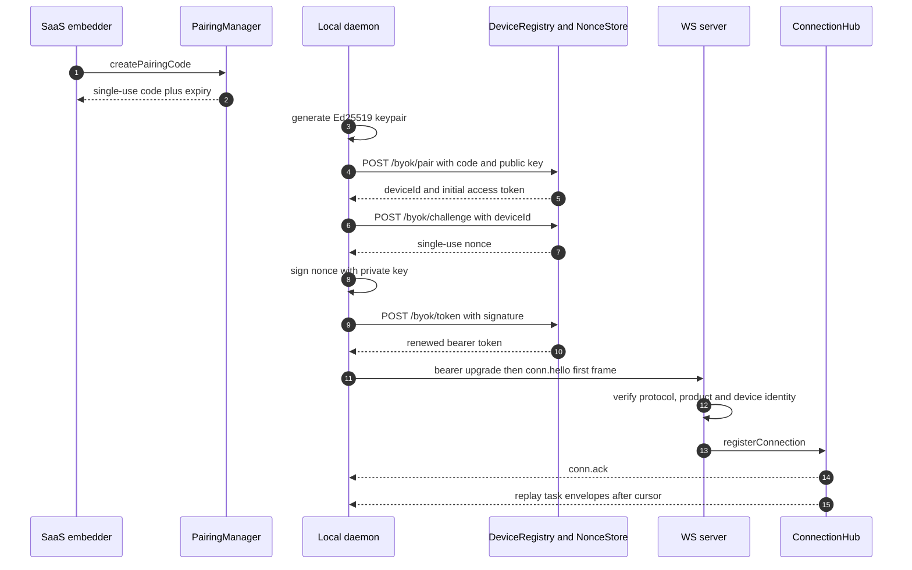

认证错误路径：无效/过期 pairing code、nonce replay、签名不符、token claims 不符都拒绝。device revoke 后 challenge/token/WS/authed HTTP 返回 401；daemon 清理本地身份并进入 `revoked`，不会无限重试。

### 8.2 Dispatch 到 terminal result

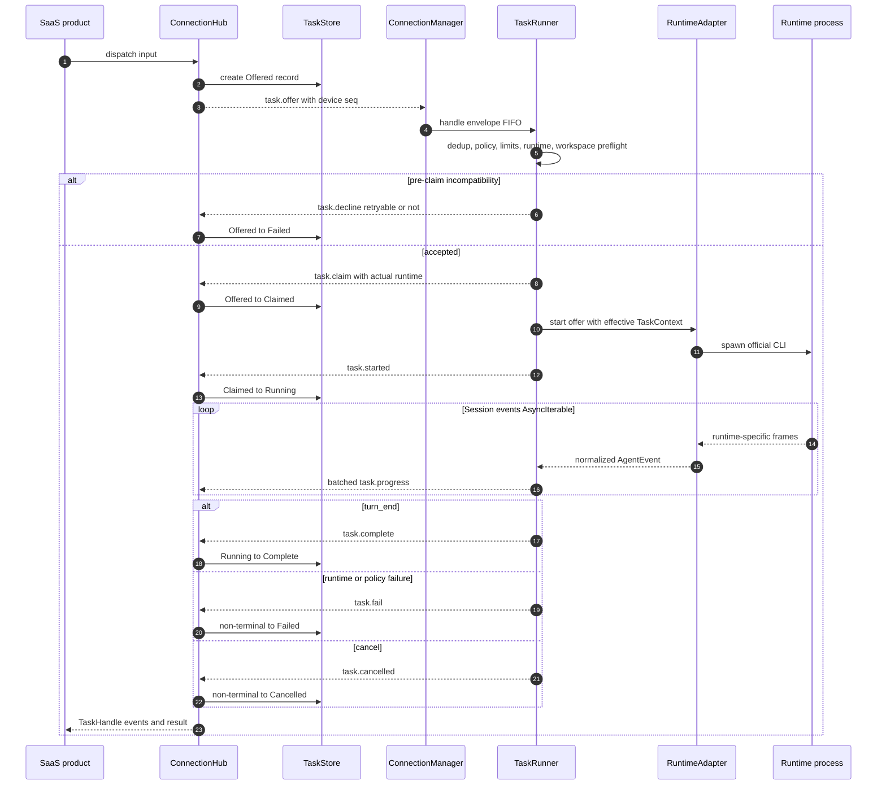

关键 ownership 变化：SaaS 创建 task；Hub 持有 embedded task record；TaskRunner 决定是否能安全执行；adapter 只拿 effective policy 与 daemon-owned workspace；runtime process 产生原始事件；adapter 归一化；server 只接受 owner device 的 daemon→server envelopes。

### 8.3 WS、long-poll 与 redelivery

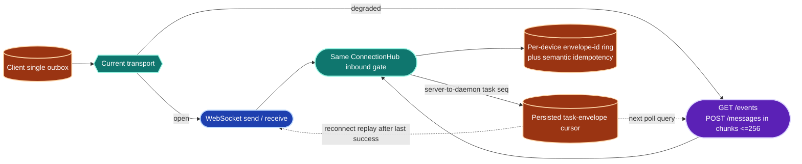

两种 transport 对同一 device 互斥，last successfully connected transport wins。long-poll 是完整双向 transport，不是只读降级。cursor 只在 `task.*` handler 成功后推进；`conn.ack.seq` 不推进 cursor。失败时 watermark 冻结并 backoff，后续重放依靠 TaskRunner 与 Hub 的 idempotency。

## 9. 安全边界与资源治理


| 控制 | 保证 | 不保证 |
| --- | --- | --- |
| device auth | pairing single-use、Ed25519 nonce proof、bearer claims、revoke | 同一 OS user 读取本地 `device.json` |
| transport gate | remote plaintext 默认拒绝；WSS/HTTPS 默认路径 | SDK 自己提供 TLS termination |
| policy | device ceiling 合并；adapter 无法表达则 decline | kernel-level sandbox 或强制 filesystem confinement |
| runtime credentials | dispatch daemon 不读 runtime credential stores；ambient env 按 allowlist | 被显式 allow 的 env value 不含 secret |
| control socket | mutual HMAC、endpoint permission/DACL、method pre-auth unreachable | 同一 user 且能读 token 的恶意进程 |
| audit/observer | 只记录 task id、event type、tool/runtime name、counts/sizes | 保存完整 tool input/output 作为审计证据 |
| resource limits | max duration、max output bytes、bounded queues/collections、shutdown deadlines | cgroup/rlimit；恶意 child 一定会响应 interrupt |
| workspace | daemon-owned path、optional one-writer Git lease | runtime 无法访问 workspace 之外的路径 |

`limits.maxTokens` 当前不能由任一 bundled adapter 精确执行，因此必须在 pre-claim fail-closed，而不是估算。`workspaceRoot` 是 convention，不应被 UI 描述成 sandbox。

## 10. 打包、服务与验证面


SDK 只交付 npm library 与 reference recipes。host product 拥有 binary signing、notarization、download hosting、installer、release channel 与 auto-update。service lifecycle 直接委托 OS supervisor；SDK 不在 daemon 内再造 supervisor。

CI 验证层次：

1. Node 20/22：build → typecheck → test；build 必须先跑，因为 workspace exports 指向 `dist`。
2. Windows Git workspace/store/security tests，含特殊字符路径。
3. Bun/SEA packageability smoke。
4. WinSW real service install/start/stop/uninstall smoke。
5. macOS/Linux/Windows control socket smoke。
6. Ubuntu `strace` credential-isolation audit。

## 11. 当前源码已知缺口

| 缺口 | 架构影响 | 当前正确表述 |
| --- | --- | --- |
| `approvalInteractive=false` 硬编码 | wire capability 与 Claude confirm 实际能力不一致 | 使用 `permissionModes.includes('confirm')` 判断，不使用 reserved flag |
| task-level steer 未按 claimed runtime gate | Claude/Codex 收到 steer 会 throw，并可能 stall cursor | `steer` 不是所有 Running task 的安全通用操作 |
| `workspaceHint` 无消费者 | schema 与 public functionality 不一致 | 标为 reserved，禁止声称已实现 |
| `@byok/keys` 零主链 import | key custody 与 dispatch 尚未组合 | 标为“已实现、隔离”，不是 placeholder，也不是 daemon secret source |
| embedded SQLite 不恢复 in-flight | record persistence 不等于 runtime recovery | 只承诺 task/blob record 跨重启，不承诺 live handle/session |
| `deploy/` 只有 skeleton | 平台设计没有部署实证 | 不把 SQL/Workers/runbook 画成当前模块 |

## 12. 目标平台架构（尚未实现）

本节只复述 `ARCHITECTURE-PROPOSAL-byok-platform.md` 的 final 裁定，所有节点均为**目标设计**。它解决当前 embedded coordinator 无法成为多租户、水平扩展、可组合 cloud service 的问题，同时保留 wire v1。

### 12.1 目标 package graph

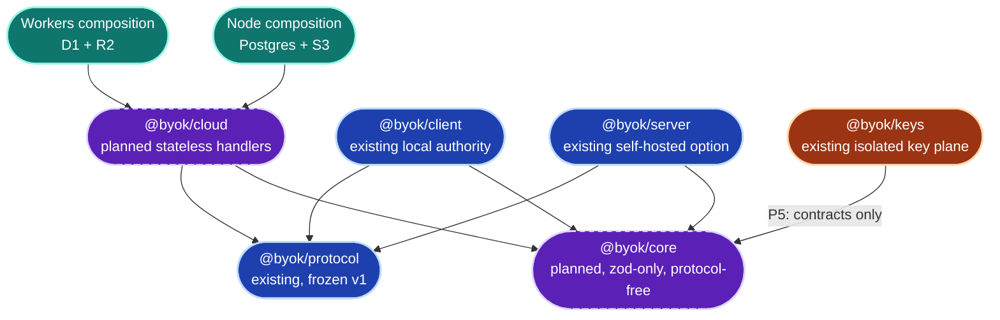

关键 invariant：`core` 必须 protocol-free，才能让 future `keys → core` 不产生 `keys → protocol` 的间接依赖。`@byok/server` 留作 self-hosted embedded coordinator；`@byok/cloud` 才是 stateless hosted surface。

### 12.2 `@byok/core` 与 `@byok/cloud` 目标职责

| 目标模块 | 责任 |
| --- | --- |
| core `attestation.ts` | `DeviceProofEnvelopeV1`、canonical bytes、注入式 verify |
| core `tenant.ts` | `TenantId`、device/control-plane principal |
| core `board.ts` | 5-state board、合法转移、claim conflict snapshot |
| core store ports | Truth/Mailbox/Board/Presence/Blob async contracts；首参数永远是 tenant |
| cloud device handlers | pair/challenge/token 与 frozen events/messages/blob HTTP surface |
| cloud board handlers | list/incremental、SSE、claim/unclaim/status CAS |
| cloud truth handlers | immutable terminal、profile/memory records、rev CAS、object refs |
| cloud hints | device presence TTL、task activity tail + explicit dropped count |
| compositions | InMemory、Postgres+S3、D1+R2、self-hosted server contract suites |

### 12.3 两个状态机与 presence vocabulary

Wire execution state、board coordination state 与 presence level 不得复用命名：

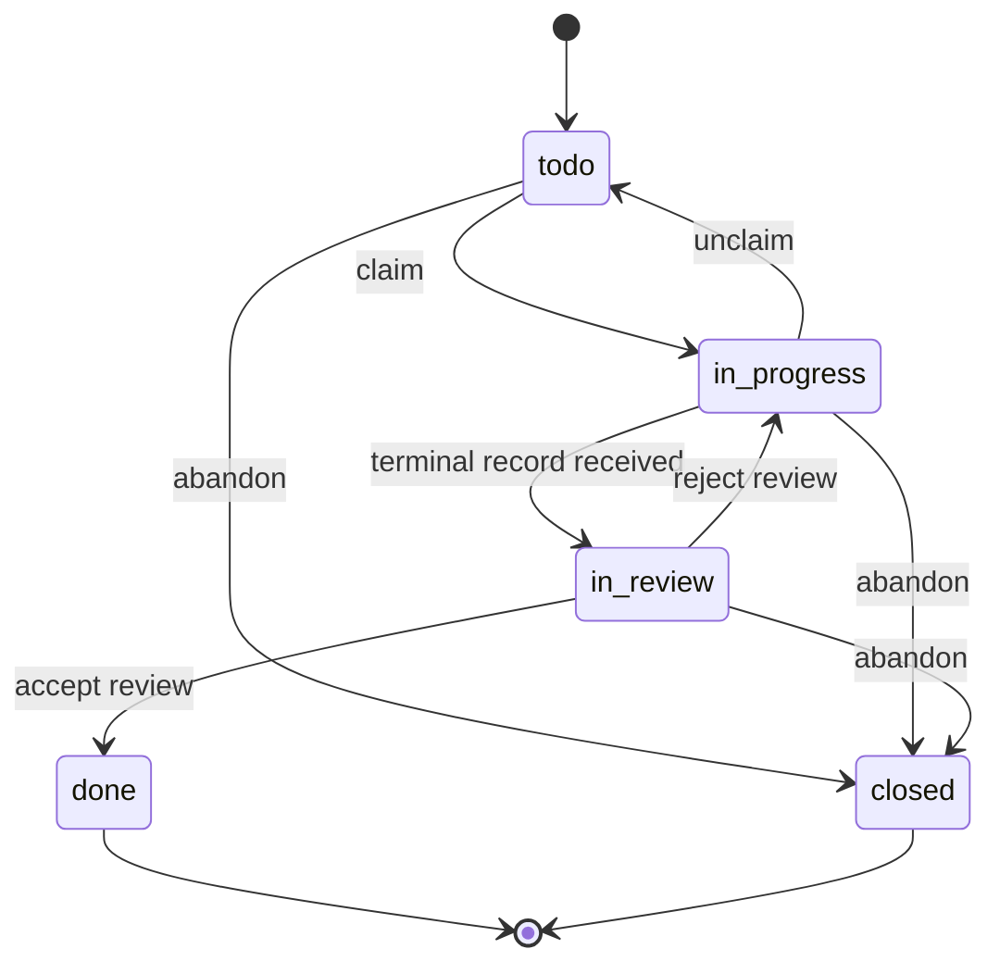

| vocabulary | 值 | 权威 | 语义 |
| --- | --- | --- | --- |
| wire execution | `Offered/Claimed/Running/AwaitApproval/Complete/Failed/Cancelled` | local execution path；frozen protocol | 一次运行尝试 |
| board coordination | `todo/in_progress/in_review/done/closed` | cloud SQL | 人与多 device 的离散协作生命周期 |
| presence | `online/thinking/working/error/offline` | TTL hint，无持久权威 | device 当前在线/活动提示 |

`AwaitApproval` 是执行中暂停；`in_review` 是执行结束后人工验收。二者不能互相触发。`closed` 在 final proposal 中暂取“终止未验收”，RAFT 原义仍需标为 unverified。

### 12.4 Cloud data categories

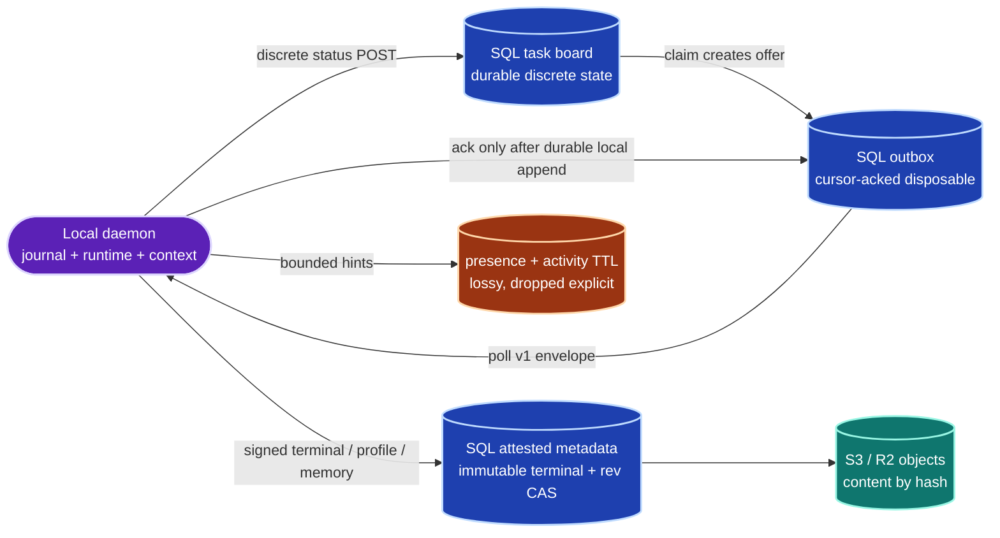

cloud 可以按 producer 给定的 tenant/channel/status/seq/hash 做精确匹配与排序，但不能做摘要、相关性、分类、memory merge 等语义推导。连续变化的 workspace、context、runtime session 与逐轮产物留在 local daemon。

### 12.5 目标 end-to-end path

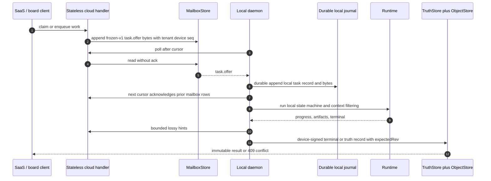

load-bearing 顺序是 durable local append 后才 ack mailbox。append 前 crash 由 redelivery 恢复；append 后 crash 由 local journal 恢复。cloud 不需要持有 Running record 才能保证任务不丢。

### 12.6 Tenant isolation 与 composition contracts

- 所有 store port 第一参数是 required `TenantId`；没有裸 `deviceId/taskId` lookup。
- pairing code 由 server-side claim 绑定 tenant/product；device record 不允许“无 tenant”。
- terminal record immutable；同 task 不同 hash 返回 conflict，不覆盖第一份事实。
- board claim 用 SQL CAS；N 个并发 claim 只允许 1 个成功，其余返回 holder snapshot。
- status transition 带 `expectedStatus`；不允许 last-write-wins。
- per-tenant `board_seq` 单调，不能跨 tenant 推进。
- 同一 store contract suite 跑 InMemory、Postgres+S3、D1+R2、self-hosted server 四种 composition。

## 13. RAFT 受限参考

完整证据与版本拓扑放在 `docs/researches/raft-architecture-reference.md`。SDK 架构只保留决策映射：

| RAFT 模式 | BYOK 决定 | 原因 |
| --- | --- | --- |
| agent-facing CLI + injected env/API context | **评估，不直接替换** | runtime-neutral callback 能解决 Pi/Codex approval gap，但会改变 frozen wire/control architecture |
| board 5 态、assignee/status 分离、claim conflict snapshot | **采纳语义** | 适合 `@byok/core` + cloud SQL，并与 wire execution state 分离 |
| SSE + periodic reconciliation + poll path | **采纳，改成 capability declaration** | 不使用 404/405/501 status sniffing heuristic |
| presence/activity + dropped count | **采纳** | 把高频有损信号与 durable truth 分开 |
| local agent shortcut API | **采纳能力，复用 control socket** | 现有 Unix socket/named pipe 边界比新增 loopback HTTP 更一致 |
| daemon/runtime driver unification | **参考 adapter shape** | BYOK 已有 RuntimeAdapter；无需搬入 RAFT 产品 workspace 语义 |
| credential proxy | **deferred** | BYOK dispatch plane 当前不持有 runtime credentials；引入会改变 credential-isolation claim |
| computer supervisor/updater 独立层 | **宿主产品责任 / deferred** | SDK 既定边界是 OS supervisor + host-owned release/update |
| hash-only updater trust | **拒绝照抄** | upgrade manifest 与 binary 同源不能形成独立签名信任根 |
| runtime bypass/yolo flags | **拒绝** | 会推翻 BYOK fail-closed PermissionPolicy 约束 |

RAFT 是带自家 cloud/workspace 的完整产品；BYOK 是供宿主产品组合的 SDK。可参考其填满的 operational semantics，不能把产品所有权边界一起搬进 SDK。

## 14. P3：设计理由、10x 与不变量

### 14.1 为什么当前形状存在

- `protocol` 小而冻结：让 Node server 与本机 daemon 共享一份 schema，不把 transport implementation 混入 contract。
- `ConnectionHub` 集中：M0-M5 优先证明单节点 embedded lifecycle、reliability 与 runtime integration；代价是不能水平扩展。
- `client` 较大：它必须跨越 CLI process、local persistence、IPC、OS service 与三种 runtime 的真实差异；这些边界共享同一个 device authority。
- `keys` 独立：key custodian 与 credential-isolated dispatcher 是相反安全承诺，package graph 必须阻止误耦合。
- OS supervisor 而非 in-process supervisor：SDK 不拥有宿主机器的 release/update policy。

### 14.2 10x 时先失败的地方

| 压力 | 最先失败处 | 已有/目标缓解 |
| --- | --- | --- |
| 单节点更多 devices/tasks | Hub in-memory maps、outbox ring、poll waiter、event queues | embedded 模式承认单 owner；hosted 目标转 mailbox/store ports |
| fleet reconnect | current backoff cohort 可能同时重试 | 后续需要 deterministic jitter；不能只靠纯 exponential delay |
| high-frequency UI hints | presence/activity SQL write amplification | bounded batch + TTL + dropped；必要时可单独换 KV/DO adapter |
| board concurrency | per-tenant `board_seq` 与 claim hot rows | SQL CAS、索引、contract suite；P2 后再做 P3 board |
| large memory | snapshot >1MiB 与 rev CAS conflict | 当前 key-granular snapshot；阈值触发 delta-chain deferred |
| many runtime kinds | closed `RuntimeIdSchema` 与 adapter-specific capability truth | 新 runtime id 是 protocol change；先修 per-task capability honesty |

### 14.3 必须保持的不变量

1. protocol golden fixtures 不漂移；breaking change 必须显式升版。
2. `keys` 与 dispatch/platform dependency graph 保持所规定的零边。
3. unknown observability 可忽略；unknown control/security fail-closed。
4. device/server/task ownership 每次 crossing 都验证，不靠调用者自律。
5. mailbox read 不等于 ack；local durable append 后才推进 cursor。
6. terminal truth immutable；TTL hint 不能覆盖 truth。
7. memory conflict 不由 cloud 语义 merge。
8. board claim/status 使用 CAS；不做 silent last-write-wins。
9. workspace/Git state 不驱动 protocol task transition。
10. runtime adapter 不把不支持的 policy 翻译成近似语义。

## 15. 事实来源与验证面

主要 authoritative surfaces：

| 主题 | 来源 |
| --- | --- |
| product truth（当前有限范围） | `docs/spec.md` |
| wire/state/auth/transport | `packages/protocol/src/*`、`docs/protocol.md` |
| current runtime behavior | `packages/server/src/*`、`packages/client/src/*`、tests |
| security posture | `docs/security.md`、`docs/security-review-m5-pilot-entry.md` |
| key plane | `packages/keys/src/index.ts`、registry/stores/transports/tests |
| target platform | `ARCHITECTURE-PROPOSAL-byok-platform.md` |
| RAFT reference | `docs/researches/raft-architecture-reference.md` |
| delivery proof | `.github/workflows/ci.yml`、`templates/*` smoke scripts |

文档验证要求：抽取并渲染每个 Mermaid fence；随后运行仓库必需检查：

```bash
pnpm -r run typecheck
pnpm -r run test
pnpm -r run build
repo-harness run check-task-workflow --strict
```
