# BYOK SDK 架構文檔

> 對象:要嵌入 BYOK 的 SaaS 開發者、SDK 本身的維護者。
> 範圍:`packages/protocol`、`packages/server`、`packages/client`、`packages/keys`,以及 `examples/`、`templates/`、`deploy/`。
> 一句話定位:BYOK SDK 讓 SaaS 產品把任務派給「使用者自己機器上的 coding agent CLI」執行,而不是在 SaaS 的伺服器上跑 agent。

---

## 1. 系統總覽

SaaS 產品在自己的後端 embed `@byok/server`(一個 Hono app + WebSocket handler),使用者在自己的機器上跑 `@byok/client` 提供的 daemon(`byok-agent`)。兩邊透過 HTTP 端點完成配對與認證,之後用 WebSocket 作為主通道、long-poll 作為 fallback 傳遞 envelope。daemon 收到任務後,選一個本機安裝的 coding-agent runtime(`pi` / `claude` / `codex` CLI)spawn 成子程序執行,把事件批次回傳給 server。

模型的 API key 全程留在使用者側:CLI 自己讀自己的憑證。`@byok/keys` 是為「產品側代管 provider 憑證」準備的獨立套件,目前**尚未接線**——整個 repo 沒有任何一處 import 它。

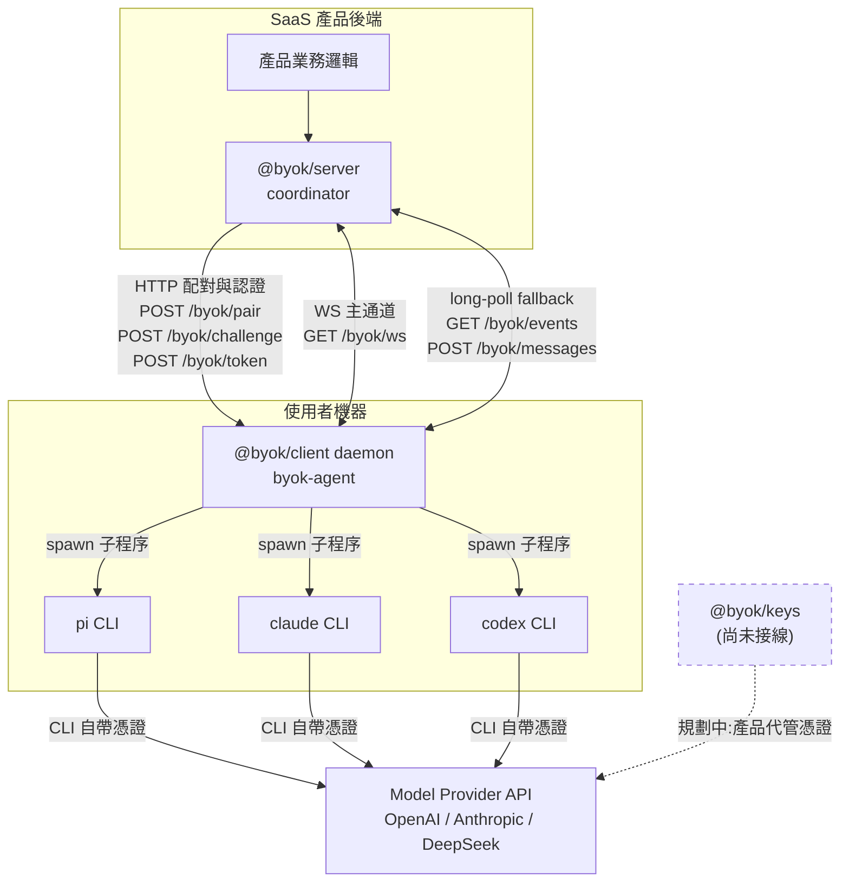

三條通道各自的職責:

| 通道 | 端點 | 用途 |
| --- | --- | --- |
| HTTP 配對/認證 | `/byok/pair`、`/byok/challenge`、`/byok/token` | 一次性 pairing code 換裝置身分,Ed25519 challenge 換 bearer token |
| WebSocket | `GET /byok/ws` | 主通道,雙向 envelope |
| long-poll | `GET /byok/events`、`POST /byok/messages` | WS 不可用時的 fallback,與 WS 互斥 |
| blob | `/byok/blobs` | 超長 instruction / artifact 的內容定址存放 |

---

## 2. Monorepo 套件依賴

pnpm workspace,四個發佈套件加兩個 example。內部依賴刻意保持單向且淺:`protocol` 是唯一被共享的節點,`server` 與 `client` 之間沒有 runtime 依賴。

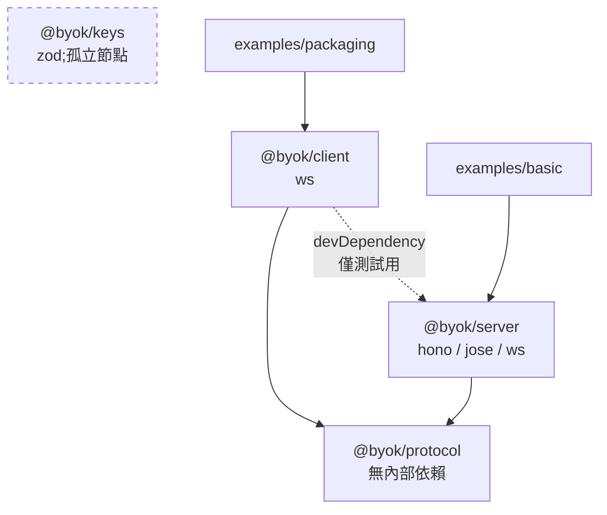

`client` 對 `server` 的 devDependency 只存在於測試:daemon 的整合測試需要起一個真的 coordinator 來對打。產品端部署時 daemon 不會帶進 server 的任何程式碼。

---

## 3. `@byok/protocol`

唯一的跨端契約。所有訊息形狀、狀態機、HTTP 路徑常數都在這裡定義,server 與 client 都只認這一份。

### 模組表

| 模組 | 職責 |
| --- | --- |
| `version.ts` | `PROTOCOL_VERSION = 1`、`CAPABILITY_FLAGS` |
| `envelope.ts` | `EnvelopeSchema`(discriminated union)、`isServerToDaemonType` |
| `messages.ts` | `MESSAGE_PAYLOAD_SCHEMAS` 單一真相源、17 個訊息類型、`RuntimeIdSchema` |
| `agent-event.ts` | `AgentEvent` 8 種變體、`partitionAgentEvents` 前向相容切分 |
| `codec.ts` | `parseMessage` / `decodeEnvelope` / `encodeEnvelope` / `createEnvelope` |
| `blob.ts` | `BlobRefSchema`,sha256 內容定址 |
| `permission.ts` | `PermissionPolicySchema`(`.strict()`) |
| `task-state.ts` | `TASK_STATES` / `TASK_TRANSITIONS` / `canTransition` |
| `http-api.ts` | HTTP 路徑常數與請求/回應 schema |
| `errors.ts` | 協定層錯誤型別 |

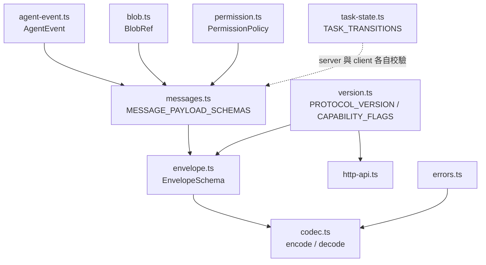

### 17 個訊息類型

`MESSAGE_PAYLOAD_SCHEMAS` 是唯一真相源;新增類型只改這一處,envelope union 自動跟上。

**連線握手(雙向,2 個)**

| 類型 | 方向 | 說明 |
| --- | --- | --- |
| `conn.hello` | daemon → server | 連線首幀,帶 protocolVersion / productId / deviceId / capabilities |
| `conn.ack` | server → daemon | 握手確認,回傳 server 側 capabilities 與 redelivery cursor |

**server → daemon(5 個)**

| 類型 | 說明 |
| --- | --- |
| `task.offer` | 派發任務,帶 instruction(inline 或 blob-ref)、runtime 偏好、PermissionPolicy |
| `task.approve` | 核准一筆待批准的工具呼叫 |
| `task.reject` | 駁回一筆待批准的工具呼叫 |
| `task.cancel` | 取消任務 |
| `task.steer` | 對執行中的任務追加指示 |

**daemon → server(10 個)**

| 類型 | 說明 |
| --- | --- |
| `task.claim` | 認領 offer,宣告要跑這筆任務 |
| `task.started` | 子程序已起,實際開始執行 |
| `task.decline` | 拒絕 offer(無合適 runtime、政策不允許等);與 fail 語義分離 |
| `task.progress` | 批次事件流,承載 `AgentEvent[]` |
| `task.artifact` | 產出物引用(通常是 blob-ref) |
| `task.await_approval` | 需要 out-of-band 核准,暫停等待 |
| `task.complete` | 正常完成 |
| `task.fail` | 執行失敗 |
| `task.cancelled` | 取消完成的獨立確認訊息 |
| `task.approval_resolved` | 核准結果已套用回 runtime |

`RuntimeIdSchema` 固定為 `'pi' | 'claude' | 'codex'`。

### AgentEvent 8 種變體

`task.progress` 內部承載的事件流。`partitionAgentEvents` 會把不認識的變體分離出來而不是整批拒絕,這是前向相容的關鍵:舊 server 遇到新 runtime 的新事件不會炸。

| 變體 | 說明 |
| --- | --- |
| `progress` | 一般文字輸出 |
| `tool_use` | runtime 呼叫工具 |
| `tool_result` | 工具回傳 |
| `artifact` | 產出檔案 |
| `needs_approval` | 需要人為核准 |
| `turn_end` | 一輪對話結束 |
| `error` | runtime 內部錯誤 |
| `usage` | token 用量統計 |

### 任務狀態機

`TASK_TRANSITIONS` 定義合法轉移,`canTransition` 在 server 的 `handleInbound` 與 client 的 TaskRunner 兩側都被檢查。

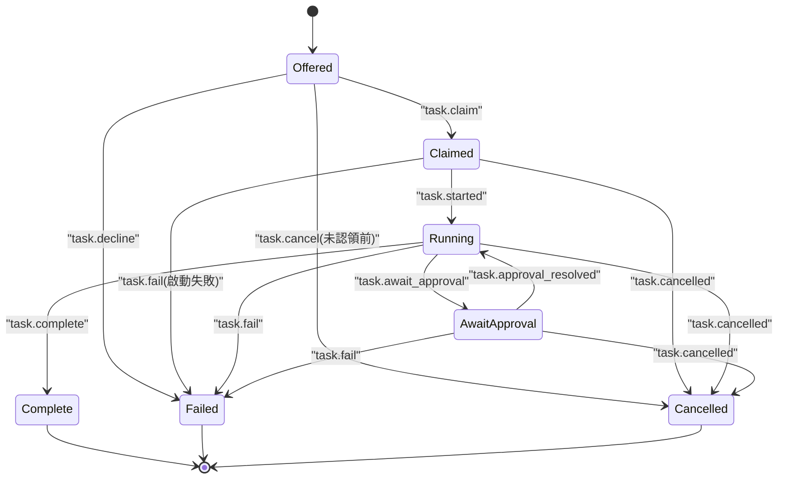

`Claimed` 與 `Running` 分離是刻意的:認領成功不代表子程序起得來,兩者失敗的處理路徑不同。`Cancelled` 也不是 `Failed` 的子類,它有自己的終態與訊息。

decline 在狀態機上落入 `Failed` 終態,但 payload 帶獨立的 `reason` 與 `retryable`,語義上與執行失敗分離——對 dispatcher 來說兩者都是「這次嘗試沒有結果」,靠 `reason` / `retryable` 判斷要不要換一台裝置重試,因此不另開 `Declined` 狀態去分裂所有終態消費端。

---

## 4. `@byok/server`(M0 coordinator)

`createByokServer()` 回傳一個可以掛進宿主 SaaS 的物件:`{ hono, attachWebSocket, pairing, dispatch, tasks, machines, events, devices, stop, stats }`。宿主可以把 `hono` mount 到自己的 app 上,或只用 `attachWebSocket` 接自己的 HTTP server。

M0 的定位是「參考實作」:in-memory 為預設,沒有 queue-until-connect(裝置離線時 dispatch 立即失敗,而不是排隊)。SQLite 實作提供給需要跨重啟保存的場景。

### 模組表

| 模組 | 職責 |
| --- | --- |
| `index.ts` | `createByokServer` 組裝與公開 API |
| `hub.ts` | `ConnectionHub`,整個 server 的核心 |
| `ws-server.ts` | `GET /byok/ws` upgrade、bearer 驗證、首幀校驗 |
| `http.ts` | `buildHonoApp`,`/healthz` 與所有 `/byok/*` routes |
| `pairing.ts` | `PairingManager.createPairingCode` |
| `auth.ts` | `DeviceRegistry` / `createHmacTokenSigner` / `NonceStore` |
| `task-store.ts` / `sqlite-task-store.ts` | 任務持久層,兩種實作 |
| `blob-store.ts` / `sqlite-blob-store.ts` | blob 持久層,兩種實作 |
| `heartbeat.ts`、`rate-limiter.ts`、`event-queue.ts`、`ids.ts` | 支援設施 |

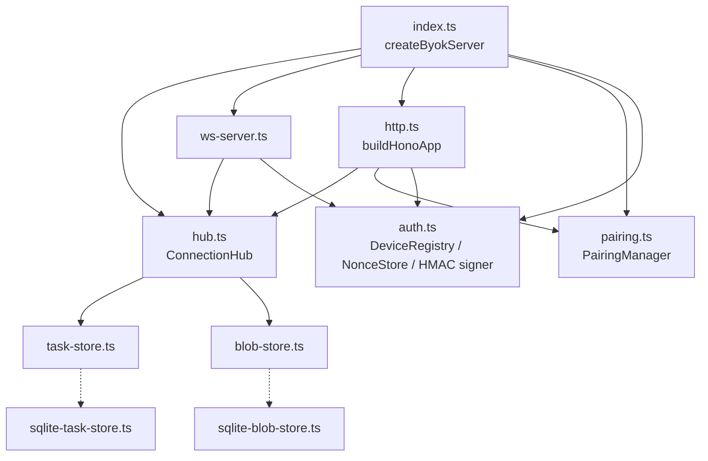

### ConnectionHub

所有連線狀態與任務生命週期都收斂在這一個物件上,沒有第二個地方能改任務狀態。

| 職責 | 說明 |
| --- | --- |
| per-device connection state | 每個裝置最多一條 active 連線;WS 與 long-poll 互斥,不可能同時活著 |
| `DeviceOutbox` redelivery ring | 每裝置一個 seq 遞增的環形緩衝;重連時依 cursor 補送漏掉的 envelope |
| task-lease reaper | 定期掃描;認領後遲遲不 `task.started`,或執行中失聯超時的任務會被回收 |
| `handleInbound` 型別閘門 | 只接受 `DAEMON_TO_SERVER_TYPES` 白名單內的類型,再過 idempotency ring 去重,最後用 `TASK_TRANSITIONS` 校驗狀態轉移 |

對外的動作方法:`registerConnection` / `sendConnAck` / `redeliverAfterReconnect` / `handleInbound` / `dispatch` / `approveTask` / `rejectTask` / `cancelTask` / `steerTask`。

`ws-server.ts` 的 upgrade 路徑有三道檢查:bearer token 驗證、首幀必須是 `conn.hello`、hello 內的 protocolVersion / productId / deviceId 三者都要對得上。任何一道不過就直接關連線。

---

## 5. `@byok/client`(daemon)

跑在使用者機器上的常駐程序。對外只依賴 `@byok/protocol` 與 `ws`,刻意保持輕,因為它要被打包成單一可執行檔分發。

### 模組表

| 模組 | 職責 |
| --- | --- |
| `bin/byok-agent.ts` | CLI 入口:`pair` / `start` / `status` / `runtimes` / `tasks` / `workspaces` / `unpair` / `approvals` / `approve` / `reject` / `install` / `uninstall` / `service-*` |
| `bin/byok-approval-mcp.ts` | 由 `claude --permission-prompt-tool` 派生的 MCP-stdio 子程序 |
| `daemon/create-daemon.ts` | `createDaemon` 生命週期組裝 |
| `daemon/auth-manager.ts` | pair / challenge / token / renew,`DeviceRevokedError` |
| `daemon/connection-manager.ts` | 單一 outbox、WS 與 long-poll transport、cursor redelivery |
| `daemon/task-runner.ts` | envelope 分派、adapter 選擇、事件 pump |
| `adapters/pi`、`adapters/claude`、`adapters/codex` | 三個 RuntimeAdapter |
| `daemon/control-server.ts`、`control-protocol.ts` | 本地 IPC(Unix socket / named pipe) |
| `daemon/store.ts` | `DeviceStore`,裝置身分與 token 持久化 |
| `daemon/observer.ts` | 本地事件流,支撐 `tasks --follow` |
| `daemon/policy.ts` | `computeEffectivePolicy` |
| `daemon/environment.ts` | 子程序 env allowlist |
| `git-workspace.ts` / `git-workspace-store.ts` | 任務工作區準備 |
| `lifecycle/*` | OS 服務安裝(launchd / systemd / WinSW) |
| `blob-client.ts` | blob 上傳下載 |
| `util/secure-dir.ts`、`util/atomic-write.ts` | 權限與原子寫 |

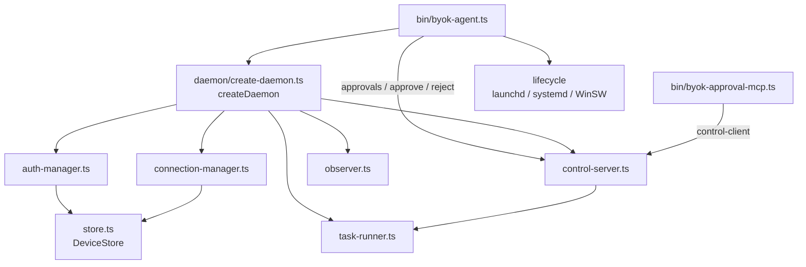

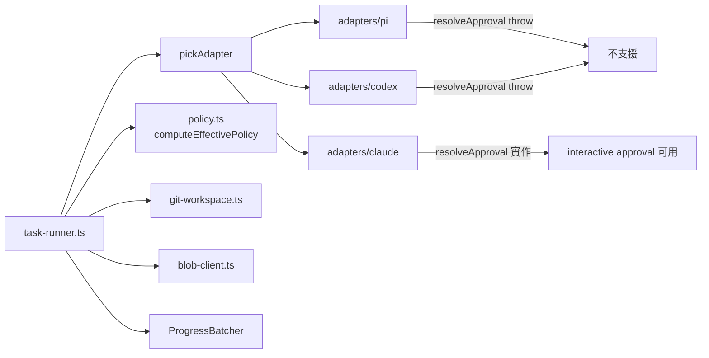

### 生命週期

`createDaemon` → `createDaemonWithAdapters`。`pair` 走一次性配對;`start` 的順序是:啟動 control-server → 偵測本機可用 runtimes → 建 TaskRunner 與 ConnectionManager → 連線並 `waitForAck`。

關閉走 `runShutdownSequence`,順序不能顛倒:

1. 停止接受新 offer
2. `shutdownActiveTasks` 收掉執行中的任務
3. drain outbox,把還沒送出的訊息推完
4. 關閉連線
5. 關閉 control socket

### RuntimeAdapter

三個 adapter 都實作同一個介面,但能力不對等。只有 `claude` 支援真正的 interactive approval——它接受 `--permission-prompt-tool` 參數,可以把權限決策外包給 daemon;`pi` 與 `codex` 的 `resolveApproval` 直接 throw。這個差異是 M2 runtime capability matrix 的核心內容,不用 fallback 掩蓋:不支援就是不支援,offer 帶 `confirm` 模式而 runtime 不支援時直接 decline。

### 本地 IPC 與 approval

`control-server` 開一個 Unix socket(Windows 上是 named pipe),兩類客戶端連進來:

- `byok-agent approvals / approve / reject` CLI,讓使用者在本機直接處理待批准項目
- `byok-approval-mcp` 子程序,由 claude CLI 在需要權限時派生,經 control socket 把請求轉回 daemon

---

## 6. `@byok/keys`

獨立於主鏈路的套件,唯一外部依賴是 `zod`。**目前零 import site**——四個套件、兩個 example、templates 都沒有引用它。它是為「產品側代管 model provider 憑證」建好的能力,還沒接進 daemon 或 server 的任何路徑。

### 模組表

| 模組 | 職責 |
| --- | --- |
| `provider-profile.ts` | providers(`openai` / `deepseek` / `anthropic` / `custom`)、adapters(`openai_compatible` / `anthropic`)、auth modes(`bearer` / `x_api_key` / `none`)與合法組合規則 |
| `registry.ts` | `ProviderRegistry`,profile 與 secret 分離存放;`resolveDefaultModelProvider` |
| `secret-store.ts` | `SecretStore` 介面 + `InMemorySecretStore` |
| `macos-keychain.ts` / `windows-credential-manager.ts` | OS 原生金鑰庫實作 |
| `secret-scope.ts` | `EnvelopeScopedSecretStore`,tenant 分區包裝 |
| `profile-store.ts` / `sqlite-profile-store.ts` / `sqlite-support.ts` | profile 持久層 |
| `headers.ts` | `providerHeaders`、`requiredProviderSecret` |
| `openai-client.ts` | `OpenAiCompatibleChatClient` |
| `anthropic-client.ts` | `AnthropicMessagesClient` |
| `http.ts` | `fetchWithProviderGuards`、`classifyModelProviderHttpError` |
| `url.ts`、`secret-name.ts`、`command-runner.ts`、`errors.ts` | 支援設施 |

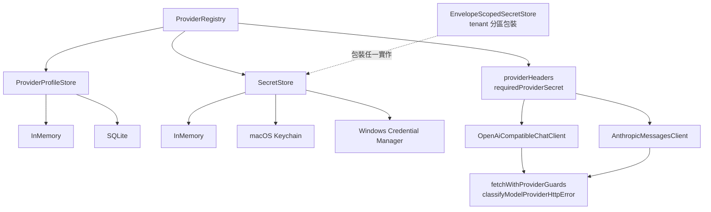

`providerHeaders` 的三種 auth mode 映射:`bearer` → `authorization`;`x_api_key` → `x-api-key` 加上 `anthropic-version`;`none` → 不加。`requiredProviderSecret` 是 fail-closed 的:需要憑證卻取不到時直接報錯,不會退回無認證請求。

`classifyModelProviderHttpError` 把 provider 的 HTTP 錯誤歸成五類:`BALANCE_INSUFFICIENT` / `AUTH_FAILED` / `MODEL_NOT_FOUND` / `RATE_LIMITED` / `HTTP_ERROR`。分類是為了讓上層能區分「使用者要充值」與「key 壞了」這兩種完全不同的處置。

---

## 7. 端到端任務流

從產品呼叫 `dispatch` 到拿到結果的完整路徑。

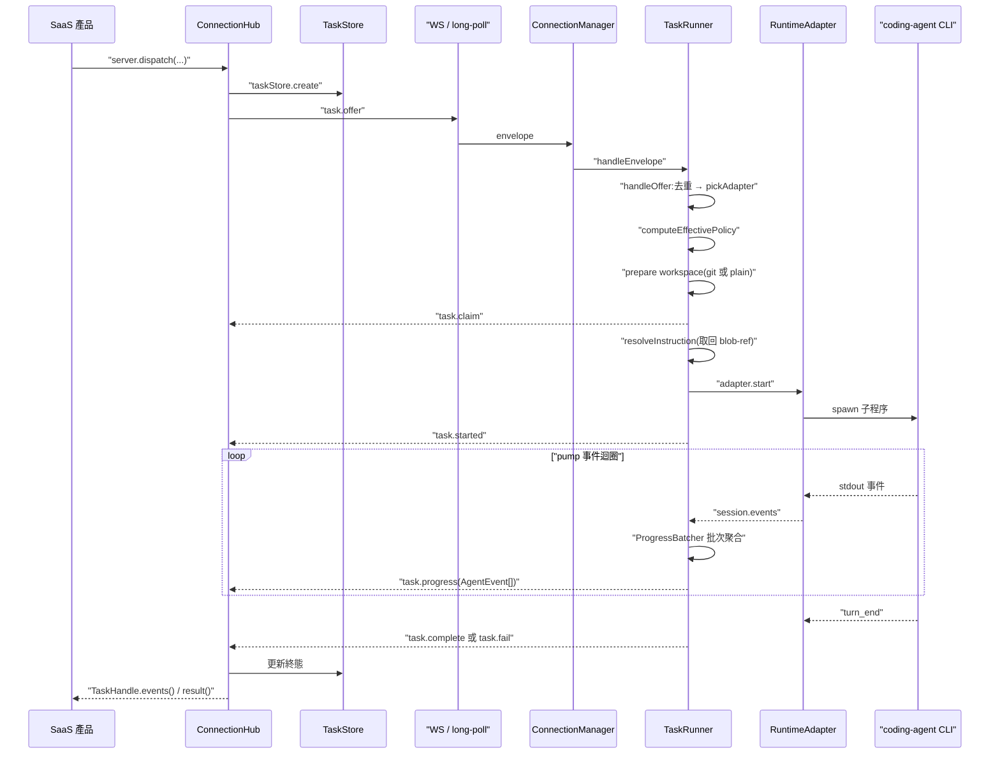

回程的每一則 daemon 訊息都經過同一條收束路徑:TaskRunner → daemon 的 send 閉包 → `ConnectionManager.send` → outbox → `drainOutbox` → WS 或 `POST /byok/messages` → server 的 ws-server / http → `hub.handleInbound`(型別閘門 → idempotency 去重 → `TASK_TRANSITIONS` 校驗)。

### approval 分支

只在 runtime 是 `claude` 且 policy 為 `confirm` 模式時發生。

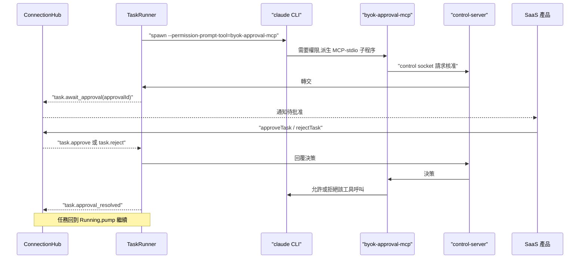

M5 引入 `approvalId` 與 `approval-targeting` capability flag,讓多筆並行的待批准項目能被精確定位,而不是靠順序假設。

---

## 8. 配對與認證流

裝置身分建立一次,之後靠 bearer token 續期。私鑰永遠不離開使用者機器。

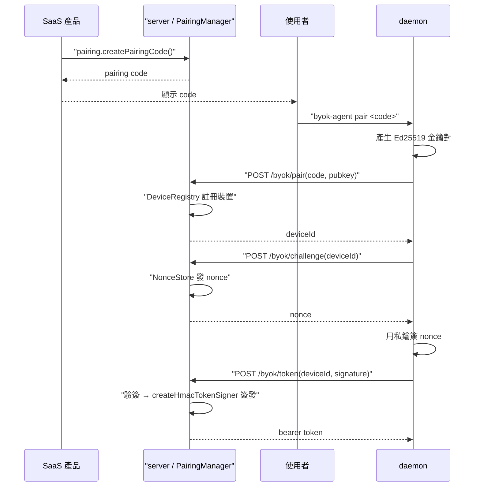

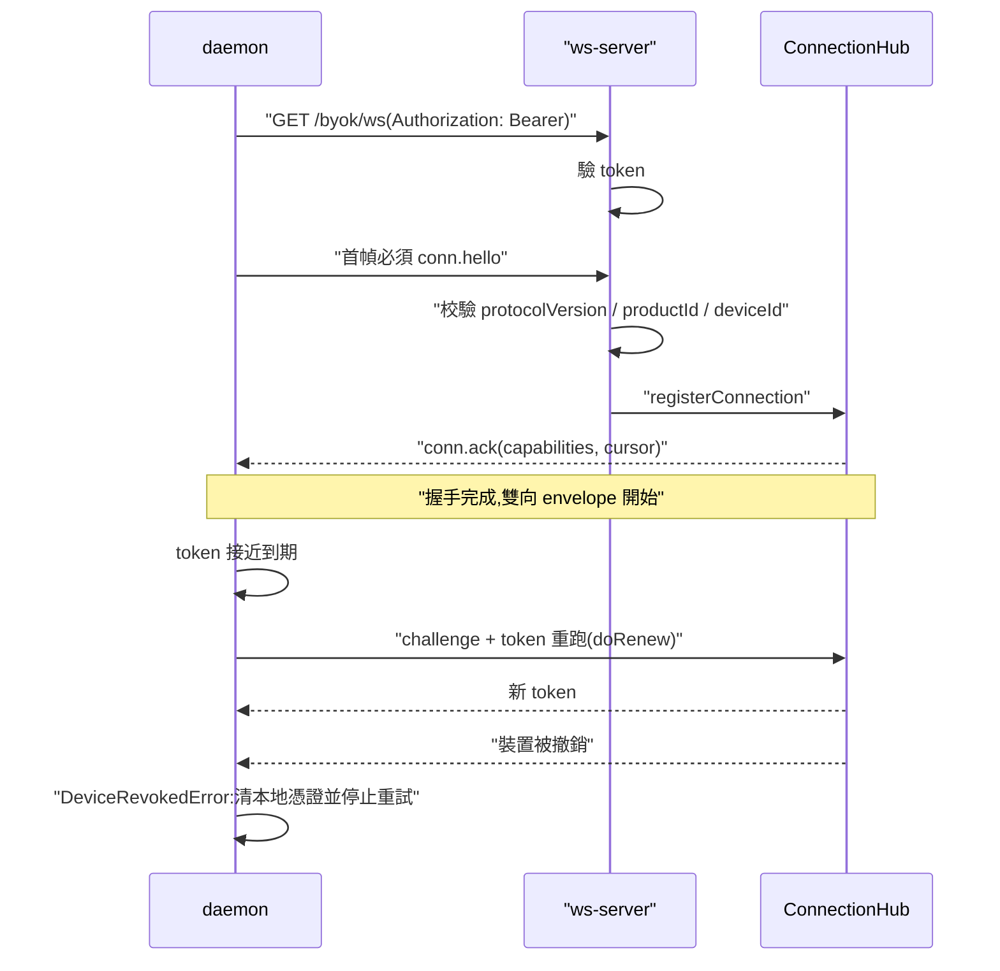

`DeviceRevokedError` 是終態:daemon 不會重試,而是清掉本地身分並要求重新配對。這是刻意的 fail-closed——撤銷後還在重試的 daemon 只會製造無意義的認證流量。

---

## 9. 傳輸與可靠性

| 機制 | 說明 |
| --- | --- |
| WS 主通道 | `GET /byok/ws`,雙向、低延遲,預設路徑 |
| long-poll fallback | `GET /byok/events` 取訊息、`POST /byok/messages` 送訊息;與 WS 對同一裝置互斥,hub 保證同時只有一種 active |
| seq cursor redelivery | server 側 `DeviceOutbox` 是 seq 遞增的環形緩衝;daemon 重連時帶上最後收到的 cursor,`redeliverAfterReconnect` 從那之後補送 |
| 單一 outbox | client 側不論用 WS 還是 long-poll,發送都經過同一個 outbox 與 `drainOutbox`,不存在兩條並行發送路徑 |
| idempotency 去重 | server `handleInbound` 有去重 ring;client `handleOffer` 也對重複 offer 去重。重送在兩端都是安全的 |
| 狀態轉移校驗 | 兩端都用 `TASK_TRANSITIONS` / `canTransition` 擋非法轉移,而不是靠對端守規矩 |
| graceful shutdown | `runShutdownSequence` 固定順序:停收 offer → 收任務 → drain outbox → 關連線 → 關 socket |

M0 沒有 queue-until-connect:裝置離線時 `dispatch` 直接失敗。redelivery 只覆蓋「連線斷掉又回來」,不覆蓋「從來沒連上」。

---

## 10. 周邊

| 位置 | 內容 |
| --- | --- |
| `examples/basic` | 嵌入式 demo:`server.ts` 起一個 embed `@byok/server` 的 Hono app,`public/` 是一個用 SSE 看任務事件流的簡易 UI |
| `examples/packaging` | `launcher.ts`,示範把 daemon 包成可分發的啟動器 |
| `templates/packaging/bun`、`templates/packaging/sea` | 兩套打包模板,各含 `build.sh` 與 `smoke-test.sh`;bun 走 `bun build --compile`,sea 走 Node.js Single Executable Application |
| `templates/service` | 三平台服務模板:`launchd` / `systemd` / `winsw`,頂層與各子目錄都有 README;`launchd` 另附 `smoke-test.sh`、`winsw` 另附 `smoke-test.mjs`。由 `packages/client/src/lifecycle/*` 消費 |
| `deploy/` | 空殼骨架:`env` / `release-checklists` / `runbooks` / `scripts` / `sql` / `submissions` 六個目錄都還沒有內容 |

---

## 11. 里程碑與凍結規則

| 里程碑 | 內容 |
| --- | --- |
| M0 | in-memory 參考 server;無 queue-until-connect |
| M1 Part A | envelope 縫隙修補:`task_id` 作唯一路由鍵、claim 與 running 分離、declined 與 failed 分離、cancelled 獨立訊息、best-effort 通知語義 |
| M1 Part B | seq cursor redelivery、blob 傳輸、long-poll fallback |
| M2 | runtime capability matrix、三個 adapter 全通、協定凍結 |
| M3 | 觀測性(`DaemonObserver`)、CLI、OS service 安裝 |
| M4 | control socket IPC、out-of-band approval(`byok-approval-mcp`、`task.approval_resolved`)、`HubStats` |
| M5 | approval targeting(`approvalId`、`approval-targeting` flag)、runtime auto-select、`maxTaskOutputBytes`、統一 graceful shutdown |

### 凍結規則(M2 之後生效)

- `PROTOCOL_VERSION = 1` 凍結。
- **additive-only 免 bump**:新增訊息類型、新增 optional 欄位、新增 `AgentEvent` 變體、新增 capability flag,都不需要升版本。`partitionAgentEvents` 與 union schema 的設計就是為了讓舊端點能安全忽略新東西。
- **兩個 `.strict()` 例外**:`PermissionPolicySchema` 與 instruction 的 blob-ref schema 用了 `.strict()`,對它們新增欄位就是 breaking change,必須升版本。理由是這兩者是安全邊界——一個舊端點如果靜默忽略了新的權限限制欄位,會在使用者以為受限的情況下放行。

### Capability flags

| flag | 狀態 |
| --- | --- |
| `steer` | 支援 `task.steer` |
| `blob-upload` | 支援 blob 上傳 |
| `interactive-approval` | reserved,尚未啟用 |
| `approval_resolved` | 支援 `task.approval_resolved` |
| `approval-targeting` | 支援 `approvalId` 精確定位(M5) |
