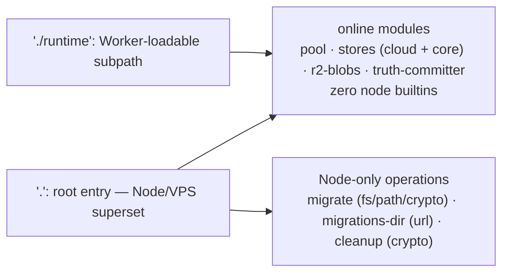

# Architecture Snapshot: cloud-dataplane runtime subpath split

> **Date**: 2026-08-16
> **Functional Block**: `root` (card) — change lands in `packages/cloud-dataplane`
> **Capability ID**: `root`
> **Type**: boundary change record (new public entrypoint) + card adjudication
> **Request Card**: `docs/architecture/requests/root.md`
> **Supersedes nothing**

## Event

The card's own event — `package.json` at 2026-08-15T15:36:38+0800, `boundary-or-config`, medium — is transient release-archive bookkeeping: the v0.4.1 archive flow touched the root manifest in the working tree, nothing committed (`git show 7b6ed4d -- package.json` is empty) and the file is byte-identical to HEAD today. **No architecture change; closed by adjudication.**

While the card was pending, a substantial packaging-boundary change landed uncommitted in this tree, and is recorded here because it is exactly the checklist this card exists to run against: `@byok-sdk/cloud-dataplane` gained a second public entrypoint, `./runtime`, making the online request path loadable on Cloudflare Workers (Hyperdrive Postgres + R2) while the root entry keeps the Node/VPS composition.

## Ruling

The split is an entrypoint projection, not a new authority. `src/runtime.ts` is the single re-export authority for the online surface; `src/index.ts` became `export * from './runtime'` plus the migrate/migrations-dir/cleanup blocks, so the two surfaces cannot drift and no export list is duplicated.

Against the card's checklist:

- **Module boundaries** — unchanged graph. No module gained or lost a dependency; `runtime.ts` re-exports modules that already existed. Two exports that had drifted out of `index.ts` (`PostgresProofRequestReceiptStore`, `PostgresSkillPackStore`) are now exported additively by both entries; nothing was removed.
- **Entrypoints** — CHANGED. Second public subpath `./runtime` → `dist/runtime.js` + `dist/runtime.d.ts`; `exports` also keeps `.` and `./package.json`. The `client/adapters` precedent is the shape followed.
- **Dependency rules** — unchanged runtime deps (`pg`, `aws4fetch`, `fast-xml-parser`, workspace `@byok-sdk/*` all stay external; `pg` is never bundled). `wrangler` is a devDependency of the packaging gate only. New invariant, enforced at build time: the runtime subgraph must reach zero node builtins — the `platform: 'neutral'` tsup pass fails the build the moment it does. This is deliberately a build failure, not a test-time grep.
- **Runtime paths** — new host composition, no new data path. Workers + Hyperdrive (`pg` over `nodejs_compat`) + R2 for the online path; migrations/cleanup remain Node-only via the root entry from a CI/operator process. No D1, no Durable Objects, no schema change, no host auto-detection — the integrator picks the composition explicitly. Pool lifecycle is pinned in `packages/cloud-dataplane/README.md`: process-scoped with `pool.end()` at shutdown on Node/VPS, created inside each `fetch`/`queue` handler per invocation on Workers — module-scope cross-request reuse is forbidden.
- **Verification commands** — extended, not replaced. New: `test:worker` script; `runtime-entry.test.ts` (export surface pinned by name, subset relation to root, dist bundle free of node specifiers), `worker-packaging.test.ts` (`wrangler deploy --dry-run` + bundle marker assertions; pg's bare-`fs` import from its lazy `pgpass` path is documented there, not banned — workerd loads it under `nodejs_compat` and the path never executes with a password-bearing DSN), `worker-e2e.test.ts` (real Postgres + MinIO through `wrangler dev`, four probes: pairing, mailbox, terminal truth, blob reserve→device PUT→verify/commit — MinIO adjudicated a SigV4 signature produced inside workerd). CI dataplane job gained the worker REQUIRE env; both substrate halves were already coupled. Release gates extended: `check-package-graph.mjs` asserts the `./runtime` import+types pair; `pack-and-smoke.mjs` imports the subpath from the isolated install and asserts `dist/runtime.js` exists.

Evidence, from the slice's verification runs (primary worktree, this diff applied):

| Check | Result |
| --- | --- |
| `bun run build` (package) | `dist/runtime.js 117.22 KB` + `dist/runtime.d.ts`; `grep -c "node:" dist/runtime.js` → 0 |
| `bun run typecheck` (package, root) | exit 0 |
| Gated package suite | 18 files / 249 tests passed, exit 0; ungated 8 passed / 10 skipped with signposts |
| Worker E2E (substrate up) | all four probes green; blob probe ends `manifestState: committed`, observed size/type match |
| `wrangler deploy --dry-run` | exit 0; bundle free of `node:fs`/`fs/promises`/migration/cleanup markers |
| `bun run check:release-pack` (pre-bump) | tarball carries 6 migrations matching `deploy/sql`, isolated import loop incl. `/runtime` |

Caveat, stated rather than papered over: the 0.4.2 train bump and the release-gate hardening (manifest-derived version authority, bun.lock drift guard) landed concurrently from a second session and are not this snapshot's subject; final combined-tree verification belongs to that release gate, not to the runs cited above.

## Durability Note

Per `20260807-1405-root-publish-metadata-ruling.md`: ruling prose lives in snapshot files because the event hook rewrites request cards; the card carries only the pointer this record attaches.

## Slice

Executed under the lite workflow profile (brief → edit → targeted test; no plan/contract/notes artifacts by design). Implementation: two `fast-worker` dispatches (runtime subpath + build/test/CI/release-gate surface; then blob probe, README pool pin, wrangler state hygiene). Acceptance of the combined tree (this slice + the concurrent release work) is deferred to the release gatekeeper covering the whole diff.
