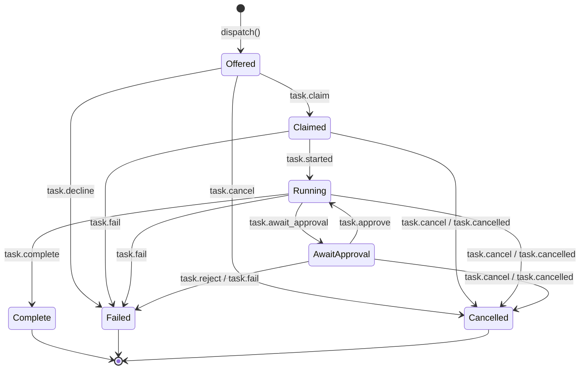

# BYOK SDK Wire Protocol

Normative contract for `@byok/protocol`. This is the single source of truth for
the M1-2 (server) and M1-3 (client) implementers — the schemas in
`packages/protocol/src/` are authoritative; this document explains the rules
those schemas encode and why.

Status: wire version `v:1`, **FROZEN**. The pi, claude, and codex runtime
adapters have all exercised the wire (M2); every M1/M2 protocol gap identified
along the way has been closed in place. From this point forward, this
document and the schemas in `packages/protocol/src/` describe a closed
contract — see "Freeze rule" immediately below for exactly what "frozen"
does and doesn't allow.

## Freeze rule

**Additive-minor-only after freeze.** `PROTOCOL_VERSION` stays `1`. Any of the
following is non-breaking and may be added without a version bump, ever:

- A new OPTIONAL field on an existing payload or the envelope.
- A new message type.
- A new `AgentEvent` variant.
- A new capability flag (`CAPABILITY_FLAGS`, or a new key inside
  `RuntimeInfo.capabilities`).

**What IS breaking, and requires a `v` bump instead:** changing an existing
field's type, removing a field, making an optional field required (or vice
versa in a way a receiver depends on), renaming a message type, or removing a
state/transition. There is no in-place "tighten it a little" allowance
post-freeze the way pre-freeze M0→M1 had (§10) — a change of this shape is a
new major version, full stop.

**Both sides ignore unknown.** A daemon or server on an older minor version
must not crash or hard-fail on a field, message type, or event variant it
doesn't recognize yet — see the asymmetry below for the one deliberate
exception. **Server supports N and N-1.** A server negotiates the highest
protocol version common to its own supported set and the daemon's
`conn.hello.protocolVersions[]` list, and must continue accepting the
immediately-prior major version so a fleet of daemons can roll forward
without a hard cutover. (`v:1` is the only version that exists today, so this
is currently a no-op in practice — it becomes load-bearing the day `v:2`
ships.)

**The observability-vs-control asymmetry.** Unknown is TOLERATED for
observability data, but FAIL-CLOSED for control/security data:

- **Tolerated (observability):** an unrecognized `AgentEvent.type` inside a
  `task.progress` batch parses as an opaque passthrough placeholder instead
  of failing the whole batch (`AgentEventOrUnknownSchema`,
  `agent-event.ts` — see `isKnownAgentEvent`/`partitionAgentEvents` for how a
  consumer is expected to skip it). An unrecognized capability flag string
  (`CAPABILITY_FLAGS`, or an entry inside `conn.hello.capabilities[]` /
  `RuntimeInfo.capabilities.permissionModes[]`) is likewise just ignored, not
  rejected. An unknown top-level envelope field is stripped, not rejected
  (§1). This tolerance exists because this data only ever informs a UI or a
  log line — silently ignoring what you don't understand yet is safe.
- **Fail-closed (control/security):** `instruction` and `policy`
  (`PermissionPolicySchema`) reject any shape they don't recognize outright —
  there is no passthrough-unknown fallback for either, unlike
  `AgentEventSchema`. A payload that would grant, deny, or otherwise change
  what a runtime is authorized to do must never be silently
  reinterpreted-as-something-safe or dropped-and-ignored; it must fail
  validation loudly. This is the same fail-closed posture every runtime
  adapter already applies to a policy shape it can't honor (§11.1) — the
  wire-schema level and the adapter level agree on it end to end.

This asymmetry is enforced by the freeze-guard regression test
(`packages/protocol/src/__tests__/freeze-guard.test.ts`), not just documented
here — see that file for the executable version of every bullet above.

## 1. Envelope

Every wire message is a single-line NDJSON envelope:

```ts
{
  v: number;            // protocol version, currently 1
  id: string;            // uuid, unique per envelope
  ts: string;             // ISO-8601 datetime with offset
  type: MessageType;       // e.g. "task.offer"
  task_id?: string;         // routing key — see rule below
  session_ref?: string;      // opaque session continuation token
  seq?: number;                // per-device redelivery cursor — see rule below
  payload: { ... };              // shape determined by `type`
}
```

Unknown top-level fields are stripped, not rejected (forward-compat). An
unrecognized `type` is a distinct error (`UnknownMessageTypeError`, not
`EnvelopeValidationError`) precisely so a daemon/server on an older minor
version can skip an unfamiliar additive message type instead of treating it as
corrupt input.

### 1.1 `task_id` is the sole routing key (M1 gap #1, #7)

**Rule: `task_id` is REQUIRED on every `task.*` envelope, and stays optional on
every `conn.*` envelope.** All `task.*` types route by task id; `conn.*` types
don't route to a task at all. This is enforced at the schema level (each
message type's envelope shape is built with either a required or an optional
`task_id`, per `envelope.ts`), not just documented — an omitted `task_id` on a
`task.*` envelope fails validation.

Before M1, `task_id` was optional everywhere and two payloads (`task.offer`,
`task.claim`) additionally duplicated a `taskId` field at the payload level.
That duplication is now removed: **`task_id` lives only on the envelope.** A
payload never carries its own `taskId` again.

### 1.2 `seq` is the per-device redelivery cursor (M1 Part B)

**Rule: `seq` is REQUIRED on every envelope type the *server* sends to the
daemon, and stays optional on every envelope the daemon sends to the server.**
`seq` is a per-device monotonically increasing counter the server assigns to
each outbound envelope, independent of and unrelated to task identity — it
exists purely so a reconnecting daemon can tell the server "replay anything
I might have missed after N." See [§9](#9-at-least-once-delivery--idempotency)
for the full redelivery procedure.

Server → daemon types (`seq` required): `conn.ack`, `task.offer`,
`task.approve`, `task.reject`, `task.cancel`, `task.steer`. Every other type
is daemon → server and leaves `seq` optional — M1 only specifies
server-to-daemon redelivery, not the reverse.

**Do not confuse this with `task.progress`'s payload-level `seq`.** That field
(`TaskProgressPayload.seq`) is unrelated — it orders progress batches *within
a single task*, was already required pre-M1, and is untouched by this change.
Two different counters happen to share the field name `seq` at two different
levels (envelope vs. payload) for two different purposes; keep them separate
in your head and in any redelivery/ordering code.

**`conn.*` envelopes never advance the redelivery cursor.** `conn.ack`
carries a `seq` (required, like every other server → daemon type) purely for
schema uniformity — it is not tied to any task and must never be treated as
"the highest seq processed so far" for the purposes of the `cursor` a daemon
reports back in a future `conn.hello` (§9). A daemon that advances its
cursor from `conn.ack`'s `seq` breaks redelivery outright: on reconnect, the
server always assigns `conn.ack` the *next* (i.e. currently highest)
per-device `seq` value, sent immediately before replaying any backlog still
queued for this device (§9) — so `conn.ack`'s `seq` is always higher than
every backlog envelope about to follow it. Advancing the cursor to
`conn.ack`'s value before that backlog even arrives makes every one of those
(necessarily lower) backlog `seq`s look already-delivered, and a
cursor-dedupe check silently drops all of them. Cursor accounting covers
`task.*` envelopes only.

### 1.3 `session_ref`

Opaque server-issued token the daemon maps to a runtime session id (`claude
--resume`, codex resume, pi session). A follow-up task carries the same
`session_ref` in a new `task.offer`. Always optional; unchanged in M1.

## 2. Message catalog

`S→D` = server sends, daemon receives. `D→S` = daemon sends, server receives.

| Type | Dir | `task_id` | `seq` | Payload | Sent when |
|---|---|---|---|---|---|
| `conn.hello` | D→S | optional | optional | `protocolVersions[]`, `capabilities[]`, `deviceId`, `productId`, `runtimes?`, `cursor?` | Opening (or reopening) the WSS connection |
| `conn.ack` | S→D | optional | **required** | `protocolVersion`, `capabilities[]`, `serverTime` | Handshake acknowledgement |
| `task.offer` | S→D | **required** | **required** | `instruction`, `policy`, `runtime?`, `sessionRef?`, `workspaceHint?`, `limits?` | `dispatch()` targets a device |
| `task.approve` | S→D | **required** | **required** | `{}` | `TaskHandle.approve()` while `AwaitApproval` |
| `task.reject` | S→D | **required** | **required** | `reason?` | `TaskHandle.reject()` while `AwaitApproval` |
| `task.cancel` | S→D | **required** | **required** | `reason?` | `TaskHandle.cancel()` from any non-terminal state |
| `task.steer` | S→D | **required** | **required** | `text` | `TaskHandle.steer()` while `Running` |
| `task.claim` | D→S | **required** | optional | `deviceId`, `agentId?` | Daemon accepts an offer (idempotent CAS) |
| `task.started` | D→S | **required** | optional | `{}` | Daemon actually starts the runtime session — `Claimed → Running` |
| `task.decline` | D→S | **required** | optional | `reason`, `retryable?` | Daemon fail-closed-rejects an offer *before* claiming — `Offered → Failed` |
| `task.progress` | D→S | **required** | optional | `seq` (payload-level batch order — §1.2), `events[]` | Batches of normalized `AgentEvent`s |
| `task.artifact` | D→S | **required** | optional | `name`, `contentType`, `inline?`, `blobRef?` | An artifact is produced |
| `task.await_approval` | D→S | **required** | optional | `summary` | Runtime raised `needs_approval` |
| `task.complete` | D→S | **required** | optional | `summary`, `sessionRef`, `artifactRefs?` | Runtime reached `turn_end` |
| `task.fail` | D→S | **required** | optional | `reason`, `retryable?` | Task ends in error |
| `task.cancelled` | D→S | **required** | optional | `reason?` | Task ends `Cancelled` (server- or daemon-initiated) |

## 3. Task state machine (M1 gap #2, #5, #6)



| From | Legal targets |
|---|---|
| `Offered` | `Claimed`, `Cancelled`, `Failed` |
| `Claimed` | `Running`, `Failed`, `Cancelled` |
| `Running` | `AwaitApproval`, `Complete`, `Failed`, `Cancelled` |
| `AwaitApproval` | `Running`, `Failed`, `Cancelled` |
| `Complete` / `Failed` / `Cancelled` | none (terminal) |

A server may additionally force a task straight to `Failed` when an inbound
message doesn't fit the task's current state (e.g. `task.progress` arriving
while `AwaitApproval`) — this is an implementation safety net (see the
reference `ConnectionHub`), not itself a distinct wire message.

### 3.1 Claim no longer implies Running (M1 gap #2)

Before M1, receiving `task.claim` was treated as claiming *and* immediately
running — there was no wire message for "I actually started." That collapsed
two distinct facts ("this device owns the task" and "the runtime session is
up") into one. M1 adds `task.started`: the daemon claims first
(`Offered → Claimed`), does whatever local setup it needs (workspace
creation, adapter `start()`), and only then reports `Claimed → Running`
explicitly. A server must not advance a task to `Running` on `task.claim`
alone.

`task.started` is idempotent the same way `task.claim` is: a repeat
`task.started` from the device that already owns a `Running` task is a
no-op, not an illegal-transition error.

### 3.2 Declined vs. Failed (M1 gap #5)

`task.decline` lets a daemon fail-closed a pre-claim offer (no compatible
runtime, policy exceeds this device's ceiling, unsupported instruction shape,
etc.) instead of silently dropping it or being forced to claim first just to
have somewhere to report failure.

**Decision: declining does not introduce a new `Declined` terminal state.**
It maps onto the existing `Failed` state via a new `Offered → Failed`
transition, and `TaskDeclinePayload` intentionally mirrors `TaskFailPayload`
exactly (`reason` + `retryable`). Rationale: a pre-claim decline and a
post-claim failure are the same outcome from the dispatcher's point of view —
this attempt produced no result, here's why, here's whether retrying (e.g.
offering to a different device) makes sense. Adding a distinct `Declined`
state would fork every terminal-state consumer (dashboards, retry logic,
`TaskSnapshot` readers) into "handle `Failed` *and* `Declined`, identically"
for no behavioral gain. Keeping the state machine at 7 states (not 8) was the
deciding factor.

### 3.3 Cancelled is its own message, not `task.fail(reason:'cancelled')` (M1 gap #6)

**Decision: `task.cancelled` is an explicit new daemon → server message —
prefer the explicit message over overloading `task.fail`.** `Cancelled` was
already a distinct `TaskState` before M1; what was missing was a proper wire
message for it. The M0 daemon reported cancellation via
`task.fail({ reason: 'cancelled', retryable: false })`, a magic-string
convention that hid a semantically distinct outcome (intentional stop) inside
the error-reporting message (unintentional failure). `task.cancelled`
supersedes that convention as the canonical way to report a `Cancelled`
outcome.

`task.cancelled` is dual-purpose on receipt, and a server must handle both:

- **Server-initiated cancel already landed** (the common case — see
  [§4](#4-cancelapprovereject-wire-semantics-m1-gap-3)): the server's record
  is already `Cancelled` by the time this arrives. Treat it as an idempotent
  no-op ack.
- **Daemon-observed cancellation the server didn't know about** (e.g. a local
  stop action in the branded CLI's UI): the server's record is still
  `Claimed` / `Running` / `AwaitApproval`. This message is the authoritative
  trigger — apply the transition to `Cancelled`.

## 4. Cancel/approve/reject wire semantics (M1 gap #3)

**Rule: the server's own state is authoritative on its own action.** Calling
the server-side API (`TaskHandle.cancel()` / `.approve()` / `.reject()`)
moves the server's task record immediately — it does not wait for the
daemon to acknowledge anything. The corresponding wire message
(`task.cancel` / `task.approve` / `task.reject`) sent to the daemon is a
**best-effort notification**, not a request awaiting a reply, and **there is
no new ack message type**. The daemon's existing message stream is the
observable proof of the daemon-side effect:

- `task.approve` → daemon resumes the paused session; proof is `task.progress`
  resuming (or `task.fail` / `task.cancelled` if resuming turns out to be
  impossible).
- `task.reject` → daemon stops the session; proof is `task.fail`.
- `task.cancel` → daemon stops the session; proof is `task.cancelled`
  ([§3.3](#33-cancelled-is-its-own-message-not-taskfailreasoncancelled-m1-gap-6)).

This is deliberate, not an oversight: a flaky or slow daemon connection must
never be able to block the server's own state machine, and a dedicated ack
message would only restate information the existing terminal/progress
messages already carry.

**`task.cancel`/`task.reject` stay individually redeliverable even though
their task is already terminal server-side by the time they're queued.**
`cancelTask`/`rejectTask` move the record to `Cancelled`/`Failed` *before*
queuing the notification for delivery — that ordering is what makes the
server's own state authoritative immediately, per the rule above — but it
also means the notification's task has already reached a terminal state
before it ever enters the redelivery backlog. The redelivery procedure's
normal rule of skipping anything that belongs to an already-terminal task
(§9) is therefore explicitly exempted for these two types: without the
exemption, a `task.cancel`/`task.reject` that never reached the daemon (the
connection dropped mid-send, say) could never be redelivered on reconnect —
by definition, its task was terminal from the moment it was queued.
`task.approve`/`task.steer` need no such exemption: neither is ever sent
while its task is already terminal in the first place (both require a
specific non-terminal state to send at all), so the ordinary terminal-task
skip never wrongly catches them.

## 5. Approval flow (M1 gap #8)

The full round trip from a runtime pausing for human input to it resuming:

1. The runtime adapter surfaces a normalized `needs_approval` `AgentEvent`.
2. The daemon sends `task.await_approval { summary }`. Server: `Running → AwaitApproval`.
3. The server-embedding SaaS surfaces the summary to a human (or automated
   policy) and calls `TaskHandle.approve()` or `.reject(reason?)`.
4. Server state moves immediately (`AwaitApproval → Running` or
   `AwaitApproval → Failed`); `task.approve` / `task.reject` go out as
   best-effort notifications ([§4](#4-cancelapprovereject-wire-semantics-m1-gap-3)).
5. Daemon reacts: on approve, resumes the runtime session and normal
   `task.progress` traffic continues; on reject, stops the session and sends
   `task.fail`.

This flow was already representable with `task.approve`/`task.reject` before
M1 — nothing new needed schema-wise. What M1 pins down is the semantics in
step 4 (§4) and documents the flow end-to-end so the M1-3 client worker can
wire an adapter's `needs_approval` event all the way through to a resumed
session without re-deriving these rules.

### 5.1 RESERVED in v1: no bundled runtime exercises this seam

**The entire approval round trip above — `needs_approval`,
`task.await_approval`, `task.approve`/`task.reject`, and
`Session.resolveApproval` — is present in the frozen v1 wire but exercised by
ZERO bundled runtime adapter.** This was empirically confirmed, not assumed,
for all three (M2-a/M2-b findings, `packages/client/src/adapters/*/`):

- **pi** never emits `needs_approval` at all — it has no built-in per-call
  approval gate (`PiSession.resolveApproval` throws unconditionally).
- **claude**'s headless mode (`claude -p`) resolves every permission decision
  *synchronously* before the turn continues: auto-denied under a restrictive
  `--permission-mode`, auto-granted under a permissive one. There is no pause,
  no wire frame this adapter could ever map to `needs_approval`, and nothing
  to resume later (`ClaudeSession.resolveApproval` throws).
- **codex**'s `codex exec --json` resolves a sandbox-denied action
  internally with no wire-visible pause either, regardless of
  `approval_policy` (`CodexSession.resolveApproval` throws).

The schema stays because the seam is a real, intentional part of the frozen
contract — a future runtime adapter (bundled or third-party) can implement it
without a wire change — but a server MUST NOT assume any *currently* bundled
runtime will ever pause a task in `AwaitApproval` on its own initiative.

**Gated by the `interactive-approval` capability flag.** `CAPABILITY_FLAGS`
(`version.ts`) includes `interactive-approval`, RESERVED as of the same
addition that introduced it: no bundled adapter advertises it (each reports
`approvalInteractive: false` — see §11.4), which is the honest signal that
the seam isn't backed by anything real yet on this device.

**Rule: a server MUST NOT route an approval-requiring policy to a daemon that
hasn't advertised `interactive-approval`.** Concretely: `policy.mode:
'confirm'`, or any policy whose fulfillment would require pausing for an
interactive grant, must not be dispatched to a device whose `conn.hello`
capabilities (connection-level `capabilities[]`, or the target runtime's own
`RuntimeInfo.capabilities.approvalInteractive`) don't include it. `confirm`
stays in the frozen `PERMISSION_MODES` enum — removing it would be a breaking
change for no reason — but it is effectively unreachable against any of the
three bundled runtimes today, all of which reject it fail-closed at the
adapter level too (§11.1): the capability gate and the adapter's own
fail-closed rejection are two independent nets against the same outcome
(dispatching a policy no runtime present can actually honor).

## 6. Auth flows

HTTP bodies for these live in `src/http-api.ts`; they are plain HTTP
request/response shapes, not wire envelopes, and never touch the WSS
connection. `v:1` is unaffected — pairing and token renewal are out-of-band
calls that happen before/alongside the WSS connection.

Device identity is a locally generated Ed25519 keypair; the private key
never leaves the device (OS keychain, or a 0600 file as fallback). It is
completely separate from runtime credentials (`~/.claude`, `~/.codex`) — the
daemon never reads, proxies, or forwards those.

### 6.1 Pairing — `POST /byok/pair` (v2)

One-time exchange. An out-of-band pairing code (minted by the SaaS's own
auth/device-flow UI, outside this protocol's concern) plus a freshly
generated device keypair register the device and mint its first token.

```
Request  (PairRequestSchema):  { pairingCode, deviceName, devicePublicKey }
Response (PairResponseSchema): { deviceId, accessToken, refreshHint? }
```

- `devicePublicKey`: Ed25519 public key, base64url-encoded.
- `accessToken`: JWT, ~1h lifetime.
- `refreshHint`: opaque hint for when/how to renew; not itself a credential.
  **Pinned semantics (resolves a carried-forward pin): the reference server
  always sets `refreshHint` to the freshly-minted token's own ISO-8601
  `expiresAt`** — the exact same value `/byok/token` reports explicitly on
  every subsequent renewal (§6.2). The schema keeps `refreshHint` typed as a
  bare opaque `string` (not narrowed to an ISO datetime) so a client is never
  *required* to parse it as a date to be spec-compliant, but a client MAY
  treat it as `expiresAt` and schedule proactive renewal accordingly — the
  reference client does exactly this (`AuthManager.resolvePairExpiry`),
  falling back to a conservative assumed TTL only if the value doesn't parse
  as a date at all. This is additive clarification of existing behavior, not
  a schema change: `refreshHint` was always allowed to contain this value,
  and always will be.

### 6.2 Token renewal — `POST /byok/challenge` + `POST /byok/token`

The access token from pairing expires in ~1h. Renewing it does not require
re-pairing: a two-step challenge/response proves possession of the device
private key without ever transmitting it.

```
POST /byok/challenge
  Request  (ChallengeRequestSchema):  { deviceId }
  Response (ChallengeResponseSchema): { nonce }

# client signs `nonce` locally with the device private key, then:

POST /byok/token
  Request  (TokenRequestSchema):  { deviceId, nonce, signature }
  Response (TokenResponseSchema): { accessToken, expiresAt }
```

`signature` is the Ed25519 signature over `nonce`, base64url-encoded. **Pinned
encoding (resolves a carried-forward pin): `nonce` is signed/verified as its
raw UTF-8 bytes** — both the reference client
(`signNonce`: `crypto.sign(null, Buffer.from(nonce, 'utf8'), privateKey)`) and
the reference server (`verifyEd25519Signature`:
`verify(null, Buffer.from(message, 'utf8'), ...)`) encode the nonce string
this way before signing/verifying; a client using any other encoding (e.g.
base64url-decoding the nonce string before signing its bytes) will produce a
signature the reference server rejects. A nonce is single-use; the server
must reject a replayed nonce.

### 6.3 Revocation

Revocation is server-side only — a dashboard/API action against the SaaS's
own device registry. There is no wire message or HTTP body for it. A revoked
device's next `/byok/challenge`, `/byok/token`, or WSS connect attempt gets a
`401`; the daemon's only recourse is to re-run `/byok/pair` from scratch (a
fresh device keypair is not required, but re-registering the existing public
key is the simplest implementation and is an acceptable choice for M1).

## 7. Blob flows

`BlobRef` (`src/blob.ts`) is unchanged. These are the two HTTP calls that
produce the presigned URLs a `BlobRef` points at; both require a valid bearer
access token.

```
POST /byok/blobs
  Request  (CreateBlobRequestSchema):    { size, contentType, contentHash }
  Response (CreateBlobResponseSchema):   { blobId, uploadUrl }

GET /byok/blobs/:id/url
  Response (BlobDownloadUrlResponseSchema): { downloadUrl }
```

### 7.1 Content transfer — signed-URL-only, not bearer (resolves a carried-forward pin)

The `uploadUrl`/`downloadUrl` produced above point at the reference server's
own content endpoints:

```
PUT /byok/blobs/:id/content?sig=...&exp=...   — upload the blob's bytes
GET /byok/blobs/:id/content?sig=...&exp=...   — fetch the blob's bytes
```

**These two `/content` routes are authenticated ENTIRELY differently from
every other route in this document: signed-URL-only (an HMAC `sig` +
expiry `exp` query pair), never a bearer token.** The bearer
`Authorization` header is what gates the two metadata calls above (`POST
/byok/blobs`, `GET /byok/blobs/:id/url`) — the URLs those calls hand back
already encode their own short-lived authorization, precisely so the content
itself can be `PUT`/`GET` directly (e.g. from a browser, or any HTTP client
that never sees the device's JWT) without needing to attach or even possess
a bearer token. A request to either `/content` route with a missing,
malformed, or expired `sig`/`exp` pair is rejected (401) regardless of
whether it also happens to carry a valid bearer header — the two auth models
are not interchangeable, and a valid access token is neither necessary nor
sufficient here.

`contentHash` enables content-addressed dedup on the server side (out of
scope for this doc — server implementation detail) and is pinned to a single
canonical format: **`sha256:<64 lowercase hex characters>`** — a SHA-256
digest, explicit algorithm prefix, lowercase hex digits, no other form
accepted. This is enforced at the schema level on both `BlobRefSchema`'s and
`CreateBlobRequestSchema`'s `contentHash` field; the server rejects anything
else outright (`POST /byok/blobs` 400s on a malformed `contentHash`) with no
normalization step for alternate forms (bare hex, uppercase, a different
algorithm prefix) — this was tightened in place during the pre-freeze M1
wave, before any compatibility shim would have been needed. A client must
always emit this exact form when declaring or referencing a blob.

Inline payloads stay under the existing 64KB limit (`task.artifact.inline`,
`task.offer.instruction` string form); anything larger goes through blobs.
Default per-product size ceiling: 100MB (server-enforced, not schema-enforced).

## 8. Long-poll fallback

For environments where an outbound WSS connection isn't viable, long-poll is
a full transport — both directions, not receive-only. A daemon that has
fallen back to long-poll keeps making normal progress on tasks; "degraded"
describes the transport, not a reason to decline new work or stop reporting
task state.

### 8.1 Receive — `GET /byok/events?cursor=N`

```
GET /byok/events?cursor=N
  Query    (EventsPollQuerySchema):    { cursor? }
  Response (EventsPollResponseSchema): { events: Envelope[], cursor }
```

Authed (bearer access token); holds the request open for ~50 seconds waiting
for new events before returning an empty `events` array. Same cursor
semantics as the WSS path (§9) — `cursor` in the query is "last seq I've
seen," `cursor` in the response is "resume from here next time." A client
using long-poll instead of WSS still sends `conn.hello` semantics implicitly
by however the reference server's HTTP layer establishes the equivalent
per-device session; the event *shapes* returned are identical `Envelope`
values regardless of transport.

### 8.2 Send — `POST /byok/messages`

```
POST /byok/messages
  Request  (MessagesSendRequestSchema):  { messages: Envelope[] }   // capped at 256 per batch
  Response (MessagesSendResponseSchema): { accepted: number, rejected?: number }
```

Authed (bearer access token). A device long-polling for S→D traffic (§8.1)
has no live WSS connection to carry its own D→S envelopes (`task.claim`,
`task.progress`, `task.complete`, etc.) — this endpoint is that path while
in that mode. Each envelope in `messages` is routed through the server's
single inbound gate (the reference implementation's `handleInbound`) — the
exact same gate a WSS connection's messages get, not a parallel or
lesser-validated path.

**Only daemon → server `task.*` types are accepted here.** A `type` outside
that set — a server → daemon type (`task.offer`, `conn.ack`, etc.) arriving
inbound, or anything unrecognized — is rejected per-envelope: not dispatched
to any handler, and not counted toward `accepted`. This never 400s the rest
of the batch: a *structurally* invalid `Envelope` (fails schema validation
outright) still 400s the whole request as before, but a *wrong-direction*
type is schema-valid — a `task.offer` is a well-formed envelope regardless
of which side sent it — and only fails this endpoint's semantic type-allow
check, which is per-envelope. The batch itself is also capped at 256
envelopes (`MessagesSendRequestSchema`); exceeding the cap 400s the whole
request.

**`accepted` counts every envelope the server took in and will not ask the
daemon to resend** — including one it recognized as an already-processed
duplicate ([§9](#9-at-least-once-delivery--idempotency)'s per-`(deviceId,
id)` dedup window). It does not mean "freshly processed": a redelivered or
retried envelope this device already sent once is counted `accepted` again
on retry, even though no handler reran for it that second time. `rejected`
is a separate, additive count — envelopes that failed the type-allow check
above, or the ownership check (§9) — present in the response only when
nonzero, so a batch with nothing rejected keeps the `{ accepted }`-only
shape.

A daemon that has fallen back to long-poll must send every D→S envelope
this way instead of queueing them for a WSS connection that isn't coming
back on its own.

**Chunking an oversized outbound queue is a client-side implementation
detail, not a new wire rule.** A daemon that has accumulated more than
`MAX_MESSAGES_PER_BATCH` queued envelopes (e.g. after an extended outage)
must split them across multiple `POST /byok/messages` calls, each within
the cap, rather than send one oversized batch and have the server reject
the whole thing outright — and then, if it naively retried the identical
oversized batch unchanged, stall permanently. The reference client
(`ConnectionManager.drainOutbox`) does this by importing the same
`MAX_MESSAGES_PER_BATCH` constant the schema enforces (exported from
`@byok/protocol`, not a hard-coded copy), so the two can never drift apart.

### 8.3 WS and long-poll are mutually exclusive — last transport wins (resolves a carried-forward pin)

**A device has exactly one live transport at a time, never both.** A WS
connection completing its handshake supersedes any long-poll request
currently held open for the same device: the reference server lets that
long-poll request resolve immediately (with whatever it already had queued,
possibly empty) instead of leaving it hanging until its own ~50s timeout, and
all subsequent server→daemon delivery for that device goes out over the new
WS connection. There is no dual-delivery window and no race to reconcile —
the newest transport to successfully connect simply takes over. A daemon
that falls back to long-poll after a WS drop, then later succeeds at
re-establishing WS, does not need to explicitly "close" the long-poll side
itself; its next in-flight long-poll request is settled server-side the
moment the new WS connection registers.

## 9. At-least-once delivery & idempotency

**Delivery is at-least-once, never at-most-once, in the server → daemon
direction.** A daemon must be able to safely process (or safely ignore, if
already processed) a redelivered envelope.

### Reconnection procedure

1. Daemon reconnects, sends `conn.hello` with `cursor` set to the highest
   `seq` it has successfully processed from this server (omitted on a
   device's first-ever connection).
2. Server responds `conn.ack` as usual.
3. Server then redelivers, in `seq` order, every server → daemon envelope it
   sent with `seq > cursor` that is **still relevant** — i.e. belongs to a
   task that has not since reached a terminal state on the server, **or is a
   `task.cancel`/`task.reject` notification** ([§4](#4-cancelapprovereject-wire-semantics-m1-gap-3)
   exempts these two from the terminal-task check specifically because their
   own task is *always* already terminal by the time they're queued).
   Envelopes for tasks that are already `Complete`/`Failed`/`Cancelled` by
   the time of reconnection are not redelivered — with that one exemption —
   because there is nothing left for the daemon to act on.
4. Normal traffic resumes.

This requires the server to retain enough state per device to reconstruct
"everything sent since seq N" (e.g. keep the last K envelopes per device, or
regenerate from current task state) — an implementation detail for the M1-2
server worker, not specified further here.

**Cursor scope (client-side rule — see §1.2).** Only `task.*` envelopes count
toward the cursor a daemon reports as `conn.hello.cursor` in step 1 —
`conn.ack` never does, even though it also carries a `seq`. Step 2 (server
sends `conn.ack`) always happens immediately before step 3 (server
redelivers the backlog) on the same reconnection, and `conn.ack`'s `seq` is
always higher than everything in that backlog; a client that doesn't
observe this scoping rule will drop its own redelivered backlog as
already-seen.

**Cursor advance timing (client-side rule).** A daemon must persist its
redelivery cursor only *after* it has finished successfully whatever a
`task.*` envelope asked for — never before receiving it, and never for an
envelope whose handling raised an error. Persisting eagerly (e.g. the moment
the envelope arrives, before its handler even runs or resolves) turns a
single failed or still-in-flight handler into a permanent gap: the daemon's
own reported cursor tells the server that envelope no longer needs
redelivering, yet the daemon never actually completed it, and it is not
redelivered on any future reconnect either. Inbound envelope processing for
one device is expected to happen one at a time, in arrival order (a
per-connection FIFO) — this is what makes "a handler failed, leave the
cursor where it was" a safe, sufficient recovery: the next reconnection's
redelivery re-attempts starting from the last envelope that actually
succeeded, relying on the idempotency guarantees below for anything at or
above it that had already succeeded once.

**Stalled-cursor re-poll backoff (client-side rule).** While a daemon has a
`task.*` envelope whose handler failed and hasn't yet been successfully
reprocessed, the cursor it reports (`conn.hello.cursor`, or the `cursor`
query param on a long-poll `GET /byok/events`) stays frozen at the last
successfully-advanced value — that's what makes the failed envelope's own
redelivery possible at all (see the rule above). One consequence on
long-poll specifically: every cycle re-pulls the WHOLE post-cursor backlog
again, not just new events, for as long as the stall lasts. This is
expected, not itself a bug, but a daemon must apply the same backoff a
failed HTTP attempt gets to this case too — a non-empty response that made
no cursor progress — not only to a genuinely empty one; otherwise a
persistently-failing handler spins the poll loop at RTT against the
server. A daemon must also not re-invoke a handler for a seq that's still
in flight (its previous attempt hasn't settled yet) or that already
succeeded this session, even though the frozen watermark alone can't
distinguish either case from "never yet attempted" — the reference client
tracks both in memory for exactly this reason. That in-memory bookkeeping
resets on every reconnect/restart, though, so it is not a substitute for
handlers themselves being safely repeatable against an already-active or
already-finished target (e.g. a redelivered `task.offer` for a task the
daemon already claimed or finished must be a no-op, not a second attempt) —
see the per-type idempotency notes below.

### Ownership

**Every inbound daemon → server envelope is checked against the task's
recorded owner before it's dispatched to anything.** If `task_id` names a
task that exists and already has an owning device on record, and that
owner is a *different* device than the one the envelope arrived from, the
server drops the envelope (and logs it) instead of processing it. A task
with no owner on record yet, or that doesn't exist at all, is not rejected
by this check — the latter is already covered by every handler's own
no-op-on-missing-task behavior.

**The mismatch is dropped, never force-failed.** Forcing the task to
`Failed` on an ownership mismatch would turn this authorization check into
a denial-of-service primitive: any client that can merely *guess* or observe
another device's `taskId` could kill that device's real, legitimate task by
sending one bogus envelope for it — no valid credential for the victim
device required, since the attack only needs the id, not the victim's
token. Dropping is side-effect-free and closes that hole; the legitimate
owner's task is completely unaffected by a mismatched envelope arriving for
it from elsewhere.

This check applies uniformly to all nine daemon → server types (§2) — it is
not specific to `task.claim` or any other single type — and runs ahead of
both the dedup window and the per-type handler described below.

### Idempotency

**Per-`(deviceId, id)` dedup window.** Every envelope carries a
schema-validated, unique `id` ([§1](#1-envelope)). The server retains a
bounded, per-device window of recently-seen envelope ids (the reference
implementation: a capped ring, oldest evicted first once full) and checks
it before dispatching an inbound envelope to any handler. An `id` already
in that window is a no-op the second (and every subsequent) time it
arrives: no handler reruns, no state changes, nothing is re-emitted. This is
what turns the wire's at-least-once guarantee (this section's opening rule)
into **at-most-once processing on the server side** — a daemon that resends
an envelope it isn't sure landed (a dropped connection mid-send, an
ambiguous timeout, a redelivered backlog entry it re-derives locally, etc.)
never risks a second application of its effect, no matter which of the nine
daemon → server types it is.

This dedup window is a generic, id-level mechanism and is complementary to
— not a replacement for — the per-type semantic idempotency rules below,
which protect against a *logically* repeated action arriving under a
*different* envelope `id` (e.g. two independent `task.claim` attempts from
the same already-owning device, or a daemon-side retry that regenerates a
fresh envelope rather than resending the exact original bytes):

- **`task.claim` is an idempotent CAS**: a claim from the device that already
  owns the task (state `Claimed` or `Running`) is a no-op, not an
  illegal-transition error. A claim from any other device is rejected (see
  "Ownership" above). This was already true pre-M1 and is unchanged.
- **`task.started` is idempotent** the same way (§3.1): repeated from the
  owning device while already `Running`, it's a no-op.
- **`task.await_approval` is idempotent** the same way: repeated while the
  task is already `AwaitApproval` is a no-op, not an illegal self-transition
  forced to `Failed`. (`AwaitApproval → AwaitApproval` is deliberately not a
  transition in [§3](#3-task-state-machine-m1-gap-2-5-6)'s table — this
  idempotency is handled as an explicit guard ahead of the transition
  attempt, the same shape as `task.started`'s, not by adding a self-loop to
  the state machine.)
- **`task.cancelled` is idempotent** (§3.3): if the server already moved to
  `Cancelled` on its own action, a `task.cancelled` arriving afterward is a
  no-op ack, not an error.
- Terminal messages (`task.complete`, `task.fail`, `task.cancelled`) arriving
  for an already-terminal task should be treated as stale/duplicate and
  dropped, not re-applied.

## 10. M0 → M1 breaking changes

Wire is pre-freeze (`v` stays `1`); these are schema/behavior changes within
that pre-freeze latitude. Every item below breaks the M0 server and/or
client packages at compile time or at runtime — **this wave intentionally
does not fix server/client**; that is M1-2/M1-3's job against this document.

| # | Change | Was (M0) | Now (M1) |
|---|---|---|---|
| 1 | `envelope.task_id` requiredness | Optional for every type | **Required** for every `task.*` type; stays optional for `conn.*` |
| 2 | `envelope.seq` requiredness | Always optional | **Required** for server→daemon types (`conn.ack`, `task.offer`, `task.approve`, `task.reject`, `task.cancel`, `task.steer`); stays optional for daemon→server types |
| 3 | `TaskOfferPayload.taskId` | Present (duplicated routing key) | **Removed** — envelope `task_id` is the sole routing key |
| 4 | `TaskClaimPayload.taskId` | Present (duplicated routing key) | **Removed** — envelope `task_id` is the sole routing key |
| 5 | `ConnHelloPayload.agents` | `unknown`, untyped, best-effort-normalized by the server | **Renamed and retyped**: `runtimes?: { id: 'pi'\|'claude'\|'codex', version?, authPresent? }[]` |
| 6 | `ConnHelloPayload.cursor` | Did not exist | **Added**, optional — redelivery cursor (§9) |
| 7 | `task.started` | Did not exist; `task.claim` implied `Running` | **New message type**; claim no longer implies running (§3.1) |
| 8 | `task.decline` | Did not exist; fail-closed pre-claim rejections had to claim-then-fail | **New message type**; `Offered → Failed` (§3.2) |
| 9 | `task.cancelled` | Did not exist; cancellation reported via `task.fail({reason:'cancelled'})` | **New message type**, canonical for the `Cancelled` outcome (§3.3) |
| 10 | `TASK_TRANSITIONS.Offered` | `['Claimed', 'Cancelled']` | `['Claimed', 'Cancelled', 'Failed']` |
| 11 | `src/http-api.ts` | Did not exist | **New module**: pair/challenge/token/blob/events-poll HTTP schemas (§6–8) |

### Fallout at the time (since resolved by M1-2/M1-3)

This subsection is a historical migration record, not a statement of current
build health. At the time this change landed, `pnpm -r typecheck` was run
from the repo root: `@byok/protocol` itself was green, but both
`@byok/client` and `@byok/server` failed to compile (verified by running
each package's `typecheck` script in isolation — the concurrent `pnpm -r`
run's failure-abort behavior truncates one package's output when both fail
around the same time, so isolating per-package was needed to see the full
list). M1-2 and M1-3 subsequently fixed both packages against this document;
none of the items below reflect the state of `packages/server` or
`packages/client` at PR tip.

**`packages/server`** (4 files) — fixed by M1-2:

- `src/hub.ts` — `onClaim` read `payload.taskId` (removed by this change) at
  four call sites (`get`, `forceFailOrDrop`, two `applyOrFail` calls);
  `dispatch()` built a `task.offer` payload literal that still included
  `taskId`. Fixing the field removal also required threading a `seq` value
  through every server→daemon `createEnvelope` call in this file (`dispatch`,
  `cancelTask`, `approveTask`, `rejectTask`, `steerTask`) — i.e. a new
  per-device monotonic counter, not just a one-line fix.
  `registerConnection`'s `agents: unknown` parameter (and the
  `normalizeRuntimes` helper that read it) no longer received anything
  meaningful once `ws-server.ts` dropped its `agents` field. The class-level
  doc comment (describing "no distinct task-started message" and "payloads
  carry no taskId of their own") had gone stale.
- `src/ws-server.ts` — passed `payload.agents` (a field this change removed)
  into `registerConnection`.
- `src/__tests__/test-support.ts` — `connectFakeDaemon`'s `conn.hello`
  fixture passed `agents: opts.agents`; the `opts` parameter type itself
  (`{ agents?: unknown }`) needed to become `{ runtimes?: RuntimeInfo[] }`.
- `src/__tests__/integration.test.ts` — five call sites constructed
  `task.offer`/`task.claim` payloads with a `taskId` field this change
  removed.

**`packages/client`** (3 files) — fixed by M1-3:

- `src/daemon/task-runner.ts` — `handleOffer` read `payload.taskId` (removed
  by this change); the `task.claim` it sent still included `taskId` in the
  payload literal. Beyond the compile fix, this file's whole fail-closed
  path needed rework against the new contract: its own header comment had
  explicitly documented claim-then-fail and `task.fail(reason:'cancelled')`
  as deliberate workarounds for gaps this change closed. Concretely: the
  pre-claim rejection branches in `handleOffer` (unsupported instruction
  shape, unknown/disallowed runtime, rejected policy) needed to send
  `task.decline` instead of claiming first; a successful claim needed to be
  followed by `task.started` once the adapter session actually started;
  `handleCancel` needed to send `task.cancelled` instead of
  `task.fail({reason:'cancelled'})`.
- `src/__tests__/daemon-task-loop.test.ts` — seven call sites constructed
  `task.offer` payloads with a `taskId` field this change removed.
- `src/__tests__/pi-adapter.test.ts` — one fixture did the same.

**Flagged at the time as not broken, but worth a look once the above
landed:** `packages/client/src/daemon/ws-transport.ts` constructed
`conn.hello` without an `agents` field even under M0 (so it didn't newly
break), but it also never populated the new `runtimes`/`cursor` fields — its
own doc comment already flagged "at-least-once redelivery with cursors is
M1," i.e. this was exactly the gap M1-3 was expected to close, not a
regression from this change. `examples/basic` typechecked clean at the time,
but only because it consumed `@byok/server`'s prebuilt (stale) `dist/`, not
its source — it didn't construct any envelope/payload directly (it only
touched `TaskHandle.taskId`, an unrelated server-side identifier), so it was
expected to remain unaffected once `@byok/server` was fixed and rebuilt.
M1-2, M1-3, and the subsequent examples adaptation have since landed,
closing this out.

## 11. Runtime capabilities (M2)

### 11.1 Tool names are runtime-specific opaque identifiers

`PermissionPolicy.allowTools`/`denyTools` (`permission.ts`) are plain
`string[]` — deliberately not a shared, normalized vocabulary across
runtimes. A tool name is meaningful only in the context of a specific target
`runtime` (`TaskOfferPayload.runtime`):

- **pi**: lowercase built-in names (`read`, `bash`, `edit`, `write`, `grep`,
  `find`, `ls`, ...).
- **claude**: Capitalized built-in names (`Read`, `Write`, `Edit`, `Bash`,
  `Glob`, `Grep`, ...) — a completely different naming convention from pi's,
  not a coincidence of casing.
- **codex**: has no per-tool allow/deny surface at all — only the coarse
  `sandbox_mode` dial (`read-only` / `workspace-write`). Any `allowTools`/
  `denyTools` at all is meaningless against codex.

A server/embedder constructing a `PermissionPolicy` must already know which
`runtime` it's targeting before choosing tool names — `'read'` is pi's Read
tool and not a recognized name to claude (whose equivalent is `'Read'`), and
codex recognizes no per-tool name whatsoever.

**Rule: a runtime that cannot honor a per-tool or permission-mode
restriction it was offered MUST decline it fail-closed — reject the policy,
refuse to start — never silently widen or approximate it.** Every bundled
adapter's `permission-mapping.ts` follows this uniformly, not just for tool
names:

- `confirm` mode is rejected by all three (§5.1) — none can pause for an
  out-of-band human decision.
- `plan` mode is rejected by pi and codex (neither has a plan-only,
  no-execute mode); claude supports it, with a documented residual (§11.2).
- `denyTools` is rejected by codex outright (no subtractive mechanism), and
  by claude outside of `readonly` mode (claude's only trustworthy
  tool-restriction mechanism, `--tools`, REPLACES the active set rather than
  subtracting from it, and claude's own default active tool set isn't
  reliably known ahead of time — see `claude/permission-mapping.ts`). pi
  resolves `denyTools` to an equivalent allowlist in-process instead, since
  pi's default active tool set is fixed and known from its installed source.
- `network: false` is rejected by pi and claude (neither has a verified
  network sandbox for its shell tool); `network: true` is rejected by codex
  (empirically, the one config key that should re-enable network under
  `workspace-write` did not restore real access on the installed build — see
  `codex/permission-mapping.ts`).

None of these are bugs to "fix" post-freeze — they are the accurate, honest
capability boundary of each real CLI as empirically found, and the
fail-closed posture is what makes a wrong assumption about a runtime's
abilities a loud rejection instead of a silent, unenforced policy.

### 11.2 Per-runtime capability matrix

Source of truth: each adapter's own `capabilities()` (`packages/client/src/
adapters/*/`) plus the empirical findings in each adapter's and its sibling
`permission-mapping.ts`'s doc comments — every row below was reproduced
against a real installed binary, not inferred from `--help` text (which was
actively misleading in more than one case).

| Capability | pi | claude | codex |
|---|---|---|---|
| `resume` | yes | yes | yes |
| `steer` (mid-turn injection) | **yes** — the only bundled runtime that can | no — a write mid-turn queues as a follow-up turn instead of redirecting the running one | no — no in-band channel at all; SIGINT is ignored, resume only starts a new turn after the current one ends |
| `permissionModes` | `auto`, `readonly` | `auto`, `readonly`, `plan` | `auto`, `readonly` |
| `confirm` mode | rejected, fail-closed (no approval gate) | rejected, fail-closed (synchronous resolution, no pause to hook into) | rejected, fail-closed (no wire-visible pause under any `approval_policy`) |
| `plan` mode | rejected (no plan-only mode without a custom extension) | **supported** — see the residual below | rejected (no plan-only mode) |
| `allowTools` | supported | supported (via the replacive `--tools`) | rejected always (no per-tool surface) |
| `denyTools` | supported (resolved to an equivalent allowlist in-process) | supported only within `readonly`'s own allowlist-intersection; rejected fail-closed otherwise | rejected always |
| `network: false` | rejected, fail-closed (no sandbox) | rejected, fail-closed (no sandbox for the Bash tool) | supported (both sandbox modes this adapter ever selects default to no network) |
| `network: true` | supported (nothing to enforce) | supported (nothing to enforce) | rejected, fail-closed (empirically doesn't restore real network access on the installed build) |
| `interactive-approval` | no (RESERVED, §5.1) | no | no |
| `usage` fields filled | none | `inputTokens`, `cachedInputTokens`, `outputTokens` | `inputTokens`, `cachedInputTokens`, `outputTokens`, `reasoningTokens` |

**Claude `plan` mode residual (accepted for v1):** claude's `--permission-mode
plan` never executes the requested mutating tool call against its real
target — confirmed, the model writes a plan document and stops — but it
writes that plan file to `~/.claude/plans/<slug>.md`, **the real user's home
directory, OUTSIDE `ctx.workspaceDir`**, unconditionally, regardless of cwd.
This is a genuine, confirmed workspace-confinement gap specific to plan
mode's own bookkeeping — the path is fixed and owned by Claude Code itself,
not attacker/model-directed, and no destructive action runs against the
actual task target. It is accepted as a v1 residual rather than made to fail
closed, because refusing would make an entire policy mode whose name and
semantics match this protocol's own `plan` mode completely unusable over a
relatively minor, fixed-path side effect. **A SaaS embedder that needs strict
workspace confinement can simply choose not to route `policy.mode: 'plan'`
tasks to a `claude`-capable device** — nothing in the protocol forces plan
mode to be offered.

**Connection-level `steer` capability = logical OR across every configured
adapter's own `capabilities().steer`.** `conn.hello.capabilities` (the
connection-wide flag list — distinct from any one runtime's own
`RuntimeInfo.capabilities.steer`, §11.4) includes `'steer'` if AT LEAST ONE
configured adapter reports `steer: true`. Concretely, today: `true` only when
pi is one of the daemon's configured adapters (pi: `steer: true`; claude and
codex: `steer: false`) — a daemon running only claude and/or codex, with no
pi adapter configured, does not advertise the connection-level `steer` flag
at all.

### 11.3 `usage` AgentEvent — token accounting (additive)

A new `AgentEvent` variant (`agent-event.ts`):

```
{ type: 'usage', inputTokens?, cachedInputTokens?, outputTokens?, reasoningTokens?, totalTokens? }
```

Every field optional (non-negative integers) — runtimes report different
subsets, and no field is synthesized/computed by this codebase when the
runtime itself doesn't report it (no adapter sums a `totalTokens` on the
runtime's behalf).

Per-runtime fill (empirical, `packages/client/src/adapters/*/events.ts`):

| Field | pi | claude | codex |
|---|---|---|---|
| `inputTokens` | never emitted | `result.usage.input_tokens` | `turn.completed.usage.input_tokens` |
| `cachedInputTokens` | never emitted | `result.usage.cache_read_input_tokens` — tokens actually SERVED from cache, not tokens written to it | `turn.completed.usage.cached_input_tokens` |
| `outputTokens` | never emitted | `result.usage.output_tokens` | `turn.completed.usage.output_tokens` |
| `reasoningTokens` | never emitted | never (claude's own usage shape has no reasoning-token field) | `turn.completed.usage.reasoning_output_tokens` |
| `totalTokens` | never emitted | never (not synthesized) | never (not synthesized) |

**pi reports no usage information at all** — the pi adapter never emits a
`usage` event. A consumer must treat an absent `usage` event for a
pi-dispatched task as "unknown," never as "zero usage."

When emitted, a `usage` event is placed immediately before the `turn_end` (or
`error`) event it accompanies within the same `task.progress` batch —
ordering is load-bearing (both adapters' own doc comments call this out
explicitly) — so a consumer processing a batch in arrival order always sees
a turn's usage before that turn's terminal marker.

### 11.4 Per-runtime capabilities on `conn.hello` (`RuntimeInfo.capabilities`, additive)

`ConnHelloPayload.runtimes[]` (each a `RuntimeInfo`) now optionally carries a
`capabilities` object (`RuntimeCapabilitiesSchema`):

```
{ steer?, resume?, approvalInteractive?, permissionModes?: string[] }
```

Every field is independently optional — an older daemon omits `capabilities`
entirely; a daemon that only partially detected a runtime's abilities may
omit individual fields. `permissionModes` is deliberately a bare `string[]`
(not `z.enum(PERMISSION_MODES)`): it is the runtime's own self-reported
observability data, not a control/security field, so per the freeze rule's
asymmetry (top of this document) it tolerates a mode string this schema
doesn't enumerate yet rather than rejecting the whole `conn.hello`.
Unrecognized KEYS inside `capabilities` itself, by contrast, are silently
stripped — a closed, typed shape a consumer can rely on; only the recognized
fields round-trip.

This is populated from the exact same adapter `capabilities()` call §11.2's
matrix and the connection-level `steer` OR (§11.2, last paragraph) are both
derived from — see `create-daemon.ts`'s `detectRuntimes`/
`toRuntimeInfoCapabilities`. `approvalInteractive` is hardcoded `false` for
all three bundled adapters (§5.1) — there is no signal on `RuntimeAdapter`
this could be derived from instead, since none of the three has any notion of
pausing for interactive approval to report in the first place.

## 12. Task lease (M2)

A backstop for a device that goes dark mid-task and never comes back —
distinct from, and layered on top of, §9's redelivery (which already handles
"device reconnects within the window, nothing lost").

**Rule: a `Claimed`/`Running`/`AwaitApproval` task whose owning device has
been dark (disconnected outright, or long-poll-silent) AND has had no
inbound `task.*` activity for `taskLeaseMs` is reaped to
`Failed(retryable: true, reason: 'lease-expired')`.** This reuses the
existing `task.fail`/`Failed` outcome shape exactly — **no new task state, no
new wire message**. The embedder is expected to treat this exactly like any
other retryable failure: re-dispatch as a brand-new task (a fresh `taskId`,
via `dispatch()`) rather than attempt to resume the reaped one.

Both conditions are checked independently, fresh on every periodic sweep
tick, never cached:

- **Dark:** disconnected outright, or — long-poll only — hasn't been seen
  since before the lease window. A live WS connection is never considered
  dark on its own; the transport's own heartbeat already independently
  proves liveness and flips the connection to disconnected first.
- **No activity:** no inbound `task.*` envelope has been accepted for this
  specific task within the last `taskLeaseMs` (claim, started, progress,
  artifact, await_approval — any of them resets this per-task clock).

A task on a connected, actively-progressing device is never touched
regardless of how long `taskLeaseMs` is — both conditions must hold at once,
not just one. This is what keeps the lease reaper from reintroducing the M0
bug M1 already removed once (a plain disconnect force-failing every in-flight
task outright, with no chance to resume via §9's redelivery — see the
reference `ConnectionHub`'s `handleDisconnect`): a lease is a much coarser,
deliberately generous backstop for "gone for a very long time," not a
disconnect timeout — disconnecting alone still does nothing here; the
no-activity condition must independently and separately elapse too.

Default `taskLeaseMs`: 30 minutes (`CreateByokServerOptions.taskLeaseMs`),
overridable per server instance — it must stay far larger than any realistic
task duration, or it will race and fail perfectly healthy long-running
tasks.

**Accepted residual, by design, not a bug: a dark device that wakes up AFTER
its task has already been reaped may still be mid-way through running real
local side effects** (file writes, shell commands, whatever the runtime
adapter was doing) for a task the server — and possibly the embedder, via a
re-dispatch — has since moved on from. Idempotent claim protects
*server-side* bookkeeping only (a stale claim/progress/etc. for an
already-reaped task is a no-op, same as any other message for an
already-terminal task, §9) — there is no way to remotely guarantee a
truly-dark device stops running. The mitigation is entirely `taskLeaseMs`
being set far larger than any realistic task duration, so this residual can
only manifest for a device genuinely unreachable for an extended period, not
a normal slow turn.
