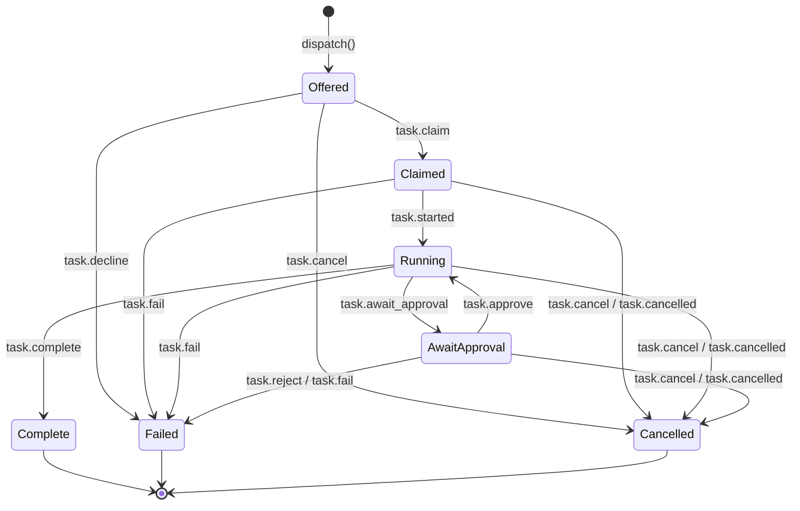

# BYOK SDK Wire Protocol

Normative contract for `@byok-sdk/protocol`. This is the single source of truth for
the M1-2 (server) and M1-3 (client) implementers — the schemas in
`packages/protocol/src/` are authoritative; this document explains the rules
those schemas encode and why.

Status: wire version `v:1`, **FROZEN**. The pi, claude, and codex runtime
adapters have all exercised the wire (M2); every M1/M2 protocol gap identified
along the way has been closed in place. From this point forward, this
document and the schemas in `packages/protocol/src/` describe a closed
contract — see "Freeze rule" immediately below for exactly what "frozen"
does and doesn't allow.

## Freeze rule

**Additive-minor-only after freeze.** `PROTOCOL_VERSION` stays `1`. Any of the
following is non-breaking and may be added without a version bump, ever:

- A new OPTIONAL field on an existing payload or the envelope.
- A new message type.
- A new `AgentEvent` variant.
- A new capability flag (`CAPABILITY_FLAGS`, or a new key inside
  `RuntimeInfo.capabilities`).

**Exception:** the "new optional field is always non-breaking" bullet above
does not apply to `PermissionPolicySchema` or the `instruction` blob-ref shape
(`{ blobRef: BlobRef }`) — see the asymmetry below. Both are built with zod's
`.strict()`, not the default strip-unknown-keys behavior every other schema in
this bullet list gets, so adding a field to either is itself a breaking
change requiring a version bump, by design.

**What IS breaking, and requires a `v` bump instead:** changing an existing
field's type, removing a field, making an optional field required (or vice
versa in a way a receiver depends on), renaming a message type, or removing a
state/transition. There is no in-place "tighten it a little" allowance
post-freeze the way pre-freeze M0→M1 had (§10) — a change of this shape is a
new major version, full stop.

**Both sides ignore unknown.** A daemon or server on an older minor version
must not crash or hard-fail on a field, message type, or event variant it
doesn't recognize yet — see the asymmetry below for the one deliberate
exception. **Server supports N and N-1.** A server negotiates the highest
protocol version common to its own supported set and the daemon's
`conn.hello.protocolVersions[]` list, and must continue accepting the
immediately-prior major version so a fleet of daemons can roll forward
without a hard cutover. (`v:1` is the only version that exists today, so this
is currently a no-op in practice — it becomes load-bearing the day `v:2`
ships.)

**The observability-vs-control asymmetry.** Unknown is TOLERATED for
observability data, but FAIL-CLOSED for control/security data:

- **Tolerated (observability):** an unrecognized `AgentEvent.type` inside a
  `task.progress` batch parses as an opaque passthrough placeholder instead
  of failing the whole batch (`AgentEventOrUnknownSchema`,
  `agent-event.ts` — see `isKnownAgentEvent`/`partitionAgentEvents` for how a
  consumer is expected to skip it). An unrecognized capability flag string
  (`CAPABILITY_FLAGS`, or an entry inside `conn.hello.capabilities[]` /
  `RuntimeInfo.capabilities.permissionModes[]`) is likewise just ignored, not
  rejected. An unknown top-level envelope field is stripped, not rejected
  (§1). This tolerance exists because this data only ever informs a UI or a
  log line — silently ignoring what you don't understand yet is safe.
- **Fail-closed (control/security):** `instruction` and `policy`
  (`PermissionPolicySchema`) reject any shape they don't recognize outright —
  there is no passthrough-unknown fallback for either, unlike
  `AgentEventSchema`. A payload that would grant, deny, or otherwise change
  what a runtime is authorized to do must never be silently
  reinterpreted-as-something-safe or dropped-and-ignored; it must fail
  validation loudly. This is the same fail-closed posture every runtime
  adapter already applies to a policy shape it can't honor (§11.1) — the
  wire-schema level and the adapter level agree on it end to end.

  Concretely, `PermissionPolicySchema` and the `instruction` blob-ref variant
  (`{ blobRef: BlobRef }`) are both built with zod's `.strict()`, rather than
  the default strip-unknown-keys behavior every other payload schema in this
  document gets: an unrecognized field on an otherwise well-formed policy or
  blob-ref instruction is REJECTED outright, not silently discarded. Plain
  `z.object()` — what every non-control payload uses — would have accepted a
  policy or instruction carrying a field it didn't recognize and quietly
  dropped that field from the parsed result, which is precisely the
  silent-widening-or-narrowing failure mode this asymmetry exists to rule
  out for control/security data: a stripped constraint is indistinguishable
  from a constraint that was never sent. **Consequence:** adding a new field
  to either schema post-freeze is therefore a BREAKING change requiring a
  `PROTOCOL_VERSION` bump — the one explicit exception to "a new optional
  field is always non-breaking" noted above. This is intentional: a new
  security/control constraint must force a conscious version bump so an
  unupgraded peer can never silently ignore it, the same way every other
  field on these two schemas already can't be silently ignored.

This asymmetry is enforced by the freeze-guard regression test
(`packages/protocol/src/__tests__/freeze-guard.test.ts`), not just documented
here — see that file for the executable version of every bullet above.

**Landed additive minor: `task.approval_resolved` (was tracked here as a
deferred candidate; now shipped).** A daemon → server message — an explicit
notification for the case where a pending approval was resolved entirely
locally (the daemon's own control-socket `approvals.resolve`, a fail-closed
`requestApproval` timeout, or a fail-closed finish/eviction rejection — see
`packages/client/src/daemon/task-runner.ts`'s `sendApprovalResolved`), with
no wire `task.approve`/`task.reject` ever exchanged for it. Exactly what the
first bullet at the top of this section already allows — "a new message
type" — so it landed with no `PROTOCOL_VERSION` bump, alongside a new
handshake capability flag, `approval_resolved` (`CAPABILITY_FLAGS`,
`version.ts`), that a server advertises when it understands the message; see
§2's catalog entry and §5.2 below for the full flow and the wire shape.

Before this landed, the server could only infer a local resolution after the
fact (`ConnectionHub.resumeIfImplicitlyApproved`, `packages/server/src/hub.ts`)
once the daemon's next `task.progress`/`task.artifact`/`task.complete`
proved it had already moved on — surfaced purely as an embedder-facing
`task.approval_resolved_implicit` `ByokServerEvent` (`packages/server/src/
types.ts`), never a protocol change. That inference path is untouched and
remains the permanent N/N-1 fallback: an old daemon that predates this
message, or a daemon talking to an old server that never advertises
`approval_resolved`, never sends the new message at all, and the server
keeps inferring exactly as it did before this section's previous wording.

**Landed additive minor: `task.complete.document` + the `result-document`
capability flag.** A new OPTIONAL field on an existing payload plus a new
capability flag — the first and fourth bullets at the top of this section —
so both landed with `PROTOCOL_VERSION` still `1`. `document` carries the
task's structured terminal result (one JSON value the product consumes as
the task's actual output), bounded by `RESULT_DOCUMENT_MAX_BYTES`; the
server-advertised `result-document` flag (`CAPABILITY_FLAGS`, `version.ts`)
is what tells a daemon the other side will actually keep the field instead
of stripping it. Full contract, cap semantics, and the
`document`-vs-`artifactRefs` boundary: §7.2. The golden fixtures
(`packages/protocol/src/__tests__/golden/v1.frozen.json`) were regenerated
deliberately for the fingerprint change, with the additive-only diff
recorded in `tasks/notes/20260812-0351-result-document-channel.notes.md`;
the historical envelope corpus (`v1.envelopes.ndjson`) was NOT touched,
since a pre-`document` peer's committed bytes must keep parsing unchanged —
which is exactly what proves the change additive.

**Landed additive minor: terminal `usage`.** `task.complete`, `task.fail`,
and `task.cancelled` each gain the same OPTIONAL `TerminalInferenceUsage`
field. This is an observability-only fact attached to a terminal receipt, not
a capability, task-state transition, billing record, storage usage, quota, or
entitlement input. The field is optional so an old daemon's terminal payload
remains valid; a receiver that does not know it follows the ordinary
observability tolerance rule and strips it. The frozen fingerprint golden was
regenerated for this additive schema change, while the historical envelope
corpus remains a pre-usage compatibility witness.

## 1. Envelope

Every wire message is a single-line NDJSON envelope:

```ts
{
  v: number;            // protocol version, currently 1
  id: string;            // uuid, unique per envelope
  ts: string;             // ISO-8601 datetime with offset
  type: MessageType;       // e.g. "task.offer"
  task_id?: string;         // routing key — see rule below
  session_ref?: string;      // opaque session continuation token
  seq?: number;                // per-device redelivery cursor — see rule below
  payload: { ... };              // shape determined by `type`
}
```

Unknown top-level fields are stripped, not rejected (forward-compat). An
unrecognized `type` is a distinct error (`UnknownMessageTypeError`, not
`EnvelopeValidationError`) precisely so a daemon/server on an older minor
version can skip an unfamiliar additive message type instead of treating it as
corrupt input.

### 1.1 `task_id` is the sole routing key (M1 gap #1, #7)

**Rule: `task_id` is REQUIRED on every `task.*` envelope, and stays optional on
every `conn.*` envelope.** All `task.*` types route by task id; `conn.*` types
don't route to a task at all. This is enforced at the schema level (each
message type's envelope shape is built with either a required or an optional
`task_id`, per `envelope.ts`), not just documented — an omitted `task_id` on a
`task.*` envelope fails validation.

Before M1, `task_id` was optional everywhere and two payloads (`task.offer`,
`task.claim`) additionally duplicated a `taskId` field at the payload level.
That duplication is now removed: **`task_id` lives only on the envelope.** A
payload never carries its own `taskId` again.

### 1.2 `seq` is the per-device redelivery cursor (M1 Part B)

**Rule: `seq` is REQUIRED on every envelope type the *server* sends to the
daemon, and stays optional on every envelope the daemon sends to the server.**
`seq` is a per-device monotonically increasing counter the server assigns to
each outbound envelope, independent of and unrelated to task identity — it
exists purely so a reconnecting daemon can tell the server "replay anything
I might have missed after N." See [§9](#9-at-least-once-delivery--idempotency)
for the full redelivery procedure.

Server → daemon types (`seq` required): `conn.ack`, all `task.*` control
messages, `agent.egress.ack`, `agent.content.read`, and
`agent.home.projection`. Every daemon → server type leaves `seq` optional —
M1 only specifies server-to-daemon redelivery, not the reverse.

**Do not confuse this with `task.progress`'s payload-level `seq`.** That field
(`TaskProgressPayload.seq`) is unrelated — it orders progress batches *within
a single task*, was already required pre-M1, and is untouched by this change.
Two different counters happen to share the field name `seq` at two different
levels (envelope vs. payload) for two different purposes; keep them separate
in your head and in any redelivery/ordering code.

**`conn.*` envelopes never advance the redelivery cursor.** `conn.ack`
carries a `seq` (required, like every other server → daemon type) purely for
schema uniformity — it is not tied to any task and must never be treated as
"the highest seq processed so far" for the purposes of the `cursor` a daemon
reports back in a future `conn.hello` (§9). A daemon that advances its
cursor from `conn.ack`'s `seq` breaks redelivery outright: on reconnect, the
server always assigns `conn.ack` the *next* (i.e. currently highest)
per-device `seq` value, sent immediately before replaying any backlog still
queued for this device (§9) — so `conn.ack`'s `seq` is always higher than
every backlog envelope about to follow it. Advancing the cursor to
`conn.ack`'s value before that backlog even arrives makes every one of those
(necessarily lower) backlog `seq`s look already-delivered, and a
cursor-dedupe check silently drops all of them. Cursor accounting covers every
server → daemon control that requires durable handler completion, including
`task.*`, `agent.egress.ack`, `agent.content.read`, and
`agent.home.projection`; it excludes `conn.*`.

### 1.3 `session_ref`

For ordinary offers, `session_ref` is an opaque continuation token the daemon
maps to a runtime session id (`claude --resume`, codex resume, pi session). A
follow-up task carries the same `session_ref` in a new `task.offer`. That
legacy/ordinary meaning is unchanged in M1.

#### 1.3.1 Strict Agent fresh versus resume authority

The published `0.7.0` strict egress path exposed a fresh-session deadlock:
`task.offer_for_agent_with_egress` requires `sessionRef`, while a fresh runtime
cannot mint its native session until after `start()`. The client must reject a
missing, preseeded, or invented Agent-home handoff, so task id or a server-side
reservation cannot substitute for the runtime session.

Protocol v1 remains frozen. The repair is additive and keeps these wire facts
distinct:

- `task.offer_for_agent_with_egress` stays byte-compatible and
  exact-resume-only. Its `sessionRef` must match the existing durable canonical
  Agent-home handoff; missing, stale, cross-Agent/profile, runtime, or cwd
  evidence fails closed and never becomes fresh execution.
- `task.offer_for_agent_with_egress_fresh` is fresh-only and carries no
  `sessionRef`. It is deliverable only to a device with the durable
  `agent-egress-fresh-session` capability. An older daemon cannot receive this
  additive message and cannot strip it into a task-only offer.

The runtime, not cloud or task identity, owns a fresh native session. After the
fresh offer is claimed, the daemon starts the selected runtime without resume
arguments, receives the runtime-issued session, fsyncs the exact
`AgentRef/profileRevision/runtime/cwd/sessionRef` handoff in the canonical
Agent home, and only then sends `task.started` or exposes reliable egress. The
public reliable publisher re-reads and exact-matches that handoff before
append/send; receipt and ack are delivery facts, not session authority.

## 2. Message catalog

`S→D` = server sends, daemon receives. `D→S` = daemon sends, server receives.

| Type | Dir | `task_id` | `seq` | Payload | Sent when |
|---|---|---|---|---|---|
| `conn.hello` | D→S | optional | optional | `protocolVersions[]`, `capabilities[]`, `deviceId`, `productId`, `clientVersion?`, `runtimes?`, `configuredToolsets?`, `cursor?` | Opening (or reopening) the authenticated WS or long-poll connection snapshot |
| `conn.ack` | S→D | optional | **required** | `protocolVersion`, `capabilities[]`, `serverTime` | Handshake acknowledgement |
| `task.offer` | S→D | **required** | **required** | `instruction`, `policy`, `runtime?`, `dispatchSelection?` (additive — see below), `sessionRef?`, `workspaceHint?` (reserved — see note below), `limits?` | `dispatch()` targets a device |
| `task.offer_with_toolsets` | S→D | **required** | **required** | All `task.offer` fields plus `requiredToolsets` (1–16 logical ids) | A toolset-aware host targets a capable device |
| `task.offer_for_agent` | S→D | **required** | **required** | `instruction`, `policy`, `agentRef`, `runtime?`, `dispatchSelection?`, `sessionRef?`, `requiredToolsets?`, `limits?` | An Agent dispatch targets a durably capable device |
| `task.offer_for_agent_with_egress` | S→D | **required** | **required** | All strict Agent fields plus required `sessionRef` and exact `egressPolicy` | An Agent dispatch targets a daemon that consumed the revisioned egress contract |
| `task.offer_for_agent_with_egress_fresh` | S→D | **required** | **required** | All strict Agent fields plus exact `egressPolicy`, with no `sessionRef` | A fresh Agent dispatch targets a daemon advertising `agent-egress-fresh-session` |
| `agent.egress.ack` | S→D | optional | **required** | exact `agentRef`, `sessionRef`, `policyRevision`, `eventId`, `cursor`, `receiptId` | Cloud durably recorded one reliable Agent event |
| `agent.content.read` | S→D | optional | **required** | `requestId`, surface, actor, exact Agent/session/runtime/cwd, policy revision, relative target, MIME, decode mode, bounded policy | An independently authorized explicit content read is requested |
| `agent.home.projection` | S→D | forbidden | **required** | exact `requestId`, AgentRef/profile revision, SHA-256 projection identity, bounded opaque JSON | A durable task-free projection targets one exact capable device |
| `task.approve` | S→D | **required** | **required** | `{}`, `approvalId?` (M5, additive — §5.3) | `TaskHandle.approve()` while `AwaitApproval` |
| `task.reject` | S→D | **required** | **required** | `reason?`, `approvalId?` (M5, additive — §5.3) | `TaskHandle.reject()` while `AwaitApproval` |
| `task.cancel` | S→D | **required** | **required** | `reason?` | `TaskHandle.cancel()` from any non-terminal state |
| `task.steer` | S→D | **required** | **required** | `text` | `TaskHandle.steer()` while `Running` |
| `task.claim` | D→S | **required** | optional | `deviceId`, `agentId?`, `agentRef?`, `runtime?` (M5, additive — §3.1), `capabilities?` (S0, additive — §11.5) | Daemon accepts an offer (idempotent CAS) |
| `task.started` | D→S | **required** | optional | `{}` | Daemon actually starts the runtime session — `Claimed → Running` |
| `task.decline` | D→S | **required** | optional | `reason`, `retryable?`, `agentRef?` | Daemon fail-closed-rejects an offer *before* claiming — `Offered → Failed` |
| `task.progress` | D→S | **required** | optional | `seq` (payload-level batch order — §1.2), `events[]` | Batches of normalized `AgentEvent`s |
| `task.artifact` | D→S | **required** | optional | `name`, `contentType`, `inline?`, `blobRef?` | An artifact is produced |
| `task.await_approval` | D→S | **required** | optional | `summary`, `approvalId?` (M5, additive — §5.3) | Runtime raised `needs_approval` |
| `task.complete` | D→S | **required** | optional | `summary`, `sessionRef`, `artifactRefs?`, `document?` (additive — §7.2), `agentRef?` | Runtime reached `turn_end` |
| `task.fail` | D→S | **required** | optional | `reason`, `retryable?`, `agentRef?` | Task ends in error |
| `task.cancelled` | D→S | **required** | optional | `reason?`, `agentRef?` | Task ends `Cancelled` (server- or daemon-initiated) |
| `task.approval_resolved` | D→S | **required** | optional | `approvalId`, `decision` (`'approve'\|'reject'`), `resolvedBy` (`'local'`), `at` | A pending approval was resolved entirely on the device (§5.2) — gated on the `approval_resolved` capability flag |
| `agent.egress.reliable` | D→S | optional | optional | exact Agent/session/policy identity, stable `eventId`/`cursor`, sanitized payload hash and byte count | A locally fsynced reliable event is sent or retried |
| `agent.content.receipt` | D→S | optional | optional | exact request/actor/Agent/session/runtime/cwd/policy/target/MIME/decode identity; allowed includes hash/size/BlobRef, denied includes zero bytes and typed reason | Local content policy and audit completed |

### 2.1 Agent egress and explicit content reads

`task.offer_for_agent_with_egress` is a distinct message rather than an
optional field on `task.offer_for_agent`. Server and hosted cloud require
`agent-home-contract`, `agent-egress-policy`, and
`agent-egress-reliable-ack` before allocating the task/mailbox row. An old
daemon cannot strip the policy and continue with task-only semantics.

`task.offer_for_agent_with_egress_fresh` is a second additive message for the
fresh case. Server and hosted cloud require the same Agent/egress declarations
plus durable `agent-egress-fresh-session` before allocating its task/mailbox
row. The fresh payload has no `sessionRef`; the runtime mints that value after
claim/start, and the client must fsync the exact Agent-home handoff before
`task.started` or any reliable egress. The existing message remains
exact-resume-only and never falls back to this path when its handoff is absent
or mismatched.

Host-facing APIs mirror those two wire facts. Hosted cloud exposes
`enqueueFreshAgentEgressOffer`, and the reference server exposes
`dispatchFreshAgentEgress`; the existing resume dispatch rejects a missing
`sessionRef` instead of selecting the fresh message.

The policy has one exact `policyRevision`. Activity is either
`metadata-status`/`latest-value`, or explicit
`contentful-trajectory`/`latest-value` with positive coalesce and event-byte
bounds. Reliable quotas are positive and independently bound per Agent and
authenticated tenant. Workspace, transcript and artifact transfers are each
`disabled` or carry an explicit MIME/byte policy; no surface inherits another
surface's capability.

`agent.egress.reliable` is at-least-once. The daemon appends/fsyncs before the
first send and retains the stable id/cursor until an exact
`agent.egress.ack`. A duplicate exact event returns the existing durable
receipt; a changed AgentRef, profile revision, session, policy, id, cursor,
hash or bytes fails closed. It never degrades to latest-value activity.

`agent.content.read` is task-independent but cursor-tracked and redeliverable.
Its target is a portable relative path (no absolute path, dot segment or
backslash); cwd is absolute. The daemon derives the capability from the
surface, binds tenant/device from authenticated local state rather than the
payload, and applies its own narrower root/text/sensitive-name policy. Allowed
bytes travel only through the authenticated blob channel. The
`agent.content.receipt` contains required stable `eventId`/positive
`cursor`. It is fsynced to the same Agent-local reliable spool before first
send and retires only after an exact `agent.egress.ack`; restart replay and
duplicate re-ack preserve that identity. An allowed receipt contains a
`BlobRef` whose hash, size and content type exactly match the receipt; denial
carries `byteCount: 0`. The receipt is content-free metadata and does not make
cloud a transcript authority.

### 2.2 Task-free Agent-home projection

`agent.home.projection` is gated by the additive `agent-home-projection`
capability in addition to the base `agent-home-contract`. It is not a task and
forbids `task_id`. The opaque JSON payload is at most 64 KiB and has no
credential-specific field; the embedding producer remains responsible for
excluding secret values because this boundary is not a DLP scanner.

Cloud persists the immutable desired fact before appending the exact-device
mailbox row. Duplicate request identity and exact body are idempotent; changed
immutable bytes conflict. Offline delivery remains pending and is never
rerouted. The daemon applies the local ordering contract under the canonical
Agent-home lease. The host consumer is an atomic/idempotent ensure of opaque
product-derived bytes. A new request with the exact current revision/hash runs
that consumer again and returns `idempotent`; stale or same-revision/different-
hash requests never invoke it. Consumer, containment or lease failure leaves
the request pending and the cursor behind. After a successful local outcome the
daemon calls:

```text
PUT /byok/agent-home-projections/:requestId/completion
{ requestId, agentRef, projectionHash, outcome }
```

The endpoint authenticates the enrolled device, exact-matches the stored
request, writes a first-terminal immutable completion receipt, and returns the
full tenant/device/request/AgentRef/hash/outcome readback. Unknown or
cross-device request is `404`; identity mismatch is `422`; changing a terminal
fact is `409`. Handler failure or non-exact readback does not advance the
server-to-daemon cursor.

**`TaskOfferPayload.dispatchSelection` is the authoritative LLM target when
present.** It is a strict discriminated union:

- subscription: `{lane:'subscription', runtimeId:'claude'|'codex',
  providerId:null, modelId:string}`;
- BYOK: `{lane:'byok', runtimeId:'pi', providerId:string, modelId:string}`.

Every id is non-empty, bounded to 160 characters, and rejects NUL/CR/LF. The
server derives the task's requested runtime from `runtimeId`; if the legacy
optional `runtime` field is also present, disagreement is rejected before task
creation. Because an older v1 daemon is allowed to strip an unknown optional
field, the server first requires the target connection to advertise the
additive `dispatch-selection` capability; absence rejects before task creation
instead of degrading to a runtime-only offer. The daemon repeats the runtime
check before claim and selects the adapter
from `dispatchSelection.runtimeId`. Adapters then pass the exact model (and, for
Pi, provider) to the runtime. No layer may infer a missing provider/model or
fall back to another target. The field is additive in frozen v1; offers that do
not use provider selection retain the pre-existing `runtime?` behavior, but the
new path never degrades into it after a selection was supplied.

**`task.offer_with_toolsets` is a distinct additive message, not an optional
field on `task.offer`.** `requiredToolsets` carries only bounded logical ids
such as `salesko.crm`; it never carries an executable command, environment,
header, token, cookie, or connector credential. The daemon resolves every id
against its operator-owned local `mcpToolsets` configuration before claiming
the task. Missing ids, duplicate MCP server names, an empty resolved set, or a
runtime without `mcpToolsets` support all produce `task.decline` and no child
process starts.

The separate message type is the backward-safety boundary: a frozen-v1 daemon
may skip an unknown additive message, but it cannot silently strip a new field
and run the instruction without its required tools. The self-hosted server
therefore requires the live connection's `toolset-selection` capability before
creating the task. A hosted caller uses `enqueueToolsetOffer()` and must route
only to a device it knows is toolset-capable. Claude is currently the sole
bundled runtime that advertises `mcpToolsets`; the daemon projects the selected
local stdio servers into one task-scoped `--mcp-config` and always supplies
`--strict-mcp-config`. Confirm mode's internal approval server is merged into
that same file. Pi and Codex decline these offers fail-closed.

**`TaskOfferPayload.workspaceHint` is RESERVED — currently ignored end to
end.** The field exists on the wire (`TaskOfferPayloadSchema`,
`packages/protocol/src/messages.ts`) but nothing reads it today: no bundled
adapter (pi/claude/codex) consults it, no `task-runner.ts` code threads it
into an adapter's `workspaceDir` resolution, and the public SDK's own
`DispatchInput` (`packages/server/src/types.ts`, the input to
`ByokServer.dispatch`) has no field for a caller to set it through in the
first place. Do not rely on it to influence workspace selection — a real
implementation (what it should override or merely suggest, relative to the
existing `sessionRef`-keyed workspace mapping) is an undesigned follow-on
task, not something already wired up behind this field.

**Decision (S0): `workspaceHint` stays reserved.** Leaving the field on the
wire costs nothing (an ignored optional payload key) and removing it would be
a breaking wire-v1 change, so it is kept as declared-but-unconsumed rather
than either wired up opportunistically or deleted. The rule that follows from
that: no public documentation, SDK surface, or UI may present this field as a
workspace-selection capability, and no code may start reading it as a
side effect of unrelated work. Wiring it later requires its own ADR that first
settles legacy task-workspace precedence against the `sessionRef`-keyed
mapping, path validation and confinement, and what a device does with a hint
it cannot honor. The Agent-home contract below does not activate this field.
See `docs/architecture/sdk-architecture.md` ADR-023.

**`task.offer_for_agent` is the strict Agent-home path.** Its required
`agentRef` contains a bounded single-segment `agentId` and bounded
`profileRevision`; both are limited by UTF-8 byte length. The target device
must have durably declared `agent-home-contract` before the server/cloud creates
or enqueues the task. A legacy daemon therefore cannot strip identity and run
the instruction in `workspaceRoot/<taskId>`. `agentId` must also be a portable
Windows pathname segment: reserved device names and trailing dot/space are
rejected. A strict Agent `taskId` is reserved exactly once; any later enqueue
with that id fails closed instead of appending a second offer.

The daemon accepts an absolute `hostStorageRoot` from its local host config and
the SDK exclusively composes `<hostStorageRoot>/agents/<agentId>`. It then
requires exact AgentRef/profileRevision/session/runtime/cwd agreement for
resume and echoes exact AgentRef through claim/decline/terminal messages.
`workspaceHint` has no precedence because it is absent from the strict Agent
offer. Profile contents and non-`.byok` Agent files are opaque; `artifacts` is
not a protocol field, schema, index, or required directory.

## 3. Task state machine (M1 gap #2, #5, #6)


```mermaid
stateDiagram-v2
    [*] --> Offered: dispatch()
    Offered --> Claimed: task.claim
    Offered --> Cancelled: task.cancel
    Offered --> Failed: task.decline
    Claimed --> Running: task.started
    Claimed --> Failed: task.fail
    Claimed --> Cancelled: task.cancel / task.cancelled
    Running --> AwaitApproval: task.await_approval
    Running --> Complete: task.complete
    Running --> Failed: task.fail
    Running --> Cancelled: task.cancel / task.cancelled
    AwaitApproval --> Running: task.approve
    AwaitApproval --> Failed: task.reject / task.fail
    AwaitApproval --> Cancelled: task.cancel / task.cancelled
    Complete --> [*]
    Failed --> [*]
    Cancelled --> [*]
```

| From | Legal targets |
|---|---|
| `Offered` | `Claimed`, `Cancelled`, `Failed` |
| `Claimed` | `Running`, `Failed`, `Cancelled` |
| `Running` | `AwaitApproval`, `Complete`, `Failed`, `Cancelled` |
| `AwaitApproval` | `Running`, `Failed`, `Cancelled` |
| `Complete` / `Failed` / `Cancelled` | none (terminal) |

The table above is the shared wire task state machine. The hosted cloud also
has one control-plane attempt state, lower-case `cancel_requested`, which is
not a new envelope value and does not extend `TaskState`. It means a host
cancellation tombstone is durable for a leased attempt but the device has not
yet acknowledged `task.cancel` with `task.cancelled`. An unleased hosted offer
goes directly to `cancelled`; a leased one goes
`running → cancel_requested → cancelled` at the attempt-store boundary.

A server may additionally force a task straight to `Failed` when an inbound
message doesn't fit the task's current state (e.g. `task.progress` arriving
while `AwaitApproval`) — this is an implementation safety net (see the
reference `ConnectionHub`), not itself a distinct wire message.

### 3.1 Claim no longer implies Running (M1 gap #2)

Before M1, receiving `task.claim` was treated as claiming *and* immediately
running — there was no wire message for "I actually started." That collapsed
two distinct facts ("this device owns the task" and "the runtime session is
up") into one. M1 adds `task.started`: the daemon claims first
(`Offered → Claimed`), does whatever local setup it needs (workspace
creation, adapter `start()`), and only then reports `Claimed → Running`
explicitly. A server must not advance a task to `Running` on `task.claim`
alone.

`task.started` is idempotent the same way `task.claim` is: a repeat
`task.started` from the device that already owns a `Running` task is a
no-op, not an illegal-transition error.

**`task.claim.runtime` (M5, additive minor): the ACTUALLY-selected runtime,
distinct from `task.offer.runtime`/`TaskSnapshot.runtime` (the merely
REQUESTED one, unchanged by this addition) — when an offer names no runtime
the daemon auto-selects in `claude → codex → pi` order (pi is the fallback,
tried last, only once nothing more capable is available; overridable
per-daemon via `DaemonConfig.runtimePreference`), and this field is what lets
the server finally learn which adapter it picked, recorded separately as
`TaskSnapshot.claimedRuntime`.**

### 3.2 Declined vs. Failed (M1 gap #5)

`task.decline` lets a daemon fail-closed a pre-claim offer (no compatible
runtime, policy exceeds this device's ceiling, unsupported instruction shape,
etc.) instead of silently dropping it or being forced to claim first just to
have somewhere to report failure.

**Decision: declining does not introduce a new `Declined` terminal state.**
It maps onto the existing `Failed` state via a new `Offered → Failed`
transition, and `TaskDeclinePayload` intentionally mirrors `TaskFailPayload`
exactly (`reason` + `retryable`). Rationale: a pre-claim decline and a
post-claim failure are the same outcome from the dispatcher's point of view —
this attempt produced no result, here's why, here's whether retrying (e.g.
offering to a different device) makes sense. Adding a distinct `Declined`
state would fork every terminal-state consumer (dashboards, retry logic,
`TaskSnapshot` readers) into "handle `Failed` *and* `Declined`, identically"
for no behavioral gain. Keeping the state machine at 7 states (not 8) was the
deciding factor.

### 3.3 Cancelled is its own message, not `task.fail(reason:'cancelled')` (M1 gap #6)

**Decision: `task.cancelled` is an explicit new daemon → server message —
prefer the explicit message over overloading `task.fail`.** `Cancelled` was
already a distinct `TaskState` before M1; what was missing was a proper wire
message for it. The M0 daemon reported cancellation via
`task.fail({ reason: 'cancelled', retryable: false })`, a magic-string
convention that hid a semantically distinct outcome (intentional stop) inside
the error-reporting message (unintentional failure). `task.cancelled`
supersedes that convention as the canonical way to report a `Cancelled`
outcome.

`task.cancelled` is dual-purpose on receipt, and a server must handle both:

- **Server-initiated cancel already landed** (the common case — see
  [§4](#4-cancelapprovereject-wire-semantics-m1-gap-3)): the server's record
  is already `Cancelled` by the time this arrives. Treat it as an idempotent
  no-op ack.
- **Daemon-observed cancellation the server didn't know about** (e.g. a local
  stop action in the branded CLI's UI): the server's record is still
  `Claimed` / `Running` / `AwaitApproval`. This message is the authoritative
  trigger — apply the transition to `Cancelled`.

## 4. Cancel/approve/reject wire semantics (M1 gap #3)

**Rule: the server's own action is authoritative.** Calling the embedded
server API (`TaskHandle.cancel()` / `.approve()` / `.reject()`) moves that
server's task record immediately. Calling the hosted cloud's tenant-scoped
`cancelTask(taskId, reason?)` atomically records a cancellation tombstone and
durable mailbox delivery; an unleased attempt becomes `cancelled`, while a
leased attempt exposes `cancel_requested` until the daemon acknowledgement.
Neither surface waits for the daemon before accepting the host decision, and
the accepted hosted tombstone outranks a racing late success in the product
result projection. The corresponding wire message
(`task.cancel` / `task.approve` / `task.reject`) sent to the daemon is a
**best-effort notification**, not a request awaiting a reply, and **there is
no new ack message type**. The daemon's existing message stream is the
observable proof of the daemon-side effect:

- `task.approve` → daemon resumes the paused session; proof is `task.progress`
  resuming (or `task.fail` / `task.cancelled` if resuming turns out to be
  impossible).
- `task.reject` → daemon stops the session; proof is `task.fail`.
- `task.cancel` → daemon stops the session; proof is `task.cancelled`
  ([§3.3](#33-cancelled-is-its-own-message-not-taskfailreasoncancelled-m1-gap-6)).

This is deliberate, not an oversight: a flaky or slow daemon connection must
never be able to block the server's own state machine, and a dedicated ack
message would only restate information the existing terminal/progress
messages already carry.

For hosted cancellation, “best-effort” describes when an online device acts,
not whether the command survives disconnection: the tombstone and
`task.cancel` mailbox row commit together, the original unleased offer is
filtered from subsequent delivery, and reconnect redelivers the cancellation.
`task.cancelled` remains the existing acknowledgement. A late
`task.complete` may be retained as raw receipt evidence but cannot overwrite
the accepted cancelled result or trigger downstream business projection.

**`task.cancel`/`task.reject` stay individually redeliverable even though
their task is already terminal server-side by the time they're queued.**
`cancelTask`/`rejectTask` move the record to `Cancelled`/`Failed` *before*
queuing the notification for delivery — that ordering is what makes the
server's own state authoritative immediately, per the rule above — but it
also means the notification's task has already reached a terminal state
before it ever enters the redelivery backlog. The redelivery procedure's
normal rule of skipping anything that belongs to an already-terminal task
(§9) is therefore explicitly exempted for these two types: without the
exemption, a `task.cancel`/`task.reject` that never reached the daemon (the
connection dropped mid-send, say) could never be redelivered on reconnect —
by definition, its task was terminal from the moment it was queued.
`task.approve`/`task.steer` need no such exemption: neither is ever sent
while its task is already terminal in the first place (both require a
specific non-terminal state to send at all), so the ordinary terminal-task
skip never wrongly catches them.

## 5. Approval flow (M1 gap #8)

The full round trip from a runtime pausing for human input to it resuming:

1. The runtime adapter surfaces a normalized `needs_approval` `AgentEvent`.
2. The daemon sends `task.await_approval { summary }`. Server: `Running → AwaitApproval`.
3. The server-embedding SaaS surfaces the summary to a human (or automated
   policy) and calls `TaskHandle.approve()` or `.reject(reason?)`.
4. Server state moves immediately (`AwaitApproval → Running` or
   `AwaitApproval → Failed`); `task.approve` / `task.reject` go out as
   best-effort notifications ([§4](#4-cancelapprovereject-wire-semantics-m1-gap-3)).
5. Daemon reacts: on approve, resumes the runtime session and normal
   `task.progress` traffic continues; on reject, stops the session and sends
   `task.fail`.

This flow was already representable with `task.approve`/`task.reject` before
M1 — nothing new needed schema-wise. What M1 pins down is the semantics in
step 4 (§4) and documents the flow end-to-end so the M1-3 client worker can
wire an adapter's `needs_approval` event all the way through to a resumed
session without re-deriving these rules.

### 5.1 pi and codex: RESERVED, no seam exercised. claude: exercised as of M4 Phase 3

**The entire approval round trip above — `needs_approval`,
`task.await_approval`, `task.approve`/`task.reject`, and
`Session.resolveApproval` — is present in the frozen v1 wire.** Through M3 it
was exercised by ZERO bundled runtime adapter (M2-a/M2-b findings); as of M4
Phase 3, claude genuinely exercises it (`packages/client/src/adapters/*/`):

- **pi** never emits `needs_approval` at all — it has no built-in per-call
  approval gate (`PiSession.resolveApproval` throws unconditionally).
- **claude**'s `--permission-mode` ALONE still resolves every permission
  decision *synchronously* before the turn continues, exactly as before
  (auto-denied under a restrictive mode, auto-granted under a permissive
  one) — that finding is unchanged. But `--permission-prompt-tool` (a
  genuinely different flag, live-verified against the real installed
  binary) makes claude block a turn on a real out-of-process round trip
  instead: see §11.2's own "Claude `confirm` mode" note for the full
  mechanism. `ClaudeSession.resolveApproval` no longer unconditionally
  throws — it routes into that channel when one is wired up (`confirm`
  mode), and still throws exactly as before otherwise.
- **codex**'s `codex exec --json` resolves a sandbox-denied action
  internally with no wire-visible pause either, regardless of
  `approval_policy` (`CodexSession.resolveApproval` throws) — pending
  codex's own app-server migration.

The schema stays because the seam is a real, intentional part of the frozen
contract — a future runtime adapter (bundled or third-party) can implement it
without a wire change — and a server MUST NOT assume pi or codex will ever
pause a task in `AwaitApproval` on their own initiative; claude now can, under
`policy.mode: 'confirm'` specifically.

**The connection-level `interactive-approval` capability flag stays RESERVED
— it is NOT the routing signal to use.** `CAPABILITY_FLAGS` (`version.ts`)
includes `interactive-approval`, but no daemon advertises it and no server
behavior keys off it; it was never wired to a per-adapter signal and nothing
since has repurposed it. **The accurate per-runtime signals live on
`RuntimeInfo.capabilities` (§11.4): `permissionModes.includes('confirm')` for
whether a runtime can honor `policy.mode: 'confirm'`, and
`approvalInteractive` for whether it pauses on a real interactive approval.**
Both are generated from the adapter's own `capabilities()` and agree by
construction (claude: `confirm` present and `approvalInteractive: true`; pi
and codex: neither). A server dispatching `policy.mode: 'confirm'` checks
those fields, never the connection-level flag.

### 5.2 `task.approval_resolved` — explicit local-resolution report (additive minor)

The approval flow above (§5) has always had two resolution paths: the wire
`task.approve`/`task.reject` (server-authoritative, §4) and the daemon's own
local control-socket `approvals.resolve` (device-owner-authoritative). Before
this addition, the SERVER only ever learned about a *local* resolution
implicitly — the next `task.progress`/`task.artifact`/`task.complete` for
that task proved, after the fact, that the daemon had already moved past
`AwaitApproval` (`ConnectionHub.resumeIfImplicitlyApproved`,
`packages/server/src/hub.ts`). In the window between the local resolution and
that next message, the server's own record still said `AwaitApproval` — long
enough for a SaaS-side `TaskHandle.approve()`/`.reject()` to independently
decide (and win) the server's authoritative record while the daemon had
already moved on locally.

**`task.approval_resolved` (D→S) closes that window.** The daemon sends it
immediately whenever an approval resolves through any LOCAL path — the
control socket's `approvals.resolve` RPC, a fail-closed `requestApproval`
timeout, or a fail-closed finish/registry-eviction rejection
(`packages/client/src/daemon/task-runner.ts`'s `sendApprovalResolved`) —
*never* for a resolution that arrived over the wire (`task.approve`/
`task.reject`): the server already knows its own decision, so it must never
be echoed back. Payload: `approvalId` (the resolved `ApprovalRegistry` entry
id), `decision` (`'approve'` or `'reject'`), `resolvedBy` (currently always
`'local'` — a single-value enum, deliberately future-proofed for an
additional value later without a version bump), and `at` (ISO-8601 datetime).
Envelope `task_id` is required (routes by task, like every other `task.*`
type); `seq` stays optional (daemon → server).

**Gated on a new handshake capability flag, `approval_resolved`**
(`CAPABILITY_FLAGS`, `version.ts`) — the N/N-1 answer for this message: an
old server never advertises the flag in its `conn.ack`, so a new daemon
talking to it never sends `task.approval_resolved` at all and silently falls
back to the pre-existing implicit-inference path, unconditionally, exactly
as before this message existed. Server-side handling
(`ConnectionHub.onApprovalResolved`, `hub.ts`): `AwaitApproval` legally
transitions to `Running` (the same edge `approveTask` itself uses) and emits
a `task.approval_resolved` `ByokServerEvent` carrying
`approvalId`/`decision`/`resolvedBy`; already-`Running` (evidence, or the
implicit path, already got there first) is a silent idempotent no-op; any
other state (terminal, or a state that never reached `AwaitApproval` at all)
is a stale no-op with a logged warning, never force-failed. The pre-existing
`resumeIfImplicitlyApproved`/`task.approval_resolved_implicit` machinery is
completely untouched and remains the permanent fallback for the N/N-1 cases
above; the two mechanisms can never both fire for the same resolution —
whichever the server processes first performs the actual transition, and the
other's own guard is already true by the time it would otherwise run.

**Residual race (honest, by design — narrowed, not eliminated):** a SaaS
decision (`TaskHandle.approve()`/`.reject()`) already in flight on the wire
when the local resolution happens can still land on the server FIRST and
move the record to a terminal state before `task.approval_resolved` arrives.
When that happens, the message hits the stale-no-op branch above — exactly
like any other late message for an already-terminal task — and the daemon
independently treats a crossing `task.approve`/`task.reject` the same way
(`NoPendingApprovalError`, an audit-only no-op — §5, `task-runner.ts`'s
`handleApprove`/`handleReject`). Both sides treat the loser as a stale no-op;
neither crashes or double-applies anything. What changed is the SIZE of the
window this can happen in: before this addition it was open until the
daemon's next progress message (arbitrarily long); now it is
network-latency-sized (however long `task.approval_resolved` takes to
reach the server) — and the only possible divergence is exactly the same
kind §4 already accepts elsewhere: the server's terminal record disagreeing
with a daemon that (in the reject case) already stopped, or (in the approve
case) already continued, its own local session. **§5.3's `approvalId`
targeting narrows an ADJACENT race further still** — a late `task.approve`/
`task.reject` that arrives not for a terminal task, but for the SAME task's
NEXT approval cycle (a different, still-`AwaitApproval` pending id) — but,
per that section's own residual-race note, does not eliminate it either.

### 5.3 `approvalId` targeting (additive minor)

**Problem this closes (M5):** none of `task.await_approval`/`task.approve`/
`task.reject` carried any identity for *which* pending approval a decision
was about — only "the one currently pending for this task." A daemon
generates its own `approvalId` locally (`ApprovalRegistry`,
`packages/client`'s `approvals.ts`) the moment it dispatches one, but that id
never reached the wire before M5. As long as a task only ever has ONE
approval in its whole lifetime this is harmless; it stops being harmless the
moment a SECOND approval (B) gets dispatched for the SAME task before a
decision for the FIRST one (A) has round-tripped all the way through the
server and back — e.g. A resolves entirely locally (the control socket's
`approvals.resolve`), B is dispatched next, and only THEN does a slow/queued
server-side decision for A finally arrive as a wire `task.approve`/
`task.reject`. Pre-M5, the daemon had no way to tell A's decision from B's:
`TaskContext.approvalChannel.resolve` always resolved "whichever approval is
CURRENTLY pending" — i.e. B — silently misapplying A's decision to it.

**The fix: all three carry an optional `approvalId`.**
`task.await_approval.approvalId` is the daemon's own generated id for the
approval it's reporting — included unconditionally by an M5+ daemon (no
capability gating needed to send it safely; see below).
`task.approve.approvalId`/`task.reject.approvalId` let a decision target
that SAME specific approval rather than "whichever is current." All three
fields are plain optional properties on already-tolerant `z.object()`
payloads — an old peer that doesn't recognize the field simply never reads
it, so this needed no version bump and no emission gating on either side.

**Matching semantics, both sides field-presence-driven (never
capability-driven — see below):**

- **Daemon** (`TaskRunner.handleApprove`/`handleReject`, `task-runner.ts`):
  if the incoming `task.approve`/`task.reject` carries an `approvalId` that
  does NOT match this task's own currently-dispatched
  `ActiveTask.pendingApprovalId`, the decision is a stale, audit-only no-op —
  logged via the same `onStaleApprovalDecision` hook `NoPendingApprovalError`
  already uses, never resolving anything and never tearing the task down.
  Absent `approvalId` (a legacy server, or one that never recorded an id)
  preserves the pre-M5 behavior exactly: resolve whichever approval is
  currently pending. The daemon-side check is always the AUTHORITATIVE gate
  — see the residual race below for why.
- **Server** (`ConnectionHub.onAwaitApproval`/`approveTask`/`rejectTask`/
  `onApprovalResolved`, `hub.ts`): `TaskSnapshot.pendingApprovalId` records
  the daemon's last-reported id for a task's CURRENT `AwaitApproval` cycle,
  updated even across a re-delivered/updated `task.await_approval` while
  still `AwaitApproval` (the daemon moved on to a fresh approval before the
  server's record left the state), and cleared centrally the instant the
  task leaves `AwaitApproval` for any reason, so a later cycle never inherits
  a stale id. `approveTask(taskId, {approvalId})`/`rejectTask(taskId, reason,
  {approvalId})` validate BEFORE any state change: a caller-supplied id that
  disagrees with the recorded one throws a typed `StaleApprovalError` (no
  transition, no wire send) — distinct from the pre-existing
  `TaskNotAwaitingApprovalError` (task isn't `AwaitApproval` at all right
  now, checked first). `onApprovalResolved` gains the mirror check: a
  reported `approvalId` that disagrees with the recorded one is a stale
  no-op (warned, state untouched) rather than resuming the wrong approval.

**A new handshake capability flag, `approval-targeting`** (`CAPABILITY_FLAGS`,
`version.ts`), is purely informational — unlike `approval_resolved` (§5.2),
it gates nothing. Both sides already emit `approvalId` unconditionally the
moment they're upgraded; a receiver decides whether to apply exact-match
targeting by FIELD PRESENCE on the specific message at hand, never by
checking this flag. It exists only so each side can advertise, and an
embedder/operator can observe (`ConnectionHub.getDeviceCapabilities` — M5
also plumbs a previously-ignored gap where `conn.hello.capabilities` was
silently dropped end to end, forwarding only `runtimes`), whether the OTHER
side is new enough to participate in targeting at all.

**Residual race (honest, by design — narrowed, not eliminated): this server
knows a task's `pendingApprovalId` only up to its LAST delivered
`task.await_approval` — this narrows the window, it does not close it.** The
server's own record of "the current approval" always LAGS the daemon by at
least one round trip: the daemon can locally resolve its current approval and
dispatch a brand-new one at any instant the server has no way to observe
until the next `task.await_approval` actually arrives. A server-side
`approveTask`/`rejectTask` call issued in that exact gap has nothing stale to
compare against yet (`record.pendingApprovalId` is still the OLD id, because
nothing newer has been reported) — the `StaleApprovalError` check can only
ever catch a mismatch the server ALREADY knows about, never one that's still
in flight. The DAEMON-side exact-match check
(`ActiveTask.pendingApprovalId`) is therefore the authoritative gate, not the
server-side one: even when a server-side decision sails through validation
unaware anything changed, the wire message it sends still carries whatever
`approvalId` the server believed was current, and the daemon's own
up-to-the-instant comparison is what correctly resolves it as a no-op if the
daemon has already moved past it. What targeting changes is that
`pendingApprovalId` now exists on the server side at all: without it, every
decision was untargeted and every one of these crossing cases resolved
"whichever is current" silently, with no way to detect a misapplication
after the fact. With it, late/cross decisions for a SUPERSEDED approval
become detectable no-ops on at least one side (usually both) instead of
silent misapplications — narrower, never zero.

## 6. Auth flows

HTTP bodies for these live in `src/http-api.ts`; they are plain HTTP
request/response shapes, not wire envelopes, and never touch the WSS
connection. `v:1` is unaffected — pairing and token renewal are out-of-band
calls that happen before/alongside the WSS connection.

Device identity is a locally generated Ed25519 keypair. The complete local
enrollment record—authenticated device/tenant/public-key metadata, token,
expiry, and private key—is one atomically replaceable OS credential authority
(macOS Keychain, Windows Credential Manager, or Linux Secret Service). The
bounded `device.json` file is only a non-secret deterministic projection. There
is no plaintext secret fallback. It is
completely separate from runtime credentials (`~/.claude`, `~/.codex`) — the
daemon never reads, proxies, or forwards those.

### 6.1 Pairing — `POST /byok/pair` (v2)

One-time exchange. An out-of-band pairing code (minted by the SaaS's own
auth/device-flow UI, outside this protocol's concern) plus a freshly
generated device keypair register the device and mint its first token.

```
Request  (PairRequestSchema):  { pairingCode, deviceName, devicePublicKey }
Response (PairResponseSchema): { deviceId, accessToken, tenantId, refreshHint? }
```

- `devicePublicKey`: Ed25519 public key, base64url-encoded.
- `accessToken`: JWT, ~1h lifetime.
- `tenantId`: required opaque, non-secret tenant binding copied exactly from
  the authenticated redeemed pairing-code/device row. It is bounded to 1–200
  characters, rejects leading/trailing whitespace and NUL, and has no
  product-specific format. It is never accepted in `PairRequest` and must not
  be derived from or parsed out of the access token.
- This required field is part of the 0.7.0 HTTP auth contract. Pairing is an
  out-of-band HTTP DTO, so `PROTOCOL_VERSION` remains `1` and the frozen v1
  envelope corpus is unchanged; the frozen HTTP schema fingerprint records
  this required field explicitly.
- `refreshHint`: opaque hint for when/how to renew; not itself a credential.
  **Pinned semantics (resolves a carried-forward pin): the reference server
  always sets `refreshHint` to the freshly-minted token's own ISO-8601
  `expiresAt`** — the exact same value `/byok/token` reports explicitly on
  every subsequent renewal (§6.2). The schema keeps `refreshHint` typed as a
  bare opaque `string` (not narrowed to an ISO datetime) so a client is never
  *required* to parse it as a date to be spec-compliant, but a client MAY
  treat it as `expiresAt` and schedule proactive renewal accordingly — the
  reference client does exactly this (`AuthManager.resolvePairExpiry`),
  falling back to a conservative assumed TTL only if the value doesn't parse
  as a date at all. This is additive clarification of existing behavior, not
  a schema change: `refreshHint` was always allowed to contain this value,
  and always will be.

**Claims flow (S1, 2026-08-07).** A pairing code is not an anonymous ticket:
the server mints it already bound to a `{tenantId, productId}` pair
(`createPairingCode({tenantId, productId})` in the reference server's
`pairing.ts`), and redeeming it returns exactly those claims. `PairRequest` is
unchanged and deliberately carries neither field — a device cannot name, hint
at, or influence the tenant it lands in; the only way tenant identity enters
the system is the code the SaaS minted out of band. On redemption the claims
are written into the device row (`DeviceRecord.tenantId` / `.productId`, both
required), and the first access token is minted from that same pair. Redeem
and row-write happen in one step, and the code's single-use semantics are what
make it exclusive: a second redeem is rejected before any row is written.
From that point the device row — not any token payload — is the authority on
which tenant and product a device belongs to.

### 6.2 Token renewal — `POST /byok/challenge` + `POST /byok/token`

The access token from pairing expires in ~1h. Renewing it does not require
re-pairing: a two-step challenge/response proves possession of the device
private key without ever transmitting it.

```
POST /byok/challenge
  Request  (ChallengeRequestSchema):  { deviceId }
  Response (ChallengeResponseSchema): { nonce }

# client signs `nonce` locally with the device private key, then:

POST /byok/token
  Request  (TokenRequestSchema):  { deviceId, nonce, signature }
  Response (TokenResponseSchema): { accessToken, expiresAt }
```

`signature` is the Ed25519 signature over the **domain-separated** nonce,
base64url-encoded. **Pinned encoding (changed 2026-08-07, S1 — this replaces
the previous raw-nonce pin and is a breaking change): the signed message is
the UTF-8 bytes of the domain prefix `byok-nonce-v1\n` followed by the UTF-8
bytes of the `nonce` string**, i.e. `sign("byok-nonce-v1\n" + nonce)`. Both
ends apply the same literal: the reference client (`signNonce`:
`crypto.sign(null, Buffer.from(NONCE_SIGNING_DOMAIN + nonce, 'utf8'), privateKey)`)
and the reference server (`verifyNonceSignature`, which applies the prefix
internally so no route can be written that checks an undomained message).

A signature over the bare nonce — the pre-S1 encoding — is rejected with
`401`. There is no dual mode: no flag, fallback, negotiated version, or grace
window makes the old encoding acceptable, and the server holds exactly one
nonce-signature check. Any other encoding (e.g. base64url-decoding the nonce
before signing its bytes, or omitting the trailing newline of the prefix) is
likewise rejected.

Why the break: the device key is a long-lived identity key that later planes
(S6 device proof) will also use to sign structured messages. Without a domain
tag, a signature produced for one purpose is a valid signature for another —
an attacker who can induce a device to sign anything nonce-shaped would hold
a token-renewal credential. Domain-separating now, before any second signing
purpose exists, is what keeps that cross-protocol reuse door closed. Since
the packages carry no published compatibility contract yet, the recovery path
for a device on the old encoding is a re-pair, not a server-side shim.

A nonce is single-use; the server must reject a replayed nonce. The nonce is
consumed only on a fully-verified success, so a bad signature does not burn
the legitimate device's outstanding nonce.

The renewed token, like the one from pairing, carries the identity triple
`{tenantId, productId, deviceId}`. Those claims are lookup keys, not
assertions: the server resolves the device row by them and the row is the
authority. `/byok/challenge` and `/byok/token` are pre-tenant by construction
— their pinned request shapes carry only a `deviceId` — so the row is what
tells the server which tenant and product the renewed token gets bound to.

### 6.3 Revocation

Revocation is server-side only — a dashboard/API action against the SaaS's
own device registry. There is no wire message or HTTP body for it. A revoked
device's next `/byok/challenge`, `/byok/token`, or WSS connect attempt gets a
`401`; the daemon's only recourse is to re-run `/byok/pair` from scratch (a
fresh device keypair is not required, but re-registering the existing public
key is the simplest implementation and is an acceptable choice for M1).

The revocation surface is tenant-first (S1): the reference server's public
action is `devices.revoke(tenantId, deviceId)`, and the tenant is part of the
lookup rather than a check applied afterward — a caller holding one tenant's
credentials cannot revoke, or even confirm the existence of, another tenant's
device. Revoking a device that the named tenant does not own is silently
indistinguishable from revoking one that does not exist at all.

## 7. Blob flows

`BlobRef` (`src/blob.ts`) is unchanged. These are the three bearer-authenticated
metadata calls around the presigned byte transfer. `Idempotency-Key` is the
reservation/request id: create and finalize for one upload use the exact same
non-empty value. It is a load-bearing header, not a request-body field, so the
frozen `CreateBlobRequest`/`CreateBlobResponse` bodies remain unchanged.

```
POST /byok/blobs
  Header: Idempotency-Key: <reservation-id>
  Request  (CreateBlobRequestSchema):    { size, contentType, contentHash }
  Response (CreateBlobResponseSchema):   { blobId, uploadUrl }

POST /byok/blobs/:id/finalize
  Header: Idempotency-Key: <same reservation-id>
  Response: 204 No Content

GET /byok/blobs/:id/url
  Response (BlobDownloadUrlResponseSchema): { downloadUrl }
```

The lifecycle is `POST create → presigned PUT → POST finalize → GET url`.
Create reserves quota before minting the PUT. Finalize binds tenant, blob
resource, and reservation; hosted object storage observes only existence,
size, and content type, then commits manifest/reservation/usage atomically.
Before finalize, `GET .../url` returns 404 even when bytes already landed.
Replaying finalize after its response was lost returns the same 204 without
double-accounting. Reusing one key for a different declaration or blob is a
422 `storage_integrity_mismatch`; an unknown key is 404. Hosted create also
requires the tenant's host-issued storage entitlement to exist; otherwise it
returns 409 `storage_entitlement_missing` before minting any upload grant.
Because cloud does not rehash R2 bytes (ADR-024), a consumer claiming download
integrity must hash the downloaded bytes itself; `BlobClient` compares both
SHA-256 and byte length against `BlobRef` before returning instruction text.

### 7.1 Content transfer — signed-URL-only, not bearer (resolves a carried-forward pin)

The `uploadUrl`/`downloadUrl` produced above point at the reference server's
own content endpoints:

```
PUT /byok/blobs/:id/content?sig=...&exp=...   — upload the blob's bytes
GET /byok/blobs/:id/content?sig=...&exp=...   — fetch the blob's bytes
```

**These two `/content` routes are authenticated ENTIRELY differently from
every other route in this document: signed-URL-only (an HMAC `sig` +
expiry `exp` query pair), never a bearer token.** The bearer
`Authorization` header is what gates the three metadata calls above (`POST
/byok/blobs`, `POST /byok/blobs/:id/finalize`, `GET /byok/blobs/:id/url`) — the URLs those calls hand back
already encode their own short-lived authorization, precisely so the content
itself can be `PUT`/`GET` directly (e.g. from a browser, or any HTTP client
that never sees the device's JWT) without needing to attach or even possess
a bearer token. A request to either `/content` route with a missing,
malformed, or expired `sig`/`exp` pair is rejected (401) regardless of
whether it also happens to carry a valid bearer header — the two auth models
are not interchangeable, and a valid access token is neither necessary nor
sufficient here.

`contentHash` enables content-addressed dedup on the server side (out of
scope for this doc — server implementation detail) and is pinned to a single
canonical format: **`sha256:<64 lowercase hex characters>`** — a SHA-256
digest, explicit algorithm prefix, lowercase hex digits, no other form
accepted. This is enforced at the schema level on both `BlobRefSchema`'s and
`CreateBlobRequestSchema`'s `contentHash` field; the server rejects anything
else outright (`POST /byok/blobs` 400s on a malformed `contentHash`) with no
normalization step for alternate forms (bare hex, uppercase, a different
algorithm prefix) — this was tightened in place during the pre-freeze M1
wave, before any compatibility shim would have been needed. A client must
always emit this exact form when declaring or referencing a blob.

Inline payloads stay under the existing 64KB limit (`task.artifact.inline`,
`task.offer.instruction` string form); anything larger goes through blobs.
Default per-product size ceiling: 100MB (server-enforced, not schema-enforced).

### 7.2 `task.complete.document` — bounded structured terminal result (additive minor)

`task.complete` carries three different KINDS of output, and the difference
matters:

| Field | Carries | For |
|---|---|---|
| `summary` | Prose | A human reading what happened |
| `artifactRefs[]` | Files (inline or blob) | Multi-file, binary, or oversized output |
| `document` | ONE JSON value | The product's structured terminal result |

**`document` is schema-neutral and stays that way.** It is typed
`z.unknown()` (`TaskCompletePayloadSchema`, `messages.ts`): this SDK never
inspects, validates, or transforms the product's own document shape, and
never will — that validation belongs to the consumer that defined the shape.
Any JSON root is legal (object, array, string, number, boolean, `null`), not
just an object. Producing it is product glue: a daemon supplies
`DaemonConfig.resultDocument.extract(finalOutput, task)`
(`create-daemon.ts`), which turns the same text that becomes `summary` into
the product's JSON, or returns `undefined` for "no structured result this
time".

Strict Agent offers may additionally carry an offer-scoped
`terminalProjection`. `{mode:'none'}` explicitly bypasses the host extractor;
`{mode:'result-document', contract}` requires the extractor to return one
document and passes that opaque contract to `ResultDocumentTask`. Missing
extractor, missing document, invalid document, or missing server capability
fails closed. Sending this field is gated by
`terminal-projection-selection`, so an older daemon cannot strip it and run
under the host-global default. A `messageEgress.mode:'required'` offer with no
second terminal selection is itself message-only authority and therefore
bypasses the extractor; an offer can request both lanes only by explicitly
selecting `result-document`.

**A document must be PLAIN JSON DATA — equal to its own JSON round trip.**
Not merely "a value `JSON.stringify` accepts", which is a much weaker bar
that lets two real failures through:

- **Silent lossiness.** An `undefined`-valued key, a `NaN`, a function-valued
  property, or a `Date` all serialize "successfully" while becoming something
  else (dropped, `null`, a string). The result is a well-formed, under-cap
  document that is *not what the producer had* — a confidently wrong terminal
  result, the worst outcome this channel has.
- **Contextual serialization.** `toJSON(key)` receives the key it is being
  serialized under, so a value can legally answer one way at the root (where
  a naive check would measure it) and another way nested under `document`
  (where the codec actually writes it). A root-only measurement is then no
  bound on the wire bytes at all. The same hole exists for any getter that
  answers differently on a second read.

So `checkResultDocument` (`messages.ts`) — the single authority both ends
call — canonicalizes rather than merely measuring: it serializes, checks the
byte cap, `JSON.parse`s the result into a **canonical snapshot**, and
requires the original to be structurally equal to that snapshot (recursively:
own enumerable string keys must match, arrays by length and element,
primitives by strict equality, so `NaN` can never pass). Any mismatch is a
rejection, never a silent transformation. **On success the snapshot — not the
original object — is what a sender puts on the wire.** Pure data serializes
identically at the root and nested, so what was measured is necessarily what
is sent, and both holes above close together. Re-running the check on an
already-parsed payload is idempotent, which is why the server's schema
refinement and the daemon's pre-send gate always agree.

One case structural comparison alone cannot see gets its own rule. An object
whose data does not live in its own enumerable string keys is invisible to
JSON: a populated `Map` or `Set` serializes to `{}`, and would compare equal
to that `{}` — an empty document delivered as the task's real result. **An
object with no own enumerable string keys whose prototype is neither
`Object.prototype` nor `null` is therefore rejected**, at every node, so a
nested `Map`/`Set`/exotic instance dies exactly like a top-level one. The
boundary this draws: a class instance WITH own enumerable fields is accepted
(its data genuinely survives the round trip), and `Object.create(null)`
carrying data is accepted (a null prototype is still plain data) — but a
class whose values come from PROTOTYPE-level getters is not, because those
are invisible to JSON and such an instance is therefore not plain JSON data
by definition. Hand this channel data, not objects with behavior.

**Cap: `RESULT_DOCUMENT_MAX_BYTES` = 1 MiB (1 048 576).** Measured as the
UTF-8 byte length of the canonical form serialized at the root — canonical
JSON bytes, not keys, not nodes, not characters (a 2-byte character counts as
2). The daemon-side pre-send gate imports and calls the same
`checkResultDocument` rather than re-deriving the rule, so the two ends
cannot disagree about what fits. **Producers should stay at or under ~512
KiB.** The extra headroom to 1 MiB exists because raising a protocol cap
later is additive while lowering one is breaking — it is not an invitation to
fill it.

**Reject at the boundary; never truncate.** An over-cap, non-serializable,
or not-plain-JSON document is refused at every layer that touches it:
`createEnvelope` throws before such a frame can be built, the server's
schema validation rejects the payload, and the daemon fails the task before
sending anything. Truncating is not on the table — a truncated JSON document
is not valid JSON, so "shrinking to fit" can only deliver garbage to a
consumer that has no way to tell. A result genuinely too big for this
channel is an artifact, not a document.

**Emission is gated on the server-advertised `result-document` capability
flag** (`CAPABILITY_FLAGS`, `version.ts`), unlike `approvalId` (§5.3) which
ships unconditionally. The difference is what an old peer does with the
field: `TaskCompletePayloadSchema` is a tolerant `z.object()`, so a
pre-`document` server SILENTLY STRIPS it (§1's forward-compat rule, working
exactly as designed) — and silently losing the task's primary structured
result is data loss, not the harmless dropped-observability-hint case that
tolerance exists for. So:

- Old server, new daemon: the flag is absent from the current transport's
  advertisement (`conn.ack.capabilities` on WS,
  `EventsPollResponse.capabilities` on long-poll), so the daemon never sends
  `document`. If its extractor did produce one,
  the daemon reports `task.fail` (`retryable: false` — the same server will
  strip it on every retry too) with a reason prefixed `result document
  undeliverable`, rather than reporting a success that quietly deleted the
  result. There is no silent-omission path.
- New server, old daemon: unaffected. The field is optional and an old
  daemon simply never sets it.
- No extractor configured: unchanged in every respect — no document is
  computed, no capability is consulted, and the payload is byte-identical to
  the one sent before this field existed.

The capability is read fresh at BOTH ends of the completion path — once when
the document is resolved, and again immediately before the envelope is handed
to the transport — because a reconnect in between can replace the connection
with one whose current transport never advertised the flag (a daemon drops
learned capabilities at every transport boundary, then only a fresh WS ack or
successful poll response repopulates them). A rollback caught in that window is the same
fail-closed `task.fail`, not a silent send.

**Residual window (known, bounded, deliberately not worked around).** Even
the second check runs before the envelope leaves the daemon's outbox. A
server rolled back to a pre-`document` build *while a queued `task.complete`
is still draining* can therefore still receive — and silently strip — a
document. Closing this would mean teaching the transport outbox to inspect
payload semantics and mint a substitute `task.fail` for a task the daemon
already considers finished: a second authority over terminal outcomes living
in the queue, which is worse than the window it closes. The bound is a
rollback landing inside a single in-flight send.

The other fail-closed daemon-side branches share that same reason prefix and
`retryable: false`: an extractor that throws; one that returns a promise
(the seam is synchronous and the runtime ENFORCES that — an unawaited
promise encodes to `{}`, a well-formed, under-cap, and completely wrong
result, which is worse than no result at all); and a document that is
over-cap, non-serializable, or not plain JSON data. On the server, `document` is projected
verbatim into `TaskResult.document` (`hub.ts`) and persists inside the same
`result_json` record that already carries `summary`/`artifactRefs` — no new
column, no migration, no second authority.

### 7.3 Terminal inference usage — bounded observation, never accounting (additive minor)

Every terminal payload MAY carry the same optional object:

```ts
interface TerminalInferenceUsage {
  runtime: 'pi' | 'claude' | 'codex';
  provider?: string;
  model?: string;
  promptTokens?: number;
  completionTokens?: number;
  durationMs?: number;
  clientVersion: string;
  reportedAt: string; // canonical UTC, e.g. 2026-08-21T10:00:02.500Z
}
```

`runtime` is the adapter that actually started the task. `provider` and
`model` are absent unless that adapter itself observed them; an offered
`dispatchSelection` is a requested target, not an observation, and must never
be echoed as telemetry. `clientVersion` is copied only from the process-
immutable `localAgentRelease.version` that the Local Agent distribution owns;
it is never inferred from a runtime version, package metadata, lockfile,
filesystem path, or network lookup. An implementation that lacks that
immutable value omits the entire optional block rather than creating a second
identity authority.

All counts are non-negative safe integers. `promptTokens` and
`completionTokens` each cap at 1,000,000,000; `durationMs` caps at seven days;
provider/model each cap at 160 characters; `clientVersion` caps at 128
characters. `reportedAt` must be a valid ISO-8601 UTC instant with exactly
millisecond precision and `Z` suffix. Negative, fractional, unsafe,
over-cap, or malformed values reject the terminal envelope at the protocol
boundary; they are never normalized, clamped, or zero-filled.

The token fields have **last-observed**, not accumulated semantics: a daemon
retains the last normalized runtime `usage` observation before the terminal
signal for that task run. It must not add multiple events or derive totals.
The Codex adapter maps its native `turn.completed.usage`; Claude maps its
terminal `result.usage`; both place that event before their terminal signal.
Pi's current RPC contract exposes no native usage fact, so it omits the
optional block rather than fabricating a usage observation from runtime, device
elapsed time, or `reportedAt`. Missing is unknown, not zero. When reported,
device elapsed time and `reportedAt` are local observations, never provider
invoice data.

Hosted storage records the canonical first terminal exactly as it does every
other terminal fact. Its typed result read model projects this object from the
winning receipt unchanged; a later terminal cannot replace it. No raw-receipt
consumer parses this object, and no `TenantStorageUsage` type is reused.

## 8. Long-poll fallback

For environments where an outbound WSS connection isn't viable, long-poll is
a full transport — both directions, not receive-only. A daemon that has
fallen back to long-poll keeps making normal progress on tasks; "degraded"
describes the transport, not a reason to decline new work or stop reporting
task state.

### 8.1 Receive — `GET /byok/events?cursor=N`

```
GET /byok/events?cursor=N
  Query    (EventsPollQuerySchema):    { cursor? }
  Response (EventsPollResponseSchema): { events: Envelope[], cursor, capabilities?: string[] }
```

Authed (bearer access token); holds the request open for ~50 seconds waiting
for new events before returning an empty `events` array. Same cursor
semantics as the WSS path (§9) — `cursor` in the query is "last seq I've
seen," `cursor` in the response is "resume from here next time." A client
using long-poll instead of WSS establishes its per-device session through the
HTTP layer's bearer auth and sends the same bounded `conn.hello` capability
snapshot as the first `POST /byok/messages` envelope. The route accepts that
one non-task envelope only when its device, product, and protocol version
exactly match the authenticated principal; it is ordered ahead of queued task
messages. `capabilities` is the HTTP transport's equivalent of
`conn.ack.capabilities`: it describes the server that produced THIS response,
is refreshed on every successful poll, and is applied before the response's
events are delivered. The field is additive and optional only for N/N-1 wire
tolerance; a new daemon reads absence as `[]`, never as an assumed default.
An HTTP/network/response-validation failure withdraws the last advertisement
immediately: long-poll has no persistent peer whose earlier capability claim
could remain authoritative across that failed request.
Anything a server needs for a per-task decision must therefore
travel on a `task.*` message, not be inferred from connection state — this is
exactly why claim-time capabilities ride `task.claim` (§11.5) rather than
`conn.hello.runtimes[]`. The event *shapes* returned are identical `Envelope`
values regardless of transport.

### 8.1.1 First-hop presence — `PUT /byok/presence`

In addition to the authenticated `conn.hello` admission snapshot, a daemon
using either transport publishes the same lossy first-hop presence snapshot:

```
PUT /byok/presence
  Request (PresencePublishRequestSchema):
    { level, detail?, configuredToolsets?, clientVersion?,
      protocolVersions?, runtimes? }
```

`clientVersion` is the U4a `localAgentRelease.version` value and is never
derived from a package, runtime executable, or host. `runtimes[]` contains
only the version/auth facts returned by the daemon's real local probe;
unavailable fields are omitted. The WS `conn.hello` and this first HTTP
presence publication use one frozen per-start snapshot, so switching to
long-poll does not invent a second identity authority. Presence remains a
lossy TTL hint and is not an execution or admission signal.

### 8.2 Send — `POST /byok/messages`

```
POST /byok/messages
  Request  (MessagesSendRequestSchema):  { messages: Envelope[] }   // capped at 256 per batch
  Response (MessagesSendResponseSchema): { accepted: number, rejected?: number }
```

Authed (bearer access token). A device long-polling for S→D traffic (§8.1)
has no live WSS connection to carry its own D→S envelopes (`task.claim`,
`task.progress`, `task.complete`, etc.) — this endpoint is that path while
in that mode. Each envelope in `messages` is routed through the server's
single inbound gate (the reference implementation's `handleInbound`) — the
exact same gate a WSS connection's messages get, not a parallel or
lesser-validated path.

#### Agent-initiated message lane

`agent-message-egress` is a distinct content lane for one bounded
user-visible Agent message. A strict fresh or resume Agent egress offer may
declare `messageEgress: {mode:'required', contract, contentType, maxBytes}`;
presence is capability-gated before task/mailbox allocation.

The SDK-owned task MCP tool accepts only `body` and optional `contentType`.
Its local control call carries a daemon-issued, single-task sealed context
token rather than a caller-selected task id. Tenant, device, task, `AgentRef`,
session, and destination identity are bound by authenticated task context and
cannot be model-authored. The host supplies a bounded opaque
`agentMessageContext` at enqueue/dispatch; it remains server-side, never enters
the Agent offer or message envelope, and is revealed only to the authenticated
product consumer after exact device/task/Agent/session matching. The daemon
fsyncs the body under the canonical Agent home before sending
`agent.message.publish`. The exact `agent.message.disposition` binds message
id, cursor, hash, AgentRef and session. Any exact disposition stops transport
replay and is cached idempotently. Only `accepted` retires local bytes and
unblocks a required `task.complete`; `held` and `refused` retain the draft for
a separate authenticated product action, while mismatch, disconnect, and
restart retain it for transport retry. This lane does not authorize raw
activity, workspace, transcript, or artifact transfer.

`mode:'required'` means exactly one immutable message per task. The daemon
revokes the sealed local context on exact acceptance, while server/cloud lock
the first task-scoped message identity and reject a second message id/body;
only an exact replay is idempotent. Agent-local records also bind the
authenticated enrollment tenant, so restart recovery cannot replay content
after a cross-tenant re-pair. Activated drafts retry after loss, reconnect, or
process restart only while no exact disposition has resolved transport delivery.

Required-message tasks are message-only at terminal projection unless the
offer also supplies an explicit `terminalProjection.mode:'result-document'`.
This prevents a daemon-wide structured-result extractor from interpreting
Chat output, while preserving a typed, fail-closed path for a task that
genuinely requires both an accepted message and a structured result.

**Only daemon → server `task.*` types are accepted here.** A `type` outside
that set — a server → daemon type (`task.offer`, `conn.ack`, etc.) arriving
inbound, or anything unrecognized — is rejected per-envelope: not dispatched
to any handler, and not counted toward `accepted`. This never 400s the rest
of the batch: a *structurally* invalid `Envelope` (fails schema validation
outright) still 400s the whole request as before, but a *wrong-direction*
type is schema-valid — a `task.offer` is a well-formed envelope regardless
of which side sent it — and only fails this endpoint's semantic type-allow
check, which is per-envelope. The batch itself is also capped at 256
envelopes (`MessagesSendRequestSchema`); exceeding the cap 400s the whole
request.

**`accepted` counts every envelope the server took in and will not ask the
daemon to resend** — including one it recognized as an already-processed
duplicate ([§9](#9-at-least-once-delivery--idempotency)'s per-`(deviceId,
id)` dedup window). It does not mean "freshly processed": a redelivered or
retried envelope this device already sent once is counted `accepted` again
on retry, even though no handler reran for it that second time. `rejected`
is a separate, additive count — envelopes that failed the type-allow check
above, or the ownership check (§9) — present in the response only when
nonzero, so a batch with nothing rejected keeps the `{ accepted }`-only
shape.

A daemon that has fallen back to long-poll must send every D→S envelope
this way instead of queueing them for a WSS connection that isn't coming
back on its own.

**Chunking an oversized outbound queue is a client-side implementation
detail, not a new wire rule.** A daemon that has accumulated more than
`MAX_MESSAGES_PER_BATCH` queued envelopes (e.g. after an extended outage)
must split them across multiple `POST /byok/messages` calls, each within
the cap, rather than send one oversized batch and have the server reject
the whole thing outright — and then, if it naively retried the identical
oversized batch unchanged, stall permanently. The reference client
(`ConnectionManager.drainOutbox`) does this by importing the same
`MAX_MESSAGES_PER_BATCH` constant the schema enforces (exported from
`@byok-sdk/protocol`, not a hard-coded copy), so the two can never drift apart.

### 8.3 WS and long-poll are mutually exclusive — last transport wins (resolves a carried-forward pin)

**A device has exactly one live transport at a time, never both.** A WS
connection completing its handshake supersedes any long-poll request
currently held open for the same device: the reference server lets that
long-poll request resolve immediately (with whatever it already had queued,
possibly empty) instead of leaving it hanging until its own ~50s timeout, and
all subsequent server→daemon delivery for that device goes out over the new
WS connection. There is no dual-delivery window and no race to reconcile —
the newest transport to successfully connect simply takes over. A daemon
that falls back to long-poll after a WS drop, then later succeeds at
re-establishing WS, does not need to explicitly "close" the long-poll side
itself; its next in-flight long-poll request is settled server-side the
moment the new WS connection registers.

## 9. At-least-once delivery & idempotency

**Delivery is at-least-once, never at-most-once, in the server → daemon
direction.** A daemon must be able to safely process (or safely ignore, if
already processed) a redelivered envelope.

### Reconnection procedure

1. Daemon reconnects, sends `conn.hello` with `cursor` set to the highest
   `seq` it has successfully processed from this server (omitted on a
   device's first-ever connection).
2. Server responds `conn.ack` as usual.
3. Server then redelivers, in `seq` order, every server → daemon envelope it
   sent with `seq > cursor` that is **still relevant** — i.e. belongs to a
   task that has not since reached a terminal state on the server, **or is a
   `task.cancel`/`task.reject` notification** ([§4](#4-cancelapprovereject-wire-semantics-m1-gap-3)
   exempts these two from the terminal-task check specifically because their
   own task is *always* already terminal by the time they're queued).
   Envelopes for tasks that are already `Complete`/`Failed`/`Cancelled` by
   the time of reconnection are not redelivered — with that one exemption —
   because there is nothing left for the daemon to act on.
4. Normal traffic resumes.

This requires the server to retain enough state per device to reconstruct
"everything sent since seq N" (e.g. keep the last K envelopes per device, or
regenerate from current task state) — an implementation detail for the M1-2
server worker, not specified further here.

**Cursor scope (client-side rule — see §1.2).** Every durable server control
(`task.*`, `agent.egress.ack`, `agent.content.read`, and
`agent.home.projection`) counts toward the cursor a daemon reports as
`conn.hello.cursor` in step 1 —
`conn.ack` never does, even though it also carries a `seq`. Step 2 (server
sends `conn.ack`) always happens immediately before step 3 (server
redelivers the backlog) on the same reconnection, and `conn.ack`'s `seq` is
always higher than everything in that backlog; a client that doesn't
observe this scoping rule will drop its own redelivered backlog as
already-seen.

Before the first tracked handler side effect, the daemon durably writes a zero
resume baseline. Zero is not an acknowledgement; it ensures that a crash or
failure on the first tracked message reconnects with `cursor: 0` rather than
omitting the cursor and looking like a first-ever connection.

**Cursor advance timing (client-side rule).** A daemon must persist its
redelivery cursor only *after* it has finished successfully whatever a
tracked envelope asked for — never past it before the handler succeeds, and
never for an
envelope whose handling raised an error. Persisting eagerly (e.g. the moment
the envelope arrives, before its handler even runs or resolves) turns a
single failed or still-in-flight handler into a permanent gap: the daemon's
own reported cursor tells the server that envelope no longer needs
redelivering, yet the daemon never actually completed it, and it is not
redelivered on any future reconnect either. Inbound envelope processing for
one device is expected to happen one at a time, in arrival order (a
per-connection FIFO) — this is what makes "a handler failed, leave the
cursor where it was" a safe, sufficient recovery: the next reconnection's
redelivery re-attempts starting from the last envelope that actually
succeeded, relying on the idempotency guarantees below for anything at or
above it that had already succeeded once.

**Stalled-cursor re-poll backoff (client-side rule).** While a daemon has a
`task.*` envelope whose handler failed and hasn't yet been successfully
reprocessed, the cursor it reports (`conn.hello.cursor`, or the `cursor`
query param on a long-poll `GET /byok/events`) stays frozen at the last
successfully-advanced value — that's what makes the failed envelope's own
redelivery possible at all (see the rule above). One consequence on
long-poll specifically: every cycle re-pulls the WHOLE post-cursor backlog
again, not just new events, for as long as the stall lasts. This is
expected, not itself a bug, but a daemon must apply the same backoff a
failed HTTP attempt gets to this case too — a non-empty response that made
no cursor progress — not only to a genuinely empty one; otherwise a
persistently-failing handler spins the poll loop at RTT against the
server. A daemon must also not re-invoke a handler for a seq that's still
in flight (its previous attempt hasn't settled yet) or that already
succeeded this session, even though the frozen watermark alone can't
distinguish either case from "never yet attempted" — the reference client
tracks both in memory for exactly this reason. That in-memory bookkeeping
resets on every reconnect/restart, though, so it is not a substitute for
handlers themselves being safely repeatable against an already-active or
already-finished target (e.g. a redelivered `task.offer` for a task the
daemon already claimed or finished must be a no-op, not a second attempt) —
see the per-type idempotency notes below.

### Ownership

**Every inbound daemon → server envelope is checked against the task's
recorded owner before it's dispatched to anything.** If `task_id` names a
task that exists and already has an owning device on record, and that
owner is a *different* device than the one the envelope arrived from, the
server drops the envelope (and logs it) instead of processing it. A task
with no owner on record yet, or that doesn't exist at all, is not rejected
by this check — the latter is already covered by every handler's own
no-op-on-missing-task behavior.

**The mismatch is dropped, never force-failed.** Forcing the task to
`Failed` on an ownership mismatch would turn this authorization check into
a denial-of-service primitive: any client that can merely *guess* or observe
another device's `taskId` could kill that device's real, legitimate task by
sending one bogus envelope for it — no valid credential for the victim
device required, since the attack only needs the id, not the victim's
token. Dropping is side-effect-free and closes that hole; the legitimate
owner's task is completely unaffected by a mismatched envelope arriving for
it from elsewhere.

This check applies uniformly to all nine daemon → server types (§2) — it is
not specific to `task.claim` or any other single type — and runs ahead of
both the dedup window and the per-type handler described below.

### Idempotency

**Per-`(deviceId, id)` dedup window.** Every envelope carries a
schema-validated, unique `id` ([§1](#1-envelope)). The server retains a
bounded, per-device window of recently-seen envelope ids (the reference
implementation: a capped ring, oldest evicted first once full) and checks
it before dispatching an inbound envelope to any handler. An `id` already
in that window is a no-op the second (and every subsequent) time it
arrives: no handler reruns, no state changes, nothing is re-emitted. This is
what turns the wire's at-least-once guarantee (this section's opening rule)
into **at-most-once processing on the server side** — a daemon that resends
an envelope it isn't sure landed (a dropped connection mid-send, an
ambiguous timeout, a redelivered backlog entry it re-derives locally, etc.)
never risks a second application of its effect, no matter which of the nine
daemon → server types it is.

This dedup window is a generic, id-level mechanism and is complementary to
— not a replacement for — the per-type semantic idempotency rules below,
which protect against a *logically* repeated action arriving under a
*different* envelope `id` (e.g. two independent `task.claim` attempts from
the same already-owning device, or a daemon-side retry that regenerates a
fresh envelope rather than resending the exact original bytes):

- **`task.claim` is an idempotent CAS**: a claim from the device that already
  owns the task (state `Claimed` or `Running`) is a no-op, not an
  illegal-transition error. A claim from any other device is rejected (see
  "Ownership" above). This was already true pre-M1 and is unchanged.
- **`task.started` is idempotent** the same way (§3.1): repeated from the
  owning device while already `Running`, it's a no-op.
- **`task.await_approval` is idempotent** the same way: repeated while the
  task is already `AwaitApproval` is a no-op, not an illegal self-transition
  forced to `Failed`. (`AwaitApproval → AwaitApproval` is deliberately not a
  transition in [§3](#3-task-state-machine-m1-gap-2-5-6)'s table — this
  idempotency is handled as an explicit guard ahead of the transition
  attempt, the same shape as `task.started`'s, not by adding a self-loop to
  the state machine.)
- **`task.cancelled` is idempotent** (§3.3): if the server already moved to
  `Cancelled` on its own action, a `task.cancelled` arriving afterward is a
  no-op ack, not an error.
- Terminal messages (`task.complete`, `task.fail`, `task.cancelled`) arriving
  for an already-terminal task should be treated as stale/duplicate and
  dropped, not re-applied.

## 10. M0 → M1 breaking changes

Wire is pre-freeze (`v` stays `1`); these are schema/behavior changes within
that pre-freeze latitude. Every item below breaks the M0 server and/or
client packages at compile time or at runtime — **this wave intentionally
does not fix server/client**; that is M1-2/M1-3's job against this document.

| # | Change | Was (M0) | Now (M1) |
|---|---|---|---|
| 1 | `envelope.task_id` requiredness | Optional for every type | **Required** for every `task.*` type; stays optional for `conn.*` |
| 2 | `envelope.seq` requiredness | Always optional | **Required** for server→daemon types (`conn.ack`, `task.offer`, `task.offer_with_toolsets`, `task.approve`, `task.reject`, `task.cancel`, `task.steer`); stays optional for daemon→server types |
| 3 | `TaskOfferPayload.taskId` | Present (duplicated routing key) | **Removed** — envelope `task_id` is the sole routing key |
| 4 | `TaskClaimPayload.taskId` | Present (duplicated routing key) | **Removed** — envelope `task_id` is the sole routing key |
| 5 | `ConnHelloPayload.agents` | `unknown`, untyped, best-effort-normalized by the server | **Renamed and retyped**: `runtimes?: { id: 'pi'\|'claude'\|'codex', version?, authPresent? }[]` |
| 6 | `ConnHelloPayload.cursor` | Did not exist | **Added**, optional — redelivery cursor (§9) |
| 7 | `task.started` | Did not exist; `task.claim` implied `Running` | **New message type**; claim no longer implies running (§3.1) |
| 8 | `task.decline` | Did not exist; fail-closed pre-claim rejections had to claim-then-fail | **New message type**; `Offered → Failed` (§3.2) |
| 9 | `task.cancelled` | Did not exist; cancellation reported via `task.fail({reason:'cancelled'})` | **New message type**, canonical for the `Cancelled` outcome (§3.3) |
| 10 | `TASK_TRANSITIONS.Offered` | `['Claimed', 'Cancelled']` | `['Claimed', 'Cancelled', 'Failed']` |
| 11 | `src/http-api.ts` | Did not exist | **New module**: pair/challenge/token/blob/events-poll HTTP schemas (§6–8) |

### Fallout at the time (since resolved by M1-2/M1-3)

This subsection is a historical migration record, not a statement of current
build health. At the time this change landed, `pnpm -r typecheck` was run
from the repo root: `@byok-sdk/protocol` itself was green, but both
`@byok-sdk/client` and `@byok-sdk/server` failed to compile (verified by running
each package's `typecheck` script in isolation — the concurrent `pnpm -r`
run's failure-abort behavior truncates one package's output when both fail
around the same time, so isolating per-package was needed to see the full
list). M1-2 and M1-3 subsequently fixed both packages against this document;
none of the items below reflect the state of `packages/server` or
`packages/client` at PR tip.

**`packages/server`** (4 files) — fixed by M1-2:

- `src/hub.ts` — `onClaim` read `payload.taskId` (removed by this change) at
  four call sites (`get`, `forceFailOrDrop`, two `applyOrFail` calls);
  `dispatch()` built a `task.offer` payload literal that still included
  `taskId`. Fixing the field removal also required threading a `seq` value
  through every server→daemon `createEnvelope` call in this file (`dispatch`,
  `cancelTask`, `approveTask`, `rejectTask`, `steerTask`) — i.e. a new
  per-device monotonic counter, not just a one-line fix.
  `registerConnection`'s `agents: unknown` parameter (and the
  `normalizeRuntimes` helper that read it) no longer received anything
  meaningful once `ws-server.ts` dropped its `agents` field. The class-level
  doc comment (describing "no distinct task-started message" and "payloads
  carry no taskId of their own") had gone stale.
- `src/ws-server.ts` — passed `payload.agents` (a field this change removed)
  into `registerConnection`.
- `src/__tests__/test-support.ts` — `connectFakeDaemon`'s `conn.hello`
  fixture passed `agents: opts.agents`; the `opts` parameter type itself
  (`{ agents?: unknown }`) needed to become `{ runtimes?: RuntimeInfo[] }`.
- `src/__tests__/integration.test.ts` — five call sites constructed
  `task.offer`/`task.claim` payloads with a `taskId` field this change
  removed.

**`packages/client`** (3 files) — fixed by M1-3:

- `src/daemon/task-runner.ts` — `handleOffer` read `payload.taskId` (removed
  by this change); the `task.claim` it sent still included `taskId` in the
  payload literal. Beyond the compile fix, this file's whole fail-closed
  path needed rework against the new contract: its own header comment had
  explicitly documented claim-then-fail and `task.fail(reason:'cancelled')`
  as deliberate workarounds for gaps this change closed. Concretely: the
  pre-claim rejection branches in `handleOffer` (unsupported instruction
  shape, unknown/disallowed runtime, rejected policy) needed to send
  `task.decline` instead of claiming first; a successful claim needed to be
  followed by `task.started` once the adapter session actually started;
  `handleCancel` needed to send `task.cancelled` instead of
  `task.fail({reason:'cancelled'})`.
- `src/__tests__/daemon-task-loop.test.ts` — seven call sites constructed
  `task.offer` payloads with a `taskId` field this change removed.
- `src/__tests__/pi-adapter.test.ts` — one fixture did the same.

**Flagged at the time as not broken, but worth a look once the above
landed:** `packages/client/src/daemon/ws-transport.ts` constructed
`conn.hello` without an `agents` field even under M0 (so it didn't newly
break), but it also never populated the new `runtimes`/`cursor` fields — its
own doc comment already flagged "at-least-once redelivery with cursors is
M1," i.e. this was exactly the gap M1-3 was expected to close, not a
regression from this change. `examples/basic` typechecked clean at the time,
but only because it consumed `@byok-sdk/server`'s prebuilt (stale) `dist/`, not
its source — it didn't construct any envelope/payload directly (it only
touched `TaskHandle.taskId`, an unrelated server-side identifier), so it was
expected to remain unaffected once `@byok-sdk/server` was fixed and rebuilt.
M1-2, M1-3, and the subsequent examples adaptation have since landed,
closing this out.

## 11. Runtime capabilities (M2)

### 11.1 Tool names are runtime-specific opaque identifiers

`PermissionPolicy.allowTools`/`denyTools` (`permission.ts`) are plain
`string[]` — deliberately not a shared, normalized vocabulary across
runtimes. A tool name is meaningful only in the context of a specific target
`runtime` (`TaskOfferPayload.runtime`):

- **pi**: lowercase built-in names (`read`, `bash`, `edit`, `write`, `grep`,
  `find`, `ls`, ...).
- **claude**: Capitalized built-in names (`Read`, `Write`, `Edit`, `Bash`,
  `Glob`, `Grep`, ...) — a completely different naming convention from pi's,
  not a coincidence of casing.
- **codex**: has no per-tool allow/deny surface at all — only the coarse
  `sandbox_mode` dial (`read-only` / `workspace-write`). Any `allowTools`/
  `denyTools` at all is meaningless against codex.

A server/embedder constructing a `PermissionPolicy` must already know which
`runtime` it's targeting before choosing tool names — `'read'` is pi's Read
tool and not a recognized name to claude (whose equivalent is `'Read'`), and
codex recognizes no per-tool name whatsoever.

**Rule: a runtime that cannot honor a per-tool or permission-mode
restriction it was offered MUST decline it fail-closed — reject the policy,
refuse to start — never silently widen or approximate it.** Every bundled
adapter's `permission-mapping.ts` follows this uniformly, not just for tool
names:

- `confirm` mode is rejected by pi and codex (§5.1) — neither can pause for
  an out-of-band human decision. claude supports it as of M4 Phase 3, via
  `--permission-prompt-tool` (a genuinely different mechanism from
  `--permission-mode`, live-verified against the real installed binary to
  block a turn on a real MCP round-trip rather than resolve synchronously)
  — see §11.2's own residual note.
- `plan` mode is rejected by pi and codex (neither has a plan-only,
  no-execute mode); claude supports it, with a documented residual (§11.2).
- `denyTools` is rejected by codex outright (no subtractive mechanism), and
  by claude outside of `readonly` mode (claude's only trustworthy
  tool-restriction mechanism, `--tools`, REPLACES the active set rather than
  subtracting from it, and claude's own default active tool set isn't
  reliably known ahead of time — see `claude/permission-mapping.ts`). pi
  resolves `denyTools` to an equivalent allowlist in-process instead, since
  pi's default active tool set is fixed and known from its installed source.
- `network: false` is rejected by pi and claude (neither has a verified
  network sandbox for its shell tool); `network: true` is rejected by codex
  (empirically, the one config key that should re-enable network under
  `workspace-write` did not restore real access on the installed build — see
  `codex/permission-mapping.ts`).

None of these are bugs to "fix" post-freeze — they are the accurate, honest
capability boundary of each real CLI as empirically found, and the
fail-closed posture is what makes a wrong assumption about a runtime's
abilities a loud rejection instead of a silent, unenforced policy.

### 11.2 Per-runtime capability matrix

Source of truth: each adapter's own `capabilities()` (`packages/client/src/
adapters/*/`) plus the empirical findings in each adapter's and its sibling
`permission-mapping.ts`'s doc comments — every row below was reproduced
against a real installed binary, not inferred from `--help` text (which was
actively misleading in more than one case).

| Capability | pi | claude | codex |
|---|---|---|---|
| `resume` | yes | yes | yes |
| `steer` (mid-turn injection) | **yes** — the only bundled runtime that can | no — a write mid-turn queues as a follow-up turn instead of redirecting the running one | no — no in-band channel at all; SIGINT is ignored, resume only starts a new turn after the current one ends |
| `permissionModes` | `auto`, `readonly` | `auto`, `readonly`, `plan`, `confirm` | `auto`, `readonly` |
| `confirm` mode | rejected, fail-closed (no approval gate) | **supported (M4 Phase 3)** — `--permission-prompt-tool` pauses the turn on a real MCP round-trip to a bundled `byok-approval-mcp` server, which relays the decision to/from this device's own daemon over its control socket; see the residual below | rejected, fail-closed (no wire-visible pause under any `approval_policy`; pending codex's app-server migration) |
| `plan` mode | rejected (no plan-only mode without a custom extension) | **supported** — see the residual below | rejected (no plan-only mode) |
| `allowTools` | supported | supported (via the replacive `--tools`) | rejected always (no per-tool surface) |
| `denyTools` | supported (resolved to an equivalent allowlist in-process) | supported only within `readonly`'s own allowlist-intersection; rejected fail-closed otherwise | rejected always |
| task-scoped host MCP toolsets | no | **supported** — logical ids resolve through device-local config and run under `--strict-mcp-config` | no |
| `network: false` | rejected, fail-closed (no sandbox) | rejected, fail-closed (no sandbox for the Bash tool) | supported (both sandbox modes this adapter ever selects default to no network) |
| `network: true` | supported (nothing to enforce) | supported (nothing to enforce) | rejected, fail-closed (empirically doesn't restore real network access on the installed build) |
| `interactive-approval` | no (RESERVED, §5.1) | no¹ | no |
| `usage` fields filled | none | `inputTokens`, `cachedInputTokens`, `outputTokens` | `inputTokens`, `cachedInputTokens`, `outputTokens`, `reasoningTokens` |

**Claude `plan` mode residual (accepted for v1):** claude's `--permission-mode
plan` never executes the requested mutating tool call against its real
target — confirmed, the model writes a plan document and stops — but it
writes that plan file to `~/.claude/plans/<slug>.md`, **the real user's home
directory, OUTSIDE `ctx.workspaceDir`**, unconditionally, regardless of cwd.
This is a genuine, confirmed workspace-confinement gap specific to plan
mode's own bookkeeping — the path is fixed and owned by Claude Code itself,
not attacker/model-directed, and no destructive action runs against the
actual task target. It is accepted as a v1 residual rather than made to fail
closed, because refusing would make an entire policy mode whose name and
semantics match this protocol's own `plan` mode completely unusable over a
relatively minor, fixed-path side effect. **A SaaS embedder that needs strict
workspace confinement can simply choose not to route `policy.mode: 'plan'`
tasks to a `claude`-capable device** — nothing in the protocol forces plan
mode to be offered.

**Claude `confirm` mode (M4 Phase 3):** `--permission-prompt-tool` makes
claude block a turn on a real MCP round-trip to `byok-approval-mcp` (a small
bundled stdio MCP server this adapter spawns claude with, via a generated
`--mcp-config`), which relays the pending decision to this device's own
daemon over its local control socket (`daemon/control-protocol.ts`'s
`approvals.request`) and answers allow/deny once a human (server-sent
`task.approve`/`task.reject`, or the local `byok-agent approve`/`reject`
CLI) decides, or once a configurable timeout elapses (default 10 minutes,
fail-closed to deny). Live-verified against the real installed binary: an
instant decision and a several-second-delayed one both worked identically;
a permission-prompt-tool call that never answers AT ALL was found to make
claude abandon the turn on its own after roughly 1.5s — never actually
reachable by this design, since `byok-approval-mcp` always eventually
answers within its own configured ceiling. Unlike `plan` mode's residual
above, this has no known workspace-confinement gap: the whole mechanism is
daemon-mediated, not a claude-internal side effect.

¹ This row is the CONNECTION-level `interactive-approval` capability flag
(§5.1), which stays reserved — no daemon advertises it and no server behavior
keys off it. The per-runtime `RuntimeInfo.capabilities.approvalInteractive`
field (§11.4) is a different thing and is no longer hardcoded: each adapter
declares it itself, and claude declares `true` because the confirm path above
is genuinely wired end to end (pi and codex declare `false`). `permissionModes`
still carries the finer signal (`'confirm'` present/absent); the two agree by
construction, since both come from the same adapter `capabilities()` call.

**Connection-level `steer` capability = logical OR across every configured
adapter's own `capabilities().steer`.** `conn.hello.capabilities` (the
connection-wide flag list — distinct from any one runtime's own
`RuntimeInfo.capabilities.steer`, §11.4) includes `'steer'` if AT LEAST ONE
configured adapter reports `steer: true`. Concretely, today: `true` only when
pi is one of the daemon's configured adapters (pi: `steer: true`; claude and
codex: `steer: false`) — a daemon running only claude and/or codex, with no
pi adapter configured, does not advertise the connection-level `steer` flag
at all.

**The connection-level `steer` flag is discovery-only; steer authority is
decided per task, from the claim.** At claim time the server snapshots
`task.claim.capabilities` (§11.5) — the claiming adapter's own self-report —
onto the task record, and `steerTask()` rejects with a typed
`steer_unsupported_runtime` error before any envelope is built whenever that
snapshot does not say `steer: true`. A `task.steer` envelope therefore never
reaches the wire for a runtime that cannot honor it. On the receiving side a
daemon that is still handed an unsupported steer (a forged or pre-gate
message) records it as a non-retryable protocol error and acks it: the
envelope is consumed, the cursor advances, and redelivery does not loop.

**That snapshot has exactly one source, and no fallback.** The server reads
the claim payload and nothing else: not the connection-level flag list, not
`conn.hello.runtimes[].capabilities`, and not either of them as a backstop for
a claim that carried no `capabilities`. Connection-level data is discovery —
it describes a DEVICE rather than a task, so it cannot prove the adapter that
claimed this exact task. A claim without `capabilities`
(a daemon predating that field) records nothing and is refused. That is
fail-closed, not a compatibility path: `undefined` means "this server does not
know", never "supported", and the server never infers a capability from a
runtime id.

### 11.3 `usage` AgentEvent — token accounting (additive)

A new `AgentEvent` variant (`agent-event.ts`):

```
{ type: 'usage', inputTokens?, cachedInputTokens?, outputTokens?, reasoningTokens?, totalTokens? }
```

Every field optional (non-negative integers) — runtimes report different
subsets, and no field is synthesized/computed by this codebase when the
runtime itself doesn't report it (no adapter sums a `totalTokens` on the
runtime's behalf).

Per-runtime fill (empirical, `packages/client/src/adapters/*/events.ts`):

| Field | pi | claude | codex |
|---|---|---|---|
| `inputTokens` | never emitted | `result.usage.input_tokens` | `turn.completed.usage.input_tokens` |
| `cachedInputTokens` | never emitted | `result.usage.cache_read_input_tokens` — tokens actually SERVED from cache, not tokens written to it | `turn.completed.usage.cached_input_tokens` |
| `outputTokens` | never emitted | `result.usage.output_tokens` | `turn.completed.usage.output_tokens` |
| `reasoningTokens` | never emitted | never (claude's own usage shape has no reasoning-token field) | `turn.completed.usage.reasoning_output_tokens` |
| `totalTokens` | never emitted | never (not synthesized) | never (not synthesized) |

**pi reports no usage information at all** — the pi adapter never emits a
`usage` event. A consumer must treat an absent `usage` event for a
pi-dispatched task as "unknown," never as "zero usage."

When emitted, a `usage` event is placed immediately before the `turn_end` (or
`error`) event it accompanies within the same `task.progress` batch —
ordering is load-bearing (both adapters' own doc comments call this out
explicitly) — so a consumer processing a batch in arrival order always sees
a turn's usage before that turn's terminal marker.

**Upstream reopened additive candidate: fresh Agent egress session.** The
published `0.7.0` `task.offer_for_agent_with_egress` contract remains frozen and
exact-resume-only. To close its fresh-session deadlock without a protocol-v2
cut, the candidate adds the distinct
`task.offer_for_agent_with_egress_fresh` message and
`agent-egress-fresh-session` capability. The fresh message has no `sessionRef`;
the selected runtime mints the native session after start, the client fsyncs
the exact AgentRef/profile/runtime/cwd/session handoff, and only then emits
`task.started` or reliable egress. The public reliable publisher must prove
that exact handoff; cloud receipt/ack is not a session authority. The aligned
fresh-session RC is not published, and this candidate does not authorize
publish, merge, push, deploy, migration, secret changes, or Agent-home
deletion.

### 11.4 Per-runtime capabilities on `conn.hello` (`RuntimeInfo.capabilities`, additive)

`ConnHelloPayload.runtimes[]` (each a `RuntimeInfo`) now optionally carries a
`capabilities` object (`RuntimeCapabilitiesSchema`):

```
{ steer?, resume?, approvalInteractive?, permissionModes?: string[] }
```

Every field is independently optional — an older daemon omits `capabilities`
entirely; a daemon that only partially detected a runtime's abilities may
omit individual fields. `permissionModes` is deliberately a bare `string[]`
(not `z.enum(PERMISSION_MODES)`): it is the runtime's own self-reported
observability data, not a control/security field, so per the freeze rule's
asymmetry (top of this document) it tolerates a mode string this schema
doesn't enumerate yet rather than rejecting the whole `conn.hello`.
Unrecognized KEYS inside `capabilities` itself, by contrast, are silently
stripped — a closed, typed shape a consumer can rely on; only the recognized
fields round-trip.

This is populated from the exact same adapter `capabilities()` call §11.2's
matrix and the connection-level `steer` OR (§11.2, last paragraph) are both
derived from — see `create-daemon.ts`'s `detectRuntimes`/
`toRuntimeInfoCapabilities`, which is now a pure passthrough of the adapter's
own declaration and synthesizes no value of its own. `approvalInteractive` is
therefore per-adapter truth: `true` for claude (the `--permission-prompt-tool`
confirm path, §11.2), `false` for pi and codex. It is unrelated to the
reserved connection-level `interactive-approval` flag (§5.1).

`RuntimeInfo.capabilities` here is CONNECTION-level discovery data: it
answers "what could this device run", for a client picking where to dispatch.
It is deliberately NOT what any server-side control decision reads — per-task
steer gating (§11.2) reads `task.claim.capabilities` (§11.5) instead.

### 11.5 Claim-carried capabilities (`task.claim.capabilities`, additive)

`TaskClaimPayload` optionally carries a `capabilities` object — the same
`RuntimeCapabilitiesSchema` shape as §11.4, reusing it rather than defining a
second capability vocabulary, and populated from the same adapter
`capabilities()` call (`task-runner.ts`'s claim path, via the shared
`toRuntimeInfoCapabilities`).

Same source of truth as §11.4, different SCOPE. §11.4 is connection-level:
what a device could run, discovered once per connection. This field is
task-level: what the adapter that actually took THIS task reported about
itself at the moment it took it. That distinction is what makes it usable as a
control-gate input — it shares a lifecycle with the task↔runtime binding the
claim itself establishes, so it stays correct across reconnects, adapter-set
changes, and transports, whereas connection-level data is re-derived on every
authenticated connection snapshot.

Additive-minor, exactly like `runtime` (§3.1): a plain optional field on an
already-tolerant payload schema, no `PROTOCOL_VERSION` bump, no emission
gating — a new daemon sends it unconditionally regardless of the connected
server's age, and an old server simply never reads it. A new server reading an
old daemon's claim finds nothing and fails closed (§11.2), which is a refusal,
not a fallback. Unlike `runtime`, it is sent even by an adapter whose id is
outside the `RuntimeId` enum: `runtime` is a closed enum a custom adapter has
no member of, but capabilities are a self-report any adapter can make
honestly, and gating them would leave a custom steer-capable adapter
permanently un-steerable.

## 12. Task lease (M2)

A backstop for a device that goes dark mid-task and never comes back —
distinct from, and layered on top of, §9's redelivery (which already handles
"device reconnects within the window, nothing lost").

**Rule: a `Claimed`/`Running`/`AwaitApproval` task whose owning device has
been dark (disconnected outright, or long-poll-silent) AND has had no
inbound `task.*` activity for `taskLeaseMs` is reaped to
`Failed(retryable: true, reason: 'lease-expired')`.** This reuses the
existing `task.fail`/`Failed` outcome shape exactly — **no new task state, no
new wire message**. The embedder is expected to treat this exactly like any
other retryable failure: re-dispatch as a brand-new task (a fresh `taskId`,
via `dispatch()`) rather than attempt to resume the reaped one.

Both conditions are checked independently, fresh on every periodic sweep
tick, never cached:

- **Dark:** disconnected outright, or — long-poll only — hasn't been seen
  since before the lease window. A live WS connection is never considered
  dark on its own; the transport's own heartbeat already independently
  proves liveness and flips the connection to disconnected first.
- **No activity:** no inbound `task.*` envelope has been accepted for this
  specific task within the last `taskLeaseMs` (claim, started, progress,
  artifact, await_approval — any of them resets this per-task clock).

A task on a connected, actively-progressing device is never touched
regardless of how long `taskLeaseMs` is — both conditions must hold at once,
not just one. This is what keeps the lease reaper from reintroducing the M0
bug M1 already removed once (a plain disconnect force-failing every in-flight
task outright, with no chance to resume via §9's redelivery — see the
reference `ConnectionHub`'s `handleDisconnect`): a lease is a much coarser,
deliberately generous backstop for "gone for a very long time," not a
disconnect timeout — disconnecting alone still does nothing here; the
no-activity condition must independently and separately elapse too.

Default `taskLeaseMs`: 30 minutes (`CreateByokServerOptions.taskLeaseMs`),
overridable per server instance — it must stay far larger than any realistic
task duration, or it will race and fail perfectly healthy long-running
tasks.

**Accepted residual, by design, not a bug: a dark device that wakes up AFTER
its task has already been reaped may still be mid-way through running real
local side effects** (file writes, shell commands, whatever the runtime
adapter was doing) for a task the server — and possibly the embedder, via a
re-dispatch — has since moved on from. Idempotent claim protects
*server-side* bookkeeping only (a stale claim/progress/etc. for an
already-reaped task is a no-op, same as any other message for an
already-terminal task, §9) — there is no way to remotely guarantee a
truly-dark device stops running. The mitigation is entirely `taskLeaseMs`
being set far larger than any realistic task duration, so this residual can
only manifest for a device genuinely unreachable for an extended period, not
a normal slow turn.

## 13. Version-negotiation drill (M4 Phase 4)

A compat-matrix exercise simulating a future minor server against today's
daemon, and vice versa — proving the Freeze rule's stated additive-compat
promise actually holds in real code, not just in this document, and pinning
down exactly where it doesn't (by design). Four scenarios, each with its
real evidence:

1. **Unknown additive fields on observability-class messages are tolerated**
   (parsed, field stripped, no throw) —
   `packages/protocol/src/__tests__/version-negotiation-drill.test.ts` and
   the adjacent AgentEvent-variant case already in `freeze-guard.test.ts`.
2. **Unknown NEW message type — the ignore/skip behavior differed by
   transport; a genuine asymmetry the drill FOUND AND FIXED:**
   - WS (`ws-transport.ts`): tolerant per-frame — an unrecognized `type`
     fails `decodeEnvelope` with a distinctly-catchable
     `UnknownMessageTypeError`, the WS message handler's `catch` block
     silently skips just that one frame, and the connection (and every
     later, well-formed frame) is unaffected. Unchanged by this fix — it
     was already correct.
   - Long-poll (`long-poll-transport.ts`): **was NOT tolerant at the batch
     level.** `EventsPollResponseSchema` used to validate the WHOLE polled
     batch as one `z.array(EnvelopeSchema)`; a single unrecognized-type
     entry anywhere in it failed the entire `.parse()` call, discarding
     every other (otherwise-valid) envelope in that same batch. Because the
     client's redelivery cursor only ever advances after a successful
     parse, and the real server's outbox *retains and redelivers* an
     un-acked envelope (§9) rather than dropping it after one attempt, a
     real future-typed envelope stuck at the head of a device's backlog
     would make that device's long-poll cursor stall on every retry — not a
     crash, not an unbounded hang (the retry loop kept backing off exactly
     as it does for any other failure), but a genuine, indefinite lack of
     forward progress on that transport specifically. This is exactly the
     failure class this drill exists to catch — a `v1.1` server adding one
     new additive message type would have stranded every `v1.0` long-poll
     device — so it was fixed rather than shipped as a documented gap.
     **Fix (`long-poll-transport.ts`, `connection-manager.ts`):** the outer
     batch shape (`events` array + `cursor`) is now validated loosely; each
     entry is validated INDIVIDUALLY via `parseMessage` — the same
     per-message validator `decodeEnvelope` (WS's own per-frame decode)
     calls internally, so the two transports share one notion of "valid"
     and cannot drift apart on it again. An entry that fails for ANY reason
     is skipped for THIS batch — silently, no log line, batch and
     connection otherwise unaffected — but (finding F1/R1, below) NOT every
     failure class gets the same cursor treatment.

     A skipped entry that fails with `UnknownMessageTypeError` (an entirely
     unrecognized `type` — genuine forward-compat tolerance) and still
     carries a numeric `seq` advances the cursor/watermark past it
     (`ConnectionManager.noteSkippedSeq`), so a persistently-redelivered
     unparseable entry can never stall progress again — verified directly:
     the cursor keeps advancing through repeated redelivery of the same
     poison payload, and a concurrent legitimate envelope is delivered with
     no grace period needed.

     **Finding F1 (cross-model adversarial review): a malformed-known-type
     entry (a recognized `type` whose payload fails schema validation —
     `EnvelopeValidationError`, e.g. a real `task.offer` whose
     `PermissionPolicy` rejects an unknown constraint) must NOT get that
     same cursor advance.** The original fix above forwarded EVERY
     `parseMessage` failure to `onSkippedSeq` regardless of class, reasoning
     (wrongly) that this "mirrored WS exactly". It does not: WS's blanket
     `catch {}` drops the frame with no skip-side cursor bookkeeping AT ALL
     (an unparseable WS frame never advances anything, so the server's
     retain-and-redeliver semantics keep it alive on their own); long-poll's
     `onSkippedSeq` call is an ACTIVE cursor advance with no WS equivalent.
     Applied uniformly, it meant a genuinely malformed control message the
     daemon never understood got silently, permanently acked — the server
     would stop redelivering it and whatever it was offering was stuck for
     good. F1's own fix narrowed `onSkippedSeq` to `UnknownMessageTypeError`
     only, forwarding no `seq` at all for any other failure.

     **Finding R1 (cross-model RE-review — F1's fix alone was NOT-CLOSED):
     simply not forwarding the seq was insufficient.** A batch
     `[bad seq2, valid seq3]` still let seq3's own INDEPENDENT success
     silently drag the durable cursor to 3 once its handler resolved —
     permanently acking seq2 one hop removed from the exact bug F1 set out
     to fix, since the server would still conclude the daemon has
     everything through 3 and stop redelivering seq2. Fix
     (`ConnectionManager.noteValidationFailure`): a validation-failed
     KNOWN-type entry now engages `stalledAtSeq` — the SAME machinery a
     thrown handler failure already uses — freezing `dedupWatermark()` at
     the durable cursor. Because `process()`'s own existing post-success
     guard already refuses to advance the cursor past a still-unresolved
     `stalledAtSeq` for ANY other envelope, this required zero changes to
     `process()` itself: a later envelope in the same or a later batch
     (seq3 above) is still delivered to its handler and its side effects
     still run normally, but the cursor stays frozen until the stall
     clears. `LongPollClient` additionally applies its `retryDelayMs`
     backoff on the VERY SAME poll cycle the failure is first discovered
     (not just from the next cycle onward — a local
     `hadValidationFailureThisBatch` flag closes a one-cycle race a
     synchronous read of `isStalled()` alone would miss, since the stall
     mutation is itself deferred via `ConnectionManager`'s FIFO
     `processingChain`), and `console.warn`s once per distinct poisoned
     seq, never once per poll.

     Explicit semantic (stated, not left implied): once the stall clears
     (a corrected redelivery of the bad seq succeeds), the cursor advances
     to EXACTLY that seq — it does NOT automatically jump forward to cover
     a higher seq that already succeeded while stalled. That higher seq's
     own `deliveredSeq` watermark already marks it "seen", so a further
     redelivery of it is idempotently discarded before ever reaching
     `process()` again (unlike an unknown-type SKIP, whose `onSkippedSeq`
     callback has no redelivery dedup at all and so DOES get another
     chance to nudge the cursor forward on a redelivery). The gap closes
     the ordinary way any live connection closes it: a later, genuinely-new
     envelope succeeds and its own `advanceCursor` call covers everything
     up to that point. This is not a new limitation R1 introduces — it is
     the pre-existing `stalledAtSeq`/`deliveredSeq` contract a real
     thrown-handler stall already had (see this section's own "CRITICAL
     fix" test below, which needed an explicit extra redelivery of ITS
     skip entry to reach its own final cursor value) — R1 deliberately
     reuses it as-is.

     See `packages/client/src/__tests__/unknown-message-type-tolerance.test.ts`
     for the full regression suite (against the real `ConnectionManager`/
     `WsTransport`/`LongPollClient`): interleaved known/unknown/known
     batches processed in order with the cursor advanced past all three
     (including a trailing skip with nothing known after it, tested in
     isolation), the persistent-redelivery/recovery case, the
     malformed-known-type case proving the cursor stays frozen until a
     corrected redelivery at the same seq is processed, and (R1) the
     same-batch stall-engagement case plus the "reaching a higher seq
     needs a later genuinely-new envelope" case above. The dedicated
     `console.warn`-cadence and poll-backoff-timing assertions live in
     `packages/client/src/__tests__/long-poll-validation-stall.test.ts`
     (isolated from a real `TestServer` — see that file's own doc comment
     for why, including a documented deviation from an original
     fake-timer-based test plan that reproducibly hung this vitest/Node
     combination).
3. **Unknown fields on control/security-class schemas
   (`PermissionPolicySchema`, the `instruction` blob-ref variant) are
   REJECTED, fail-closed** — already established by `freeze-guard.test.ts`;
   `version-negotiation-drill.test.ts` additionally routes both cases
   through the real end-to-end `decodeEnvelope` entrypoint (not just the
   isolated payload schema) to close the loop.
4. **Handshake version negotiation: a daemon advertising an overlapping set
   (e.g. `[1, 2]`) agrees on `1`; a disjoint set (e.g. `[2, 3]`) gets a
   clean, typed failure, not a hang.** The schema half (`conn.hello` accepts
   either shape; `conn.ack` can only ever express one resolved version) is
   in `version-negotiation-drill.test.ts`. The actual negotiation DECISION —
   `ws-server.ts`'s handshake check,
   `payload.protocolVersions.includes(PROTOCOL_VERSION)` — is exercised for
   real (not reimplemented) in
   `packages/server/src/__tests__/version-negotiation.test.ts`, including a
   race against a timeout as direct "not a hang" evidence rather than
   relying on the test runner's own global timeout to catch a hang
   implicitly. Confirms today's actual negotiation rule is a simple
   membership check against the server's single `PROTOCOL_VERSION`, not yet
   the "highest common version across an N/N-1 range" policy the "Freeze
   rule" section above already flags as "currently a no-op in practice"
   until a real `v:2` exists.

**Adjacent honest note (gatekeeper advisory, docs-only, no code change): rate
limiting's abrupt WS close is not a new at-most-once risk.** M4 Phase 4's
per-device rate limiter (`CreateByokServerOptions.rateLimit`) closes a
flooding device's WS connection (1008). Any envelope the daemon's own WS
transport already handed to its socket write between budget exhaustion and
that close actually landing shares the ordinary at-most-once exposure of ANY
abrupt WS disconnect — this section's own opening line scopes the
at-least-once guarantee to the server→daemon direction; daemon→server has no
redelivery cursor at all (`messages.ts`: "M1 only specifies at-least-once
server->daemon redelivery, not a daemon->server one"), so this was already
true before rate limiting existed. A flood just makes the pre-existing
window more likely to have something in flight at the exact moment of a
close — it introduces no new loss mode of its own.
