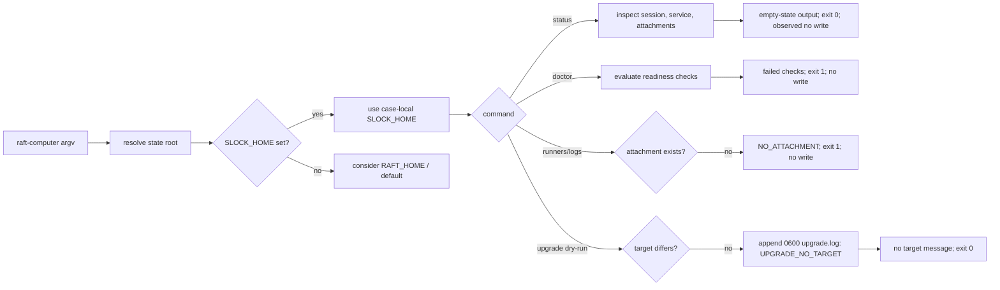

# RAFT Computer CLI 动态研究报告

> 日期：2026-08-10
> 目标：本机 `/Users/ancienttwo/.local/bin/raft-computer`
> 版本：`1.0.15`
> 结论：**PARTIAL** — 已真实执行并验证未登录、未 attach、未启动 daemon 时的 CLI 行为；认证、远端控制面、后台 service、agent runtime 与真实升级仍未验证。

> BYOK canonical/proposal 的下游裁定与修正结果见 [RAFT 新证据对 BYOK 架构的影响报告](./2026-08-10_raft-evidence-impact-on-byok-architecture.md)。

## 1. 执行摘要

本轮把既有[静态架构参考](./raft-architecture-reference.md)中的“未执行任何 RAFT 二进制”边界向前推进了一步：真实运行了 `raft-computer` 的版本、帮助、`status`、`doctor`、`channel show`、`runners list`、`logs` 与同版本 `upgrade --dry-run`。所有运行都使用 case-local `SLOCK_HOME`/`RAFT_HOME`；需要观察运行态的命令额外由 macOS `sandbox-exec` 禁止网络。

动态结果确认了四件事：

1. 本机目标确为 `raft-computer 1.0.15` 的 arm64 Mach-O SEA，大小 `150,920,336` bytes，SHA-256 为 `87f298144f1dc13393af635d57dad15345a4b31cac032524bf3e9fec965bb51b`，Developer ID 签名在磁盘校验通过。
2. 空状态的 `status` 是观察命令：未登录、service 停止、无 attachment 仍返回 `0`，且不创建状态文件；`doctor` 才是 health gate，在相同状态返回 `1`。
3. `runners list` 与 `logs` 在无 attachment 时以 `NO_ATTACHMENT` fail-closed，返回 `1`，并明确声明没有修改本地状态。
4. `upgrade --dry-run --target-version 1.0.15` 对 shell 返回成功并输出“无升级目标”，但仍写入 `0600` 的 `upgrade.log`，其中 `outcome="err"`、`errorCode="UPGRADE_NO_TARGET"`。这是已观察到的双层语义，不足以单独判定为漏洞。

另有一项静态/动态对位结果：在 2026-08-10 的捕获时点，当前安装 binary 与当时存在的 `/tmp/raft-probe/sea/rc.bin` SHA-256 完全相同，因此该次捕获可用匹配 bundle 做窄范围 control-flow 校正。校正发现现有 RAFT 文档有四处实质归因错误：board timing tuple 实际锚在 agent bridge、task create 实有 `--assignee`、五级 activity 词汇实属 RAFT bundle、`status` 在 stale-upgrade 条件下可能写状态。临时 bundle 现已不存在；E-008 是 hash-bound historical observation，不是 fresh clone 可独立重放的证据。

## 2. Scope 与方法

- Scope 契约：[clone-visible evidence appendix](./evidence/2026-08-10_raft-cli-dynamic-evidence.md#scope)
- Timeline：[clone-visible evidence appendix](./evidence/2026-08-10_raft-cli-dynamic-evidence.md#timeline)
- Work items：[clone-visible evidence appendix](./evidence/2026-08-10_raft-cli-dynamic-evidence.md#work-items)
- 网络边界：`sandbox-exec` 使用 `(deny network*)`；未登录、未 attach、未启动或安装 service、未 rollback。
- 状态边界：未读取真实 `~/.slock/`；全部状态指向 `work/20260810-raft-cli-dynamic/` 下的隔离目录。
- 证据边界：动态证据只证明本报告执行过的 CLI 分支，不把静态 control flow 自动升级为运行时事实。

## 3. P1：系统地图

本轮真实边界只有一个 150 MB 本地二进制及其 CLI-facing 路径：

| 组件 | 本轮角色 | Authority / 证据 | 本轮状态 |
|---|---|---|---|
| `raft-computer` Mach-O | 人面向 control-plane CLI | 实际二进制、digest、签名、命令输出；hash 等于 archived `rc.bin` | 已执行 |
| Commander 命令面 | 参数解析与 subcommand dispatch | `--help` / subcommand `--help` | 已执行 |
| `SLOCK_HOME` 状态树 | session、service、attachment、upgrade audit | case-local filesystem readback | 已执行 |
| RAFT API / OAuth | login、attach、server authority | 远端系统 | 未执行 |
| background service / daemon core | service、runtime、agent 进程 | 既有静态参考 §5–§8 | 未执行 |
| updater 下载与 swap | manifest、下载、替换、rollback | 既有静态参考 §7 | 仅同版本 dry-run；未下载/替换 |

强依赖是 CLI 对本地状态根和状态文件的读取；远端 API、daemon 与 runtime 在空状态分支上均未进入。弱依赖是人类可读 help/error 文案，它能说明公开命令契约，但不能替代 server-side enforcement 或内部实现证据。

规模信号：既有 RAFT 静态参考为 `1,865` 行；canonical SDK architecture 与 RAFT-aligned sprint 合计另有 `3,367` 行。本报告只补动态 CLI 证据，不重写那三份 authority，也不把 RAFT 产品边界搬进 BYOK SDK。

## 4. P2：具体调用路径



一条实走路径是：shell 提供 `argv` 与两个 state-root env → computer CLI 选择 `SLOCK_HOME` → `status` 读取本轮全新空状态 → 输出 `Logged in: no`、`Service: stopped`、`Attachments: none` → 进程返回 `0` → filesystem readback 仍为空。同步边界在单个 CLI 进程内；本轮没有进入 network 或 background service 的 async 边界。

“本轮空状态没有写入”不能提升为“`status` 天生只读”。hash-matched bundle 的 `program3 status` 会先调用 `reconcileStalePendingUpgrade()`；当 success receipt、live service attestation、version evidence 与 managed runners 都收敛时，该函数会删除 settled status/pending marker。也就是说，`status` 是 observation-facing command，但含一个有条件的恢复性 mutation 分支，本轮没有构造该前置状态。

异常路径同样实走：`runners list`/`logs` 在 attachment gate 失败后返回结构化错误代号 `NO_ATTACHMENT` 和 exit `1`。`doctor` 将未登录与无 attachment 计为失败，但把 service stopped 视为可接受检查项。具体设计压力点是：`status` 没有 JSON 输出，fleet automation 只能依赖 exit code 的粗粒度语义或解析人类文本。

## 5. P3：设计判断

当前形状很可能刻意区分“面向观察”与“验收”：

- `status` 描述事实，所以系统未就绪也返回成功；但它会顺手 reconcile stale upgrade marker，不能作为纯只读 API；
- `doctor` 表达健康闸，所以缺 session/attachment 返回失败；
- attachment-scoped 操作不猜默认 server，也不制造空结果，而是 `NO_ATTACHMENT` fail-closed；
- `channel show` 在无持久化文件时直接报告声明式默认值 `latest`，且不落盘。

需要保留的 invariant 是：未认证/未 attach 时不得启动或伪造远端能力，本地观察命令也不应暗中改变 attachment/service 状态。本轮结果满足这条 invariant。

`upgrade --dry-run` 的外层 exit `0` 与审计层 `outcome="err"` 是非显然取舍：对 operator，它把“已在目标版本”视为成功 no-op；对 audit schema，它把“没有可执行 target”记为错误码。最小改进不是强行统一语义，而是先公开定义这两个 authority 的用途；否则 CI、审计分析和 shell automation 会对同一次操作得出相反结论。

在 10x fleet automation 下，最先暴露的不是本地读取性能，而是 contract surface：`status` 只有人类文本、无 `--json`，调用方会开始维护脆弱 parser。此判断只针对 automation ergonomics，未做 fleet load test。

## 6. Evidence

| ID | 观察 | Source / 复现 | Hash |
|---|---|---|---|
| E-001 | arm64 Mach-O、大小、SHA-256、Developer ID 签名有效 | [E-001](./evidence/2026-08-10_raft-cli-dynamic-evidence.md#e-001) | binary SHA-256 `87f298...51b` |
| E-002 | `1.0.15` 与 root command surface | [E-002](./evidence/2026-08-10_raft-cli-dynamic-evidence.md#e-002) | n/a |
| E-003 | 空状态 `status` exit `0` 且无写入 | [E-003](./evidence/2026-08-10_raft-cli-dynamic-evidence.md#e-003) | n/a |
| E-004 | 无 attachment 的 runners/logs exit `1` 且无写入 | [E-004](./evidence/2026-08-10_raft-cli-dynamic-evidence.md#e-004) | n/a |
| E-005 | computer 层 `SLOCK_HOME` precedence；doctor exit `1` | [E-005](./evidence/2026-08-10_raft-cli-dynamic-evidence.md#e-005) | n/a |
| E-006 | dry-run 写 `0600 upgrade.log`，外层成功、内层 err | [E-006](./evidence/2026-08-10_raft-cli-dynamic-evidence.md#e-006) | artifact SHA-256 `e9265f...7070` |
| E-007 | `status` public options 只有 `--help` | [E-007](./evidence/2026-08-10_raft-cli-dynamic-evidence.md#e-007) | n/a |
| E-008 | 捕获时 binary 与 rc.bin 同 hash；matched bundle 暴露文档归因冲突 | [E-008](./evidence/2026-08-10_raft-cli-dynamic-evidence.md#e-008) | bundle SHA-256 `18c3eb...609` |

## 7. Findings

### F-001：本机 RAFT Computer 1.0.15 身份可复核

- severity: `n/a_re`
- category: `reverse_algo`
- status: `validated`
- evidence_ids: `[E-001, E-002]`
- location: `/Users/ancienttwo/.local/bin/raft-computer`
- impact: 后续动态结论可绑定到一个具体 hash，不与 npm `0.0.70` 或其他 CDN build 混淆。
- confidence: `high`
- remediation: n/a

### F-002：本轮空状态下观察命令与健康门闩语义分离

- severity: `info`
- category: `design`
- status: `validated`
- evidence_ids: `[E-003, E-004, E-005]`
- location: `status` / `doctor` / `runners list` / `logs`
- impact: automation 不能把 `status exit=0` 解释为 ready；readiness 应以 `doctor` 或更明确的 authority 判定。空状态无写入也不证明 status 对所有状态只读。
- confidence: `high`
- remediation: 运维文档明确 exit-code contract；调用方不要从 status success 推断登录、service 或 attachment ready。

### F-003：computer CLI 动态确认 `SLOCK_HOME` 优先于 `RAFT_HOME`

- severity: `info`
- category: `design`
- status: `validated`
- evidence_ids: `[E-005]`
- location: computer-layer state-root resolution
- impact: 同时设置两个变量时，本命令面选 `SLOCK_HOME`。这只验证 computer CLI，不能证明 agent CLI 与 daemon 层一致。
- confidence: `high`
- remediation: n/a；跨层一致性仍以静态报告 §17 #5 为待独立动态验证项。

### F-004：同版本 upgrade dry-run 存在 shell/audit 双语义

- severity: `low`
- category: `design`
- status: `candidate`
- evidence_ids: `[E-006]`
- location: `upgrade --dry-run --target-version 1.0.15` / `computer/upgrade.log`
- impact: shell automation 看到成功，审计消费者看到 `err/UPGRADE_NO_TARGET`；若二者被用作相同 gate，会产生不一致的运营判断。
- confidence: `medium`
- remediation: 定义 no-target 是 successful no-op 还是 error，并让 exit code、文案、审计 outcome 对该定义可解释；在没有 vendor contract 前不把它定性为漏洞。

### F-005：公开 status surface 不适合作为规模化机器接口

- severity: `low`
- category: `design`
- status: `validated`
- evidence_ids: `[E-003, E-007]`
- location: `raft-computer status --help`
- impact: 无 JSON/structured output；fleet tooling 只能解析人类文本或退化为单一 exit code。
- confidence: `high`
- remediation: 增加版本化 `--json` schema，分别暴露 logged-in、service、attachment、upgrade-in-flight 与 live-version evidence。

### F-006：现有 RAFT 文档包含会污染架构引用的静态归因错误

- severity: `medium`
- category: `design`
- status: `validated`
- evidence_ids: `[E-008]`
- location: `ARCHITECTURE-PROPOSAL-byok-platform.md:256-269,832-847`; `docs/researches/raft-architecture-reference.md:1042-1084`; `docs/architecture/sdk-architecture.md:1624-1627`
- impact: 四类错误会把 bridge 参数误当 board production tuning、把实际 assignee 能力说成不存在、把 RAFT activity 词汇误归为 BYOK、把 status 空状态观察误推广为纯只读；它们会改变后续 architecture decision 的 evidence strength。
- confidence: `high`
- repro_steps:
  1. 先读取 [E-008 retained evidence](./evidence/2026-08-10_raft-cli-dynamic-evidence.md#e-008) 的捕获时 hash 与归因；仓库不声称临时 `/tmp/raft-probe` 仍存在。
  2. 若取得相同 hash、且获授权分析的 binary/bundle，再独立复核 `agentBridgeCommand`、`taskCreateCommand`、`AGENT_ACTIVITIES`、`program3 status` 与 `reconcileStalePendingUpgrade`。
  3. 对照上述三份文档的行级归因。
- remediation: 分别更正来源与证据等级；board/server enforcement 继续标 `[unverified]`，不得用 bridge/client bundle 代替 server 证明。

## 8. Path

### P-001：未认证 CLI 观察路径

- path_type: `callflow`
- start: operator invokes local `raft-computer`
- goal: obtain local readiness facts without reading real user state or contacting RAFT cloud
- steps:
  1. 绑定 case-local `SLOCK_HOME`/`RAFT_HOME` 并禁止网络 — evidence: E-003 — finding: F-002
  2. `status` 读取空 session/service/attachment 状态并 exit `0` — evidence: E-003 — finding: F-002
  3. `doctor` 对同一状态执行 readiness checks 并 exit `1` — evidence: E-005 — finding: F-002
  4. attachment-scoped 命令在 gate 处返回 `NO_ATTACHMENT` — evidence: E-004 — finding: F-002
  5. dry-run 的 no-target 分支追加审计记录但不下载/替换 — evidence: E-006 — finding: F-004
  6. 用相同 binary hash 的 bundle 限定静态解释并识别归因冲突 — evidence: E-008 — finding: F-006
- residual_risks: 未观察 authenticated session、server response、background service、runtime spawn、credential handling、真实 updater 下载/swap/rollback。

## 9. 与既有静态报告的关系

本报告确认了既有静态参考中三项事实的运行面：`1.0.15` command surface、computer 层 state-root precedence、无 attachment 的 fail-closed gate。它没有验证下列静态结论：三角色 argv dispatch、daemon in-process 加载、WebSocket 重连、credential mint、runtime driver、upgrade package trust、alpha channel、staging cleanup、hidden commands 或 server-side board semantics。

捕获时 binary 与 archived `rc.bin` hash 相同，允许把当次相同 payload 的静态 symbol 作为窄范围 historical correction，但不能把 client bundle 提升为 server proof，也不能声称 fresh clone 可独立重放 E-008。校正矩阵如下：

| 现有陈述 | hash-matched evidence | 裁定 |
|---|---|---|
| `5s/120s/3s/limit 50` 是 board/SSE 的生产实测参数 | tuple 位于 `agentBridgeCommand` wake-hint bridge handler（bundle `649260-649264`） | **归因不成立**；只能称 bridge 静态默认值 |
| task CLI 没有 assignee flag，agent 不能替别人指派 | `taskCreateCommand` 注册 `--assignee <handle>`，owner/admin 可 reserve 给他人（bundle `651053-651096`） | **事实错误** |
| `online/thinking/working/error/offline` 不是 RAFT 词汇 | bundle 明确定义 `AGENT_ACTIVITIES` 为这五值（bundle `18765`、`648306`） | **事实错误**；BYOK 的 `presence` 抽象命名仍可自有 |
| `status` 可按命令类别视为无 mutation | status 先调用 stale-upgrade reconciliation，满足条件会清 marker（bundle `692946-692952`、`54979-55021`） | **仅本轮空状态无写入** |
| “CLI 全命令面实测，start 被 attach-gate 拒绝、零残留”可作本轮证据 | 现有静态参考的方法段明确原分析未执行 binary；本轮也未执行 `start` | **证据 provenance 冲突；NOT EXERCISED** |

Developer ID 签名“当前文件在磁盘上有效”也不等于“应用内 updater 验证了下载物签名/公证”。`spctl --assess --type execute` 对该 standalone CLI 返回 `rejected (the code is valid but does not seem to be an app)`；因此本轮不宣称 Gatekeeper/notarization acceptance，只保留 `codesign --verify` 的窄结论。

## 10. 可复现命令

以下命令只重放 E-001 至 E-007，前提是同一可执行文件仍由 operator 合法持有。E-008 的临时 extracted bundle 未纳入仓库，不能从 fresh clone 重放；其 provenance 边界见 clone-visible evidence appendix。

```bash
RAFT_CASE=/Users/ancienttwo/Projects/byok-sdk/work/20260810-raft-cli-dynamic
RAFT_BIN=/Users/ancienttwo/.local/bin/raft-computer

shasum -a 256 "$RAFT_BIN"
codesign --verify --deep --strict --verbose=2 "$RAFT_BIN"
SLOCK_HOME="$RAFT_CASE/sandbox-home" RAFT_HOME="$RAFT_CASE/sandbox-home" "$RAFT_BIN" --version
SLOCK_HOME="$RAFT_CASE/sandbox-home" RAFT_HOME="$RAFT_CASE/sandbox-home" sandbox-exec -p '(version 1)(allow default)(deny network*)' "$RAFT_BIN" status
SLOCK_HOME="$RAFT_CASE/sandbox-home" RAFT_HOME="$RAFT_CASE/sandbox-home" sandbox-exec -p '(version 1)(allow default)(deny network*)' "$RAFT_BIN" doctor
SLOCK_HOME="$RAFT_CASE/sandbox-home" RAFT_HOME="$RAFT_CASE/sandbox-home" sandbox-exec -p '(version 1)(allow default)(deny network*)' "$RAFT_BIN" upgrade --dry-run --target-version 1.0.15
```

## 11. 未验证边界

- OAuth device login、token refresh 与 logout；
- attach/setup 对真实 RAFT server 的权限与错误路径；
- start/stop/restart、launchd supervisor、daemon/runner lifecycle；
- agent-facing `raft` CLI 与 `raft-daemon` 的动态 argv dispatch；
- 真实 upgrade manifest、下载、hash/signature、公证、swap、rollback；
- alpha channel 与多 attachment/multi-runner 行为；
- 任意生产或用户真实 `~/.slock/` 状态。

这些未验证项不影响本报告对本机 CLI 空状态分支的结论，但阻止把 verdict 提升为完整动态架构验证。
