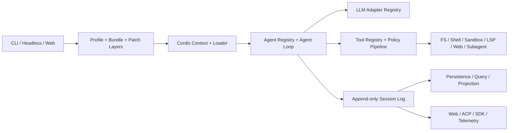

# DeepSeek Harness 架构与 byok-sdk 萃取评估

> 2026-08-13。外部产品源码研究，评估 DeepSeek Harness 中哪些运行时机制值得萃取进 byok-sdk。本文不是 byok-sdk 架构文档，不修改 `docs/architecture/`、`docs/spec.md`、active plan、contract 或 todo 的既有结论。

## 1. 方法、基线与证据等级

研究对象为 [`deepseek-ai/deepseek-harness`](https://github.com/deepseek-ai/deepseek-harness)，本地只读 clone 位于 `~/Projects/deepseek-harness`，基线 commit 为 `47f943859bef60e4160492346772ded9b24f765a`（2026-08-13，`Merge pull request #2519 from deepseek-harness/feat/npm-public`）。研究时 worktree clean，仓库无 `.codegraph/`，因此通过 `rg`、`nl`、manifest、生成文档和已有测试源码做静态取证；未安装依赖、未执行被研究方二进制，也未运行其 `typecheck/test/build`。

静态规模快照：49 个 package group、226 个 `packages/*/*/package.json`、1185 个 `packages/**/src/*.ts`、684 个匹配测试命名的 TypeScript 文件。数字只用于判断组织成本，不作为质量指标。

证据等级沿用仓库既有研究约定：未标注即 `[verified]`（有源码或生成文档位置可覆核）；`[inferred]` 为基于已验证结构作出的架构判断；`[unverified]` 表示本轮未通过执行验证。文中的源码路径均相对 `~/Projects/deepseek-harness`。

byok-sdk 对照不变量：

- Pi 是 BYOK lane 的 provider registry、transport 与 agent-loop 唯一权威；byok-sdk 只选择并投影 provider/model，不重建第二套模型路由或 turn loop（`docs/spec.md:17-20`）。
- vendor CLI 持有 subscription lane 的认证；BYOK lane 的 credential-custody launcher 隔离凭证，dispatch 进程不能获得通用凭证读取能力（`docs/spec.md:9-20`）。
- capability 是显式声明，不通过 endpoint probing、状态码解释或 semantic fallback 推断（`docs/spec.md:62-65`）。
- 当前 presence producer + hosted capability discovery 已在独立 contract worktree 执行中，本研究不扩大其 scope，也不重复实现。

## 2. 系统边界与可比面

DeepSeek Harness 是完整 agent runtime：它拥有 agent loop、LLM adapter registry、tool registry、prompt assembly、session persistence、Web/ACP/SDK surface 和 subagent runtime。byok-sdk 是 SaaS 与用户本机 coding agent 之间的 dispatch/credential/capability SDK，不拥有 vendor agent loop。

因此两者的可比面不是“把 DeepSeek agent runtime 搬进 byok”，而是四类跨 runtime contract：

1. Provider capability declaration 与 admission；
2. 外部 runtime run 的准备、发布、取消和 quiescent disposal；
3. 运行时事件、durable receipt 与 projection 的职责划分；
4. 真实产品入口、built artifact 和 process-tree lifecycle 的验证方法。

DeepSeek-specific LLM wire、Cordis plugin Loader、SessionEvent durable format、动态 runtime self-modification 不在可萃取边界内。

## 3. P1：架构图谱

DeepSeek Harness 的基础是 vendored Cordis：共享 `Context` 持有 service，插件通过 service injection 表达依赖，通过 typed event 协作，通过 `ctx.effect()` / `ctx.on()` 注册可逆副作用。架构宣称“everything is a plugin”，包括 model adapter、tool registry、session log 和 agent loop（`docs/architecture.md:9-13`；`docs/cordis-primer.md:7-13`）。



### 3.1 启动与组合平面

| 模块 | 职责 | 关键证据 |
|---|---|---|
| `apps/cli` | 解析 launcher 自己拥有的 profile/patch flags，将余下 argv 原样交给被加载 app | `apps/cli/src/bin.ts:27-48`, `apps/cli/src/args.ts:1-15` |
| `packages/boot/app-boot` | 创建 Context、安装 Loader、挂载根 Include、等待 entry activation、失败时回收 partial tree | `packages/boot/app-boot/src/index.ts:727-801` |
| `packages/bundle/*` | 以 npm package + `dsh.bundle.patch` 分发可 patch 的 composition rows | `docs/architecture.md:15-37`, `packages/bundle/base/package.json:36-39` |
| `packages/preset/*` | 在单 Agent scope 下组合 persona、tools、compaction、workflow 等能力 | `apps/cli/config/agent-presets/code/agent.cordis.yml:13-25` |

Profile composition 的确定顺序是：

```text
ordered bundle layers
→ profile cordis.patch.yml
→ home cordis.patch.yml
→ --patch overlays
→ launcher-derived patches
```

`runProfile()` 在任何 config-tree entry mount 前注入 immutable launch environment、cmdline snapshot 与 bounded `appExit`；boot 与 live reload 使用同一 patch composition（`apps/cli/src/profile-boot.ts:207-299`）。配置 dump 也复用 Include 的 `applyEntryPatches`，避免“实际启动语义”和“诊断显示语义”形成双权威（`packages/boot/app-boot/src/index.ts:348-441`）。

### 3.2 核心产品脊柱

| Service | 所有权 | `ctx` key |
|---|---|---|
| Session | append-only events、surface projection、in-memory store | `ctx.sessions` |
| System Prompt | prompt sections、variables、tool schema assembly | `ctx.systemPrompt` |
| Tools | scoped registry、pre/execute/post pipeline、parallel scheduling | `ctx.tools` |
| Agent | live Agent registry、inbox 与 `agent/*` events | `ctx.agents` |
| Agent Loop | 默认 turn/step driver；本身可替换 | `ctx.agentLoop` |
| LLM | provider-neutral messages、stream vocabulary、adapter registry | `ctx.llm` |

来源：`docs/architecture.md:39-51`。base bundle 把这些 service 与默认 Provider 装配起来，但 row order 不承担 load order；service injection 才是 activation dependency（`packages/bundle/base/cordis.patch.yml:15-24,58-67,420-451`）。

### 3.3 Capability seam

DeepSeek 把一个完整 capability 定义为三角色：

```text
Service Definition → Service Provider → Consumer
```

例如 `subagent` Definition 声明 provider registry 与 request/result vocabulary；`subagent-codex`、`subagent-claude-code`、in-process/ACP/SDK packages 是 Providers；`tool-subagent` 和 control/report tools 是 model-facing Consumers（`packages/subagent/README.md:5-21`）。Extension plugins 依赖 Definition，不依赖具体 Provider（`packages/README.md:63-67`）。

### 3.4 Durable 与 live 两类事件

- `SessionEvent` 是 durable fact，必须能 replay；
- `agent/*` 是 live Agent lifecycle/interception；
- `tools/*`、`fs/*` 等 capability events 承载策略与 adapter 拦截；
- `emit`、`waterfall`、`parallel`、`serial` 的 dispatch mode 是 event public contract，而不是调用点细节（`docs/cordis-primer.md:15-34`）。

生成的 `docs/event-producer-consumer.md` 从 TypeScript Program 解析 declaration、producer 和 listener，拒绝“声明了事件但没有 dispatcher”的漂移（`docs/event-producer-consumer.md:8-75`；`scripts/gen-doc-graphs.ts:1208-1210`）。

## 4. P2：真实 headless 调用链

以 `dsh --profile headless "<task>"` 为 concrete trace：

1. `apps/cli/src/bin.ts:27-37` 解析 invocation，加载 environment snapshot，调用 `runProfile()`。
2. `apps/cli/src/profile-boot.ts:207-259` 解析 profile/bundle/user/overlay patches，建立 process shutdown owner，并调用 `boot()`。
3. `packages/boot/app-boot/src/index.ts:757-801` 创建 Cordis Context，安装 Loader，挂载 Include，等待全部 entries settle，并审计 enabled entry activation；失败会先 dispose partial tree 再抛出原始 activation cause。
4. `packages/bundle/headless/src/startup.ts:43-56` 解析 task positional 并发布 `headlessStartup` service；缺 task 时不发布半成品 service。
5. `packages/bundle/headless/src/index.ts:96-149` 等待完整 Loader settle，读取 default model，调用 `ctx.agents.create()`，提交 task，等待 Agent idle，flush Session，最后从 durable events 选择 final assistant text 和 turn reason。
6. `packages/core/agent/src/index.ts:396-414` 将 create 转发给当前 AgentFactory；`packages/core/agent-loop/src/index.ts:548-570,606-645` 创建 Session 与 `ReactLoopAgent`，setup 成功后才发布 Session/Agent。
7. `packages/core/agent-loop/src/agent.ts:225-243` 从 inbox claim input，组装 prompt/context，并运行 `agent/pre-step` waterfall。
8. `packages/core/agent-loop/src/agent.ts:245-329` 写入 `turn/start`、`step/start`、`user/message`；无论完成、取消或失败，最终都记录结构化 `turn/end`。
9. `packages/core/agent-loop/src/agent.ts:407-495` 从 log-derived history 构造 request，通过 `ctx.llm.prepareCall()` 固定 adapter registration、resolved config 与 retry policy，并记录 request header/context。
10. `packages/core/agent-loop/src/agent.ts:332-400` 流式消费模型输出：每个 raw chunk 写 `assistant/chunk`，组装后写 `assistant/message`；tool calls 进入 bounded scheduler。
11. `packages/core/agent-loop/src/tool-calls.ts:150-245,261-288` 先按模型顺序记录 `tool/call`，只让 tool body 并发，结果仍按原顺序 commit 为 `tool/result`；取消时为未启动 call 写结构化 aborted result。
12. `packages/core/tools/src/index.ts:1453-1506` 执行 `tools/pre-execute`、approval、monotonic guard，再决定 dispatch；deny、abort 和 invalid args 都成为显式 result，不绕过 executor enforcement。
13. `packages/core/session/src/index.ts:569-655` 在 append 点完成 lossless JSON snapshot、surface validation、deep freeze，commit 后才广播 `session/event`；`deriveMessages()` 只从同一 surface projection 生成下一次模型 history（`:708-747`）。

这个 trace 的核心不变量是 **model-visible means logged**：凡进入模型请求的内容必须能从 Session log 重建；UI、persistence、telemetry、fork/resume 和 transcript 不各自维护第二份 conversation authority（`docs/architecture.md:92-102`）。

## 5. P3：设计判断

DeepSeek 的结构服务于“一个进程内可动态组合、可 HMR、拥有完整 turn loop 的 agent platform”。byok-sdk 的结构服务于“跨 SaaS、本机 daemon 与 vendor CLI 的稳定 dispatch/credential/capability protocol”。两者压力点不同，因此应萃取 lifecycle contract 和 verification discipline，不应萃取 runtime framework。

在 10x 规模下，DeepSeek 最先承压的不是单次模型调用，而是 package/composition coordination：目前已有 226 个 packages、base bundle 长 patch、跨 package event/capability graph、source/artifact compiler faces、生成 catalog 和大量 freshness gate。Cordis effect/fiber 把同进程动态卸载的资源正确性做得很强，但把这套复杂度引入没有同等 HMR/plugin 需求的 byok-sdk，会先增加发布图、配置权威和测试矩阵，而不是删除当前复杂度。

byok-sdk 当前真实压力点是 runtime/provider capability 能否在 spawn 前被确定性判断、一次 dispatch 的身份/config 是否冻结、取消是否到达 whole-process quiescence、结果是否绑定同一 task/authority subject。DeepSeek 的 subagent 与 prepared-call contract 正好覆盖这些点。

## 6. 可萃取优先级

### 6.1 P0：Provider capability declaration + fail-closed admission

DeepSeek `SubagentProvider` 的关键不是接口名字，而是检查时点和职责边界：

- 多个 named Provider 在同一个 registry 共存；
- static `capabilities` 描述 one-shot start-time feature；
- method presence（如 `prepareContinuable`）表达另一类能力；
- `SubagentRuntime.start()` 在调用 Provider、预留 child resource 之前检查 capability；
- 缺 Provider 或缺能力抛 typed error，不切换 Provider、不忽略 option、不降级运行。

证据：`packages/subagent/subagent/src/types.ts:75-91,277-323`；`packages/subagent/subagent/src/index.ts:404-445,480-495`。

**萃取判断：做为 runtime/device capability contract 的设计模板，不复制类型本身。** byok-sdk 已有 capability declaration 与 hosted discovery；后续 runtime adapter contract 应把“支持 structured result/cancellation/continuation/native sandbox/tool guard”等事实变成 bounded descriptor，并在 offer/dispatch admission 时一次性验证。现有 presence slice 只处理已批准的 device discovery scope，不应顺手扩成 generic fleet registry。

### 6.2 P0：Prepared run → published handle 的所有权转移

`SubagentProvider.start()` fulfill 前，Provider 拥有进程、wire、临时 thread/session 和全部 partial resource；失败必须清理后 reject，且不得产生 start/end lifecycle pair。fulfill 后所有权转移到 `SubagentRun`：child semantic failure resolve 为 `stopReason`，seam 无法表示的 infrastructure fault 才 reject；调用方最终必须 `dispose()` 并等待 quiescence（`packages/subagent/subagent/src/types.ts:240-275,297-323`）。

Codex Provider 的 concrete path 是 `initialize → initialized → thread/start(ephemeral) → turn/start → turn/completed`；publication 前失败关闭 wire、结束 whole process tree，publication 后 cancellation 与 dispose 分开记账（`packages/subagent/subagent-codex/README.md:5-19`）。Claude Provider 同样把 SDK graceful close 与 subprocess tree ownership 分开（`packages/subagent/subagent-claude-code/README.md:5-23`）。

**萃取判断：高优先。** byok runtime adapter 应显式区分：

```text
prepare/config validation
→ acquire process/wire
→ publish RunHandle
→ semantic settlement
→ dispose and await whole-tree quiescence
```

`prepare()` 失败不得留下 run id 或“半启动” presence；published run 的 task failure、runtime failure 和 teardown failure必须是正交结果，不能用一个 success/error 布尔吞并。

### 6.3 P0：Per-operation immutable snapshot

DeepSeek LLM runtime 在 `prepareCall()` 后固定本次 adapter registration、resolved model metadata 和 retry policy；DeepSeek adapter 又在一次 stream 起点固定 endpoint config 与 credential，确保热更新不能让同一请求混用不同 generation（`packages/llm/llm/src/index.ts:779-813,843-927`；`packages/llm/llm-deepseek/src/adapter.ts:214-233`）。

**萃取判断：只萃取 snapshot invariant。** byok 每次 dispatch 应冻结：

```text
runtime + lane + provider + model
+ advertised capabilities/toolsets
+ authority/progress revision
+ workspace/session/lease identity
```

整个 run 只消费这份 manifest；配置变化只影响下一次 dispatch。Pi 仍是模型 catalog、transport 与 loop authority，byok 不复制 DeepSeek 的 LLM registry。

### 6.4 P1：事件作为 diagnostics，typed receipt 作为 durable evidence

DeepSeek 的 Session log 是 conversation runtime authority；`deriveMessages()`、UI、telemetry、persistence 都是 projection。这个模式证明“单一事件源 + deterministic projection”可消除多表意状态，但 byok 不能把 runtime event stream 升格为 workflow authority。

**萃取判断：有边界地采用。** `EffectiveStateV1`、task protocol 和既有 store 继续是 byok/repo-harness authority；normalized runtime events 只做 diagnostics、恢复输入和观测。长期 durable 输出应是带 subject/revision 的 typed artifacts，例如 run/verification/acceptance receipt，而不是从日志文本反推完成状态。

生成 producer/consumer matrix 的做法值得用于检查 normalized event declaration 与 adapter mapping 是否漂移，但生成器应读取唯一的 event schema，不能另建 shadow parser。

### 6.5 P1：Real-composition keyless smoke 与 built-artifact test

DeepSeek package 规则要求 product-visible plugin 通过真实 Loader/config/app 或 process 入口测试，手工 `ctx.plugin(...)` 单测不够（`packages/AGENTS.md:5-18`；`docs/testing.md:31-35`）。现有例子包括：

- Loader + real bash round-trip + JSONL persistence：`examples/headless-agent/tests/keyless-smoke.e2e.ts:15-48`；
- real DeepSeek + real bash：`examples/headless-agent/tests/full-loop.e2e.ts:28-48`；
- dynamic settings/credentials 下一请求切换 endpoint/key：`packages/llm/llm-deepseek/tests/loader-composition.spec.ts:110-177`；
- Codex/Claude Provider pinned product protocol evidence：两者 README 的 `Product compatibility and evidence`。

**萃取判断：高价值验证纪律。** byok adapter 测试至少应证明真实 built entry、handshake、capability rejection before spawn、cancellation 后 process-tree 退出、final result selection、credential boundary 和 pinned upstream version。mock transport tests 保留，但不能替代 assembled product path。

### 6.6 P2：Profile/bundle layering 与 isolated agent scope

ordered patches、可 dump composition、来源标注、同一 patch algorithm、per-agent isolated service realm 都是成熟做法（`packages/boot/app-boot/src/index.ts:348-441`；`apps/cli/config/agent-presets/code/agent.cordis.yml:13-25`）。

**萃取判断：只留参考。** byok 目前没有 same-process 第三方 plugin/HMR 生态，也不拥有 agent tool composition；引入 Cordis/`cordis.yml`/`!!js` 会新建配置权威。只有未来出现至少两个独立部署方需要组合同一组 runtime components、且现有显式 manifest 已出现重复 authority 时，才值得重新评估一个更窄的 profile layer。

## 7. 明确不复制

| 机制 | 否决理由 |
|---|---|
| Cordis vendoring与“everything is a plugin” | byok 不拥有 same-process agent platform；引入 226-package 级组织与 HMR lifecycle 不能删除当前复杂度 |
| DeepSeek LLM wire | `/chat/completions`、SSE `[DONE]`、`reasoning_content`、model ids、`x-deepseek-*` headers 和 HTTP error mapping 都是 Provider-specific |
| DSH SessionEvent durable format | `surfaceOp`、`sourceEventSeqs`、fork/resume、format version 是其 conversation product contract，不是跨 vendor run wire |
| 动态 self-modification | `tool-cordis` 允许模型检查并挂载动态 package，会扩大代码执行与 authority 边界；不属于 byok dispatch SDK |
| runtime-owned credentials facade | byok 的 credential-custody launcher 与 subscription-native auth 是既定安全边界；不能让插件取得通用模型凭证 |
| DeepSeek adapter 的 last-good config | `packages/llm/llm-deepseek/src/index.ts:200-221` 在动态配置非法时继续服务旧配置；与 byok fail-closed/no semantic fallback 原则冲突 |
| Codex final phase compatibility fallback | `packages/subagent/subagent-codex/README.md:9-15` 在没有 `final_answer` 时接受 `phase: null`；byok 的 pinned protocol contract 不应维持并行旧语义 |
| coding-agent tools/sandbox 默认栈 | filesystem observation、bash、approval、sandbox、LSP 是产品部署政策，不能成为通用 runtime adapter 隐式默认 |

## 8. 结论

DeepSeek Harness 最值得萃取的是 contract，而不是 framework：

1. Provider 明示 capabilities，admission 在资源预留前 fail closed；
2. setup 期间 Provider 持有资源，publication 后转移到 RunHandle；
3. semantic result、infrastructure failure、teardown failure 正交；
4. dispose 必须等待 whole runtime quiescence；
5. 每个 run 固定 immutable operation manifest；
6. event stream 只做运行事实，durable authority 与 typed receipt 不从文本重建；
7. adapter 必须通过真实 built/product entry 的 keyless composition evidence。

对 byok-sdk 的直接影响是设计审查清单，而不是立即新增 implementation scope。当前 presence producer + hosted capability discovery contract 应继续按原 approved boundary 完成；本研究只要求后续 runtime/provider work 在进入 plan 前核对上述 lifecycle/capability contract，避免把 DeepSeek 的完整 agent runtime 或兼容 fallback 一并带入。

## 9. 研究入口索引

- 总体架构：`~/Projects/deepseek-harness/docs/architecture.md`
- Cordis 语义：`~/Projects/deepseek-harness/docs/cordis-primer.md`
- package 分组：`~/Projects/deepseek-harness/packages/README.md`
- capability graph：`~/Projects/deepseek-harness/docs/capability-seams.md`
- event matrix：`~/Projects/deepseek-harness/docs/event-producer-consumer.md`
- headless concrete trace：`~/Projects/deepseek-harness/apps/cli/src/profile-boot.ts`、`packages/bundle/headless/src/`、`packages/core/agent-loop/src/agent.ts`
- subagent provider contract：`~/Projects/deepseek-harness/packages/subagent/subagent/src/types.ts`
- Codex/Claude external runtime Providers：`~/Projects/deepseek-harness/packages/subagent/subagent-codex/`、`packages/subagent/subagent-claude-code/`
- testing policy：`~/Projects/deepseek-harness/docs/testing.md`
