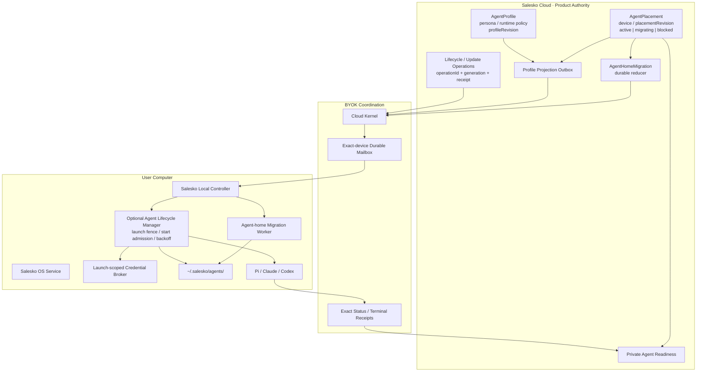

# 结论

我把你说的 `users/.salesko/` 按当前 `salesko-new` 实现中的用户状态根 `~/.salesko/` 来分析；这不是对你本机实际目录内容的读取。

本次固定的代码基线是：

* `byok-sdk@f1eed3d3227c20f057111e27c459d2dda2175879`
* `RAFT-study@1737475a83f36127c668a4853e470530f770b0e8`
* `salesko-new@1ec6ca9c97556b3ec073fa78e22f12ecba817cf0`

我的判断是：

1. **不需要把 `.salesko` 改造成 RAFT，也不需要重构现有单根目录。**
2. Salesko/BYOK 已经吸收了 RAFT 最重要的一部分：Agent-first home、云端 Profile authority、本地只读投影、单写者、凭证不进 Agent home、OS service 托管。
3. Salesko 当前甚至在路径安全、Profile exact projection、可靠 egress 和权限隔离上比 RAFT 静态证据更严格。
4. 真正值得从 RAFT 继续吸收的不是 channel、DM、task board，而是四个基础设施机制：

   * **Profile 与设备 Placement 分离**
   * **durable lifecycle operation + launch generation fence**
   * **跨设备 Agent-home 冷迁移**
   * **更新信任、凭证代理与统一可观测性**
5. 在这些功能之上继续开发之前，上一轮发现的 #135、#136、#137、#138、#139、#141、#142、#143 应先关闭，否则 migration/lifecycle 会建立在仍有歧义的 ack、dedup 和双写边界上。

---

# 一、RAFT 与 Salesko/BYOK 的根本区别

RAFT 的产品原语是一个 Slack-like 多方协作 workspace。Agent 是长期参与者，会进入 channel、thread、DM、task、mention、reminder 等协作结构；它不是简单的 job worker。`raft-architecture-reference.md` 本身也明确裁定：RAFT 与 BYOK 不属于同一类产品，真正可比的是 credential isolation、Agent process management、升级、迁移和 telemetry 等基础设施。

Salesko/BYOK 的原语则是：

```text
Salesko Cloud Product Authority
  ├─ Private Agent Profile
  ├─ Chat / Research / Relationship product semantics
  ├─ exact device + runtime execution binding
  └─ desired projection / task dispatch

BYOK coordination kernel
  ├─ authenticated device
  ├─ durable mailbox
  ├─ task/receipt/approval authority
  └─ exact-device control delivery

User computer
  ├─ resident Salesko daemon
  ├─ canonical Agent home
  ├─ task/turn-scoped runtime process
  └─ device-local credentials and provider sessions
```

因此，**RAFT 是“协作平台中的常驻 Agent”**，而 Salesko 是**“产品云控制面调度用户本地 Personal Agent”**。

| 维度               | RAFT                                            | Salesko / BYOK                                        | 判断                                 |
| ---------------- | ----------------------------------------------- | ----------------------------------------------------- | ---------------------------------- |
| 产品核心             | 多人、多 Agent workspace                            | 一位用户的 Private Agent、Chat、Research                     | 不应复制 RAFT 产品层                      |
| 长期主体             | Agent 是 workspace participant                   | `agentId` 是 Personal Agent 长期身份                       | 已趋同                                |
| 本地持久化单位          | `agents/<agentId>` workspace                    | `~/.salesko/agents/<agentId>` Agent home              | 已趋同，Salesko 更严格                    |
| Runtime          | 中央 AgentProcessManager，可常驻                      | daemon 常驻，runtime 通常按 task/turn 启动                    | 保留 Salesko 默认；可补 lifecycle manager |
| Profile          | remote metadata + launch config + local state分层 | cloud Profile + exact local projection                | Salesko 当前已更完整                     |
| Device placement | Computer/Agent placement 与迁移是一等对象               | `deviceId` 仍嵌在 Private Agent Profile                  | 建议分离                               |
| 跨机迁移             | 有 manifest、transfer、arrival、commit              | 只有本机 root relocation lease 和 re-pair successor rebind | 最大功能缺口                             |
| Credential       | launch-scoped loopback proxy                    | CLI 自有认证、OS credential store、Pi launcher              | 两者可组合，不必替换                         |
| 更新               | service owner、operation、reconciliation 思路较完整    | 本地 swap/rollback 强，但缺独立签名与 crash ledger               | 需要补强                               |
| 可观测性             | launch/process/session trace 较完整                | readiness 很好，跨层 lifecycle trace 较弱                    | 可吸收 RAFT                           |

---

# 二、当前 `.salesko` 已经做对的部分

## 1. 单根状态域是正确的，不应再拆

当前 Salesko 以 `SALESKO_HOME` 为唯一 root，默认是 `~/.salesko`，并从中派生：

```text
~/.salesko/
├── config.json
├── computer/
├── provider-state/
├── runtimes/pi/
├── workspaces/
└── agents/
    └── <agentId>/
```

旧的 `hostStorageRoot`、`workspaceRoot`、`storeDir` 独立配置已被明确拒绝，避免多个长期 authoring authority。

这比 RAFT 历史上的 `.slock`、旧路径、兼容变量并存更健康。**不要为了“像 RAFT”重新拆成 config root、state root、Agent root 三套用户可配置根。**

## 2. Agent home contract 已经比 RAFT 更严格

BYOK 当前明确拥有：

```text
<hostStorageRoot>/agents/<validated-agentId>/
  MEMORY.md
  notes/
  profile.json                 # Salesko product-derived
  .byok/
    agent-home.lease
    agent-home-projection.json
    egress/reliable-v1.jsonl
    messages/outbox-v1.jsonl
    content-read-audit-v1.jsonl
    runtime-sessions/
  ...opaque Agent files
```

SDK 负责 Agent ID 验证、realpath、symlink/traversal 防护、跨 Agent 隔离、初始化、lease、runtime cwd；Salesko 不自行拼接 `agents/<agentId>`。

RAFT 的恢复代码虽然也采用 Agent-first home，但 `RAFT-study` 明确记录了它的 `agentId` 直接 join、browse guard 偏 lexical，且 symlink resistance 没有完整证明。Salesko/BYOK 这一层**不应倒退去模仿 RAFT 的具体目录实现**。

## 3. Profile projection 缺口已经关闭

`RAFT-study` 早期报告基于较旧的 byok-sdk / salesko-new commit，曾指出 Profile 创建后缺少 durable projection command、exact-device materialization 和 acknowledgement。这个结论对当时是成立的，但对当前 `main` 已经过时。

目前 Salesko 已经实现：

* Profile 与 projection outbox 在同一数据库 transaction 中提交；
* deterministic request ID；
* `pending → delivering → synced/failed`；
* `FOR UPDATE SKIP LOCKED` lease；
* exponential retry；
* 重试时 status-first；
* tenant/device/request/AgentRef/revision/hash exact readback；
* 5xx 保持 pending，明确的 control rejection 才 terminal failure。

本地写入也有：

* exact AgentRef 校验；
* projection hash 重算；
* `O_EXCL | O_NOFOLLOW`；
* 0600 临时文件；
* file `fsync`；
* atomic rename；
* directory `fsync`。

所以，**不要再新增一套 Profile polling、editable local profile 或 fake task projection。现有 projection outbox 就是正确 authority。**

## 4. Readiness 模型优于单纯 presence

Salesko 已经没有把 `online` 等同于“可以聊天”，而是把以下事实折叠为一个 admission answer：

* Profile/device binding；
* presence；
* capability compatibility；
* runtime 是否存在和是否认证；
* required toolset 是否已配置；
* bootstrap/resume 所需能力。

这正是正确的 read model：presence 只是 hint，不是执行授权。

RAFT 的 lifecycle convergence 可以补充 operation 层，但不应替代 Salesko 现有 readiness projection。

## 5. 本地更新事务已经相当强

当前 Salesko updater 已有：

* 先确认并停止 service；
* 等待 supervisor/lease 真正 quiescent；
* 校验 installed binary；
* stage 到私有目录；
* 备份 predecessor；
* same-directory atomic rename；
* root-owned privileged boundary；
* swap 后校验；
* service 恢复；
* enrollment identity readback；
* 失败时恢复旧 binary 和 service。

这一部分不是要推翻，而是要补 publisher trust 和 crash recovery ledger。

---

# 三、最重要的结构补足：把 Profile 与 Placement 分开

当前 Private Agent Profile 同时包含：

```text
agentId
profileRevision
name
deviceId
runtimePreference
provider/model metadata
researchPreset
```

任何更新——包括只改变 `deviceId`——都会增加 `profile_revision`。same-machine re-pair 的 successor rebind 也通过同一个 Profile upsert 完成。

这在“一个 tenant、一个 Agent、一个 active computer”的阶段可以工作，但它把三个不同的东西混在一起了：

1. **Agent identity**：稳定 `agentId`
2. **Profile content**：persona、runtime policy、research preset
3. **Placement**：Agent 当前在哪个 device/computer 上运行

问题是：移动电脑会变成一次 Profile 内容升级；即使 persona 完全没变，也会产生新 Profile revision、新 projection hash 和新本地 `profile.json` revision。

## 建议目标模型

```ts
interface PrivateAgentProfile {
  agentId: string;
  profileRevision: string;
  name: string;
  runtimePreference: RuntimePreference;
  researchPreset: string;
  providerSelection?: ProviderSelection;
}

interface PrivateAgentPlacement {
  agentId: string;
  placementRevision: string;
  deviceId: string;
  machineLineageId?: string;
  state:
    | "active"
    | "quiescing"
    | "migrating"
    | "activating"
    | "blocked";
}

interface PrivateAgentExecutionBinding {
  agentId: string;
  profileRevision: string;
  placementRevision: string;
  deviceId: string;
  runtime: RuntimeId;
  sessionMode: "bootstrap" | "resume";
}
```

这样做之后：

* 修改 persona 只增加 `profileRevision`；
* re-pair 同一台物理机只增加 `placementRevision`；
* 跨电脑迁移是一笔 Placement transaction；
* Profile projection 可投到新设备而不改变 persona revision；
* 旧 task/turn 继续保留其 immutable execution binding；
* stale callback 可以同时用 profile revision 和 placement revision 拒绝。

RAFT 最值得吸收的正是这种分层：稳定 Agent identity、remote Profile、Computer placement、Agent home 和 runtime session 是不同 authority。

### 是否必须立刻拆表

* 下一阶段仍只支持一台电脑：可以先保留表结构，增加 `placement_revision` 和 `placement_state`，逐步把 routing 从 `profileRevision` 中剥离。
* 准备支持换电脑、备用电脑、故障转移或多设备：**现在就应该拆成 Profile 与 Placement 两个 authority。**

---

# 四、从 RAFT 萃取 Agent lifecycle，但不要默认常驻 provider process

RAFT 的 AgentProcessManager 把以下内容变成一等状态：

* start queue 与全局 concurrency；
* launch ID、dispatch ID；
* process instance；
* runtime/session identity；
* residency；
* startup phase；
* deadline；
* crash-loop backoff；
* launch/process/session binding fence；
* stale callback 拒绝；
* proxy cleanup；
* SIGTERM → SIGKILL；
* orphan process reap。

而且 RAFT 明确把三个轴分开：

* DaemonCore：machine lock、组合 lifecycle；
* Connection：网络连接/reconnect；
* AgentProcessManager：Agent/runtime process；
* 网络断开不等于本地 runtime 必须死亡。

BYOK 当前已有 OS service lifecycle，而且 `ServiceStatusResult` 会区分“确认不在运行”和“service manager 根本无法查询”，这是很好的 fail-closed 设计。但它仍主要是 imperative 的 `install/start/stop/status`，没有 RAFT 那种 durable operation ID、phase version、generation 和 terminal receipt。

## 适合 Salesko 的实现不是“永远运行 Claude/Codex”

建议区分：

### Logical Agent residency

```text
dormant
ready
starting
active
draining
backoff
blocked
migrating
```

### Runtime process

```text
absent
spawning
bound
running
stopping
exited
orphaned
```

Personal Agent 可以长期处于 `ready`，但 provider process 默认仍然是 `absent`。只有收到 Chat turn、Research task、提醒或后台机会分析时才 spawn。

也就是说，吸收 RAFT 的：

* lifecycle reducer；
* start admission；
* generation fence；
* crash backoff；
* orphan reap；
* stop ordering；

但**不吸收“每个 Agent 永久维持一个 Claude/Codex/Pi process”**。

## 建议增加的 lifecycle record

```ts
interface AgentLifecycleOperation {
  operationId: string;
  agentId: string;
  placementRevision: string;

  kind: "activate" | "drain" | "stop" | "restart" | "migrate";
  desiredState: string;
  observedState: string;

  phaseVersion: number;
  generation: number;

  launchId?: string;
  processInstanceId?: string;
  runtimeId?: string;
  sessionRef?: string;

  deadlineAt?: string;
  failureClass?: string;
  reasonCode?: string;

  terminalReceipt?: {
    status: "succeeded" | "failed" | "cancelled";
    completedAt: string;
  };
}
```

关键不变量：

* stale generation 的 runtime event 永远不能修改新 launch；
* `service running` 不等于 Agent ready；
* Agent ready 不等于 runtime process currently running；
* connection offline 不自动杀 Agent；
* terminal success 必须由目标 generation 的 readback 判定，不能由 spawn 成功推断；
* remote stop/update 需要 operation receipt，而不是“请求已发出”。

RAFT 的 Computer lifecycle convergence 就是把 operation、claim epoch、phase version、restart marker、effect replay 和 terminal outbox做成 durable reducer。

---

# 五、最大缺口：真正的跨设备 Agent-home 冷迁移

## 当前已有的不是跨设备迁移

BYOK 当前 `localStateRelocation` 做得很好，但它只提供：

* source/destination path canonicalization；
* symlink component refusal；
* daemon/store quiescence；
* Agent-home lease检查；
* source/destination path mutation gates。

它**明确不移动 bytes，也不决定 mapping、retention、rollback、cutover**。这适合一台机器上把 root 从旧位置迁到 `~/.salesko`，不是 Agent 跨电脑迁移。

Salesko 当前 `rebindProfileToSuccessorDevice()` 也只是“同一物理机 re-pair 后跟随 successor device”，失败或不确定时保持原 Profile 不变。它没有传输 `MEMORY.md`、notes 或 Agent files。

因此要明确区分：

```text
Same-machine re-pair
  = device identity successor
  = no file transfer
  = automatic follow-the-machine is acceptable

Cross-machine migration
  = placement change + Agent-home transfer
  = explicit user operation
  = never automatic
```

## RAFT 可借用的迁移不变量

RAFT 的迁移设计包含：

* migration/agent/source/target/generation identity；
* versioned manifest；
* file count、byte count、disk-space budget；
* path normalization；
* symlink ancestor protection；
* per-entry hash；
* chunk hash；
* whole-bundle hash；
* resumable transfer；
* target home 必须不存在；
* source 保留到 target commit；
* arrival report、cancel receipt；
* commit 后才 archive source。

这些机制值得学习。但 Salesko 应比 RAFT 更严格地定义 secret 与 `.byok` state。

## 建议的冷迁移流程

```text
requested
  ↓
source_quiescing
  ↓
source_ready
  ↓
snapshotting
  ↓
transferring
  ↓
target_staged
  ↓
target_verified
  ↓
placement_cutover
  ↓
profile_projecting
  ↓
target_ready
  ↓
source_archived
  ↓
completed
```

失败分支必须保存：

```text
failed_before_cutover
failed_after_cutover
rollback_required
cancelled
```

### 具体顺序

1. Salesko Cloud 创建 `AgentHomeMigration`，固定：

   * `migrationId`
   * `agentId`
   * `profileRevision`
   * `sourceDeviceId`
   * `targetDeviceId`
   * `sourcePlacementRevision`
   * `targetPlacementRevision`
   * `generation`

2. Placement 进入 `migrating`，拒绝新 Chat turn 和 Research task。

3. Source daemon：

   * 停止该 Agent 的新执行；
   * 等待 Agent-home writer lease 释放；
   * 确认没有 active runtime；
   * 确认 reliable egress/message outbox 已清空；
   * 冻结 export manifest。

4. BYOK client 生成安全 snapshot：

   * canonical relative paths；
   * 无 symlink escape；
   * count/byte limits；
   * per-file hash；
   * manifest hash；
   * bundle hash。

5. Target daemon：

   * 检查磁盘空间；
   * 要求目标 Agent home 不存在；
   * 写入临时目录；
   * 完整验证；
   * file + directory fsync；
   * atomic rename 安装。

6. Salesko 在一笔 cloud transaction 中：

   * 把 Placement 切到 target；
   * enqueue 当前 Profile 到 target 的 projection outbox；
   * 递增 placement revision，而非 persona revision。

7. 等待：

   * profile exact readback；
   * target device readiness；
   * runtime/toolset compatibility；
   * Agent home target generation readback。

8. 成功后才 archive/delete source。

## 哪些内容可以迁移

| `.salesko` 内容                      | v1 策略                                                        |
| ---------------------------------- | ------------------------------------------------------------ |
| `agents/<id>/MEMORY.md`            | 迁移                                                           |
| `agents/<id>/notes/`               | 迁移                                                           |
| Agent 自有代码、文档、项目                   | 按 product policy 迁移                                          |
| `agents/<id>/profile.json`         | **不复制**；由云端重新 projection                                     |
| `.byok/agent-home.lease`           | 永不复制                                                         |
| `.byok/agent-home-projection.json` | v1 不复制，目标重新建立                                                |
| `.byok/runtime-sessions/`          | 默认 archive-only；不跨机 live resume                              |
| `.byok/egress/`、message outbox     | 必须 drain 为 0，或未来定义专门 handoff；不可盲目复制                          |
| `computer/`                        | 永不复制；它是 device enrollment/daemon state                       |
| `provider-state/`                  | 不自动复制；credential 必须在目标设备重新建立                                 |
| `runtimes/`                        | 重新安装/生成                                                      |
| `workspaces/`                      | 不迁移；Salesko 已是 `strictAgentOnly`，这是 legacy/scratch authority |

### 这部分应该放哪里

不要把完整 Salesko migration 语义塞入 BYOK kernel。

建议分工：

* **Salesko Cloud/API**

  * 用户授权；
  * source/target selection；
  * Placement state；
  * migration job/reducer；
  * object-store retention；
  * cutover/rollback；
  * UI。

* **byok-control**

  * exact-device authenticated orchestration；
  * status/receipt forwarding；
  * 不解释 Agent 文件。

* **BYOK client**

  * per-Agent migration lease；
  * canonical safe walk；
  * export/import staging；
  * `.byok` 分类；
  * path/hash/disk limits；
  * atomic install。

* **Salesko local agent**

  * product include/exclude policy；
  * transfer channel composition；
  * user-visible progress；
  * target credential/runtime preparation。

先 downstream 实现一次。只有第二个 BYOK consumer 也需要同样的 wire migration protocol 时，再把 control messages 晋升到 `@byok-sdk/protocol`。

---

# 六、更新系统：保留本地 swap，补 publisher trust 与 crash ledger

Salesko updater 当前下载 manifest、binary 和 checksum，然后以 SHA-256 比较下载 binary。这个过程证明“binary 与下载到的 checksum 一致”，但从当前路径看，没有使用独立 pinned public key、detached signature 或 transparency log 验证 publisher authenticity。

RAFT-study 对 RAFT updater也做出了同样的批评：同一个 mutable origin 提供 binary 与 expected hash，只是 integrity，不是独立 authenticity。它建议独立 trust anchor、single live owner、durable phase/receipt 和 exact resume reconciliation。

## 建议保留

* 当前 service quiescence；
* root-owned target；
* private staging；
* predecessor hash；
* atomic rename；
* rollback；
* enrollment identity readback。

## 建议新增

### 1. 签名 manifest

```text
release-manifest.json
release-manifest.sig
```

安装 binary 内嵌 pinned Ed25519/minisign public key。先验证 manifest signature，再相信：

* version；
* architecture；
* binary hash；
* binary size；
* minimum compatible protocol；
* release channel。

### 2. Durable update operation

在 device-scoped state 内保存：

```text
~/.salesko/computer/operations/update/<operationId>.json
```

阶段：

```text
resolved
downloaded
verified
quiesced
swapped
service_started
attested
finalized
rolled_back
failed
```

重新启动时必须读取并 reconcile incomplete operation，而不是依赖临时目录或 backup 是否碰巧存在。

### 3. Finalize gate

只有以下全部一致后才删除 predecessor：

* operation ID；
* target version；
* target binary hash；
* service manager running；
* control socket/daemon identity；
* enrolled device ID；
* expected managed process generation。

---

# 七、Credential proxy：选择性吸收，不要全盘替换

Salesko 当前已经做到：

* provider credential 不进入 config；
* provider secret 留在 OS credential store；
* Claude/Codex 使用各自 CLI 认证；
* Pi 可通过独立 launcher；
* cloud offer 和 Profile 不携带 secret。

RAFT 进一步使用 launch-scoped loopback proxy：

* runtime 只拿 proxy URL 和临时 token；
* upstream credential 只在 daemon 内注入；
* loopback 强制 `NO_PROXY`；
* route/method allowlist；
* bounded body；
* response-header timeout；
* hop-by-hop header stripping；
* launch cleanup；
* failure normalization。

## 适合吸收的场景

* Pi direct provider API key；
* Gmail、calendar、LinkedIn 等本地 OAuth connector；
* 未来需要把 credentialed API 暴露为 MCP tool 的情况；
* runtime 需要访问 Salesko local service，但不应看到永久 token 的情况。

## 不适合

* 不要为了统一而代理 Claude/Codex 已经安全工作的 subscription CLI；
* 不要让 BYOK cloud 保存 provider key；
* 不要把 proxy token 放入 Agent home；
* 不要让 migration bundle带走 proxy/token/credential store。

更合适的上游抽象是一个可选的：

```ts
interface LaunchScopedCapabilityBroker {
  open(input: {
    launchId: string;
    allowedRoutes: RoutePolicy[];
    expiresAt: string;
  }): Promise<{
    endpoint: string;
    tokenFile: string;
  }>;

  close(launchId: string): Promise<void>;
}
```

真实 credential 与 route policy 仍由 Salesko 或 `@byok-sdk/keys` 拥有。

---

# 八、可观测性：借 RAFT 的 identity contract，不复制庞大 span catalog

RAFT 有较完整的：

* bounded stdout/stderr/transcript window；
* runtime error classification/fingerprint；
* crash-loop backoff；
* orphan reap；
* secret scrub；
* reserved identity attributes；
* trace upload receipt；
* launch/process/session correlation。

Salesko 目前的 readiness、operational health、observer 和 support bundle 已有不错基础。缺少的主要是**跨云端到本地的统一 correlation chain**。

建议统一以下 identity：

```text
tenantId
agentId
profileRevision
placementRevision
deviceId
projectionRequestId
taskId
lifecycleOperationId
migrationId
launchId
processInstanceId
runtimeId
sessionRef
messageId
```

首批只需要约十类事件：

```text
profile.projection.attempt
profile.projection.settled
agent.lifecycle.transition
agent.launch.requested
agent.launch.bound
agent.launch.failed
agent.home.migration.phase
daemon.connection.transition
update.operation.phase
credential.broker.request
orphan.process.reaped
```

规则：

* identity attributes 是 reserved fields，runtime payload 不得覆盖；
* 不记录 prompt、message body、credential、URL query；
* 本地 trace 要 bounded；
* 上传必须 opt-in、age/count bounded；
* 相同 failure fingerprint 触发 backoff，而不是持续刷日志。

---

# 九、当前立即可清理的一个 WP3B 遗留

BYOK 已经 long-poll-only，但 Salesko config 的预校验仍接受：

```ts
https:
wss:
http: loopback
ws: loopback
```

Profile reconciliation 也仍把 `ws/wss` 转成 `http/https`。

这应该删除。否则会出现：

```text
Salesko config validation: accepted
BYOK current transport: rejected later
```

建议只允许：

```text
https://...
http://localhost...
```

这也是 RAFT 经验中“不长期保留双命名、双 transport、双 root compatibility authority”的具体落实。

---

# 十、建议的目标架构



---

# 十一、建议执行顺序

## Gate 0：先修可靠性基础

优先关闭：

* #135 cursor 先暴露后持久化；
* #136 200 partial rejection 被客户端当全成功；
* #137 unknown sequence 可污染 cursor；
* #138 dedup 先于 lifecycle commit；
* #139 terminal receipt/status/projection 非原子；
* #141 legacy offer 先 mailbox 后 attempt；
* #142 relay 注册晚于 offer 可见；
* #143 approval control 与 timeline 分裂。

这些是后续 migration、lifecycle operation、update receipt 共用的事务地基。

同时清理 Salesko 的 `ws/wss` 配置兼容面。

## Sprint A：Profile / Placement 分层

* 增加 `PrivateAgentPlacement`；
* 增加 `placementRevision`；
* Profile projection 不再因 device rebind 改 persona revision；
* readiness 同时消费 profile 与 placement；
* same-machine successor rebind 只更新 Placement；
* cross-machine placement change 只能由 migration transaction 完成。

## Sprint B：Agent-home cold migration

先实现：

* product-owned migration job；
* per-Agent migration lease；
* manifest/hash/budget；
* staging + atomic install；
* no secret transfer；
* no live session migration；
* target ready 后 source archive。

不要一开始做 live migration、runtime session跨机 resume 或双活。

## Sprint C：Lifecycle generation 与 durable operation

* 为 TaskRunner/adapter session增加正式 launch generation；
* stale event fence；
* global start admission；
* crash-loop fingerprint/backoff；
* orphan reaper；
* durable restart/update/migration operation；
* exact terminal receipt。

Provider process仍按需启动。

## Sprint D：Updater trust 与统一 trace

* signed release manifest；
* pinned public key；
* durable update ledger；
* post-restart attestation；
* unified correlation IDs；
* bounded/redacted trace。

## Sprint E：可选 credential broker

只有当 Pi 或 connector 确实需要 credentialed API 时再做，不作为所有 runtime 的强制层。

---

# 最终裁定

**`.salesko` 本地根不需要大改。** 当前的单根、Agent-first home、SDK-owned `.byok`、Profile exact projection、OS credential custody 和 strict-agent-only 都应该保留。

真正需要重组的是云端 domain model：

```text
当前：
PrivateAgentProfile = identity + persona + runtime policy + placement

目标：
AgentIdentity
  ├─ AgentProfile
  ├─ AgentPlacement
  ├─ AgentLifecycle
  └─ AgentHomeMigration
```

RAFT 最有价值的不是它“像 Slack”的部分，而是它把 **placement、process generation、migration、credential seam 和 lifecycle receipt** 当作独立 authority。Salesko 应吸收这些不变量，同时继续保持 BYOK 当前更强的隐私、路径和可靠交付边界。
