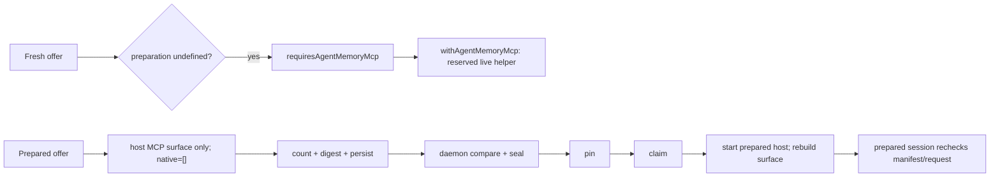
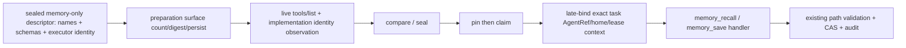

# Hermes WP1-D：prepared memory-only 机制合同

> 后续规范：用户批准的 WP1-I-C 已形成 [Prepared Agent Memory Contract](2026-09-28-prepared-agent-memory-contract.md)。下文保留研究和v7表达能力证据；后续实现以该契约为准，不把研究候选当第二份行为权威。

> 状态：设计候选；本文件是源码阅读与后续实现边界，不是 runtime、release 或 Host adoption 验收。
>
> 范围：只讨论 SDK 的 prepared lane 如何让既有 Agent memory 工具成为可计数、可封存的 capability。它不自动注入 memory snapshot，不增加 SDK memory-proposal 业务库，也不改变 Host 的 persona、用户事实或审批 authority。

## 结论

**WP1-I-E 更新：表达能力验证已完成，当前端到端能力不可表达。** 底层 schema/manifest/artifact 容器具有通用性，但现行 selector、registry authority、task-free probe 与 runtime reconstruction 只能贯通 Host MCP。以下正文的候选链尚未实现；具体反例、已运行验证与下一契约边界见文末 WP1-I-E。不能将本结论简化为“必须新增一种 artifact 格式”。

当前 prepared lane **不能**调用 Agent memory：它刻意排除 reserved helper，prepared surface 只封存 host MCP，且现有回归固定断言即使配置了 memory helper 也不会进入 prepared input。可行的最小方向不是把现有 reserved server 偷渡进 `taskMcpServers`，而是先把 memory-only 做成一个与 host MCP 同样可观察、可计数、可绑定 implementation identity、可在 seal 时重算的 prepared capability；然后只在 pin/claim 后，将既有 Agent home/lease 授权上下文晚绑定给其 handler。是否已有可承载该 descriptor 的类型与持久化槽位，尚未由本轮证据证明；WP1-I 必须先作该 check，缺失即触发本文的最小反例，不得臆造 wire 字段。

## P1：架构图与 authority

| 边界 | 当前 authority / 已证事实 | 本切片约束 |
| --- | --- | --- |
| Agent memory 内容、路径与 revision | `agent-memory.ts` 要求精确 active Agent task context（含 AgentRef、canonical home、lease 与 home identity），只允许 `MEMORY.md` 或安全的 `notes/*.md`，并以 SHA-256 revision CAS 读写。 | 复用这一个 home/CAS authority；不复制正文到 prepared artifact、Host 或云端。 |
| fresh Agent memory helper | fresh task 才计算 `requiresAgentMemoryMcp`，随后才调用 `withAgentMemoryMcp`。该 helper 是 daemon-reserved server，名字由 SDK 保留。 | 这条 live helper 不是 prepared capability，不能直接复用为 sealed 入口。 |
| prepared tool surface 与 accounting | prepared surface 目前由 host MCP projection 组成，native tools 固定为空；preparation service 对 surface 计数、digest 并保存，prepared host 再以 observations、servers 与 surface 重建。 | memory-only 必须进入同一 count/digest/persist/recompute 闭环，不能以未计数附加工具绕开预算。 |
| prepared execution | prepared session 将实际 `tools[].name` 与 `tools[].identity` 精确比对 frozen manifest；spec 要求 admission、compare、seal、pin、claim、start 的顺序。 | schema、executor identity、policy 或 tool name 的 drift 必须在副作用前拒绝或重新 preparation。 |
| reserved helper 特例 | `mcp-extension.ts` 明示 reserved servers 在 session start live 读取，且不进入 canonical toolset projection、billing artifact 或 frozen manifest。 | 不能仅把 `byokagentmemory` 塞入 `taskMcpServers`；那会同时违反现行 reserved 规则和 prepared accounting。 |

tenant/device 的既有认证 principal 与 sealed execution 对应的 exact AgentRef、task、session、home、lease 共同构成授权上下文；display name、title、SOUL 与 profile 文本只用于展示或人格，不可替代其中任一授权事实。同名 Agent 不共享 home，跨 Agent 读取/写入必须拒绝。

## P2：当前拒绝点与候选闭环

### 已证的当前路径



`preparation === undefined` 是 fresh-only 条件。因此 prepared offer 不会计算 `requiresAgentMemoryMcp`，也不会到达 `withAgentMemoryMcp`。即使 daemon 配置了 helper，现有 prepared egress test 断言 prepared input 的 `mcpServers` 只有 host server；它同时断言 helper preflight 不运行。这是当前拒绝点，不是缺少一条 Host 配置。

### 候选路径（未实现、未批准新 wire）



候选只描述机制，**不是**已批准字段或数据模型：

1. preparation 取得一个 memory-only descriptor。它必须完整表达模型可见的 `memory_recall`、`memory_save` schema 与 executor identity，并作为普通 prepared surface 成员参与 observed `tools/list`、计数、surface digest、artifact 保存和 daemon compare/seal。descriptor 本身不含 raw memory、自动 snapshot、context token 或 provider secret；既有 artifact manifest 已定义的 task 授权 tuple（例如 AgentRef）仍依其现行契约存在，本候选不另增字段。
2. 只有 descriptor 通过 live observation、implementation identity 与 seal 后，pin 再 claim。运行时实际注册的工具必须仍精确匹配 frozen name/identity manifest；任何多一个工具、少一个工具、schema/identity drift 都先拒绝，不能凭 digest 相近继续执行。
3. claim 成功后，daemon 才用现有 `withAgentMemoryMcp` 所在的 task-scoped context 机制或等价的单一后继，将 exact task、AgentRef、canonical home、home identity 和 active lease 交给 helper。这个授权材料是短生命期运行时输入，不写入 artifact，且不能由模型参数指定或替换。
4. helper 仍仅调用 `AgentMemoryService`。`recall` 受路径/可选 revision 约束；`save` 必须提供 expected revision，CAS conflict、过期 lease、不可用 secure filesystem、只读/非法 path 均 fail closed。initial frozen D 不自动将 memory 正文拼入 system prompt 或首个 request body；合法 `memory_recall` 的结果会成为后续 model-visible tool result，且必须受既有每次调用预算与 usage 检查约束。

该候选链使「tool schema + executor identity + accounting + seal」与「真实 handler 的 exact Agent/home/lease」在同一 execution 合拢；前半可封存且可审计，后半保持运行时授权与秘密隔离。

## P3：决策依据、取舍与 falsifier

现状将 reserved helper 排除在 prepared manifest 外是有意的：它的 schema live 读取且不进入 billing/frozen artifact。保留这个 invariant 的代价是，memory helper 不能以现状进入 prepared lane。最小 coherent change 是为 **memory-only** 创建可封存 capability，而不是放宽 prepared 对任意 reserved helper 的排除，也不是同时开放 terminal/filesystem/native tools。

在 10x 并发下，先失效的会是同一 Agent home 的 CAS 冲突、lease 过期以及被计数工具目录增长；它们分别由 existing CAS/lease、seal-before-start 与 memory-only surface 限住。它没有解决 Host memory proposal 积压、跨会话总结或向量检索；这些属于 WP2-D/WP2-I，不能由 SDK 自动生成第二 authority。

**Falsifier / 最小反例：** 当前唯一可用的 memory server 是 `byokagentmemory` reserved helper。若 WP1-I 核查后发现 prepared 的 persisted surface 类型只能表示 host-observed MCP，且无法在不新增明确协议/存储契约的条件下表示 SDK-owned memory descriptor 的 schema、implementation identity 与 observation，那么下面这个最小请求无法表达：

> 对一个 prepared offer，模型只看见 `memory_recall` 与 `memory_save`；artifact 可重算二者 schema/identity/count；运行时在 exact Agent A 的 active lease 下执行；artifact 不含 A 的 memory 正文或 secret。

把现有 reserved helper 加到 `taskMcpServers` 不能满足它：该 helper 仍是 live、未观测、未计数且未冻结，违背 `mcp-extension.ts` 的规则。此时应停止 implementation，签发一个精确的协议/持久化 contract 来批准 descriptor 表达；不得以自动 snapshot、双读/兼容 helper 或未计数 runtime injection 规避。

## 源码证据表

| 事实 | 证据 |
| --- | --- |
| fresh-only memory admission | `packages/client/src/daemon/task-runner.ts:2254-2256` |
| fresh lane 才添加 reserved memory MCP | `packages/client/src/daemon/task-runner.ts:2433-2439` |
| daemon 保留 memory server 名称，配置 token 绑定 | `packages/client/src/daemon/task-runner.ts:3272-3284` |
| prepared surface 当前仅 host MCP、native tools 为空 | `packages/client/src/daemon/prepared-tool-surface.ts:560-640` |
| surface 的计数、digest 与保存位置 | `packages/client/src/daemon/input-preparation-service.ts:715-747`, `:840-905` |
| prepared host 使用 observation、servers、surface 重新组装 | `packages/client/src/bin/pi-prepared-host.ts:626-643` |
| prepared session 精确比对 runtime tool name 与 identity | `packages/client/src/adapters/pi/prepared-session.ts:305-356` |
| reserved helpers live-read，且不进 billing artifact/frozen manifest | `packages/client/src/adapters/pi/mcp-extension.ts:52-60` |
| prepared test 固定无 reserved helper，即使 configured | `packages/client/src/__tests__/prepared-offer-lane.test.ts:1134-1155` |
| Agent task context、path allowlist、CAS read/write | `packages/client/src/daemon/agent-memory.ts:41-53`, `:114-125`, `:418-457` |
| existing helper 的两个公开 tool names/schema baseline | `packages/client/src/__tests__/fixtures/reserved-mcp-wire-baseline.json:56-61` |
| spec 的 lifecycle、sealed comparison 与无 reserved memory injection | `docs/spec.md:441-468` |

## WP1-I 最小实施包（后续，非本轮写入授权）

单一 owner 是 SDK client prepared-lane work package；Host 不改 memory 内容权威，也不需要新增业务 proposal store。顺序必须如下，前一步不能由后一步 fallback：

1. **表达能力 gate** — `packages/client/src/daemon/prepared-tool-surface.ts` 与 `packages/client/src/daemon/input-preparation-service.ts`：先证明或以新 contract 显式新增一个能保存 memory-only descriptor 的现有 surface representation；它必须带 tool schemas、executor implementation identity、observed identity 与计数输入。若做不到，按上述 falsifier 停止。
2. **同一封存链** — `packages/client/src/bin/pi-prepared-host.ts` 与 `packages/client/src/adapters/pi/prepared-session.ts`：从保存的 surface 重建同一 descriptor，执行 live observation / identity verification，并保留精确 name/identity compare；不得接受 live reserved schema 作为替代。
3. **只在成功 claim 后授权** — `packages/client/src/daemon/task-runner.ts` 与 `packages/client/src/adapters/pi/mcp-extension.ts`：把 prepared memory 从现有 live-reserved special case 分离为 sealed capability，pin/claim 后才交付 task-scoped context。不可将 `taskMcpServers` 用作旁路，也不可为 prepared 自动登记 message helper。
4. **复用内容安全边界** — `packages/client/src/daemon/agent-memory.ts`：保持 exact context、secure filesystem、path validation、lease、CAS 与审计语义；只有有证据的整合需要才改此文件，禁止为 prepared 降低这些约束。
5. **定向测试所有权** — `prepared-offer-lane.test.ts`、`prepared-tool-surface.test.ts`、`pi-prepared-tools.test.ts` 与 `agent-memory-mcp.test.ts`。先固定正向 descriptor chain，再固定下列负控；不把本轮文档当产品验证。

## 验收矩阵与负控

| 场景 | 期望结果 |
| --- | --- |
| memory-only prepared offer | frozen surface 只含两个 memory tools；两个 schema、executor identity、observation、计数与 seal 一致；native tools 仍为空。 |
| Agent A 的 descriptor 在 Agent B / 同名不同 AgentRef 执行 | seal 或 late-bound task context 拒绝；不能读取或写入 A home。 |
| descriptor/schema/executor identity/observed `tools/list` drift | claim 前拒绝或要求重新 preparation；不调用 handler。 |
| stale/被撤销 lease | helper 拒绝；不发生 recall/save 副作用。 |
| `memory_save` expectedRevision 过期或并发 CAS 冲突 | 明确 conflict；不得自动覆盖、重试成新 revision 或双写。 |
| 只读、非法/secret-like path、secure filesystem unavailable | fail closed；模型不能指定 root、glob、Agent identity 或 filesystem helper。 |
| initial frozen D / offer / capability metadata | 不自动包含 raw memory 或 snapshot，且不出现 provider secret 或 context token；现有 manifest 已定义的 task 授权 tuple 元数据仍按原契约保留。合法 `memory_recall` 的后续 tool result 可向模型可见，并受每次调用预算与 usage 检查。 |
| reserved helper 被直接加入 `taskMcpServers` 或 live 工具在 seal 后新增 | 拒绝；不得作为 compatibility fallback。 |
| 已有 prepared egress 情形 | 保持无 reserved message/memory helper 的既有断言；memory-only 是显式 capability，不是全局注入。 |

## Focused 验证入口（本轮未执行）

以下是 WP1-I 代码冻结后的定向命令；本轮 docs-only 合同禁止运行它们，故这里没有 PASS 声明：

Prerequisite: dependencies installed and required build completed in the frozen WP1-I worktree. Commands use the existing package test script; not executed in this docs-only wave.

```sh
bun run --cwd packages/client test -- src/__tests__/prepared-offer-lane.test.ts src/__tests__/prepared-tool-surface.test.ts src/__tests__/pi-prepared-tools.test.ts
bun run --cwd packages/client test -- src/__tests__/agent-memory-mcp.test.ts src/__tests__/agent-memory-embedded-entry.test.ts
```

本轮交付仅应运行 contract 指定的文档 whitespace check；产品级 build、typecheck、full test、API/version/workflow checks 留给授权的 WP1-I gate。

## WP1-I-E：获批后的表达能力验证

### P1：逐层判定

基线为 `e83e685fa8a7e27b714b0fb7b90668b19fc14a8e`，本节只报告表达能力，不把候选链升级为实现。

| 层 | 当前可表达什么 | 结论及来源 |
| --- | --- | --- |
| memory schema authority | `AGENT_MEMORY_TOOLS` 已定义两个完整 schema，handler 接受 task-bound deps | 可复用；`packages/client/src/bin/agent-memory-mcp-server.ts:17`，不可复制成第二份 schema authority。 |
| compiler input / manifest | 通用 name/description/parameters 与 name→executor fingerprint；manifest 是 order/executors/digest | 容器支持，并非只能存 Host MCP；`packages/client/src/input-preparation.ts:434`、`packages/client/src/adapters/pi/input-preparation.ts:96`。 |
| artifact | 保留 requestBody、counterProjection、projection/residual 和 envelope | 存储容器可复用；`packages/client/src/daemon/input-preparation-store.ts:159`。尚无证据要求新增 memory snapshot 或新 artifact 格式。 |
| request selection | Host 只能声明本机 registry 的 requiredToolsets，不能提供 tools/executors | SDK-owned memory capability 没有选择/准入契约；`packages/client/src/input-preparation.ts:478`、`packages/protocol/src/messages.ts:683`。 |
| registry / task-free observation | 每项必须解析为 registry server/revision；reserved name 被拒绝 | 不能冒充 Host toolset；`packages/client/src/daemon/prepared-tool-surface.ts:252`、`packages/client/src/daemon/toolset-registry.ts:183`。 |
| runtime reconstruction | 仅从 MCP observation 投影，native 为空；重算两种 digest，再注册 exact tools | 没有 SDK-owned memory 分支；`packages/client/src/adapters/pi/prepared-tools.ts:211`、`packages/client/src/bin/pi-prepared-host.ts:626`。 |
| authorization | fresh helper 由 daemon 签发 task-context token；service 从 active sealed task 恢复身份/home/lease | 不可从 Host 字段、工具参数或 artifact 合成授权；`packages/client/src/daemon/task-runner.ts:3272`、`:3300`。 |

### P2：最小反例与可观察拒绝

输入意图：为 exact Agent A 准备仅含 memory_recall / memory_save 的执行，不创建 task，不提前发 memory credential，不开放 native filesystem/terminal。

1. 往远程 request 加 `memoryTools`、`tools` 或 `toolExecutors`：严格 schema 拒绝 unknown key。三个字段只是反例输入，不是拟议 wire。
2. 不加字段、`requiredToolsets=[]`：`resolvePreparedToolBinding` 在没有 servers 时返回 `required_toolsets_resolved_to_no_servers`（源码证明，未执行装配）。
   > 已被取代（0.24.0）：`agentMemory` 为 `none` 且 `requiredToolsets=[]` 时不再拒绝，而是得到一条零工具记录，offer 省略 `requiredToolsets`，launch attestation 仍然绑定。见 `docs/spec.md` 的 prepared 章节与 `plans/plan-20260929-1735-toolless-prepared-lane.md`。上面这条只描述 0.24.0 之前的行为。
3. 传 `requiredToolsets=['byokagentmemory']`：没有对应 registry entry 时返回 `required_toolset_unconfigured`。即使另起一个 toolset ID，把其 server 命名为 `byokagentmemory` 仍被 registry reserved-name 检查拒绝（源码证明）。
4. 改 server 名仍不构成现成复用：它变成 Host-configured executable authority；当前 task-free preparation 没有活跃 task credential。实际 helper 在开始 serve 之前要求 STORE_DIR、PRODUCT_ID、AGENT_MEMORY_CONTEXT，见 `packages/client/src/bin/sdk-reserved-helper-runners.ts:50`。单纯绕过名称检查不能补齐授权，不能把假的 context 当真实 authority。
5. 事后注入 handler 则没有同一 observation/manifest；prepared session 的 exact name/identity 比对拒绝。memory 内容也不得预读成 prompt 以绕过工具链。

通用容器链已存在：`surface.tools/toolExecutors` → compiler（`input-preparation-service.ts:715`）→ summary/digests（`:840`）→ durable artifact。counter 是可选项：未配置时依据精确 requestBytes 保留并进入 prepared（`:856`）；配置时才做 counter reservation。后续设计应保持现行 accounting 契约，不能新加“必定有 token counter”的条件。

### 已运行验证与限制

- 纯协议探针：使用现成 golden `agent.input.preparation` payload 作正控，通过当前 source 的 `AgentInputPreparationPayloadSchema`；三个额外 key 均为 `unrecognized_keys`，exit 0。探针没有网络、provider、helper 或 memory 操作。
- 原 checkout 与隔离工作树 HEAD 相同；protocol/client/core/implementation-identity 下 625 个 tracked source 文件逐字节相同。按排序 path + NUL + bytes + NUL 计算 SHA-256：`1d2326ee3d4234ec87537217923f81f79a2b58681021efbd6af50b51d734d183`。
- 本地重放命令：`bun _ops/hermes-memory-expression-gate/protocol-probe.ts`。script SHA-256：`f53d45c022580ff0220f654948a9410ddedb7ef1fd3e463eab8d725763cdf495`；结果和 subject 在同目录。该探针从 source-identical 原 checkout 读取协议 source 与现有依赖；不是发布产物验证。
- 完整 assembler 探针未运行成功：本机先缺 `@byok-sdk/implementation-identity`，显式 source loader 后仍缺 `@modelcontextprotocol/client`。保留为 `NOT_RUN_missing_dependencies`，未安装、未修改产品 loader/依赖，未将失败冒充被测机制拒绝。registry/runtime 结论由源码证明，不宣称 runtime PASS。
- `.ai/context/capabilities.json` 在隔离工作树缺失；本切片未添加 scoped agent context，未修复该范围外文件。

### P3：裁定与下一完整切片

**裁定：本轮 falsifier 成立。** 现行通用 schema/持久化足以承载描述数据，但没有一条合法的 SDK-owned memory 选择→observation→授权→runtime 链。结束表达能力验证，不继续以改 if 或 registry 伪装方式实施。

下一切片是一个 memory-only 契约修订，须一次闭合四项：① Host 请求的 capability 选择与设备本地准入 authority；② 来自唯一 `AGENT_MEMORY_TOOLS` 的 descriptor 及 SDK implementation identity 如何参与 binding/observation；③ task-free descriptor 不含执行凭据、claim 后 exact task/home/lease 晚绑定；④ runtime 用同一 descriptor 重建并拒绝 drift。复用 compiler/artifact/CAS，不预设新的 storage format；现有版本 7 的严格字段/语义若变化，必须通过单一版本 authority 与消费者 one-shot 切换，无双读旧格式。

准确修订入口：`docs/spec.md`、`packages/protocol/src/messages.ts`、`packages/protocol/src/input-preparation.ts`、`packages/client/src/input-preparation.ts`，以及上表 assembler/runtime/helper 来源。它们是下一契约的候选文件，不是本次产品写入许可。充分的退出条件是给出一条可表达的 memory-only request→artifact→handler 路径和跨 Agent/schema drift/stale lease 负控；无需同时开放 native tools 或实现 Host 审批 UI。
