# RAFT（raft.build，內部代號 slock）架構參考

## 1. 這份文檔是什麼／探針方法與證據等級

### 1.1 定位

這是一份**外部產品的靜態拆解成果**，供 byok-sdk 在設計自身 credential proxy、agent 執行面、升級通道與遙測體系時作橫向參考。版本與 CDN readback 的探針日期是 **2026-08-07**；這些值會漂移，不能當成永久常數。

**這不是 byok-sdk 的架構文檔。** 本倉庫自身的架構帳本在 `docs/architecture/`，本文不修改也不引用其結論。本文只落在 `docs/researches/`，屬於外部產品拆解類材料。

RAFT 是 Botiverse 團隊（maintainer 來自 RisingWave）發佈的多方 agent 協作平台，公開品牌為 raft.build，內部代號 slock。本文拆解的是它的 client 側：CLI、daemon、control plane 二進位。

### 1.2 證據等級

全文每條事實標註證據等級：

| 標記 | 含義 |
|---|---|
| `[verified]` | 靜態拆解實證。可在下列產物中 grep 覆核到具體行 |
| `[inferred]` | 由實證推論。推論鏈條在文中寫明，但未直接觀測到 |
| `[unverified]` | 無法確認。通常是 server 側行為或未拆解的平台 |

**未標註者一律按 `[verified]` 處理。** 因此凡屬推論必然帶標記。

### 1.3 探針方法

全程**未執行**任何 raft 二進位、未安裝、未起 daemon、未登入、未讀取使用者本機的 `~/.slock/`。方法限於：

- npm tarball 靜態拆解
- SEA（Single Executable Application）二進位靜態切片

產物位置：

| 產物 | 說明 |
|---|---|
| `/tmp/raft-probe/sea/bundle.cjs` | 1.0.15 SEA payload，693,529 行未壓縮 CJS。esbuild bundle 保留 `// packages/*/src/*.ts` 模組註解，**可直接 grep 覆核** |
| `/tmp/raft-probe/sea/rc.bin` | 原始二進位，150,920,336 B，權限 0600 無執行位 |
| `/tmp/raft-probe/sea/old/package/` | 0.0.70 npm 基線 |
| `/tmp/raft-probe/botiverse-raft-0.0.17/` | agent CLI npm 包 |
| `/tmp/raft-probe/botiverse-raft-computer-0.0.70/` | control-plane CLI npm 包 |
| `/tmp/raft-probe/botiverse-raft-daemon-0.66.0/` | daemon 引擎 npm 包 |

探針產物 identity（便於在 `/tmp` 清除後重新抓取並比對）：

| 產物 | sha256 |
|---|---|
| `sea/bundle.cjs` | `18c3eb8ea40f029acf643fe6872b9d0ff77c6d68d996bd7ae49d25906edc0609` |
| `sea/rc.bin` | `87f298144f1dc13393af635d57dad15345a4b31cac032524bf3e9fec965bb51b` |
| `@botiverse/raft@0.0.17.tgz` | `71f39a889b0c1a778be932651d3e99838d1e203b6d1d1f4c4041e266b96df644` |
| `@botiverse/raft-computer@0.0.70.tgz` | `51d03a453266d756cbc29e94a847e88231a1dc0ee8a14c8863fa27ade8d9afcf` |
| `@botiverse/raft-daemon@0.66.0.tgz` | `534f3367510897b5f71be9a82b5be3e818bd47985ef27d6933bb3b7cee5082fb` |

### 1.4 侷限

1. **server 端行為全部 `[unverified]`。** 只看得到 client 側送出的 request schema、期待的 response schema、與 client 定義的錯誤碼。server 如何實作 task claim 的併發鎖、如何驗 scope、migration 狀態機的服務端半邊，都無從觀測。
2. **只分析 darwin-arm64。** linux-arm64／linux-x64／win32-x64 的 SEA 佈局未驗，本文出現的 Mach-O section 偏移只對 darwin-arm64 成立。
3. **未執行 = 沒有動態證據。** 所有「流程」都是讀 control flow 推出的靜態路徑。實際 runtime 是否走該分支未驗。
4. 本文引用的模組註解是原始碼註解，反映開發者當時意圖，不必然反映當前實作 —— 文中已標出兩處註解與實作脫節的位置。

### 1.5 公開資料與靜態證據的分工

| 資料 | 本文用途 | 不能證明什麼 |
|---|---|---|
| [Raft welcome](https://docs.raft.build/welcome/) | 產品定位 | 本機實作與安全邊界 |
| [Runtime](https://docs.raft.build/features/agents/runtime/) | 公開支持的 runtime、直連 provider 宣稱 | daemon 的 launch flags、driver shape |
| [External Agents](https://docs.raft.build/features/agents/external/) | external profile、CLI 接入與 bridge 概念 | managed-agent 內部憑證交換 |
| [Lifecycle](https://docs.raft.build/features/agents/lifecycle/) | 公開 lifecycle 與 workspace persistence 語意 | client/server 狀態機實作 |
| [Messages](https://docs.raft.build/features/messaging/messages/) | workspace 的消息原語 | `/internal/*` route 實作 |
| npm metadata + CDN manifest | 探針日版本、target、hash 與 Apple metadata | updater 是否實際驗證簽章 |
| `/tmp/raft-probe/*` 靜態產物 | 本文 `[verified]` 的 client-side control flow | runtime 動態行為與 server-side enforcement |

公開文件只支撐產品表面；本文所有進程、route、credential、migration、upgrade 與 telemetry 細節仍以本地靜態產物為證據。npm/CDN 在探針日的 readback 為：agent CLI `0.0.17`、daemon `1.0.15`、computer npm `0.0.70`、CDN SEA `1.0.15`。

---

## 2. 產品定位

RAFT 是**給 agent 用的 Slack-like 多方協作 workspace**，官方自述 "Where humans and AI agents build together"。`[verified]`

agent 在 RAFT 裡是 workspace 的**參與者**而非被派遣的執行單元：有 profile 與頭像、會被 @、在 channel 與 thread 裡發言、認領看板 task、設提醒、傳附件、走第三方 integration 的 OAuth。它的原語是 channel／DM／thread／task／mention／reminder，不是 job／queue／worker。

這與 byok-sdk 的任務派發模型不屬同一類產品。兩者的可比面在基礎設施層 —— 憑證隔離、agent 進程管理、二進位分發 —— 而非產品語意層。詳細對照放在第 18 節，本節不展開。

---

## 3. 分發拓撲與版本鏈

### 3.1 包家族 `[verified]`

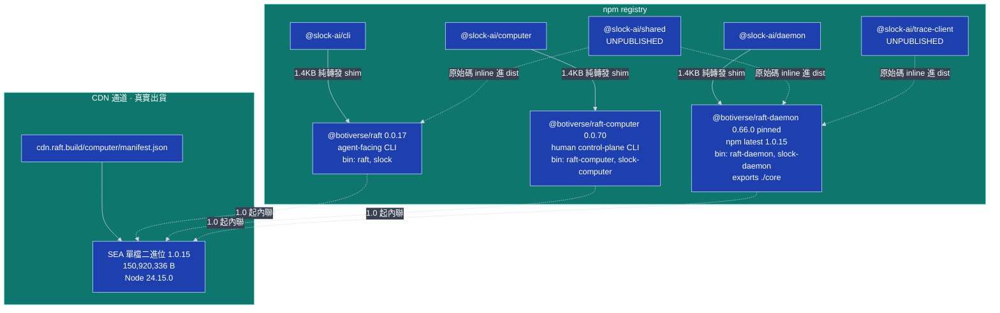
```mermaid
%%{init: {"theme":"base","themeVariables":{"background":"#0d1117","primaryColor":"#1e40af","primaryTextColor":"#ffffff","primaryBorderColor":"#bfdbfe","secondaryColor":"#5b21b6","secondaryTextColor":"#ffffff","secondaryBorderColor":"#ddd6fe","tertiaryColor":"#0f766e","tertiaryTextColor":"#ffffff","tertiaryBorderColor":"#99f6e4","lineColor":"#d1d5db","textColor":"#ffffff","edgeLabelBackground":"#374151","actorBkg":"#1e40af","actorBorder":"#bfdbfe","actorTextColor":"#ffffff","actorLineColor":"#6b7280","signalColor":"#d1d5db","signalTextColor":"#ffffff","labelBoxBkgColor":"#5b21b6","labelBoxBorderColor":"#ddd6fe","labelTextColor":"#ffffff","loopTextColor":"#ffffff","activationBkgColor":"#5b21b6","activationBorderColor":"#ddd6fe","noteBkgColor":"#78350f","noteBorderColor":"#fcd34d","noteTextColor":"#ffffff"}}}%%
flowchart TB
  subgraph npm["npm registry"]
    R["@botiverse/raft 0.0.17<br/>agent-facing CLI<br/>bin: raft, slock"]
    RC["@botiverse/raft-computer 0.0.70<br/>human control-plane CLI<br/>bin: raft-computer, slock-computer"]
    RD["@botiverse/raft-daemon 0.66.0 pinned<br/>npm latest 1.0.15<br/>bin: raft-daemon, slock-daemon<br/>exports ./core"]
    S1["@slock-ai/computer"]
    S2["@slock-ai/daemon"]
    S3["@slock-ai/cli"]
    SH["@slock-ai/shared<br/>UNPUBLISHED"]
    ST["@slock-ai/trace-client<br/>UNPUBLISHED"]
  end

  subgraph cdn["CDN 通道 · 真實出貨"]
    M["cdn.raft.build/computer/manifest.json"]
    B["SEA 單檔二進位 1.0.15<br/>150,920,336 B<br/>Node 24.15.0"]
  end

  S1 -->|"1.4KB 純轉發 shim"| RC
  S2 -->|"1.4KB 純轉發 shim"| RD
  S3 -->|"1.4KB 純轉發 shim"| R
  SH -.->|"原始碼 inline 進 dist"| R
  SH -.->|"原始碼 inline 進 dist"| RD
  ST -.->|"原始碼 inline 進 dist"| RD

  M --> B
  R -.->|"1.0 起內聯"| B
  RC -.->|"1.0 起內聯"| B
  RD -.->|"1.0 起內聯"| B
```

`@slock-ai/*` 的 shim 包 description 直白寫明「Renamed to @botiverse/…」。`@slock-ai/shared` 與 `@slock-ai/trace-client` **從未發佈到 npm**，是 monorepo 內部包，以原始碼形式被 bundle 進 dist。

### 3.2 npm 通道是化石 `[verified]`

`@botiverse/raft-computer` 0.0.70 與 `@botiverse/raft-daemon` 0.66.0 的發佈時間差 **9 秒**（同一次 release，2026-07-01）。此後 computer 通道再沒發過任何版本。

程式碼註解自承原因：

> npm dist-tags went stale at the SEA cutover; the binary store is the CDN

真實出貨路徑是 **CDN 分發的 Node 24.15.0 SEA 單檔二進位**，當前 1.0.15。

### 3.3 CDN 分發鏈 `[verified]`

| 環節 | 值 |
|---|---|
| always-latest | `https://cdn.slock.ai/computer/manifest.json` |
| 版本 manifest | `<base>/1.0.15/manifest.json` |
| targets | darwin-arm64 / darwin-x64 / linux-arm64 / linux-x64 / win32-x64，每個帶 `{file, sha256}` |
| 安裝入口 | `curl -fsSL https://cdn.raft.build/computer/install.sh \| sh` |
| 安裝位置 | `$HOME/.local/bin`，改寫 `.zshrc` / `.bashrc` 加 PATH |
| 安裝後動作 | 呼叫 `<bin> __supervisor retire-legacy` |
| sidecar | `photon_rs_bg.wasm`，1.88 MB |

`photon_rs_bg.wasm` 的用途 `[inferred]` 為影像處理（photon-rs 是 Rust 影像庫），實際呼叫點未追到。

SEA blob 佈局（darwin-arm64）：

| 欄位 | 值 |
|---|---|
| Mach-O section | `__NODE_SEA_BLOB` |
| segment | `NODE_SEA` |
| offset | 91,160,576 |
| size | `0x1d87746` |
| header | `magic(4)=0x0143da20 \| flags(4)=0x1 \| 0x01(1) \| pathLen(8)=99 \| path(99) \| codeLen(8) \| code` |

建置路徑洩漏在 blob 內：`/var/folders/.../T/raft-computer-sea/darwin-arm64/computer-bundle.cjs` —— 建置機是 macOS。

下載的 gz 與二進位 sha256 **均與 manifest 相符** `[verified]`。

### 3.4 1.0.15 的三合一 `[verified]`

1.0.15 SEA 內含三個原本獨立的包：

- `packages/computer/src/*`
- `packages/daemon/dist/*`
- `packages/cli`（agent CLI）

驗證方式：0.0.70 的 dist 裡 `DaemonCore` **零命中**，證明 daemon 是 1.0 才被內聯進 computer 二進位的。

外加 vendor：undici ×3 副本、zod 4.3.6、commander 12.1.0、`@google/genai`、openai SDK、babel、chokidar、tar-stream ×2、kimi-code-sdk、pi-coding-agent。

### 3.5 版本時間軸

| 版本 | 時間 | 說明 |
|---|---|---|
| `@botiverse/raft` 0.0.17 | — | agent CLI，deps 僅 commander + undici |
| `@botiverse/raft-daemon` 0.66.0 | 2026-07-01 | pinned |
| `@botiverse/raft-computer` 0.0.70 | 2026-07-01（+9s） | npm 通道最後一版 |
| SEA 1.0.15 | 當前 | CDN 分發，三包合一 |

maintainer 是 RisingWave 團隊成員（tennyzhuang / richardchien / yezizp / lengthmin / xxchan）。`github.com/botiverse/slock` 已轉私有，npm metadata 的 repository / bugs / homepage 全指向死連結。`[verified]`

---

## 4. 系統總覽

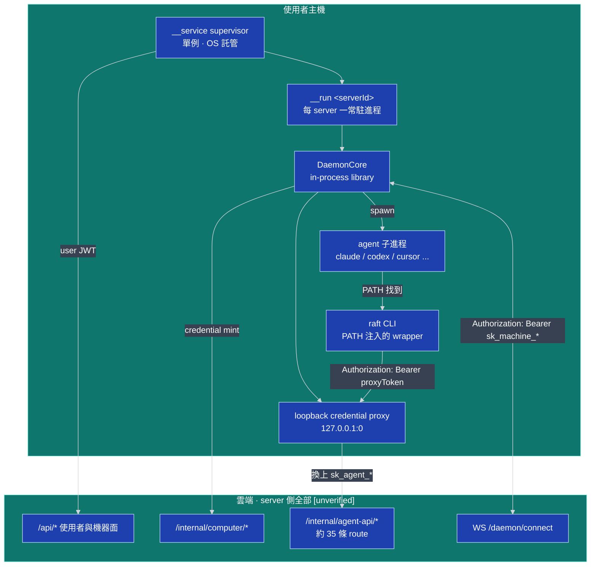
```mermaid
%%{init: {"theme":"base","themeVariables":{"background":"#0d1117","primaryColor":"#1e40af","primaryTextColor":"#ffffff","primaryBorderColor":"#bfdbfe","secondaryColor":"#5b21b6","secondaryTextColor":"#ffffff","secondaryBorderColor":"#ddd6fe","tertiaryColor":"#0f766e","tertiaryTextColor":"#ffffff","tertiaryBorderColor":"#99f6e4","lineColor":"#d1d5db","textColor":"#ffffff","edgeLabelBackground":"#374151","actorBkg":"#1e40af","actorBorder":"#bfdbfe","actorTextColor":"#ffffff","actorLineColor":"#6b7280","signalColor":"#d1d5db","signalTextColor":"#ffffff","labelBoxBkgColor":"#5b21b6","labelBoxBorderColor":"#ddd6fe","labelTextColor":"#ffffff","loopTextColor":"#ffffff","activationBkgColor":"#5b21b6","activationBorderColor":"#ddd6fe","noteBkgColor":"#78350f","noteBorderColor":"#fcd34d","noteTextColor":"#ffffff"}}}%%
flowchart TB
  subgraph cloud["雲端 · server 側全部 [unverified]"]
    API["/api/* 使用者與機器面"]
    IC["/internal/computer/*"]
    IA["/internal/agent-api/*<br/>約 35 條 route"]
    WS["WS /daemon/connect"]
  end

  subgraph host["使用者主機"]
    SUP["__service supervisor<br/>單例 · OS 託管"]
    RUN["__run &lt;serverId&gt;<br/>每 server 一常駐進程"]
    DC["DaemonCore<br/>in-process library"]
    PROXY["loopback credential proxy<br/>127.0.0.1:0"]
    AG["agent 子進程<br/>claude / codex / cursor ..."]
    CLI["raft CLI<br/>PATH 注入的 wrapper"]
  end

  SUP --> RUN
  RUN --> DC
  DC --> PROXY
  DC -->|spawn| AG
  AG -->|"PATH 找到"| CLI
  CLI -->|"Authorization: Bearer proxyToken"| PROXY
  PROXY -->|"換上 sk_agent_*"| IA
  DC <-->|"Authorization: Bearer sk_machine_*"| WS
  SUP -->|"user JWT"| API
  DC -->|"credential mint"| IC
```

### 三種憑證與三條認證邊界 `[verified]`


```mermaid
%%{init: {"theme":"base","themeVariables":{"background":"#0d1117","primaryColor":"#1e40af","primaryTextColor":"#ffffff","primaryBorderColor":"#bfdbfe","secondaryColor":"#5b21b6","secondaryTextColor":"#ffffff","secondaryBorderColor":"#ddd6fe","tertiaryColor":"#0f766e","tertiaryTextColor":"#ffffff","tertiaryBorderColor":"#99f6e4","lineColor":"#d1d5db","textColor":"#ffffff","edgeLabelBackground":"#374151","actorBkg":"#1e40af","actorBorder":"#bfdbfe","actorTextColor":"#ffffff","actorLineColor":"#6b7280","signalColor":"#d1d5db","signalTextColor":"#ffffff","labelBoxBkgColor":"#5b21b6","labelBoxBorderColor":"#ddd6fe","labelTextColor":"#ffffff","loopTextColor":"#ffffff","activationBkgColor":"#5b21b6","activationBorderColor":"#ddd6fe","noteBkgColor":"#78350f","noteBorderColor":"#fcd34d","noteTextColor":"#ffffff"}}}%%
flowchart LR
  U["使用者<br/>OAuth device code"] -->|"access + refresh JWT"| US["user-session.json"]
  US -->|"attach"| MK["sk_computer_* / sk_machine_*<br/>機器層 key"]
  MK -->|"runner credential mint"| AK["sk_agent_*<br/>agent 層 credential<br/>帶 scope 限制"]
  AK -->|"daemon 持有 · 不外流"| PT["proxy token<br/>子進程唯一可見的憑證"]
```

三層**單向降權**：使用者 JWT → 機器 key → agent credential → proxy token。下層拿不到上層的憑證明文。這是全系統最值得注意的設計，第 9 節展開。

---

## 5. 進程模型

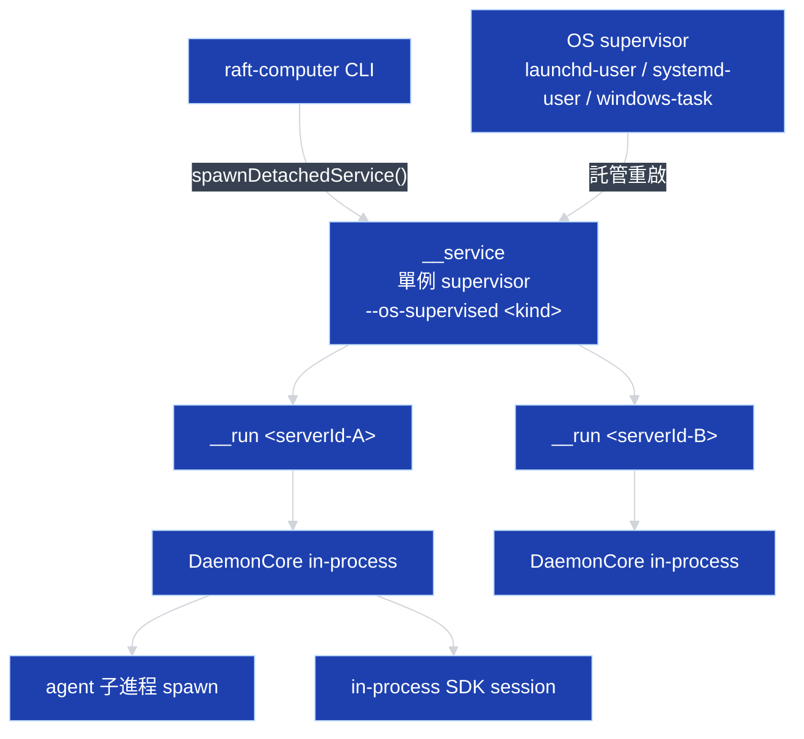
```mermaid
%%{init: {"theme":"base","themeVariables":{"background":"#0d1117","primaryColor":"#1e40af","primaryTextColor":"#ffffff","primaryBorderColor":"#bfdbfe","secondaryColor":"#5b21b6","secondaryTextColor":"#ffffff","secondaryBorderColor":"#ddd6fe","tertiaryColor":"#0f766e","tertiaryTextColor":"#ffffff","tertiaryBorderColor":"#99f6e4","lineColor":"#d1d5db","textColor":"#ffffff","edgeLabelBackground":"#374151","actorBkg":"#1e40af","actorBorder":"#bfdbfe","actorTextColor":"#ffffff","actorLineColor":"#6b7280","signalColor":"#d1d5db","signalTextColor":"#ffffff","labelBoxBkgColor":"#5b21b6","labelBoxBorderColor":"#ddd6fe","labelTextColor":"#ffffff","loopTextColor":"#ffffff","activationBkgColor":"#5b21b6","activationBorderColor":"#ddd6fe","noteBkgColor":"#78350f","noteBorderColor":"#fcd34d","noteTextColor":"#ffffff"}}}%%
flowchart TB
  OS["OS supervisor<br/>launchd-user / systemd-user / windows-task"]
  CLI["raft-computer CLI"]
  SVC["__service<br/>單例 supervisor<br/>--os-supervised &lt;kind&gt;"]
  RUN1["__run &lt;serverId-A&gt;"]
  RUN2["__run &lt;serverId-B&gt;"]
  DC1["DaemonCore in-process"]
  DC2["DaemonCore in-process"]
  A1["agent 子進程 spawn"]
  A2["in-process SDK session"]

  CLI -->|"spawnDetachedService()"| SVC
  OS -->|"託管重啟"| SVC
  SVC --> RUN1
  SVC --> RUN2
  RUN1 --> DC1
  RUN2 --> DC2
  DC1 --> A1
  DC1 --> A2
```

`[verified]` 1.0.15 三層角色同在一顆二進位裡，靠 argv 分派：

| 角色 | 職責 |
|---|---|
| `raft-computer` | 人面向 control plane：login / attach / 生命週期 / 健康 / 升級 / 遙測 / legacy 遷移 |
| `raft` | agent 面向的 syscall 層：agent 對 workspace 的所有動作 |
| `raft-daemon` | 引擎：agent 進程管理、runtime driver、credential proxy |

在 0.0.70，`defaultCoreFactory` 是 `await import("@botiverse/raft-daemon/core")` → `new DaemonCore({serverUrl, apiKey, localTrace:true, lifecycleHooks})`。**daemon 不是獨立進程二進位，是被 in-process 載入的 library。** `[verified]`

### 5.1 隱藏 argv 入口 `[verified]`

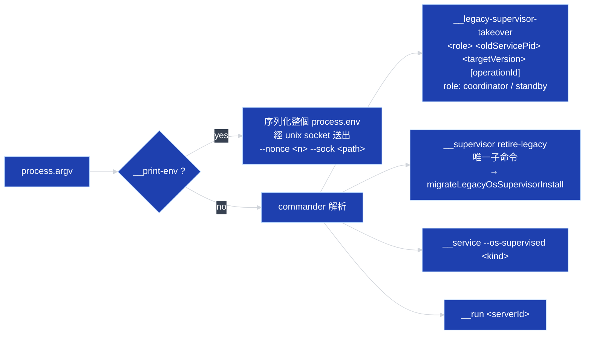
```mermaid
%%{init: {"theme":"base","themeVariables":{"background":"#0d1117","primaryColor":"#1e40af","primaryTextColor":"#ffffff","primaryBorderColor":"#bfdbfe","secondaryColor":"#5b21b6","secondaryTextColor":"#ffffff","secondaryBorderColor":"#ddd6fe","tertiaryColor":"#0f766e","tertiaryTextColor":"#ffffff","tertiaryBorderColor":"#99f6e4","lineColor":"#d1d5db","textColor":"#ffffff","edgeLabelBackground":"#374151","actorBkg":"#1e40af","actorBorder":"#bfdbfe","actorTextColor":"#ffffff","actorLineColor":"#6b7280","signalColor":"#d1d5db","signalTextColor":"#ffffff","labelBoxBkgColor":"#5b21b6","labelBoxBorderColor":"#ddd6fe","labelTextColor":"#ffffff","loopTextColor":"#ffffff","activationBkgColor":"#5b21b6","activationBorderColor":"#ddd6fe","noteBkgColor":"#78350f","noteBorderColor":"#fcd34d","noteTextColor":"#ffffff"}}}%%
flowchart LR
  ARGV["process.argv"] --> PE{"__print-env ?"}
  PE -->|yes| SOCK["序列化整個 process.env<br/>經 unix socket 送出<br/>--nonce &lt;n&gt; --sock &lt;path&gt;"]
  PE -->|no| CMD["commander 解析"]
  CMD --> LT["__legacy-supervisor-takeover<br/>&lt;role&gt; &lt;oldServicePid&gt; &lt;targetVersion&gt; [operationId]<br/>role: coordinator / standby"]
  CMD --> SU["__supervisor retire-legacy<br/>唯一子命令<br/>→ migrateLegacyOsSupervisorInstall"]
  CMD --> SVC["__service --os-supervised &lt;kind&gt;"]
  CMD --> RUNC["__run &lt;serverId&gt;"]
```

`__print-env` 是**在 commander 之前的 argv 級攔截**。它存在的原因：launchd 啟動的進程不帶使用者 shell 的 PATH，導致 runtime 偵測（找 `claude` / `codex` 等 binary）失敗。此入口讓 supervisor 能在使用者 shell 環境下重新採集一份完整 env。

---

## 6. raft-computer 層

### 6.1 命令面 `[verified]`

| 命令 | 0.0.70 | 1.0.15 | 變化 |
|---|---|---|---|
| `login` / `logout` | ✅ | ✅ | — |
| `attach` | ✅ | ✅ | — |
| `detach` | ✅ | ❌ | **移除，無替代** |
| `setup` | ✅ | ✅ | 加 `--machine` `--fresh` `--verbose` `-y` |
| `start` / `stop` / `restart` | ✅ | ✅ | — |
| `status` | ✅ | ✅ | — |
| `doctor` | ✅ | ✅ | 加 `--fix` `--migration-details` |
| `logs` | ✅ | ✅ | 加 `--service` |
| `reset` | ✅ | ❌ | **移除，無替代** |
| `runners list` / `stop` | ✅ | ✅ | `list` 加 `--all` |
| `channel show` / `set` | ✅ | ✅ | — |
| `upgrade` | ✅ | ✅ | 加 `--rollback` |
| `__service` / `__run` | ✅ | ✅ | `__service` 加 `--os-supervised` |
| `__legacy-supervisor-takeover` | ❌ | ✅ 隱藏 | 新增 |
| `__supervisor` | ❌ | ✅ 隱藏 | 新增 |
| `__print-env` | ❌ | ✅ 隱藏 | 新增 |

移除 `detach` 與 `reset` 且不提供替代路徑，是 1.0 對「機器脫離／狀態重置」這兩個操作的**權限上收** `[inferred]` —— 從 CLI 可達改為僅 server 側可發起，與第 13 節 `raft migrate export` 被硬性禁用是同一種收權模式。

### 6.2 鎖與併發 `[verified]`

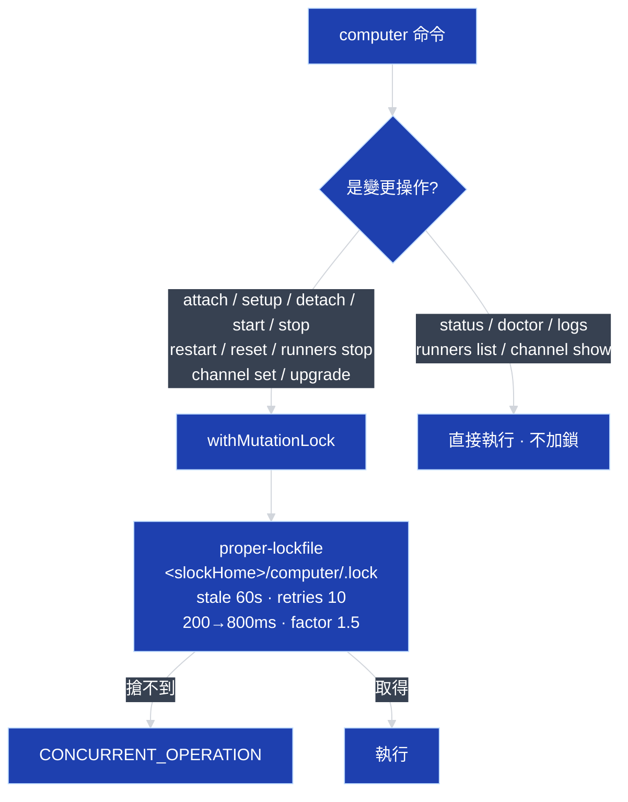
```mermaid
%%{init: {"theme":"base","themeVariables":{"background":"#0d1117","primaryColor":"#1e40af","primaryTextColor":"#ffffff","primaryBorderColor":"#bfdbfe","secondaryColor":"#5b21b6","secondaryTextColor":"#ffffff","secondaryBorderColor":"#ddd6fe","tertiaryColor":"#0f766e","tertiaryTextColor":"#ffffff","tertiaryBorderColor":"#99f6e4","lineColor":"#d1d5db","textColor":"#ffffff","edgeLabelBackground":"#374151","actorBkg":"#1e40af","actorBorder":"#bfdbfe","actorTextColor":"#ffffff","actorLineColor":"#6b7280","signalColor":"#d1d5db","signalTextColor":"#ffffff","labelBoxBkgColor":"#5b21b6","labelBoxBorderColor":"#ddd6fe","labelTextColor":"#ffffff","loopTextColor":"#ffffff","activationBkgColor":"#5b21b6","activationBorderColor":"#ddd6fe","noteBkgColor":"#78350f","noteBorderColor":"#fcd34d","noteTextColor":"#ffffff"}}}%%
flowchart TB
  CMD["computer 命令"] --> MUT{"是變更操作?"}
  MUT -->|"attach / setup / detach / start / stop<br/>restart / reset / runners stop<br/>channel set / upgrade"| LOCK["withMutationLock"]
  MUT -->|"status / doctor / logs<br/>runners list / channel show"| NOLOCK["直接執行 · 不加鎖"]
  LOCK --> PL["proper-lockfile<br/>&lt;slockHome&gt;/computer/.lock<br/>stale 60s · retries 10<br/>200→800ms · factor 1.5"]
  PL -->|"搶不到"| ERR["CONCURRENT_OPERATION"]
  PL -->|"取得"| EXEC["執行"]
```

`forceReleaseLock` 在 child service 啟動時**無條件執行**，靠環境變數 `..._PARENT_MUTATION_LOCK_HELD=1` 抑制 —— 這是父進程持鎖 spawn 子進程時避免自我死鎖的機制。

### 6.3 狀態目錄樹 `[verified]`

根路徑解析：`resolveSlockHome()` = `$SLOCK_HOME` → `$RAFT_HOME` → `~/.slock`

```
~/.slock/
├── computer/
│   ├── user-session.json  0600
│   ├── channel            0600   純文字一行
│   ├── upgrade.log        0600   JSONL append-only 審計
│   ├── adoption.log              legacy 收養審計
│   ├── service-version.json
│   ├── .lock                     proper-lockfile
│   ├── .quarantine/<ISO>-<serverId>/   power-loss 損壞 subtree 隔離
│   ├── traces/daemon-trace-*.jsonl     0600（目錄 0700）
│   ├── upgrade-staging/<version>/      >24h 由 doctor --fix 清
│   ├── upgrade-snapshot.json           舊路徑殘留
│   ├── run/
│   │   ├── service.pid
│   │   ├── service.log
│   │   ├── service.state.json          含 crashHistory
│   │   └── service.sock
│   │       win32: \\.\pipe\slock-computer-<sha256(computerDir)[0:16]>
│   └── servers/<serverId-UUID>/
│       ├── runner.state.json   0600  含 sk_computer_* 明文
│       ├── attachment.json           舊檔名，讀到就遷移後刪
│       ├── runner.pid / runner.log / runner.connected
│       ├── managed.flag
│       └── health.json         0600  60s 窗 3 次進 degraded
├── agents/<agentId>/{.pi-sessions,.builtin-sessions,.builtin-runtime,.kimi-sessions}/
├── machines/machine-<sha256(apiKey)[0:16]>/
│   ├── daemon.lock/owner.json  0600
│   └── traces/
├── cli-transport/<agentId>/<launchId>/{agent-token(0600), slock, raft, opencli}
├── agent-proxy-tokens/<agentId>/(0700)/<launchId>.token(0600)
├── attachments/
├── profiles/<slug>/{credential.json, integrations/<clientId>.json, agent-comms-core/…}
├── integration-sessions/<agentId>/integrations/<clientId>.json
├── integration-profiles/<serverId>/<agentId>/<serviceId>/(0700)
├── upgrade-pending.json          ← 寫在根，不在 computer/
└── upgrade-staging/<version>/    ← runSeaUpgrade 預設也在根
```

`user-session.json` 的 schema：`{kind:"user-session", schemaVersion:1, userId, accessToken(JWT), refreshToken, serverUrl, email?, name?, displayName?, createdAt, refreshedAt?}`

`machines/…/owner.json` 的 schema：`{pid, token, hostname, startedAt, serverUrl, apiKeyFingerprint}`

`$TMPDIR` 另有兩份 CLI-local 狀態：`slock-cli-consumed-seq/<agentId>/consumed-seqs.json`、`slock-cli-attested-send/<agentId>/continue-state.json`（TTL 10 min）。

### 6.4 健康與 crash budget `[verified]`

`health.json` 採 **60 秒滑動窗、3 次失敗進 degraded**。`service.state.json` 保留 `crashHistory`。`.quarantine/<ISO>-<serverId>/` 用於 power-loss 造成的損壞 subtree 隔離 —— 不刪除、不修復，移到隔離區保留現場。

---

## 7. 升級與發佈通道

這是全系統設計密度最高、也是安全缺口最明顯的一塊。

### 7.1 完整升級流程 `[verified]`

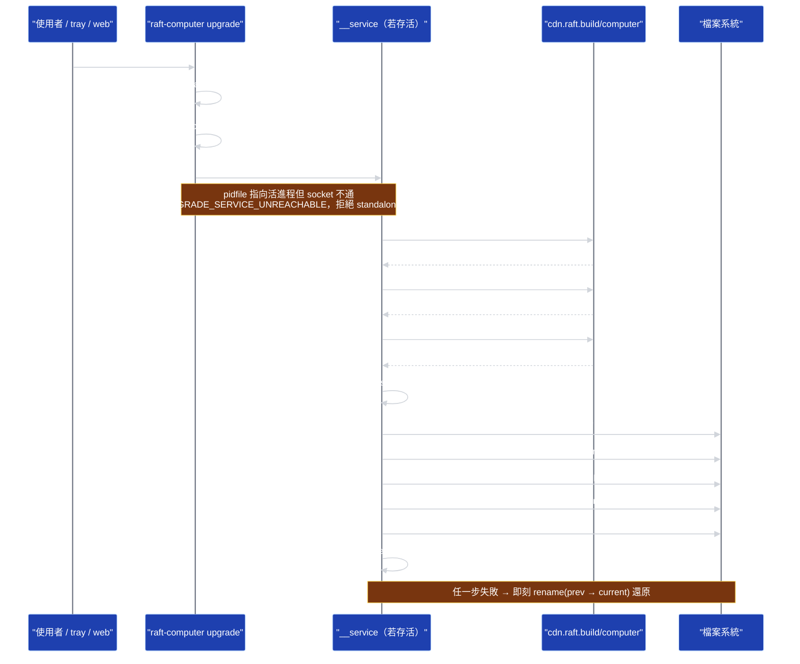
```mermaid
%%{init: {"theme":"base","themeVariables":{"background":"#0d1117","primaryColor":"#1e40af","primaryTextColor":"#ffffff","primaryBorderColor":"#bfdbfe","secondaryColor":"#5b21b6","secondaryTextColor":"#ffffff","secondaryBorderColor":"#ddd6fe","tertiaryColor":"#0f766e","tertiaryTextColor":"#ffffff","tertiaryBorderColor":"#99f6e4","lineColor":"#d1d5db","textColor":"#ffffff","edgeLabelBackground":"#374151","actorBkg":"#1e40af","actorBorder":"#bfdbfe","actorTextColor":"#ffffff","actorLineColor":"#6b7280","signalColor":"#d1d5db","signalTextColor":"#ffffff","labelBoxBkgColor":"#5b21b6","labelBoxBorderColor":"#ddd6fe","labelTextColor":"#ffffff","loopTextColor":"#ffffff","activationBkgColor":"#5b21b6","activationBorderColor":"#ddd6fe","noteBkgColor":"#78350f","noteBorderColor":"#fcd34d","noteTextColor":"#ffffff"}}}%%
sequenceDiagram
  participant U as "使用者 / tray / web"
  participant C as "raft-computer upgrade"
  participant S as "__service（若存活）"
  participant CDN as "cdn.raft.build/computer"
  participant FS as "檔案系統"

  U->>C: upgrade
  C->>C: "resolveUpgradeBaseUrl()"
  C->>C: "讀 channel: latest / alpha / pinned:<semver>"
  C->>S: "IPC upgrade-start（有活 service 時）"
  Note over C,S: pidfile 指向活進程但 socket 不通<br/>→ UPGRADE_SERVICE_UNREACHABLE，拒絕 standalone swap
  S->>CDN: "GET <base>/manifest.json"
  CDN-->>S: "{ version }"
  S->>CDN: "GET <base>/<version>/manifest.json"
  CDN-->>S: "targets[<platform>-<arch>] = { file, sha256 }"
  S->>CDN: "GET <base>/<version>/<file>"
  CDN-->>S: "150MB 未壓縮本體"
  S->>S: "createHash('sha256') 比對"
  S->>FS: "寫 staging（0755）"
  S->>FS: "writePendingUpgradeMarker"
  S->>FS: "rename(current → current.prev)"
  S->>FS: "rename(staged → current)"
  S->>FS: "chmod 0755"
  S->>S: "re-exec"
  Note over S,FS: 任一步失敗 → 即刻 rename(prev → current) 還原
```

### 7.2 channel `[verified]`

| channel | 語法 | 實際行為 |
|---|---|---|
| `latest` | — | `GET <base>/manifest.json` 取版本 |
| `pinned:<semver>` | `SEMVER_RE = /^\d+\.\d+\.\d+(-[\w.]+)?$/` | 直接用該版本；不合正則 → `publishing` |
| `alpha` | — | **壞的**。落到 `channel_not_on_cdn` |

`alpha` 從 0.0.70 到 1.0.15 一直是壞的 `[verified]`：`parseChannel` 接受它，`channel set alpha` 會寫盤成功，但 `resolveSeaTargetVersionResult` 只處理 `pinned:` 與 `latest` 兩個分支，其餘一律 fallthrough：

```js
async function resolveSeaTargetVersionResult(channel2, baseUrl, fetchLatest) {
  if (channel2.startsWith("pinned:")) { ... }
  if (channel2 === "latest") { return await fetchLatest(baseUrl); }
  return { ok: false, reason: "channel_not_on_cdn" };
}
```

1.0.15 唯一的改進是把靜默失敗換成可診斷的 `UPGRADE_CHANNEL_NOT_ON_CDN` 錯誤文案 —— 沒有修好 alpha，只是讓失敗說話。

### 7.3 errorCode `[verified]`

`UPGRADE_ERROR_CODES` 的實際內容是 **6 個**：

```js
UPGRADE_ERROR_CODES = [
  "UPGRADE_NETWORK_FAILED",
  "UPGRADE_DOWNLOAD_STALLED",
  "UPGRADE_INTEGRITY_FAILED",
  "UPGRADE_SWAP_FAILED",
  "UPGRADE_NO_TARGET",
  "UPGRADE_ALREADY_RUNNING"
];
```

這個集合是 `upgrade.log` 的**寫入合約**：`outcome === "err"` 的 log entry 必須攜帶集合內的 code，否則拋 contract violation。合約錯誤訊息把集合以 `UPGRADE_ERROR_CODES.join(" | ")` 動態插值，稱之為「v8.3.3 closed-set」。

但 payload 裡實際存在的 `UPGRADE_*` 錯誤碼有 **9 個** —— 集合外還有三個：

| 集合外的 code | 觸發點 |
|---|---|
| `UPGRADE_NO_ROLLBACK` | `upgrade --rollback` 但無 `.prev` |
| `UPGRADE_SERVICE_UNREACHABLE` | pidfile 指向活進程但 socket 不通 |
| `UPGRADE_CHANNEL_NOT_ON_CDN` | channel 既非 `latest` 也非 `pinned:` |

`[inferred]` 若這三者中任一被寫入 `upgrade.log` 的 `errorCode` 欄位，會觸發合約違反。三者的實際寫入路徑未追到，因此標為推論而非確認缺陷。

### 7.4 trigger 與單寫者保護 `[verified]`

`trigger` 三值：`"cli" | "web" | "tray"`，來源 `SLOCK_UPGRADE_TRIGGER`，非 web/tray 一律降為 cli。

單寫者保護的關鍵設計：有活 service 時，CLI **不自己換**，走 IPC `upgrade-start` 交給 service 自換自重啟。若 pidfile 指向活進程但 socket 不通，**fail-loud `UPGRADE_SERVICE_UNREACHABLE`，拒絕 standalone swap** —— 寧可拒絕升級，也不要出現「盤上是新版、跑著的進程是舊版」的裂腦狀態。

### 7.5 信任鏈分析 `[verified]`

**Updater 路徑沒有獨立的簽章驗證。1.0.15 與 0.0.70 在這一點上一模一樣。** CDN manifest 的 macOS target 確實帶 Developer ID 與 notarization metadata；靜態 control flow 沒有讀取或驗證這些欄位。這不等於二進位「沒有 Apple 簽章」，也不能排除 macOS 在執行時施加自身平台檢查；本文的結論只約束 RAFT updater 本身。

| 檢查項 | 結果 |
|---|---|
| `minisign` / `cosign` / `sigstore` | 全量 grep **零命中** |
| `ed25519` | 4 次命中，**全在 SSH 私鑰檔名黑名單**，與升級無關 |
| `codesign` / `spctl` / `notariz` / `com.apple.quarantine` | updater control flow **零命中** |
| sha256 校驗 | 有 |

問題不在於「有沒有 hash」，而在於**信任錨點**：

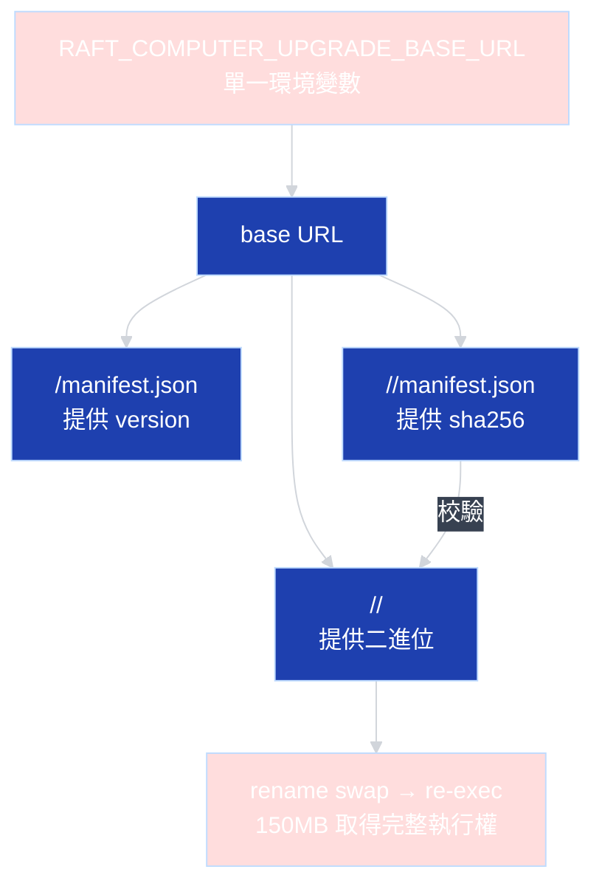
```mermaid
%%{init: {"theme":"base","themeVariables":{"background":"#0d1117","primaryColor":"#1e40af","primaryTextColor":"#ffffff","primaryBorderColor":"#bfdbfe","secondaryColor":"#5b21b6","secondaryTextColor":"#ffffff","secondaryBorderColor":"#ddd6fe","tertiaryColor":"#0f766e","tertiaryTextColor":"#ffffff","tertiaryBorderColor":"#99f6e4","lineColor":"#d1d5db","textColor":"#ffffff","edgeLabelBackground":"#374151","actorBkg":"#1e40af","actorBorder":"#bfdbfe","actorTextColor":"#ffffff","actorLineColor":"#6b7280","signalColor":"#d1d5db","signalTextColor":"#ffffff","labelBoxBkgColor":"#5b21b6","labelBoxBorderColor":"#ddd6fe","labelTextColor":"#ffffff","loopTextColor":"#ffffff","activationBkgColor":"#5b21b6","activationBorderColor":"#ddd6fe","noteBkgColor":"#78350f","noteBorderColor":"#fcd34d","noteTextColor":"#ffffff"}}}%%
flowchart TB
  ENV["RAFT_COMPUTER_UPGRADE_BASE_URL<br/>單一環境變數"] --> BASE["base URL"]
  BASE --> M1["<base>/manifest.json<br/>提供 version"]
  BASE --> M2["<base>/<version>/manifest.json<br/>提供 sha256"]
  BASE --> BIN["<base>/<version>/<file><br/>提供二進位"]
  M2 -->|"校驗"| BIN
  BIN --> SWAP["rename swap → re-exec<br/>150MB 取得完整執行權"]

  style ENV fill:#fdd
  style SWAP fill:#fdd
```

**hash 與二進位來自同一個 base URL、同一次信任決策。** 控制了 base URL 就同時控制了預期 hash 與實際內容，sha256 校驗退化為傳輸完整性檢查，不提供來源真實性。而 base URL 由單一環境變數 `RAFT_COMPUTER_UPGRADE_BASE_URL` 完全決定。

manifest 裡帶了整套 Apple 公證元資料：

```json
{ "teamId": "XDAPXFY8FZ", "cdHash": "...", "hardenedRuntime": true,
  "notarization": { "status": "Accepted" }, "stapled": false }
```

**客戶端一個位元組都不驗。** 這些欄位是純發佈記錄，不參與任何判斷。另外 `stapled: false` 意味著即使走 Gatekeeper 校驗，也需要連網向 Apple 取 ticket。

對一個「常駐使用者機器、握有其全部 AI 訂閱憑證」的產品，這是升級鏈上最實質的缺口。

---

## 8. raft-daemon 層

### 8.1 DaemonCore 生命週期 `[verified]`

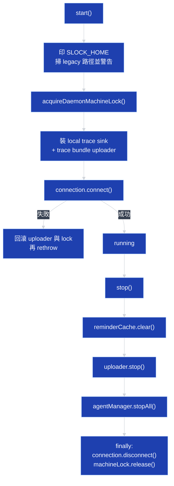
```mermaid
%%{init: {"theme":"base","themeVariables":{"background":"#0d1117","primaryColor":"#1e40af","primaryTextColor":"#ffffff","primaryBorderColor":"#bfdbfe","secondaryColor":"#5b21b6","secondaryTextColor":"#ffffff","secondaryBorderColor":"#ddd6fe","tertiaryColor":"#0f766e","tertiaryTextColor":"#ffffff","tertiaryBorderColor":"#99f6e4","lineColor":"#d1d5db","textColor":"#ffffff","edgeLabelBackground":"#374151","actorBkg":"#1e40af","actorBorder":"#bfdbfe","actorTextColor":"#ffffff","actorLineColor":"#6b7280","signalColor":"#d1d5db","signalTextColor":"#ffffff","labelBoxBkgColor":"#5b21b6","labelBoxBorderColor":"#ddd6fe","labelTextColor":"#ffffff","loopTextColor":"#ffffff","activationBkgColor":"#5b21b6","activationBorderColor":"#ddd6fe","noteBkgColor":"#78350f","noteBorderColor":"#fcd34d","noteTextColor":"#ffffff"}}}%%
flowchart TB
  START["start()"] --> P1["印 SLOCK_HOME<br/>掃 legacy 路徑並警告"]
  P1 --> P2["acquireDaemonMachineLock()"]
  P2 --> P3["裝 local trace sink<br/>+ trace bundle uploader"]
  P3 --> P4["connection.connect()"]
  P4 -->|失敗| RB["回滾 uploader 與 lock<br/>再 rethrow"]
  P4 -->|成功| OK["running"]

  OK --> STOP["stop()"]
  STOP --> S1["reminderCache.clear()"]
  S1 --> S2["uploader.stop()"]
  S2 --> S3["agentManager.stopAll()"]
  S3 --> S4["finally:<br/>connection.disconnect()<br/>machineLock.release()"]
```

**沒有 supervisor 或 watchdog 重啟 daemon 自身。** watchdog 只存在於連線層（見 8.3）。

子進程回收：`DEFAULT_STALLED_RECOVERY_SIGTERM_TIMEOUT_MS = 1e4`，SIGTERM 後 10 秒未退則 force kill。

### 8.2 machine lock `[verified]`

不是 `flock`，而是 **`mkdirSync(lockDir)` 的 EEXIST 原子性**：

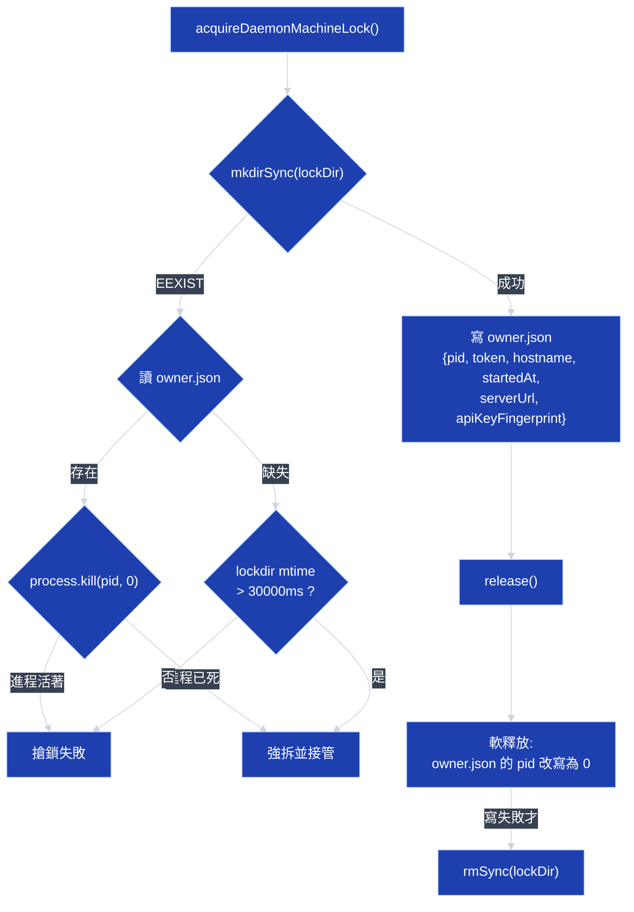
```mermaid
%%{init: {"theme":"base","themeVariables":{"background":"#0d1117","primaryColor":"#1e40af","primaryTextColor":"#ffffff","primaryBorderColor":"#bfdbfe","secondaryColor":"#5b21b6","secondaryTextColor":"#ffffff","secondaryBorderColor":"#ddd6fe","tertiaryColor":"#0f766e","tertiaryTextColor":"#ffffff","tertiaryBorderColor":"#99f6e4","lineColor":"#d1d5db","textColor":"#ffffff","edgeLabelBackground":"#374151","actorBkg":"#1e40af","actorBorder":"#bfdbfe","actorTextColor":"#ffffff","actorLineColor":"#6b7280","signalColor":"#d1d5db","signalTextColor":"#ffffff","labelBoxBkgColor":"#5b21b6","labelBoxBorderColor":"#ddd6fe","labelTextColor":"#ffffff","loopTextColor":"#ffffff","activationBkgColor":"#5b21b6","activationBorderColor":"#ddd6fe","noteBkgColor":"#78350f","noteBorderColor":"#fcd34d","noteTextColor":"#ffffff"}}}%%
flowchart TB
  ACQ["acquireDaemonMachineLock()"] --> MK{"mkdirSync(lockDir)"}
  MK -->|成功| OWN["寫 owner.json<br/>{pid, token, hostname, startedAt,<br/>serverUrl, apiKeyFingerprint}"]
  MK -->|EEXIST| RD{"讀 owner.json"}
  RD -->|存在| KILL{"process.kill(pid, 0)"}
  KILL -->|"進程活著"| FAIL["搶鎖失敗"]
  KILL -->|"進程已死"| TAKE["強拆並接管"]
  RD -->|"缺失"| MT{"lockdir mtime<br/>&gt; 30000ms ?"}
  MT -->|是| TAKE
  MT -->|否| FAIL

  OWN --> REL["release()"]
  REL --> SOFT["軟釋放:<br/>owner.json 的 pid 改寫為 0"]
  SOFT -->|"寫失敗才"| HARD["rmSync(lockDir)"]
```

`lockId = machine-<sha256(apiKey)[0:16]>` —— 鎖的粒度是 API key，不是機器。同一台機器接兩個不同 workspace 拿到不同鎖。

`INCOMPLETE_LOCK_STALE_MS = 30000`：owner.json 缺失（進程在 mkdir 後、寫 owner 前崩潰）且 lockdir 存在超過 30 秒才允許強拆。

**release 是軟釋放**：把 owner.json 的 pid 改寫為 0 而非刪除目錄，只有寫入失敗才退回 `rmSync`。這保留了「上一任持有者是誰」的取證資訊。

### 8.3 WS 控制面 `[verified]`

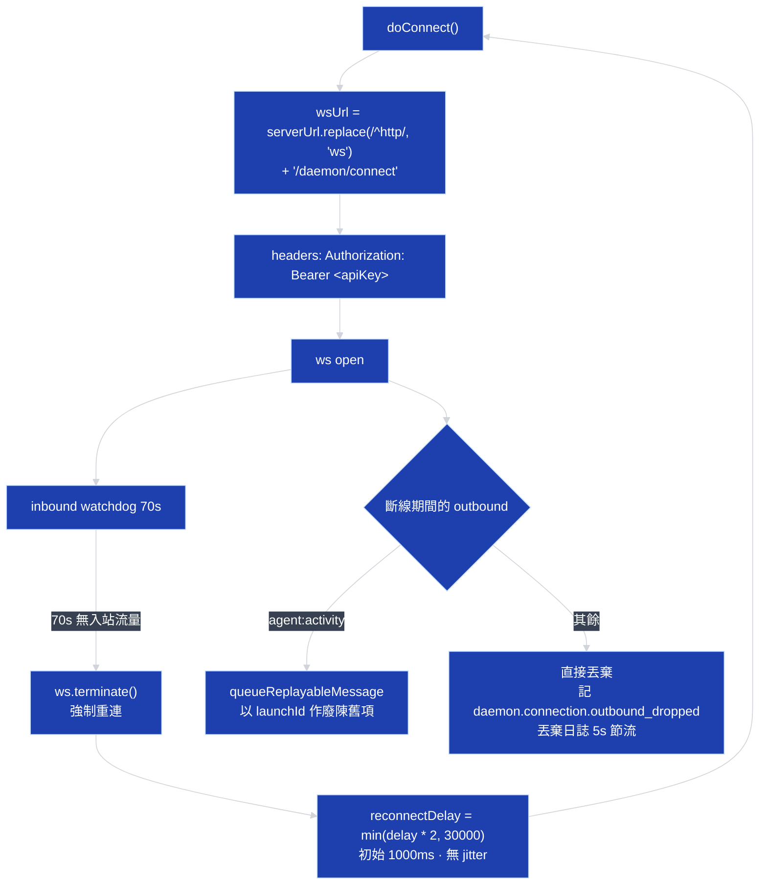
```mermaid
%%{init: {"theme":"base","themeVariables":{"background":"#0d1117","primaryColor":"#1e40af","primaryTextColor":"#ffffff","primaryBorderColor":"#bfdbfe","secondaryColor":"#5b21b6","secondaryTextColor":"#ffffff","secondaryBorderColor":"#ddd6fe","tertiaryColor":"#0f766e","tertiaryTextColor":"#ffffff","tertiaryBorderColor":"#99f6e4","lineColor":"#d1d5db","textColor":"#ffffff","edgeLabelBackground":"#374151","actorBkg":"#1e40af","actorBorder":"#bfdbfe","actorTextColor":"#ffffff","actorLineColor":"#6b7280","signalColor":"#d1d5db","signalTextColor":"#ffffff","labelBoxBkgColor":"#5b21b6","labelBoxBorderColor":"#ddd6fe","labelTextColor":"#ffffff","loopTextColor":"#ffffff","activationBkgColor":"#5b21b6","activationBorderColor":"#ddd6fe","noteBkgColor":"#78350f","noteBorderColor":"#fcd34d","noteTextColor":"#ffffff"}}}%%
flowchart TB
  CONN["doConnect()"] --> URL["wsUrl = serverUrl.replace(/^http/, 'ws')<br/>+ '/daemon/connect'"]
  URL --> HDR["headers: Authorization: Bearer &lt;apiKey&gt;"]
  HDR --> OPEN["ws open"]
  OPEN --> WD["inbound watchdog 70s"]
  WD -->|"70s 無入站流量"| TERM["ws.terminate()<br/>強制重連"]
  TERM --> BO["reconnectDelay = min(delay * 2, 30000)<br/>初始 1000ms · 無 jitter"]
  BO --> CONN

  OPEN --> OUT{"斷線期間的 outbound"}
  OUT -->|"agent:activity"| Q["queueReplayableMessage<br/>以 launchId 作廢陳舊項"]
  OUT -->|"其餘"| DROP["直接丟棄<br/>記 daemon.connection.outbound_dropped<br/>丟棄日誌 5s 節流"]
```

**認證方式在 1.0.15 已改為 header。** 0.66.0 的寫法是：

```js
const wsUrl = this.options.serverUrl.replace(/^http/, "ws")
  + `/daemon/connect?key=${this.options.apiKey}`;
```

1.0.15 改為：

```js
const wsUrl = this.options.serverUrl.replace(/^http/, "ws") + "/daemon/connect";
const wsOptions = { ...buildWebSocketOptions(wsUrl, proxyEnv),
  headers: { Authorization: `Bearer ${this.options.apiKey}` } };
```

query string 攜帶長期 API key 的問題（進 access log、進 proxy log、進 Referer）在 1.0.15 已修正。

**重連無 jitter 的對比缺陷** `[verified]`：trace 上傳路徑實作了確定性去同步 ——

```js
function computeTraceJitter(lockId) {
  // seed = sha256(lockId)
  return {
    initialUploadDelayMs: seed.readUInt32BE(0) % INITIAL_UPLOAD_DELAY_SPAN_MS, // 3e4
    uploadIntervalJitterMs: seed.readUInt32BE(4) % UPLOAD_INTERVAL_JITTER_SPAN_MS, // 6e4
  };
}
```

同一台機器每次啟動得到相同的偏移量（可重現、可除錯），不同機器彼此錯開。但**重連路徑沒有套用同樣的機制** —— `Math.min(delay * 2, maxReconnectDelay)` 是純指數。server 重啟會讓整個機隊的重連時刻對齊，形成 thundering herd。

fetch 逾時：`SLOCK_DAEMON_FETCH_PRE_RESPONSE_TIMEOUT_MS` 預設 3e4，同時套用到 `connect.timeout` / `requestTls.timeout` / `headersTimeout` **三個 pre-response leg** —— 覆蓋 TCP 連線、TLS 握手、首個 response header 三段，不覆蓋 body 傳輸。

### 8.4 Runtime registry `[verified]`

1.0.15 的 `RUNTIMES2` 共 13 個。欄位名為 `abbreviation`（非 `abbr`）：

| id | displayName | abbreviation | binary | 執行方式 | 狀態 |
|---|---|---|---|---|---|
| `claude` | Claude Code | CC | `claude` | spawn | supported |
| `codex` | Codex CLI | CX | `codex` | spawn | supported |
| `grok` | Grok Build | GK | `grok` | spawn | supported |
| `builtin` | Built-in Pi | BP | — | **in-process** | supported |
| `antigravity` | Antigravity CLI | AG | `agy` | spawn | supported |
| `kimi-sdk` | Kimi Code | KC | — | **in-process SDK** | supported，新 agent 推薦 |
| `kimi` | Kimi CLI (deprecated) | KL | `kimi` | spawn | **deprecated** |
| `copilot` | Copilot CLI | CP | `copilot` | spawn | supported |
| `cursor` | Cursor CLI | CU | `cursor-agent` | spawn | supported |
| `gemini` | Gemini CLI (deprecated) | GM | `gemini` | spawn | **deprecated**，選擇器隱藏 |
| `opencode` | OpenCode | OC | `opencode` | spawn | supported |
| `pi` | Pi | PI | `pi` | **in-process** | supported |
| — | `EXTERNAL_AGENT_RUNTIME_ID` | — | — | 外部 agent 橋接 | — |

原始碼註解保留了內部決策記錄：

> Kimi: prefer the in-process SDK (`kimi-sdk` → "Kimi Code") for new agents. The legacy `kimi` (kimi-cli child-process) entry stays for backward compat with existing `runtime=kimi` agents but is labelled deprecated.

> Gemini CLI: deprecated — no longer maintained upstream, replaced by Antigravity CLI (`antigravity` → "Antigravity CLI"). Kept for backward compat with existing `runtime=gemini` agents but hidden from selectors.

### 8.5 二元分派 `[verified]`

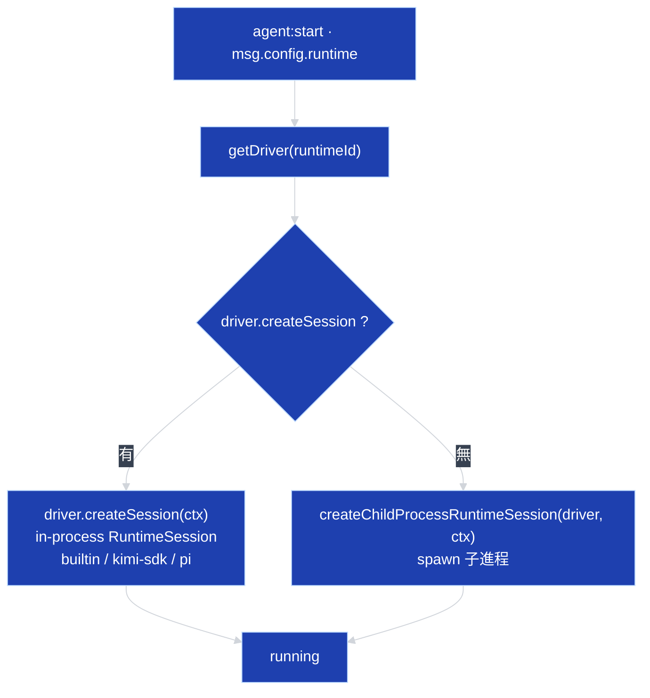
```mermaid
%%{init: {"theme":"base","themeVariables":{"background":"#0d1117","primaryColor":"#1e40af","primaryTextColor":"#ffffff","primaryBorderColor":"#bfdbfe","secondaryColor":"#5b21b6","secondaryTextColor":"#ffffff","secondaryBorderColor":"#ddd6fe","tertiaryColor":"#0f766e","tertiaryTextColor":"#ffffff","tertiaryBorderColor":"#99f6e4","lineColor":"#d1d5db","textColor":"#ffffff","edgeLabelBackground":"#374151","actorBkg":"#1e40af","actorBorder":"#bfdbfe","actorTextColor":"#ffffff","actorLineColor":"#6b7280","signalColor":"#d1d5db","signalTextColor":"#ffffff","labelBoxBkgColor":"#5b21b6","labelBoxBorderColor":"#ddd6fe","labelTextColor":"#ffffff","loopTextColor":"#ffffff","activationBkgColor":"#5b21b6","activationBorderColor":"#ddd6fe","noteBkgColor":"#78350f","noteBorderColor":"#fcd34d","noteTextColor":"#ffffff"}}}%%
flowchart TB
  START["agent:start · msg.config.runtime"] --> DRV["getDriver(runtimeId)"]
  DRV --> DISP{"driver.createSession ?"}
  DISP -->|"有"| NATIVE["driver.createSession(ctx)<br/>in-process RuntimeSession<br/>builtin / kimi-sdk / pi"]
  DISP -->|"無"| CHILD["createChildProcessRuntimeSession(driver, ctx)<br/>spawn 子進程"]
  NATIVE --> RUN["running"]
  CHILD --> RUN
```

唯一分派點就是這一行：

```js
driver.createSession?.(ctx) ?? createChildProcessRuntimeSession(driver, ctx)
```

`PiDriver.spawn()` 直接 throw：「PiDriver uses a native RuntimeSession; child-process spawn is unsupported」—— **不留降級路徑**。in-process runtime 沒有 child-process fallback，選錯即失敗，而非默默降級成一個行為不同的路徑。

driver capability flags：

| flag | 語意 |
|---|---|
| `lifecycle.kind` | `per_turn` → `turn_based` / `process_exit`；否則 `persistent_stream` / `parsed_event` |
| `supportsStdinNotification` | 能否經 stdin 送非同步通知 |
| `busyDeliveryMode` | 忙碌時訊息投遞策略 |
| `terminateProcessOnTurnEnd` / `endStdinOnTurnEnd` | 回合結束的收尾方式 |
| `supportsNativeStandingPrompt` | 是否支援常駐 prompt |

**runtime 選擇不在 daemon。** server 下發的 `agent:start` 訊息攜帶 `msg.config.runtime`，daemon 只負責在 `detectRuntimes()` 上報可用性（先試 `driver.probe()`，無 probe 則在 PATH 找 binary）。`STATIC_RUNTIME_MODEL_SOURCE_IDS = ["claude","copilot","gemini"]` 走靜態模型表，其餘動態探測。

模型清單可當 vendor 時間戳 `[verified]`：claude-opus-5 / opus-4-8 / 4-7 / 4-6、fable-5、sonnet-5 / 4-6、haiku-4-5；gpt-5.6-sol / terra / luna（reasoning effort 最高到 `ultra`）、5.5 / 5.4 / 5.3-codex[-spark] / 5.2[-codex] / 5.1-codex[-max] / 5-codex / 5；grok-4.5、grok-composer-2.5-fast。

### 8.6 MCP 的真實地位 `[verified]`

這裡有兩件必須分清的事。

**第一件：daemon 不說 MCP 協定。** `@modelcontextprotocol/sdk` 是宣告的 dependency，但 0.66.0 的三個 bundle 裡 `modelcontextprotocol` 命中 **0**，`jsonrpc` 在 CLI bundle 命中 0。daemon **既不是 MCP server 也不是 MCP client**，它只被動消費下游 runtime 吐出的 MCP 事件：

| 動作 | 實作 |
|---|---|
| 名稱正規化 | `MCP_CHAT_NAMESPACE_PREFIXES = ["mcp__chat__", "mcp_chat_"]`、`replace(/^mcp__\w+__/, "")`、`` `mcp_${server}_${tool}` `` |
| codex 事件 | `item` / `mcpToolCall` / `progress` |
| kimi SDK 的 `mcp.server.status` | **顯式丟棄** |
| opencode 配置 | 透傳 `mcp` 欄位 |
| 與 approval 的唯一交集 | copilot driver 帶 `--approve-mcps`（**繞過**核准，非實作核准） |

**第二件：server 側對 agent 提供 MCP 能力。** 1.0.15 的 `/internal/agent-api/` 有 `mcp/tools` 與 `mcp/call` 兩條 route，`capability: "mcp"`。這是 server 為 agent 提供的 MCP 訪問面，與 daemon 不說 MCP 協定並不衝突 —— 協定終結在 server，daemon 只是傳輸與觀測的中間層。

---

## 9. agent 執行與工具面

### 9.1 PATH 注入 `[verified]`

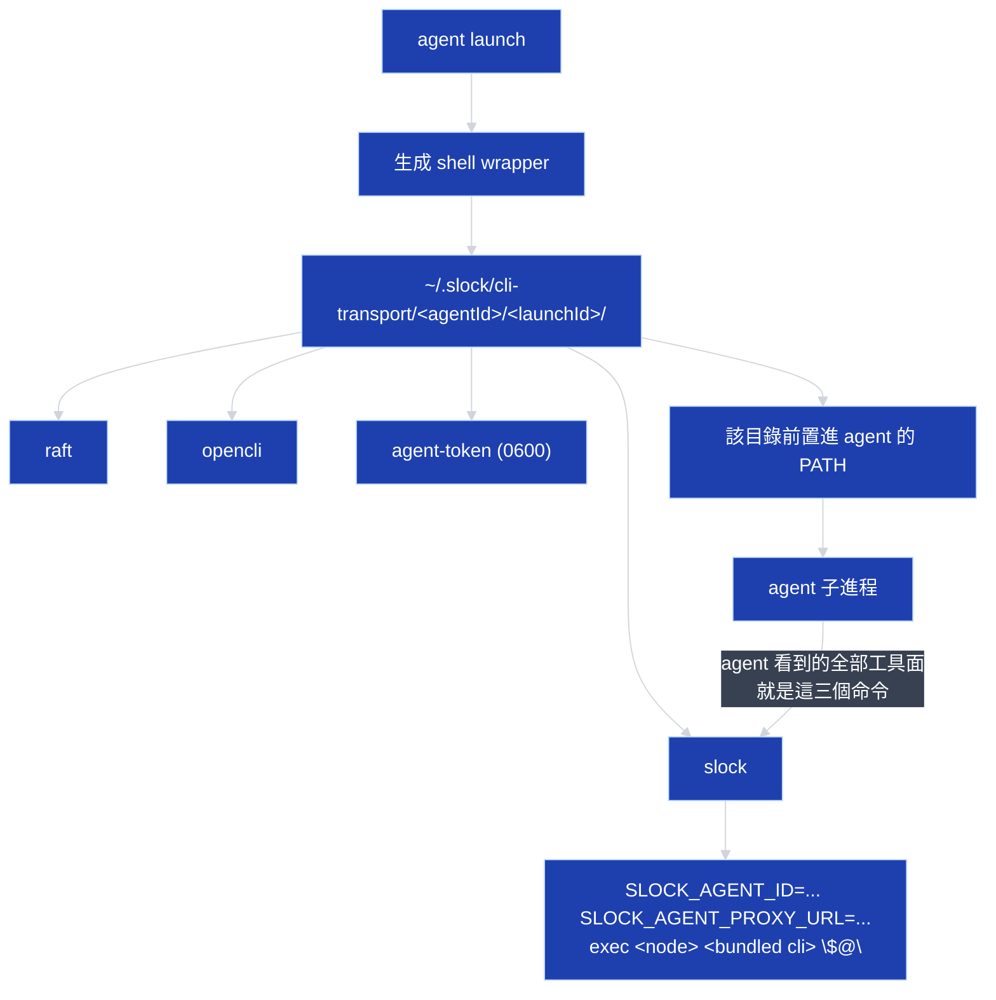
```mermaid
%%{init: {"theme":"base","themeVariables":{"background":"#0d1117","primaryColor":"#1e40af","primaryTextColor":"#ffffff","primaryBorderColor":"#bfdbfe","secondaryColor":"#5b21b6","secondaryTextColor":"#ffffff","secondaryBorderColor":"#ddd6fe","tertiaryColor":"#0f766e","tertiaryTextColor":"#ffffff","tertiaryBorderColor":"#99f6e4","lineColor":"#d1d5db","textColor":"#ffffff","edgeLabelBackground":"#374151","actorBkg":"#1e40af","actorBorder":"#bfdbfe","actorTextColor":"#ffffff","actorLineColor":"#6b7280","signalColor":"#d1d5db","signalTextColor":"#ffffff","labelBoxBkgColor":"#5b21b6","labelBoxBorderColor":"#ddd6fe","labelTextColor":"#ffffff","loopTextColor":"#ffffff","activationBkgColor":"#5b21b6","activationBorderColor":"#ddd6fe","noteBkgColor":"#78350f","noteBorderColor":"#fcd34d","noteTextColor":"#ffffff"}}}%%
flowchart TB
  LAUNCH["agent launch"] --> GEN["生成 shell wrapper"]
  GEN --> DIR["~/.slock/cli-transport/&lt;agentId&gt;/&lt;launchId&gt;/"]
  DIR --> F1["slock"]
  DIR --> F2["raft"]
  DIR --> F3["opencli"]
  DIR --> F4["agent-token (0600)"]
  F1 --> WRAP["SLOCK_AGENT_ID=... SLOCK_AGENT_PROXY_URL=...<br/>exec &lt;node&gt; &lt;bundled cli&gt; \"$@\""]
  DIR --> PATH["該目錄前置進 agent 的 PATH"]
  PATH --> AGENT["agent 子進程"]
  AGENT -->|"agent 看到的全部工具面<br/>就是這三個命令"| F1
```

daemon 為**每一次** agent launch 生成一組 wrapper，放進一個 launch 專屬目錄，把該目錄加進 agent 的 PATH。

**agent 看到的是 `raft` / `slock` / `opencli` 三個命令，這就是它的全部工具面。** 不是 MCP server、不是 function calling schema、不是 SDK —— 就是三個可執行檔。

wrapper 內帶路徑 fallback 鏈（`@botiverse/raft-daemon` → `@slock-ai/daemon`），應對 daemon 運行期間底下 package tree 被改動的情況。win32 另有 `.cmd` / `.ps1` 變體。

這個設計的取捨：agent 不需要學任何協定，任何能執行 shell 的 runtime 都能接入，代價是工具面的類型契約只存在於 CLI 的 argument parser 裡，runtime 無法在呼叫前做 schema 校驗。

### 9.2 Credential proxy `[verified]`

這是全系統最值得參考的安全設計。

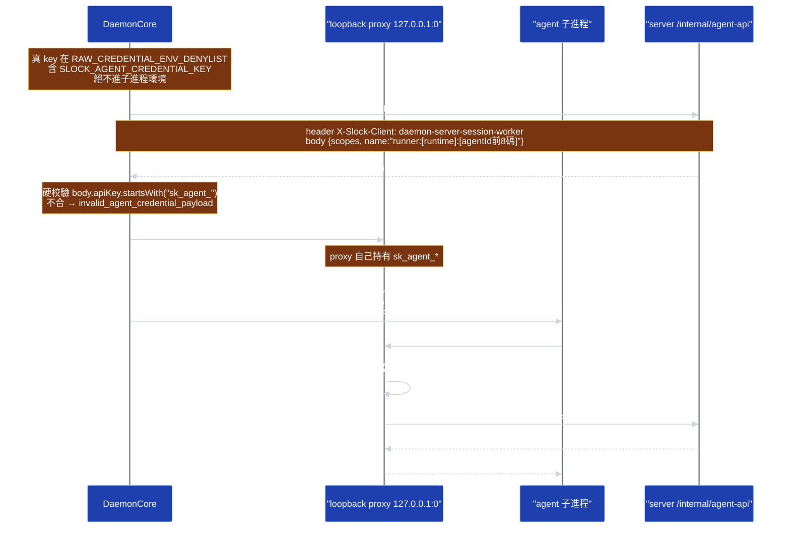
```mermaid
%%{init: {"theme":"base","themeVariables":{"background":"#0d1117","primaryColor":"#1e40af","primaryTextColor":"#ffffff","primaryBorderColor":"#bfdbfe","secondaryColor":"#5b21b6","secondaryTextColor":"#ffffff","secondaryBorderColor":"#ddd6fe","tertiaryColor":"#0f766e","tertiaryTextColor":"#ffffff","tertiaryBorderColor":"#99f6e4","lineColor":"#d1d5db","textColor":"#ffffff","edgeLabelBackground":"#374151","actorBkg":"#1e40af","actorBorder":"#bfdbfe","actorTextColor":"#ffffff","actorLineColor":"#6b7280","signalColor":"#d1d5db","signalTextColor":"#ffffff","labelBoxBkgColor":"#5b21b6","labelBoxBorderColor":"#ddd6fe","labelTextColor":"#ffffff","loopTextColor":"#ffffff","activationBkgColor":"#5b21b6","activationBorderColor":"#ddd6fe","noteBkgColor":"#78350f","noteBorderColor":"#fcd34d","noteTextColor":"#ffffff"}}}%%
sequenceDiagram
  participant D as DaemonCore
  participant P as "loopback proxy 127.0.0.1:0"
  participant A as "agent 子進程"
  participant S as "server /internal/agent-api"

  Note over D: 真 key 在 RAW_CREDENTIAL_ENV_DENYLIST<br/>含 SLOCK_AGENT_CREDENTIAL_KEY<br/>絕不進子進程環境
  D->>S: "POST /internal/computer/runners/{agentId}/credentials"
  Note over D,S: header X-Slock-Client: daemon-server-session-worker<br/>body {scopes, name:"runner:[runtime]:[agentId前8碼]"}
  S-->>D: "{ apiKey: sk_agent_... }"
  Note over D: 硬校驗 body.apiKey.startsWith("sk_agent_")<br/>不合 → invalid_agent_credential_payload
  D->>P: "啟動 loopback proxy（bind 重試 3 次，server.unref()）"
  Note over P: proxy 自己持有 sk_agent_*
  D->>A: "spawn，僅注入:<br/>SLOCK_AGENT_PROXY_URL<br/>SLOCK_AGENT_PROXY_TOKEN_FILE<br/>SLOCK_AGENT_ACTIVE_CAPABILITIES"
  A->>P: "Authorization: Bearer [proxyToken]"
  P->>P: "剝除 hop-by-hop header<br/>換上真 key"
  P->>S: "Authorization: Bearer sk_agent_*"
  S-->>P: response
  P-->>A: response
```

關鍵設計點：

| 設計 | 說明 |
|---|---|
| 真 key 不進子進程環境 | `RAW_CREDENTIAL_ENV_DENYLIST` 硬性攔截。子進程 dump `process.env` 也拿不到 |
| token 走檔案不走 env 明文 | `SLOCK_AGENT_PROXY_TOKEN_FILE` 指向 `~/.slock/agent-proxy-tokens/<agentId>/<launchId>.token`，dir 0700 file 0600。env 明文變體 `SLOCK_AGENT_PROXY_TOKEN` 存在但兩者互斥 |
| loopback 不可被繞出 | `LOOPBACK_NO_PROXY = "127.0.0.1,localhost"` 防止 agent 自己設的 `HTTP_PROXY` 把對 loopback proxy 的請求導向外部 |
| 憑證分 launch | token 檔以 `<launchId>` 命名，一次 launch 一個 token |
| mint 硬校驗 | `body.apiKey.startsWith("sk_agent_")`，不合直接丟 `invalid_agent_credential_payload` |
| mint fail-closed | 失敗訊息：「Managed runner startup requires /internal/computer credential mint; deploy server first or roll back the daemon binary.」不降級成用機器 key 跑 |

mint 重試策略：3 次 / 250ms 間隔。可重試條件 `status === 408 | 425 | 429 | >= 500`，但 `code === "experimental_surface_disabled"` **一律不重試**（伺服器明確表態該面未開，重試無意義）。

憑證**存檔案不進 keychain** —— 全 repo 無 keychain 引用 `[verified]`。

### 9.3 scope `[verified]`

`RUNNER_CREDENTIAL_SCOPES` 共 **9 項**：

```js
RUNNER_CREDENTIAL_SCOPES = ["send", "read", "mentions", "tasks",
  "reactions", "server", "channels", "knowledge", "mcp"];
```

這 9 項與 CLI route table 的 `capability` 欄位一一對應 —— 每條 `/internal/agent-api/` route 都掛一個 capability 標籤，`mcp/tools` 與 `mcp/call` 對應的正是 `capability: "mcp"`。

### 9.4 沙箱取捨 `[verified]`

**以下是 RAFT 傳給下游 runtime 的啟動參數，是對該產品行為的描述，不是給讀者的操作建議。**

每個 CLI driver 的啟動參數都帶繞過核准的旗標：

| runtime | 旗標 |
|---|---|
| claude | `--dangerously-skip-permissions`、`permission-mode: "bypassPermissions"` |
| copilot / cursor / kimi | `--yolo` |
| antigravity / opencode | 同類旗標 |
| 其他 | `--allow-all-tools`、`--allow-all-paths`、`--trust`、`--approve-mcps` |

這是一個明確的架構決定：**信任邊界畫在 API capability 上，不畫在檔案系統上。**

agent 在本機為所欲為（讀寫任意檔案、執行任意命令），但它能對 workspace 做什麼由 9 項 scope 與 403 `requiredScope` 卡死。這個取捨的前提是 workspace 資料比本機檔案更值得保護，且 agent 的本機工作目錄本來就是為它準備的。

`https-proxy-agent` 與沙箱無關 `[verified]`，純粹是企業出口 proxy 支援：`WSS_PROXY | HTTPS_PROXY | ALL_PROXY` 逐級 fallback，`NO_PROXY` 比對支援 `*` / `*.host` / `host:port` 三種形式。

---

## 10. raft agent CLI

### 10.1 完整命令樹 `[verified]`

`@botiverse/raft` 0.0.17：

```
raft [-p|--profile <slug>] [-V] [-h]
├─ auth whoami                          （永遠 JSON，{ok:true,data:{...}}）
├─ agent login[ start|wait|status] / list / bridge
├─ channel members|leave|info|create|update|add-member|remove-member|join|mute|unmute
├─ thread unfollow
├─ server info|update
├─ user info
├─ manual get|search                    （knowledge 是 legacy alias）
├─ inbox check
├─ message send|check|read|search|resolve|react
├─ attachment upload|view|comments
├─ task list|create|claim|unclaim|update
├─ mention pending|notify|add
├─ profile show|update
├─ integration list|login|env|invoke|app{prepare{register,update},rotate-secret}
├─ reminder schedule|list|cancel|snooze|update|log
└─ action prepare
```

1.0.15 的 agent CLI（bundle 內符號 `program22`）另有 `wiki` 與 `migrate` 兩個子命令樹。

`program2.name("raft")` 硬寫死，所以 `slock` alias 的 help 輸出也印 `raft`。`SLOCK_CLI_INVOCATION_NAME` 被設置但**從未被讀取** —— 純 bin-name 相容殼。

### 10.2 env 契約 `[verified]`

`RAW_AGENT_ENV_KEYS` 是 daemon ↔ agent 的權威介面清單：

| env | 用途 | 缺失行為 |
|---|---|---|
| `SLOCK_AGENT_ID` | 身分，發成 `X-Agent-Id` | `MISSING_AGENT_ID` |
| `SLOCK_SERVER_URL` | base URL | `MISSING_SERVER_URL` |
| `SLOCK_SERVER_ID` | 多 workspace，發成 `X-Server-Id` | 選用 |
| `SLOCK_AGENT_PROXY_URL` | daemon 本地代理；設了就頂掉 `SERVER_URL` | 三者其一設了就全組必需 |
| `SLOCK_AGENT_PROXY_TOKEN` | 代理 bearer（明文 env） | 與 `TOKEN_FILE` 互斥 |
| `SLOCK_AGENT_PROXY_TOKEN_FILE` | token 檔路徑，讀檔 + trim | 空檔 → `TOKEN_FILE_EMPTY` |
| `SLOCK_AGENT_TOKEN` / `_TOKEN_FILE` | **已廢止** | 設了直接 fail-closed 拋 `LEGACY_MACHINE_UNSUPPORTED` |

另有 `SLOCK_AGENT_ACTIVE_CAPABILITIES`（逗號分隔，**原樣轉發**成 header `X-Slock-Agent-Active-Capabilities`）與 `SLOCK_CURRENT_WORKSPACE_PATH`。

廢止路徑的處理值得注意：`SLOCK_AGENT_TOKEN` 不是被忽略，而是**設了就報錯**：

> SLOCK_AGENT_TOKEN_FILE/SLOCK_AGENT_TOKEN machine-token bootstrap is no longer supported by this CLI. Upgrade or restart the daemon.

這是 fail-closed 而非靜默降級 —— 舊 daemon 配新 CLI 會立刻爆，不會用一個過期的信任模型繼續跑。

### 10.3 clientMode `[verified]`

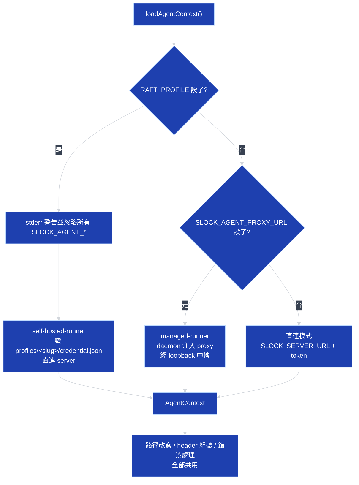
```mermaid
%%{init: {"theme":"base","themeVariables":{"background":"#0d1117","primaryColor":"#1e40af","primaryTextColor":"#ffffff","primaryBorderColor":"#bfdbfe","secondaryColor":"#5b21b6","secondaryTextColor":"#ffffff","secondaryBorderColor":"#ddd6fe","tertiaryColor":"#0f766e","tertiaryTextColor":"#ffffff","tertiaryBorderColor":"#99f6e4","lineColor":"#d1d5db","textColor":"#ffffff","edgeLabelBackground":"#374151","actorBkg":"#1e40af","actorBorder":"#bfdbfe","actorTextColor":"#ffffff","actorLineColor":"#6b7280","signalColor":"#d1d5db","signalTextColor":"#ffffff","labelBoxBkgColor":"#5b21b6","labelBoxBorderColor":"#ddd6fe","labelTextColor":"#ffffff","loopTextColor":"#ffffff","activationBkgColor":"#5b21b6","activationBorderColor":"#ddd6fe","noteBkgColor":"#78350f","noteBorderColor":"#fcd34d","noteTextColor":"#ffffff"}}}%%
flowchart TB
  START["loadAgentContext()"] --> RP{"RAFT_PROFILE 設了?"}
  RP -->|是| WARN["stderr 警告並忽略所有 SLOCK_AGENT_*"]
  WARN --> SH["self-hosted-runner<br/>讀 profiles/&lt;slug&gt;/credential.json<br/>直連 server"]
  RP -->|否| PU{"SLOCK_AGENT_PROXY_URL 設了?"}
  PU -->|是| MR["managed-runner<br/>daemon 注入 proxy<br/>經 loopback 中轉"]
  PU -->|否| DIRECT["直連模式<br/>SLOCK_SERVER_URL + token"]
  SH --> CTX["AgentContext"]
  MR --> CTX
  DIRECT --> CTX
  CTX --> COMMON["路徑改寫 / header 組裝 / 錯誤處理<br/>全部共用"]
```

`RAFT_PROFILE` **優先於全部 `SLOCK_AGENT_*`**，同時存在時 stderr 警告並忽略 env。`SLOCK_PROFILE` 是 deprecation alias，兩者值不同 → `PROFILE_ENV_CONFLICT`。

兩條路在 `loadAgentContext` 收斂成同一個 `AgentContext`，之後的路徑改寫、header 組裝、錯誤處理全部共用 —— 分歧只在憑證取得，不在請求構造。

### 10.4 auth header `[verified]`

```
Authorization: Bearer <token>
X-Agent-Id: <agentId>
X-Slock-Client: cli
X-Server-Id: <serverId>                      （有才帶）
X-Slock-Agent-Active-Capabilities: a,b,c     （有才帶）
```

路徑改寫規則：

| 原路徑 | 改寫後 |
|---|---|
| `/internal/agent/<agentId>/<suffix>` | `/internal/agent-api/<suffix>` |
| `/api/attachments/<id>` | `/internal/agent-api/attachments/<id>` |

`DAEMON_API_BASE_PATH = "/internal/agent-api"`。

### 10.5 `/internal/agent-api/` route 表 `[verified]`

每條掛 zod request/response schema 與 `capability` 標籤。按 capability 分組：

| capability | routes |
|---|---|
| `send` | `send`、`prepare-action` |
| `read` | `history`、`inbox`、`search`、`events`、`receive-ack`、`resolve-channel`、`messages/<id>`、`migrations/current`、`migrations/ready`、`migrations/arrived` |
| `mentions` | `mention-actions/pending`、`mention-actions/execute` |
| `tasks` | `tasks`、`tasks/claim`、`tasks/unclaim`、`tasks/update-status` |
| `reactions` | （反應相關） |
| `server` | `server`、`server/avatar`、`migrations`（POST） |
| `channels` | `channels`、`channels/<id>`、`channels/<id>/members`、`channel-members`、`threads/unfollow` |
| `knowledge` | `knowledge`、`wiki/manifest`、`wiki/publish` |
| `mcp` | `mcp/tools`、`mcp/call` |
| 其他 | `activity`、`attachments/<id>`、`attachment-upload-capabilities`、`attachment-upload-sessions`、`upload`、`integrations/…`、`profile`、`profile/avatar`、`reminders`、`reminders/<id>`、`wake-hints/stream` |

### 10.6 API 面版本差 `[verified]`

0.0.70 只有：

```
/api/auth/device/{authorize,token}
/api/auth/me
/api/auth/refresh
/api/computer/{attach,adopt-legacy,legacy-machines}
/api/servers/
```

1.0.15 `/api/` 新增：

```
/api/servers/<id>/machines[/<machineId>/computer-lifecycle-operations]
/api/attachments/{upload-capabilities,upload-sessions[/<id>[/complete]],<id>}
/api/uploads
/api/trace-bundles
/api/computer/legacy-machines?…&includeAll=1
/api/models  +  /api/models/<id>?blobs=true  +  /api/models/providers/<id>
```

`/api/models*` 這組 `[inferred]` 是本地模型探測（Ollama / LM Studio 類）的支撐面，`?blobs=true` 暗示模型權重檔的列舉 —— 但呼叫點未追到，故標推論。

1.0.15 `/internal/`（0.0.70 完全沒有這一整層）：

```
/internal/computer/{preflight,runners,runners/<agentId>/credentials,agent-migrations/…}
/internal/machine/scope-attestation
/internal/agent-api/…                     （約 35 條）
/internal/agent/<id>/{channels,…,server/avatar}
```

`/internal/` 層的整體出現是 1.0 的主要架構變化：把 agent 面與機器面從公開 `/api/` 分離出來。

### 10.7 錯誤碼分類 `[verified]`

| 類別 | 代表 |
|---|---|
| bootstrap | `MISSING_AGENT_ID`、`MISSING_SERVER_URL`、`TOKEN_FILE_EMPTY`、`LEGACY_MACHINE_UNSUPPORTED`、`PROFILE_ENV_CONFLICT` |
| 授權 | `SCOPE_DENIED`（HTTP 403 且 body 帶 `requiredScope`） |
| 傳輸 | `SERVER_5XX`、`BRIDGE_WAKE_STREAM_UNAVAILABLE` |
| 模式 | `BRIDGE_REQUIRES_PROFILE`、`MIGRATE_EXPORT_NOT_SUPPORTED` |
| migration | `MIGRATION_*`（見 13.7） |
| upgrade | `UPGRADE_*`（見 7.3） |

`SCOPE_DENIED` 的語意特別明確：不是泛用的「權限不足」，而是「human 在 agent profile 的 Permissions tab 撤銷了該 capability」—— 錯誤訊息直接指向使用者可執行的補救位置。

---

## 11. agent bridge

`agent bridge` 是 CLI 唯一的長駐能力，也是整個系統的**方向反轉點**。

其餘所有命令都是 agent 主動打雲端。bridge 反過來：常駐訂閱雲端 wake hint，收到後回頭去打**本地 Claude Code plugin 的 localhost 端點**把 agent 叫醒，並把 agent 產生的活動回流雲端。

它只在 self-hosted profile 模式可用 —— daemon 模式下 daemon 自己就是喚醒者，不需要 bridge。用 `bridge.lock` 保證每個 profile／agent／adapter 組合只有一份實例。

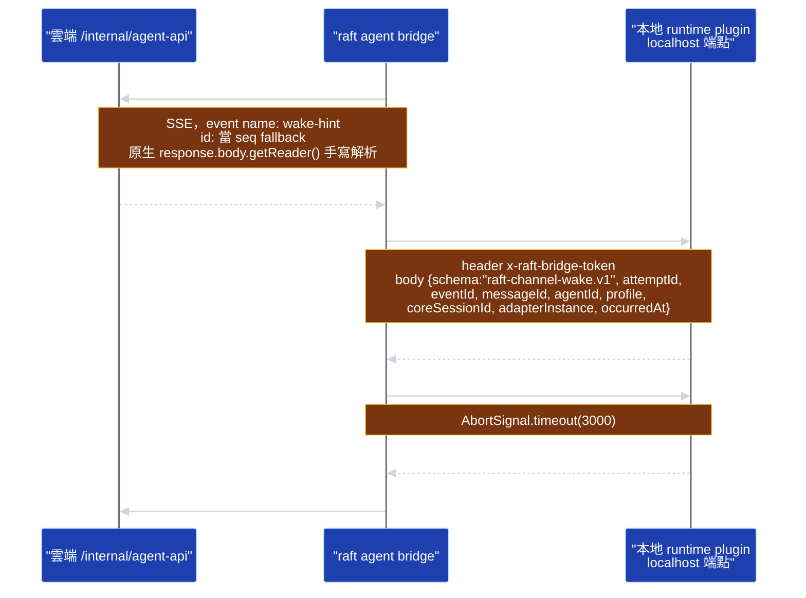
```mermaid
%%{init: {"theme":"base","themeVariables":{"background":"#0d1117","primaryColor":"#1e40af","primaryTextColor":"#ffffff","primaryBorderColor":"#bfdbfe","secondaryColor":"#5b21b6","secondaryTextColor":"#ffffff","secondaryBorderColor":"#ddd6fe","tertiaryColor":"#0f766e","tertiaryTextColor":"#ffffff","tertiaryBorderColor":"#99f6e4","lineColor":"#d1d5db","textColor":"#ffffff","edgeLabelBackground":"#374151","actorBkg":"#1e40af","actorBorder":"#bfdbfe","actorTextColor":"#ffffff","actorLineColor":"#6b7280","signalColor":"#d1d5db","signalTextColor":"#ffffff","labelBoxBkgColor":"#5b21b6","labelBoxBorderColor":"#ddd6fe","labelTextColor":"#ffffff","loopTextColor":"#ffffff","activationBkgColor":"#5b21b6","activationBorderColor":"#ddd6fe","noteBkgColor":"#78350f","noteBorderColor":"#fcd34d","noteTextColor":"#ffffff"}}}%%
sequenceDiagram
  participant S as "雲端 /internal/agent-api"
  participant B as "raft agent bridge"
  participant L as "本地 runtime plugin<br/>localhost 端點"

  B->>S: "GET /wake-hints/stream?since=[seq]"
  Note over B,S: SSE，event name: wake-hint<br/>id: 當 seq fallback<br/>原生 response.body.getReader() 手寫解析
  S-->>B: "event: wake-hint"
  B->>L: "POST [--wake-channel-endpoint]"
  Note over B,L: header x-raft-bridge-token<br/>body {schema:"raft-channel-wake.v1", attemptId,<br/>eventId, messageId, agentId, profile,<br/>coreSessionId, adapterInstance, occurredAt}
  L-->>B: ack
  B->>L: "GET [--activity-channel-endpoint]?max=[n]"
  Note over B,L: AbortSignal.timeout(3000)
  L-->>B: "活動事件"
  B->>S: "回流活動"
```

### 11.1 降級策略 `[verified]`

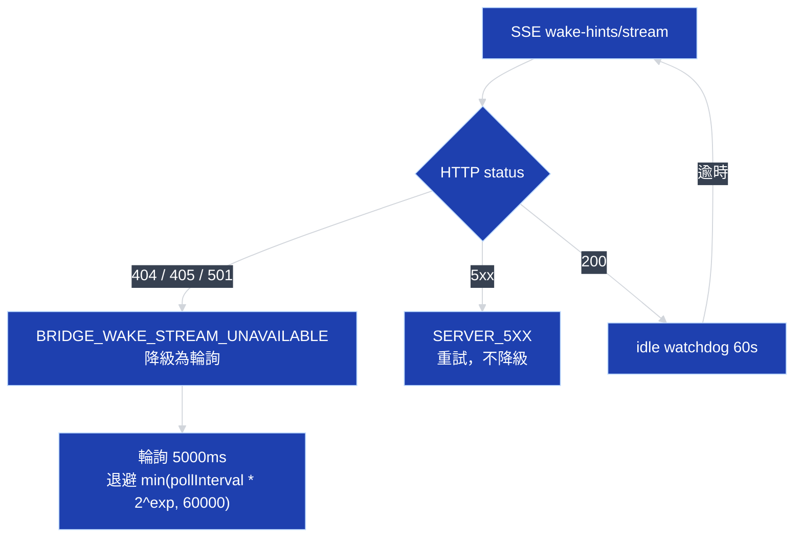
```mermaid
%%{init: {"theme":"base","themeVariables":{"background":"#0d1117","primaryColor":"#1e40af","primaryTextColor":"#ffffff","primaryBorderColor":"#bfdbfe","secondaryColor":"#5b21b6","secondaryTextColor":"#ffffff","secondaryBorderColor":"#ddd6fe","tertiaryColor":"#0f766e","tertiaryTextColor":"#ffffff","tertiaryBorderColor":"#99f6e4","lineColor":"#d1d5db","textColor":"#ffffff","edgeLabelBackground":"#374151","actorBkg":"#1e40af","actorBorder":"#bfdbfe","actorTextColor":"#ffffff","actorLineColor":"#6b7280","signalColor":"#d1d5db","signalTextColor":"#ffffff","labelBoxBkgColor":"#5b21b6","labelBoxBorderColor":"#ddd6fe","labelTextColor":"#ffffff","loopTextColor":"#ffffff","activationBkgColor":"#5b21b6","activationBorderColor":"#ddd6fe","noteBkgColor":"#78350f","noteBorderColor":"#fcd34d","noteTextColor":"#ffffff"}}}%%
flowchart TB
  SSE["SSE wake-hints/stream"] --> ST{"HTTP status"}
  ST -->|"404 / 405 / 501"| DEG["BRIDGE_WAKE_STREAM_UNAVAILABLE<br/>降級為輪詢"]
  ST -->|"5xx"| RETRY["SERVER_5XX<br/>重試，不降級"]
  ST -->|"200"| IDLE["idle watchdog 60s"]
  IDLE -->|"逾時"| SSE
  DEG --> POLL["輪詢 5000ms<br/>退避 min(pollInterval * 2^exp, 60000)"]
```

**降級條件收得很窄，這是刻意的。** 只有 404 / 405 / 501 —— 即「server 明確表示這條路由不存在或未實作」—— 才降級為輪詢。5xx 歸類為 `SERVER_5XX` 走重試，不降級。

這個區分避免了一個常見錯誤：把暫時性的 server 故障誤判成能力缺失，然後永久降級到低效路徑。狀態碼在這裡被用作**能力探測**而非健康探測。

### 11.2 常數與狀態 `[verified]`

| 常數 | 值 |
|---|---|
| SSE idle watchdog | 60s（`SLOCK_BRIDGE_WAKE_STREAM_IDLE_TIMEOUT_MS`） |
| 輪詢間隔 | 5000ms |
| 退避上限 | 60000ms |
| `WAIT_MAX_POLL_MS` | 15 min |
| `MAX_DRAIN_ROUNDS` | 50 |
| draft TTL | 10 min |
| activity drain timeout | 3000ms |

wake adapter manifest 硬寫死的欄位：

```
runtimeId:          "claude"
integrationPattern: "external-harness-plugin"
commsMode:          "spawn-core"
protocol:           "raft-channel.v0"
minSlockCliVersion: "0.0.3"
agentIsolation:     "session-scoped"
autoStartDefault:   false
explicitStartOnly:  true
```

`externalAgentWakeAdapterKindValues = ["raft-channel", "hermes-in-process"]` —— **這是 payload 裡 "hermes" 唯一出現的位置**，共 3 次命中（同一常數在 bundle 中的三份副本）。詳見第 16 節。

狀態目錄：

```
~/.slock/profiles/<slug>/agent-comms-core/<agentId>/<adapterInstance>/
├── session.json
├── wake-hints.jsonl
├── proofs.jsonl        （agent-proof.v1）
├── bridge.lock
└── bridge.log          （5MB 輪轉）
```

---

## 12. task board

### 12.1 狀態機 `[verified]`

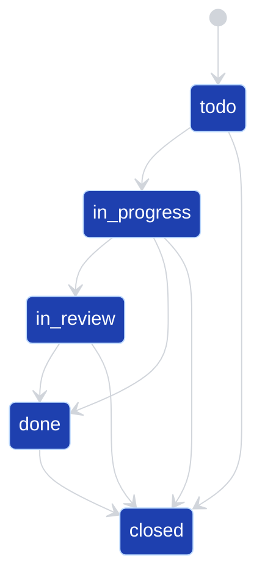
```mermaid
%%{init: {"theme":"base","themeVariables":{"background":"#0d1117","primaryColor":"#1e40af","primaryTextColor":"#ffffff","primaryBorderColor":"#bfdbfe","secondaryColor":"#5b21b6","secondaryTextColor":"#ffffff","secondaryBorderColor":"#ddd6fe","tertiaryColor":"#0f766e","tertiaryTextColor":"#ffffff","tertiaryBorderColor":"#99f6e4","lineColor":"#d1d5db","textColor":"#ffffff","edgeLabelBackground":"#374151","actorBkg":"#1e40af","actorBorder":"#bfdbfe","actorTextColor":"#ffffff","actorLineColor":"#6b7280","signalColor":"#d1d5db","signalTextColor":"#ffffff","labelBoxBkgColor":"#5b21b6","labelBoxBorderColor":"#ddd6fe","labelTextColor":"#ffffff","loopTextColor":"#ffffff","activationBkgColor":"#5b21b6","activationBorderColor":"#ddd6fe","noteBkgColor":"#78350f","noteBorderColor":"#fcd34d","noteTextColor":"#ffffff"}}}%%
stateDiagram-v2
  [*] --> todo
  todo --> in_progress
  in_progress --> in_review
  in_review --> done
  in_progress --> done
  done --> closed
  todo --> closed
  in_progress --> closed
  in_review --> closed
```

```js
taskStatusSchema = enum(["todo", "in_progress", "in_review", "done", "closed"]);
```

`VALID_STATUSES` 另含 `"all"`，但**僅用於 list 過濾，不可寫入**。狀態轉移的約束在 server 側 `[unverified]`；上圖是依 status 語意繪製的合理路徑，不是從實作提取的轉移表。

### 12.2 route 與 capability `[verified]`

| method | path | capability |
|---|---|---|
| GET | `/tasks` | `tasks` |
| POST | `/tasks` | `tasks` |
| POST | `/tasks/claim` | `tasks` |
| POST | `/tasks/unclaim` | `tasks` |
| POST | `/tasks/update-status` | `tasks` |

### 12.3 assignee 模型 `[verified]`

schema 有 `task_assignee_id` / `task_assignee_type` 兩個欄位（皆 nullable optional），但 **CLI 端沒有任何 assignee flag**。

claim 的語意因此是隱含的：**認領人 = 當前 agent**。agent 不能代替別人認領，也不能指派給別人。這把「誰在做這件事」的寫入權限收斂到單一來源 —— 只有執行者本人能宣告自己在執行。

task 是 **channel-scoped**，`--target '#channel'` 為必需參數。

claim 的併發鎖語意在 server 端 `[unverified]` —— client 側沒有任何樂觀鎖或 revision 欄位，兩個 agent 同時 claim 同一個 task 的結果無從判斷。

### 12.4 attention hint `[verified]`

server 向 agent 下推「你現在該做什麼」的指令建議：

```
trigger:      "M2" | "M3"
suggested_command:  <字串>
copy_version: "attention-hint-copy-v1"
thresholds:   { K, k, window_ms }
ATTENTION_HINT_DEFAULT_WINDOW_MS = 7 天
```

`daemonApiInboxFlagSchema = enum(["mention", "thread", "dm", "task"])`。

`copy_version` 這個欄位值得留意：提示文案的版本號由 server 下發，client 只負責渲染。這讓文案迭代不需要 client 升級。

---

## 13. Agent Migration 子系統

這是 1.0 的主線新系統，設計密度最高的一塊。

**遷移的對象是 agent workspace 目錄樹** `<slockHome>/agents/<agentId>/`，不是記憶庫、也不是憑證 —— 憑證走 runner credential mint 在目標機重簽。

### 13.1 狀態機 `[verified]`

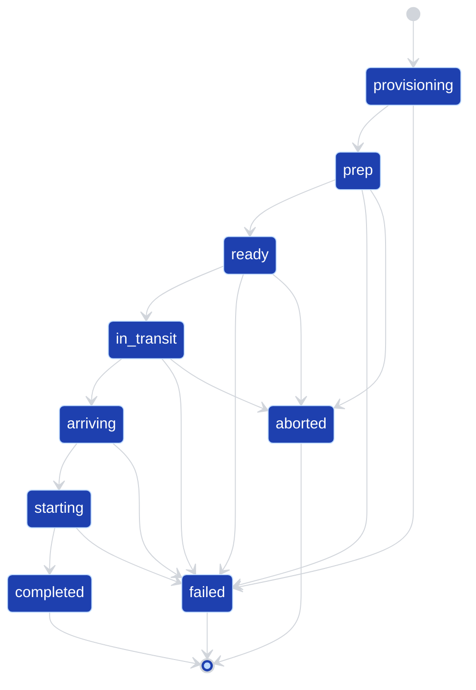
```mermaid
%%{init: {"theme":"base","themeVariables":{"background":"#0d1117","primaryColor":"#1e40af","primaryTextColor":"#ffffff","primaryBorderColor":"#bfdbfe","secondaryColor":"#5b21b6","secondaryTextColor":"#ffffff","secondaryBorderColor":"#ddd6fe","tertiaryColor":"#0f766e","tertiaryTextColor":"#ffffff","tertiaryBorderColor":"#99f6e4","lineColor":"#d1d5db","textColor":"#ffffff","edgeLabelBackground":"#374151","actorBkg":"#1e40af","actorBorder":"#bfdbfe","actorTextColor":"#ffffff","actorLineColor":"#6b7280","signalColor":"#d1d5db","signalTextColor":"#ffffff","labelBoxBkgColor":"#5b21b6","labelBoxBorderColor":"#ddd6fe","labelTextColor":"#ffffff","loopTextColor":"#ffffff","activationBkgColor":"#5b21b6","activationBorderColor":"#ddd6fe","noteBkgColor":"#78350f","noteBorderColor":"#fcd34d","noteTextColor":"#ffffff"}}}%%
stateDiagram-v2
  [*] --> provisioning
  provisioning --> prep
  prep --> ready
  ready --> in_transit
  in_transit --> arriving
  arriving --> starting
  starting --> completed
  completed --> [*]

  provisioning --> failed
  prep --> failed
  ready --> failed
  in_transit --> failed
  arriving --> failed
  starting --> failed

  prep --> aborted
  ready --> aborted
  in_transit --> aborted
  failed --> [*]
  aborted --> [*]
```

狀態機帶 `revision` 樂觀鎖與三個獨立 deadline：`prepDeadlineAt` / `transferDeadlineAt` / `arrivalDeadlineAt` —— 三個階段各有各的逾時預算，而非一個全域逾時。

### 13.2 冷遷移，不是熱遷移 `[verified]`

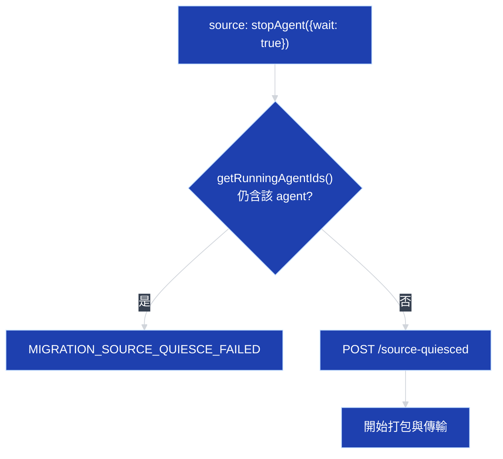
```mermaid
%%{init: {"theme":"base","themeVariables":{"background":"#0d1117","primaryColor":"#1e40af","primaryTextColor":"#ffffff","primaryBorderColor":"#bfdbfe","secondaryColor":"#5b21b6","secondaryTextColor":"#ffffff","secondaryBorderColor":"#ddd6fe","tertiaryColor":"#0f766e","tertiaryTextColor":"#ffffff","tertiaryBorderColor":"#99f6e4","lineColor":"#d1d5db","textColor":"#ffffff","edgeLabelBackground":"#374151","actorBkg":"#1e40af","actorBorder":"#bfdbfe","actorTextColor":"#ffffff","actorLineColor":"#6b7280","signalColor":"#d1d5db","signalTextColor":"#ffffff","labelBoxBkgColor":"#5b21b6","labelBoxBorderColor":"#ddd6fe","labelTextColor":"#ffffff","loopTextColor":"#ffffff","activationBkgColor":"#5b21b6","activationBorderColor":"#ddd6fe","noteBkgColor":"#78350f","noteBorderColor":"#fcd34d","noteTextColor":"#ffffff"}}}%%
flowchart TB
  S1["source: stopAgent({wait: true})"] --> S2{"getRunningAgentIds()<br/>仍含該 agent?"}
  S2 -->|是| FAIL["MIGRATION_SOURCE_QUIESCE_FAILED"]
  S2 -->|否| S3["POST /source-quiesced"]
  S3 --> S4["開始打包與傳輸"]
```

先停、確認停穩、才開始傳。沒有記憶體狀態遷移、沒有 live snapshot。這把一致性問題從「傳輸期間的狀態變更」化簡為「傳輸期間目錄樹不變」。

### 13.3 打包策略 `[verified]`

| 策略 | 值 |
|---|---|
| `unknownFiles` | `"include"` —— 預設全收 |
| `excludePolicy` | `"regenerable_only"` |
| `REGENERABLE_DIRECTORY_NAMES` | `.cache`, `.gradle`, `.pnpm-store`, `.venv`, `__pycache__`, `dist`, `node_modules`, `target`, `vendor` |

**密鑰只披露、不排除** `[verified]`。這是一個明確且需要理解的決定：

```js
SECRET_FILE_NAMES = { .env, .env.local, .env.development,
                      .env.production, .env.test,
                      credentials.json, credential.json }
ENV_KEY_PATTERN = /^\s*(?:export\s+)?([A-Za-z_][A-Za-z0-9_]*)\s*=/
```

`detectSecretShapes()` 掃這些檔案，用上述正則抽出 **key 名稱**（不含值）寫進 `manifest.secretsDisclosed`。**檔案本體照樣完整打包進 tar。**

這是 shape-disclosure 而非脫敏。理由 `[inferred]`：agent workspace 裡的 `.env` 是 agent 工作所需的一部分，剝掉它遷移後 agent 就跑不起來；披露 key 名稱讓操作者知道這次遷移攜帶了哪些敏感項，由人決定是否繼續。

`crossTreeRefs`：runtime session 檔（`runtime/<runtime>/<label>/<basename>`）即使跨出 workspace 樹也一起搬。

agent 可以提交 `cooperativeManifest` 提議 include / exclude_regenerable / cleaned / secrets_disclosed，但**服務端 refusal 優先**：`exclude_regenerable` 指向非 regenerable 路徑會被強制 promote 回 include，並記入 `proposalRefusals`。agent 的提議是建議，不是指令。

### 13.4 分塊續傳 `[verified]`

```mermaid
%%{init: {"theme":"base","themeVariables":{"background":"#0d1117","primaryColor":"#1e40af","primaryTextColor":"#ffffff","primaryBorderColor":"#bfdbfe","secondaryColor":"#5b21b6","secondaryTextColor":"#ffffff","secondaryBorderColor":"#ddd6fe","tertiaryColor":"#0f766e","tertiaryTextColor":"#ffffff","tertiaryBorderColor":"#99f6e4","lineColor":"#d1d5db","textColor":"#ffffff","edgeLabelBackground":"#374151","actorBkg":"#1e40af","actorBorder":"#bfdbfe","actorTextColor":"#ffffff","actorLineColor":"#6b7280","signalColor":"#d1d5db","signalTextColor":"#ffffff","labelBoxBkgColor":"#5b21b6","labelBoxBorderColor":"#ddd6fe","labelTextColor":"#ffffff","loopTextColor":"#ffffff","activationBkgColor":"#5b21b6","activationBorderColor":"#ddd6fe","noteBkgColor":"#78350f","noteBorderColor":"#fcd34d","noteTextColor":"#ffffff"}}}%%
sequenceDiagram
  participant SRC as source daemon
  participant FS as 本地檔案系統
  participant TGT as target daemon

  SRC->>SRC: "forensic export plan"
  SRC->>FS: "tar-stream.pack()"
  FS->>FS: "createGzip({level: 6})"
  FS->>FS: "byte-limit transform"
  FS->>FS: "createWriteStream(bundle.tar.gz, {flags:'wx', mode:0600})"
  SRC->>SRC: "hashBundleChunks() 單遍算全包 sha256<br/>+ 每 chunk {index, offsetBytes, sizeBytes, sha256}"
  SRC->>TGT: "control manifest"
  TGT->>TGT: "validateAgentMigrationControlManifest()"
  loop 每個 chunk
    SRC->>TGT: "chunk[i]"
    TGT->>TGT: "verifyAndStoreAgentMigrationChunk"
  end
  TGT->>TGT: "missingAgentMigrationChunks() 複查全部"
  TGT->>TGT: "解壓 + 三層 digest 校驗"
  TGT->>TGT: "寫 commit marker + 原子 rename"
```

chunk 落盤的冪等與防篡改設計：

```mermaid
%%{init: {"theme":"base","themeVariables":{"background":"#0d1117","primaryColor":"#1e40af","primaryTextColor":"#ffffff","primaryBorderColor":"#bfdbfe","secondaryColor":"#5b21b6","secondaryTextColor":"#ffffff","secondaryBorderColor":"#ddd6fe","tertiaryColor":"#0f766e","tertiaryTextColor":"#ffffff","tertiaryBorderColor":"#99f6e4","lineColor":"#d1d5db","textColor":"#ffffff","edgeLabelBackground":"#374151","actorBkg":"#1e40af","actorBorder":"#bfdbfe","actorTextColor":"#ffffff","actorLineColor":"#6b7280","signalColor":"#d1d5db","signalTextColor":"#ffffff","labelBoxBkgColor":"#5b21b6","labelBoxBorderColor":"#ddd6fe","labelTextColor":"#ffffff","loopTextColor":"#ffffff","activationBkgColor":"#5b21b6","activationBorderColor":"#ddd6fe","noteBkgColor":"#78350f","noteBorderColor":"#fcd34d","noteTextColor":"#ffffff"}}}%%
flowchart TB
  IN["chunk[i] 到達"] --> EX{"&lt;chunksDir&gt;/&lt;i&gt;.chunk 已存在?"}
  EX -->|是| RH["重算 hash"]
  RH -->|匹配| REUSE["回 {outcome: 'reused'}"]
  RH -->|不匹配| MISMATCH["拋 AgentMigrationChunkDigestMismatchError(i)<br/>不靜默覆蓋"]
  EX -->|否| PART["寫 &lt;i&gt;.partial-&lt;pid&gt;-&lt;uuid&gt;<br/>flags: 'wx' 防搶"]
  PART --> STREAM["流式邊寫邊 hash<br/>超長立即中斷"]
  STREAM -->|通過| REN["rename() 原子轉正"]
  STREAM -->|失敗| ABORT["中止"]

  style MISMATCH fill:#fdd
```

不匹配時**拋錯而非覆蓋**，是這個設計的關鍵。重傳一個內容不同的 chunk 到同一個 index，只可能意味著來源不一致或中間人篡改 —— 覆蓋會讓錯誤靜默通過。

### 13.5 三層 digest `[verified]`

```mermaid
%%{init: {"theme":"base","themeVariables":{"background":"#0d1117","primaryColor":"#1e40af","primaryTextColor":"#ffffff","primaryBorderColor":"#bfdbfe","secondaryColor":"#5b21b6","secondaryTextColor":"#ffffff","secondaryBorderColor":"#ddd6fe","tertiaryColor":"#0f766e","tertiaryTextColor":"#ffffff","tertiaryBorderColor":"#99f6e4","lineColor":"#d1d5db","textColor":"#ffffff","edgeLabelBackground":"#374151","actorBkg":"#1e40af","actorBorder":"#bfdbfe","actorTextColor":"#ffffff","actorLineColor":"#6b7280","signalColor":"#d1d5db","signalTextColor":"#ffffff","labelBoxBkgColor":"#5b21b6","labelBoxBorderColor":"#ddd6fe","labelTextColor":"#ffffff","loopTextColor":"#ffffff","activationBkgColor":"#5b21b6","activationBorderColor":"#ddd6fe","noteBkgColor":"#78350f","noteBorderColor":"#fcd34d","noteTextColor":"#ffffff"}}}%%
flowchart TB
  L1["第 1 層 · chunk"] --> L1A["落盤時驗"]
  L1 --> L1B["readVerifiedChunkSequence() 讀取時再驗一遍"]
  L2["第 2 層 · whole-bundle"] --> L2A["解壓流掛 hashing Transform"]
  L2 --> L2B["超 totalBytes 立刻拋<br/>AgentMigrationWholeBundleDigestMismatchError"]
  L3["第 3 層 · archive accounting"] --> L3A["entries !== entryCount<br/>|| bytes !== expandedBytes<br/>→ MIGRATION_ARCHIVE_COMMIT_CONDITION_MISMATCH"]
```

三層各自防不同的失效：chunk 層防傳輸損壞與分塊級篡改；whole-bundle 層防「所有 chunk 都對但拼接順序錯」；archive accounting 層防「bundle 對但解壓出的內容與 manifest 宣告不符」（例如 gzip bomb —— 這也是 `MAX_ARCHIVE_ENTRIES = 250,000` 存在的理由）。

### 13.6 路徑安全三道閘 `[verified]`

這三道閘是**手寫實作**，與 `safe-regex2` 無關（`safe-regex2` 的唯一使用點見下）。

```mermaid
%%{init: {"theme":"base","themeVariables":{"background":"#0d1117","primaryColor":"#1e40af","primaryTextColor":"#ffffff","primaryBorderColor":"#bfdbfe","secondaryColor":"#5b21b6","secondaryTextColor":"#ffffff","secondaryBorderColor":"#ddd6fe","tertiaryColor":"#0f766e","tertiaryTextColor":"#ffffff","tertiaryBorderColor":"#99f6e4","lineColor":"#d1d5db","textColor":"#ffffff","edgeLabelBackground":"#374151","actorBkg":"#1e40af","actorBorder":"#bfdbfe","actorTextColor":"#ffffff","actorLineColor":"#6b7280","signalColor":"#d1d5db","signalTextColor":"#ffffff","labelBoxBkgColor":"#5b21b6","labelBoxBorderColor":"#ddd6fe","labelTextColor":"#ffffff","loopTextColor":"#ffffff","activationBkgColor":"#5b21b6","activationBorderColor":"#ddd6fe","noteBkgColor":"#78350f","noteBorderColor":"#fcd34d","noteTextColor":"#ffffff"}}}%%
flowchart TB
  E["archive entry"] --> G1["閘 1 · normalizeArchiveRelativePath"]
  G1 --> G1R["含 \\ → reject<br/>segment 為空 / . / .. → reject<br/>normalize 後為空 / . / .. → reject<br/>../ 前綴 / 絕對路徑 / ^[a-zA-Z]: / 含 \\0 → reject"]
  G1R --> G2["閘 2 · normalizeAgentMigrationSymlinkTarget"]
  G2 --> G2R["posix.normalize(posix.join(dirname(linkPath), target))<br/>解析到 link 所在目錄之後才判越界<br/>結果為 .. / ../ 前綴 / 絕對 / Windows drive → reject"]
  G2R --> G3["閘 3 · extractArchiveEntry"]
  G3 --> G3R["entry 名須 workspace/ 開頭 → MIGRATION_ARCHIVE_ENTRY_UNEXPECTED<br/>維護 symlinkPaths set，後續 entry 落在已建 symlink 之下<br/>→ MIGRATION_ARCHIVE_SYMLINK_ANCESTOR<br/>重名 → MIGRATION_ARCHIVE_ENTRY_DUPLICATE<br/>type 只允許 file / symlink<br/>寫檔 flags: 'wx'"]
```

閘 2 的設計要點：**解析到 link 所在目錄之後再判越界**，而不是只看 target 字面是否含 `..`。`a/b/link -> ../../../etc/passwd` 與 `a/b/link -> ../c` 的字面都含 `..`，但只有前者越界。字面檢查會同時誤殺後者並漏放經過編碼變形的前者。

閘 3 的 `symlinkPaths` set 擋的是經典 TOCTOU：先在 archive 前段建一個指向外部的 symlink，再在後段往該 symlink 底下寫檔案。逐 entry 校驗路徑本身擋不住這個 —— 每個 entry 的路徑字面都合法，越界發生在檔案系統解析時。

保留路徑 `.raft-migration/commit-v1.json` **打包與解包雙向拒絕**（`MIGRATION_OBJECT_STORE_RESERVED_PATH`）—— 防止偽造 commit marker 讓 target 誤判為「已完成的遷移」。

匯出側另有 `assertAgentMigrationManifestSymlinkTargetsSafe()`，在 grant 建立時就跑，且要求 `normalized === entry.linkTarget` —— **規範化前後必須完全一致**，杜絕以等價表示（`./a/../b` vs `b`）繞過後續檢查。

`safe-regex2` 的唯一使用點是第三方 integration 的 agent manifest v1 JSON-Schema `pattern` 欄位的 ReDoS 校驗（錯誤訊息：「pattern must not contain unsafe backtracking」）—— **與遷移子系統無關**。

### 13.7 常數表 `[verified]`

| 常數 | 值 |
|---|---|
| `BUNDLE_SCHEMA_VERSION` | `"agent-bundle/v2"` |
| `CONTROL_SCHEMA_VERSION` | `"agent-migration-control/v1"` |
| `RESUMABLE_PROTOCOL` | `"agent-migration/resumable-v1"` |
| `RESUMABLE_CAPABILITIES` | `["migration:chunk-upload-v1", "migration:chunk-download-v1", "migration:staged-atomic-commit-v1"]` |
| `DEFAULT_CHUNK_BYTES` | 8 MiB |
| `MIN_CHUNK_BYTES` | 1 MiB |
| `MAX_CHUNKS` | 2048（理論最大 bundle 16 GiB） |
| `MAX_ARCHIVE_ENTRIES` | 250,000 |
| `MAX_CONTROL_MANIFEST_BYTES` | 512 KiB |
| `COMMIT_MARKER_PATH` | `.raft-migration/commit-v1.json` |
| `BUNDLE_CONTENT_TYPE` | `application/vnd.raft.agent-migration-bundle+tar+gzip` |
| `CONTROL_REQUEST_MAX_BYTES` | 8 MiB |
| `MAX_ARCHIVE_MANIFEST_BYTES` | 64 MiB |
| `TARGET_ADOPTION_COPY_MULTIPLIER` | `2n` |
| `TARGET_DISK_RESERVE_BYTES` | 512 MiB |
| `OBJECT_STORE_DOWNLOAD_RETRY_INITIAL/MAX_MS` | 25 / 250 |

control manifest 形狀：

```
{
  schemaVersion, protocol,
  identity { migrationId, migrationGeneration, leaseId, agentId,
             sourceMachineId, targetMachineId },
  capability { required },
  bundle { contentType, totalBytes, sha256, chunkSizeBytes, chunks[] },
  archive { format: "tar+gzip", entryCount, expandedBytes, maxEntryBytes,
            allowedEntryTypes: ["file", "symlink"] },
  commit { mode: "atomic-rename", markerPath,
           requireWholeBundleDigest: true, requireAllChunkDigests: true,
           existingWorkspace: "idle-or-same-commit" }
}
```

`validateAgentMigrationControlManifest()` 強制的不變式：

- chunk index 嚴格遞增
- offset 精確連續（無空洞、無重疊）
- `Σ sizeBytes === totalBytes`
- 每個 digest 符合 `/^[0-9a-f]{64}$/`
- `commit` 三個欄位必須是硬編碼值（`mode` 必為 `"atomic-rename"` 等）

不符拋 `MIGRATION_CONTROL_*`。最後一條特別值得注意：**commit 語意不可協商**。manifest 是資料，但其中定義 commit 行為的欄位被當作常數校驗 —— 對端不能透過 manifest 把 commit 模式降級成非原子的。

`RESUMABLE_MIGRATION_SPECIFIC_ERROR_CODES`：

```
MIGRATION_WORKSPACE_ALREADY_EXISTS
MIGRATION_WORKSPACE_COMPLETE_OLD_COPY
MIGRATION_CHUNK_DIGEST_MISMATCH
MIGRATION_WHOLE_BUNDLE_DIGEST_MISMATCH
MIGRATION_LEASE_EXPIRED
MIGRATION_GENERATION_STALE
MIGRATION_CONTROL_MANIFEST_INVALID
MIGRATION_CONTROL_MANIFEST_TOO_LARGE
```

### 13.8 grant 生命週期 `[verified]`

```mermaid
%%{init: {"theme":"base","themeVariables":{"background":"#0d1117","primaryColor":"#1e40af","primaryTextColor":"#ffffff","primaryBorderColor":"#bfdbfe","secondaryColor":"#5b21b6","secondaryTextColor":"#ffffff","secondaryBorderColor":"#ddd6fe","tertiaryColor":"#0f766e","tertiaryTextColor":"#ffffff","tertiaryBorderColor":"#99f6e4","lineColor":"#d1d5db","textColor":"#ffffff","edgeLabelBackground":"#374151","actorBkg":"#1e40af","actorBorder":"#bfdbfe","actorTextColor":"#ffffff","actorLineColor":"#6b7280","signalColor":"#d1d5db","signalTextColor":"#ffffff","labelBoxBkgColor":"#5b21b6","labelBoxBorderColor":"#ddd6fe","labelTextColor":"#ffffff","loopTextColor":"#ffffff","activationBkgColor":"#5b21b6","activationBorderColor":"#ddd6fe","noteBkgColor":"#78350f","noteBorderColor":"#fcd34d","noteTextColor":"#ffffff"}}}%%
stateDiagram-v2
  [*] --> issued: "createGrant()"
  issued --> streaming: "beginBundleStream() · state CAS"
  streaming --> consumed: "完成 · oneTimeUse 預設 true"
  streaming --> interrupted: "連線中斷"
  interrupted --> streaming: "允許重來"
  issued --> revoked: "close() → revokeAll()"
  streaming --> revoked
  issued --> expired: "authenticate() 檢出過期"
  consumed --> [*]
  revoked --> [*]
  expired --> [*]
```

`AgentMigrationGrantRegistry` 的憑證模型：

| 項目 | 實作 |
|---|---|
| token | `randomBytes(32).base64url`，**僅返回一次** |
| grantId | `randomBytes(16).hex` |
| 儲存 | 存 `tokenHash`，**不存明文** |
| manifest 綁定 | `manifestSha256 = sha256(canonicalJson(manifest))` |
| ETag | `bundleEtag = "agent-migration-<manifestSha256>"` |
| `oneTimeUse` | 預設 `true` |

`authenticate()` 的分支：token 不符 → 401 `migration_grant_auth_failed`；revoked / consumed → 410；過期則置 `expired` 並 410。

`beginBundleStream()` 用 **state CAS** 保證同一 grant 不能並發下載 —— 衝突回 409 `migration_bundle_stream_in_progress`。連線中斷置 `interrupted` 允許重來，這是續傳與防重放之間的取捨點：允許重來但只允許一個 in-flight。

### 13.9 本機 HTTP transport `[verified]`

`createAgentMigrationHttpTransport`，預設 bind `127.0.0.1` port 0。認證 `Authorization: Bearer <token>`。

| method | path | 說明 |
|---|---|---|
| POST | `/migration-control/grants` | control seam，預設開，`SLOCK_AGENT_MIGRATION_CONTROL_SEAM=0` 關 |
| GET | `/migration/<grantId>/manifest` | 帶 `X-Raft-Manifest-Sha` / ETag |
| HEAD / GET | `/migration/<grantId>/bundle.tar` | 支援 Range 206 |
| GET | `/migration/<grantId>/chunk/<id>` | **501 `migration_chunk_not_implemented`** —— 預留未實作 |

chunk 端點回 501 意味著分塊**下載**路徑在 client 側尚未接通，儘管 `RESUMABLE_CAPABILITIES` 已宣告 `migration:chunk-download-v1`。

### 13.10 控制面 route `[verified]`

agent 面 4 條：

| method | path | 名稱 | capability |
|---|---|---|---|
| POST | `/migrations` | migrationBegin | `server` |
| GET | `/migrations/current` | migrationStatus | `read` |
| POST | `/migrations/ready` | — | `read` |
| POST | `/migrations/arrived` | — | `read` |

daemon 內部控制面：

```
GET  /internal/computer/agent-migrations/by-id/<migrationId>
POST /internal/computer/agent-migrations/…/source-ready
POST /internal/computer/agent-migrations/…/transport-lost
GET  /internal/computer/agent-migrations/…/<grantKey>
POST /internal/computer/agent-migrations/…/<grantKey>/start-transfer
POST /internal/computer/agent-migrations/…/<grantKey>/flip-machine
POST /internal/computer/agent-migrations/…/<grantKey>/arrived
```

resumable lease 的 `controlUrl` 後綴：`/source-quiesced`、`/control`、`/chunks`、`/upload-complete`。統一攜帶 header `X-Raft-Migration-Token: <lease.bearerToken>`。

### 13.11 target commit `[verified]`

```mermaid
%%{init: {"theme":"base","themeVariables":{"background":"#0d1117","primaryColor":"#1e40af","primaryTextColor":"#ffffff","primaryBorderColor":"#bfdbfe","secondaryColor":"#5b21b6","secondaryTextColor":"#ffffff","secondaryBorderColor":"#ddd6fe","tertiaryColor":"#0f766e","tertiaryTextColor":"#ffffff","tertiaryBorderColor":"#99f6e4","lineColor":"#d1d5db","textColor":"#ffffff","edgeLabelBackground":"#374151","actorBkg":"#1e40af","actorBorder":"#bfdbfe","actorTextColor":"#ffffff","actorLineColor":"#6b7280","signalColor":"#d1d5db","signalTextColor":"#ffffff","labelBoxBkgColor":"#5b21b6","labelBoxBorderColor":"#ddd6fe","labelTextColor":"#ffffff","loopTextColor":"#ffffff","activationBkgColor":"#5b21b6","activationBorderColor":"#ddd6fe","noteBkgColor":"#78350f","noteBorderColor":"#fcd34d","noteTextColor":"#ffffff"}}}%%
flowchart TB
  C["classifyAgentMigrationTargetResidue()"] --> R1{"目標路徑狀態"}
  R1 -->|"無目錄"| IDLE["idle → 直接進行"]
  R1 -->|"失敗殘留"| FR["failed-residue → 清理後進行"]
  R1 -->|"有 commit marker"| COC{"marker 匹配?"}
  COC -->|是| IDEM["already-committed<br/>冪等返回"]
  COC -->|否| ERR1["MIGRATION_WORKSPACE_COMPLETE_OLD_COPY"]
  R1 -->|"有目錄但無 marker"| UO["user-owned<br/>→ MIGRATION_WORKSPACE_ALREADY_EXISTS<br/>拒絕覆蓋使用者資料"]

  IDLE --> EXT["解到 &lt;generationRoot&gt;/extracting-XXXX/workspace"]
  FR --> EXT
  EXT --> MARK["寫 commit marker（flags: 'wx'）"]
  MARK --> REN["單次 rename() 原子轉正"]
  REN -->|失敗| RECHECK["再查 marker 做冪等收斂"]

  style UO fill:#fdd
```

`user-owned` 分支是這個系統的安全底線：目標路徑有目錄但沒有 commit marker，說明那不是本系統寫的 —— **拒絕覆蓋，報錯退出**。沒有 `--force`，沒有備份後覆蓋。

### 13.12 發起權收歸 server `[verified]`

`raft migrate export` / `import` 被硬性禁用：

```
MIGRATE_EXPORT_NOT_SUPPORTED:
"Agent-initiated migration export is not supported;
 start migration from the agent profile as a server owner/admin."
```

agent 只剩 `status` / `ready` / `arrived` 三個**回報**動作。發起權完全收歸 server owner / admin。

這與第 6.1 節移除 `detach` / `reset` 是同一個模式：**能改變機器歸屬與資料位置的操作，一律不從 agent 或本機 CLI 發起。**

---

## 14. legacy machine adoption

**這與第 13 節的 agent migration 是兩件完全不同的事。** 本節遷移的是「舊 `@slock-ai/daemon` 單機安裝」→「新 raft-computer attachment」，是安裝形態的升級，不是 agent workspace 的搬遷。

### 14.1 決策樹 `[verified]`

```mermaid
%%{init: {"theme":"base","themeVariables":{"background":"#0d1117","primaryColor":"#1e40af","primaryTextColor":"#ffffff","primaryBorderColor":"#bfdbfe","secondaryColor":"#5b21b6","secondaryTextColor":"#ffffff","secondaryBorderColor":"#ddd6fe","tertiaryColor":"#0f766e","tertiaryTextColor":"#ffffff","tertiaryBorderColor":"#99f6e4","lineColor":"#d1d5db","textColor":"#ffffff","edgeLabelBackground":"#374151","actorBkg":"#1e40af","actorBorder":"#bfdbfe","actorTextColor":"#ffffff","actorLineColor":"#6b7280","signalColor":"#d1d5db","signalTextColor":"#ffffff","labelBoxBkgColor":"#5b21b6","labelBoxBorderColor":"#ddd6fe","labelTextColor":"#ffffff","loopTextColor":"#ffffff","activationBkgColor":"#5b21b6","activationBorderColor":"#ddd6fe","noteBkgColor":"#78350f","noteBorderColor":"#fcd34d","noteTextColor":"#ffffff"}}}%%
flowchart TB
  S["runSetup(serverSlug)"] --> L["login"]
  L --> MF{"--migrate-from &lt;path&gt; ?"}
  MF -->|"有"| G3["三閘驗證<br/>MIGRATE_FROM_NOT_FOUND<br/>MIGRATE_FROM_INVALID<br/>MIGRATE_FROM_NOT_OWNED"]
  MF -->|"無"| DET["detectLegacyMigration()"]
  G3 --> DET
  DET --> EV["本地證據: ~/.slock/machines/machine-&lt;fp&gt;/…/owner.json 的 apiKeyFingerprint<br/>伺服器證據: GET /api/computer/legacy-machines?serverSlug=…<br/>交集 key = sha256(legacy apiKey)[0:16]"]
  EV --> B{"分支"}
  B -->|"候選 0"| F1["fresh · empty-intersection"]
  B -->|"非 TTY"| F2["fresh · non-tty"]
  B -->|"server 不可用"| F3["fresh · server-unavailable"]
  B -->|"TTY 有候選"| PICK["picker"]
  PICK -->|"1..N"| ADOPT["收養"]
  PICK -->|"0"| F4["fresh · explicit-zero"]
  PICK -->|"EOF"| F5["fresh · eof"]
  PICK -->|"m"| MAN["手動輸路徑 → 三閘"]
  MAN -->|失敗| PICK
  PICK -->|"其他輸入"| PICK
```

**絕不靜默 fresh。** `MIGRATION_FRESH_TRIGGERS` 是 closed set：

```js
["empty-intersection", "explicit-zero", "eof", "non-tty", "server-unavailable"]
```

每一次「決定不收養、開新機器」都必須歸因到這五個觸發之一並記入 `adoption.log`。這防止了「收養邏輯出 bug → 靜默開新機器 → 使用者以為資料丟了」這條路徑。

註：0.0.70 的 CLI **沒有把 `--migrate-from` 這個 option wire 上去**，該路徑僅在程式碼中存在。

### 14.2 收養 `[verified]`

`POST /api/computer/adopt-legacy`。

`CredentialBridgeMode` 五值：

```
legacy_key_argv | legacy_key_file | legacy_key_stdin
legacy_key_env  | legacy_fingerprint_roster
```

**正常 setup 只走最後一種** `legacy_fingerprint_roster` —— 只比對 fingerprint，**不讀取原始 legacy key**。前四種是需要實際傳遞 key 的路徑，保留但不在預設流程上。

停舊 daemon 的結果 `LegacyStopResult.outcome` 六值：`absent` / `already_dead` / `stopped` / `timed_out` / `denied` / `error`。

收養成功的 attachment 標記 `adoptedFromLegacy: true` 與 `legacyMachineId`。

### 14.3 第二層 migration `[verified]`

attachment 的 `serverUrl` 若等於 `https://slock-server-staging.fly.dev`，自動改寫成 `https://api-aws-staging.botiverse.dev`。

這是硬編碼的 staging endpoint 搬遷補丁（Fly.io → AWS），出現在產品程式碼中。

---

## 15. 遙測體系

### 15.1 規模變化 `[verified]`

| 版本 | span 數 |
|---|---|
| 0.0.70 | **1**（僅 `upgrade`） |
| 1.0.15 | **106** = 20 個 `startSpan` + 86 個 `recordDaemonTrace` 事件 |

從 1 到 106 是 1.0 最大的非功能性投入。

### 15.2 span 分類 `[verified]`

20 個 `startSpan`：

| 分類 | spans |
|---|---|
| upgrade | `upgrade` |
| computer | `computer.cli`、`computer.migration.discovery`、`computer.migration.decision`、`computer.migration.adopt` |
| daemon 生命週期 | `daemon.lifecycle.start`、`daemon.lifecycle.stop` |
| agent | `daemon.agent.delivery`、`daemon.agent.start_dispatch.receipt` |
| proxy | `daemon.agent_proxy.request` |
| 上傳 | `daemon.bundle.upload`、`daemon.feedback_transcript.upload` |
| pi | `daemon.pi.prompt` |
| runtime | `daemon.runtime.detect`、`daemon.runtime.turn`、`daemon.runtime_models.detect` |
| runtime profile | `daemon.runtime_profile.control.inject`、`…control.received`、`…report.sent` |
| transcript | `daemon.session_transcript.read` |

86 個事件中密度最高的三塊：

**agent 生命週期 ~50 個** ——
`spawn.{created,started,failed,deferred,skipped,fail_backoff}`、
`start.{requested,queued,dequeued,cancelled,ignored,skipped,rebound,rate_limited,slot_released}`、
`status.transition`、`process.{error,exited}`、
`stalled_recovery.{sigterm_timeout,sigkill_failed}`、
`runtime_error_delivery_backoff{,.flush,.reset}`、
`runtime_error_fingerprint_fence{,.tripped,.reset}`、
`inbox.{freshness_decision,purged,visible_consumed}`、
`inbox_projection.{delta,snapshot}`、
`stdin_delivery{,.async_rejected}`、`stdin_notification{,.retry_signal}`、
`drain.outcome`、`provider_reconnect`、`activity.{produced,skipped}`

**migration transport 5 個** ——
`daemon.migration_transport.{lease,listen,object_store,resumable,stop}`

**runtime ~13 個** ——
`process.spawn`／`process.exit`、`diagnostic`、
`stall.{detected,recovery_action,suppressed_alive}`、`recovery.visible`、
`turn.communication_gap`、`subagent.progress`、
`tooling.exposure{,_without_process}`、`progress.activity.suppressed`

其他：`daemon.computer_control.{received,replayed}`、`daemon.computer_restart.reconciled`、`daemon.computer_upgrade.reconciled`、`daemon.runner_credential{_mint}.{revoke,failed,retry,hard_fail}`、`daemon.proxy.failed`、`daemon.ready.sent`、`daemon.connection.local_disconnect_observed`、`daemon.transport.normalized_error`、`daemon.apm.gated_effect`、`attention_hint_shown`、`launch_residency_transition`（單一 span 宣告 25 個 attribute）。

### 15.3 record 形狀與傳播 `[verified]`

```
{
  type: "span", schema_version: 1,
  trace_id, span_id, parent_span_id,
  name, surface, kind, status,
  start_time, end_time, duration_ms,
  attrs,
  events: [{ name, time, attrs }]
}
```

W3C traceparent 跨進程傳播：

```
TRACE_ID_HEX_LENGTH  = 32
SPAN_ID_HEX_LENGTH   = 16
TRACE_FLAGS_HEX_LENGTH = 2
```

server 下發的 `msg.traceparent` 被 `parseTraceparent` 接成 parent span，ack 時以 `formatTraceparent` 回傳。**trace 上下文跨越 server → daemon → agent 三層。**

### 15.4 脫敏與合約 `[verified]`

`sanitizeAttrs` 三段式：

```mermaid
%%{init: {"theme":"base","themeVariables":{"background":"#0d1117","primaryColor":"#1e40af","primaryTextColor":"#ffffff","primaryBorderColor":"#bfdbfe","secondaryColor":"#5b21b6","secondaryTextColor":"#ffffff","secondaryBorderColor":"#ddd6fe","tertiaryColor":"#0f766e","tertiaryTextColor":"#ffffff","tertiaryBorderColor":"#99f6e4","lineColor":"#d1d5db","textColor":"#ffffff","edgeLabelBackground":"#374151","actorBkg":"#1e40af","actorBorder":"#bfdbfe","actorTextColor":"#ffffff","actorLineColor":"#6b7280","signalColor":"#d1d5db","signalTextColor":"#ffffff","labelBoxBkgColor":"#5b21b6","labelBoxBorderColor":"#ddd6fe","labelTextColor":"#ffffff","loopTextColor":"#ffffff","activationBkgColor":"#5b21b6","activationBorderColor":"#ddd6fe","noteBkgColor":"#78350f","noteBorderColor":"#fcd34d","noteTextColor":"#ffffff"}}}%%
flowchart LR
  A["attr"] --> D1{"isDiagnosticIdAttr?"}
  D1 -->|是| KEEP["保留"]
  D1 -->|否| D2{"isDiagnosticErrorAttr?"}
  D2 -->|是| SPECIAL["特殊處理"]
  D2 -->|否| D3{"shouldDropAttr 白名單"}
  D3 -->|"不在白名單"| DROP["丟棄"]
  D3 -->|"在白名單"| KEEP
  KEEP --> E{"空字串或 null?"}
  E -->|是| DROP
```

**白名單制** —— 未明確允許的 attribute 一律丟棄，而非黑名單過濾已知敏感詞。

`DAEMON_CORE_TRACE_ATTR_CONTRACTS` 是硬合約表：每個 span 宣告自己的 `spanAttrs` / `eventAttrs` / `endAttrs`，由 `createTraceScopeTracer` 在寫入時強制。span 不能攜帶未宣告的 attribute，也不能漏掉必需的。

### 15.5 落盤與上傳 `[verified]`

| 項目 | 值 |
|---|---|
| 路徑 | `<machineDir>/traces/daemon-trace-<ISO>-<pid>-<4位序號>.jsonl` |
| 輪轉 | 5 MB / 5 min / 保留 8 檔 |
| 上傳 | gzip POST `/api/trace-bundles` |
| scope | `daemon-trace-bundle:create` |
| 上傳間隔 | 5 min |
| min file age | 60s |
| 每輪最多 | 4 檔 |
| jitter | `computeTraceJitter(lockId)` 確定性去同步 |
| 預設上傳 URL | `https://slock-trace-upload.botiverse.dev` |

`SLOCK_DAEMON_DEPLOYMENT_ENV` 只接受 `production | staging | dev | test | slockdev`。

### 15.6 覆蓋面評估 `[inferred]`

**觀測面最厚的是 agent 啟動與 residency 狀態機；最薄的是工具執行本身 —— 沒有 per-tool-call span。**

`daemon.runtime.turn` 是一整個 turn 的 span，`tooling.exposure` 只記錄「有哪些工具被暴露給 runtime」，不記錄「哪個工具被呼叫、參數是什麼、耗時多久、成功與否」。

推論依據：daemon 是 runtime 的**進程宿主**而非**工具執行者** —— 工具呼叫發生在 runtime 內部（claude / codex 自己的 tool loop），daemon 只看得到 stdout/stderr 的事件流。要記錄 per-tool-call span，需要每個 runtime 都吐結構化的 tool event，而這是 daemon 無法統一要求的。

---

## 16. 公開文件與實作的落差

官方 raft.build / docs.raft.build 的陳述：

- "Where humans and AI agents build together"
- "a multi-agent collaboration platform"
- Computer 描述為 **"a lightweight local process"**
- agent "has persistent identity, memory, and expertise"，可跑 **"Claude, Codex, Hermes, and more"**
- 互動面：channels / DMs / threads / tasks

對不上的六處：

### 16.1 "lightweight local process" `[verified]`

實際是 **150 MB 單檔二進位 + Node 24.15.0 + 三層進程結構**（`__service` supervisor → `__run <serverId>` → in-process DaemonCore → agent 子進程）。

### 16.2 概念面有文件，運維面沒有 `[verified]`

這一條在本文初稿裡寫成「文件完全不提 CLI」，是錯的，已更正。docs.raft.build 有成套的功能文件（見 §1.5 的來源表），其中 [External Agents](https://docs.raft.build/features/agents/external/) 一頁就出現 12 次 `CLI`，並明確區分 managed agent（Raft 啟動並託管 runtime）與 external agent（使用者自己跑 runtime、透過 CLI 接入）——這正是本文 §10 拆出的兩種 clientMode 的公開對應物。

缺的是**運維面**。在同一頁上量測：

| 詞 | 命中次數 |
|---|---:|
| `CLI`（概念） | 12 |
| `raft-computer` | 0 |
| `install.sh` | 0 |
| `SLOCK` / `slock` | 0 |
| `sk_agent` | 0 |

使用者實際會在自己機器上得到三個 CLI 二進位、一棵 `~/.slock/` 狀態樹、一個自我升級的 150 MB 常駐程序，而 `channel` / `upgrade` / `SLOCK_HOME` / `install.sh` 這些他真正需要知道的操作面沒有任何公開文件。**能讀到的是「這個產品是什麼」，讀不到的是「它在我機器上做了什麼」。**

### 16.3 品牌改名只做了外層 `[verified]`

內部代號 slock 在公開面完全不存在，但實際落在使用者機器與網路上的是：

| 面 | 仍是 slock |
|---|---|
| 狀態目錄 | `~/.slock/` |
| CDN | `cdn.slock.ai` |
| env | `SLOCK_*`（daemon 側 57 個，agent 側全部） |
| npm 舊 scope | `@slock-ai` |
| trace 上傳 | `slock-trace-upload.botiverse.dev` |
| device OAuth client_id | `slock-computer` |

### 16.4 原始碼倉庫已私有 `[verified]`

`github.com/botiverse/slock` 轉為私有，npm metadata 的 `repository` / `bugs` / `homepage` 全是死連結。

### 16.5 官方沒有說明升級模型 `[verified]`

自動 self-upgrade + binary swap + 單一環境變數可改寫下載來源 + 無簽章驗證。

對一個「常駐你的機器、握有你全部 AI 訂閱憑證」的產品，這是重要的未揭露事實。使用者無從得知自己的機器上有一個會自我替換的 150 MB 二進位。

### 16.6 "Hermes" `[verified]` —— 修正

行銷文案把 Hermes 與 Claude、Codex 並列為可跑的 runtime。實際情況：

**Hermes 不在 `RUNTIMES2` 的 13 個 runtime 裡。** payload 中 "hermes" 共 3 次命中，全部是同一個常數在 bundle 中的三份副本：

```js
externalAgentWakeAdapterKindValues = ["raft-channel", "hermes-in-process"];
```

也就是說，Hermes 在實作中是一個 **external agent wake adapter kind** —— 外部 agent 的喚醒橋接方式之一，與 `raft-channel` 並列 —— 而不是一個由 daemon 管理的 runtime。它走的是第 11 節的 bridge 路徑，不是第 8.5 節的 runtime 分派路徑。

把它與 Claude、Codex 並列為「可跑的 runtime」，混淆了兩種不同的接入機制。

---

## 17. 可引用的缺陷清單

散落各節的實測缺陷收攏如下。

| # | 缺陷 | 證據等級 | 位置 |
|---|---|---|---|
| 1 | **升級無簽章驗證** —— 只有 sha256，且 hash 與二進位同源同一次信任決策；base URL 可被單一環境變數 `RAFT_COMPUTER_UPGRADE_BASE_URL` 整個劫持；manifest 帶的 Apple 公證元資料客戶端一個位元組都不驗 | `[verified]` | §7.5 |
| 2 | **`alpha` channel 從 0.0.70 到 1.0.15 一直是壞的** —— `parseChannel` 接受、`channel set alpha` 寫盤成功，但 `resolveSeaTargetVersionResult` 只處理 `pinned:` 與 `latest`，alpha 落到 `channel_not_on_cdn`。1.0.15 唯一改進是把靜默失敗換成可診斷錯誤文案 | `[verified]` | §7.2 |
| 3 | **`upgrade-staging` 路徑不一致** —— 產生用 `join(slockHome, "upgrade-staging", targetVersion)`，清理用 `join(computerDir, "upgrade-staging")`。`doctor --fix` 清不到實際產生的 staging 目錄，150 MB 級殘留會累積 | `[verified]` | §6.3 |
| 4 | **`agent bridge` 兩個 flag 不可達** —— handler 讀 `options.reconcileIntervalMs` 與 `options.fastReconcileDelayMs`，但 spec 的 `options` 陣列宣告了 13 個 flag，不含這兩個。從 CLI 無法設定，永遠吃預設 120000ms / 3000ms | `[verified]` | §11 |
| 5 | **`RAFT_HOME` / `SLOCK_HOME` 優先序三方不一致** —— `resolveSlockHome`（computer 層）是 `SLOCK_HOME \|\| RAFT_HOME`；`resolveStateRoot`（agent CLI 層）是 `RAFT_HOME \|\| SLOCK_HOME`；`resolveSlockHome3` 只讀 `SLOCK_HOME`，無 RAFT fallback。同時設兩者且值不同，三處會解析到不同根目錄 | `[verified]` | §10.3 |
| 6 | **WS 重連無 jitter** —— trace 上傳實作了 `computeTraceJitter(lockId)` 確定性去同步，重連路徑卻是純指數 `min(delay * 2, 30000)`。server 重啟會讓整個機隊重連對齊 | `[verified]` | §8.3 |
| 7 | **`GET /migration/<grantId>/chunk/<id>` 回 501** —— `migration_chunk_not_implemented`，但 `RESUMABLE_CAPABILITIES` 已宣告 `migration:chunk-download-v1`。宣告的能力與實作不符 | `[verified]` | §13.9 |
| 8 | **`SLOCK_REF_*_PATTERN` 可注入 regex 且無 ReDoS 校驗** —— 6 個環境變數（`CHANNEL_NAME` / `DM_PEER` / `MESSAGE_ID` / `TASK_NUMBER` / `THREAD_SHORT_ID` / `USER_NAME`）可注入正則。`safe-regex2` 在 1.0.15 存在但唯一使用點是 integration manifest 的 JSON-Schema `pattern` 校驗，不覆蓋這 6 個。0.66.0 完全沒有 `safe-regex2` | `[verified]` 前提；`[inferred]` ReDoS 面實際暴露程度 | §8 |
| 9 | **`UPGRADE_ERROR_CODES` 閉集有 6 個，但 payload 中存在 9 個 `UPGRADE_*` code** —— `UPGRADE_NO_ROLLBACK` / `UPGRADE_SERVICE_UNREACHABLE` / `UPGRADE_CHANNEL_NOT_ON_CDN` 不在 `upgrade.log` 的寫入合約閉集內 | `[verified]` 集合差異；`[inferred]` 是否實際觸發合約違反 | §7.3 |
| 10 | **憑證存檔案不進 keychain** —— `runner.state.json` 內含 `sk_computer_*` 明文（0600）；`user-session.json` 內含 access + refresh JWT 明文（0600）。全 repo 無 keychain 引用。防護僅靠檔案權限 | `[verified]` | §6.3 |
| 11 | **`SLOCK_CLI_INVOCATION_NAME` 被設置但從未讀取** —— `program2.name("raft")` 硬寫死，`slock` alias 的 help 也印 `raft`。死變數 | `[verified]` | §10.1 |
| 12 | **硬編碼 staging endpoint 搬遷補丁進了產品程式碼** —— attachment 的 `serverUrl` 若等於 `https://slock-server-staging.fly.dev` 自動改寫成 `https://api-aws-staging.botiverse.dev` | `[verified]` | §14.3 |
| 13 | **bundle 死重嚴重** —— `@botiverse/raft` 0.0.17 的 2.1 MB 裡真正屬於該 CLI 的只有約 400 KB，vendor 佔 82% | `[verified]` | §17.1 |

### 17.1 bundle 死重細節 `[verified]`

| vendor | 規模 | 實際使用 |
|---|---|---|
| undici | 112 個 CJS 模組，含 llhttp WASM base64 單獨 145,500 B、完整 mock/snapshot 層、socks5、h2、websocket frame | **只用到 fetch + ProxyAgent** |
| zod | 85 個模組 | `package.json` **沒宣告 zod** —— 是 devDependency `@slock-ai/shared` 的傳遞依賴被整包 inline |
| commander | 8 個模組 | 使用 |
| tsup esm_shims | — | 使用 |

`@slock-ai/shared` 整包拉進 48 個模組，含大量與 CLI 無關的死重：`piBuiltinModels.generated.ts`、`runtimeProviderDisplayNames.ts`、`translationLanguages.ts`、`emailValidation.ts`、`legalAcceptance.ts`、`thirdPartyInertRenderer.ts`、`toolDisplay.ts`、`sync-core/*`、`tracing/*`、`testing/failpoints.ts`。

這解釋了一個容易誤判的現象：bundle 裡有一堆 `*_API_KEY` 字串卻沒有對應的 `process.env` 讀取 —— 它們來自 shared 包裡未被 tree-shake 掉的死程式碼，不是 CLI 真的會去讀那些憑證。

---

## 18. 對 byok-sdk 的參考價值

本節只陳述各項機制的性質與適用理由，不對 byok-sdk 做設計決定，也不排里程碑。

### 18.1 可直接借鑑

**Credential proxy 的真 key 隔離**（§9.2）

性質：真憑證由父進程持有並置於 env denylist，子進程只拿到一個 loopback proxy URL 與一個從檔案讀取的短期 token；proxy 在轉發時換上真 key 並剝除 hop-by-hop header；`LOOPBACK_NO_PROXY` 防止子進程自設的 `HTTP_PROXY` 把 loopback 請求繞出去。

適用理由：這個結構讓「子進程被攻破」與「憑證洩漏」解耦。子進程 dump 完整 `process.env`、讀完自己的整個檔案系統可見範圍，拿到的最壞情況也只是一個 launch-scoped 的 proxy token —— 撤銷它不影響其他 launch，也不需要輪換上游憑證。對任何需要把第三方憑證交給不可信執行體的系統，這是可直接搬的骨架。

**PATH 注入取代協定綁定**（§9.1）

性質：宿主為每次 launch 生成一組 shell wrapper 放進專屬目錄，把該目錄前置進子進程 PATH。子進程看到的工具面就是幾個可執行檔，不需要學任何協定。

適用理由：接入成本近乎為零 —— 任何能執行 shell 的執行體都能用，不要求對方實作 MCP client、function calling 或任何 SDK。代價是類型契約只存在於 CLI 的 argument parser 裡，執行體無法在呼叫前做 schema 校驗。當接入的執行體種類多且不可控時，這個取捨划算。

**三層 digest + 原子 rename commit**（§13.4、§13.5、§13.11）

性質：chunk 層（落盤驗 + 讀取再驗）、whole-bundle 層（解壓流掛 hashing Transform，超長立即中斷）、archive accounting 層（entry 數與展開位元組數必須與 manifest 一致）；最終以單次 `rename()` 原子轉正，並用 commit marker 做冪等收斂；目標路徑有內容但無 marker 一律拒絕覆蓋。

適用理由：三層各自防不同的失效模式，不是冗餘。特別值得參考的是兩點：chunk digest 不匹配時**拋錯而非覆蓋**（重傳一個不同內容到同一 index 只可能是來源不一致或篡改）；以及 `user-owned` 分支**沒有 `--force`** —— 拒絕覆蓋是終態，不是可繞過的預設。

**確定性 jitter**（§8.3、§15.5）

性質：`computeTraceJitter(lockId)` 以 `sha256(lockId)` 為種子取模，同一節點每次啟動得到相同偏移，不同節點彼此錯開。

適用理由：既解決 thundering herd，又保持可重現、可除錯 —— 隨機 jitter 會讓「為什麼這台機器在這個時刻上傳」變成不可複現的問題。任何多節點週期性任務都適用。

**fail-loud 的裂腦防護**（§7.4）

性質：升級時若 pidfile 指向活進程但 socket 不通，回 `UPGRADE_SERVICE_UNREACHABLE` 並**拒絕 standalone swap**。

適用理由：這裡的取捨是「拒絕操作」優於「可能造成盤上新版、跑著舊版」。不確定單寫者是否唯一時，正確反應是停下報錯，不是賭一把繼續。

**廢止路徑 fail-closed**（§10.2）

性質：`SLOCK_AGENT_TOKEN` 這類已廢止的憑證 env，設了就直接拋 `LEGACY_MACHINE_UNSUPPORTED` 並提示升級，而不是忽略或降級。

適用理由：舊 daemon 配新 CLI 立刻爆，不會用一個過期的信任模型繼續跑。與本倉庫「no compatibility fallbacks in product code」的既有立場一致。

**能力探測 vs 健康探測的區分**（§11.1）

性質：bridge 只在 HTTP 404 / 405 / 501 時降級為輪詢，5xx 走重試不降級。

適用理由：狀態碼在這裡被明確用作**能力探測**，避免把暫時性故障誤判為能力缺失後永久降級。任何有「新路徑 + 舊路徑 fallback」的協商都適用這個區分。

### 18.2 需改造後借鑑

**升級 channel 模型**（§7）

可取的部分：`latest` / `pinned:<semver>` 的雙模式、staging → marker → 雙 rename → re-exec 的 swap 序列、失敗即刻反向 rename 還原、`upgrade.log` 的 append-only JSONL 審計與 errorCode 寫入合約。

**必須改造的部分：加簽章。** 現狀是 hash 與內容同源，`RAFT_COMPUTER_UPGRADE_BASE_URL` 一個環境變數即可整條劫持。任何借鑑此模型的實作，信任錨點必須獨立於下載來源 —— 發佈公鑰隨二進位一起分發或釘死在程式碼裡，manifest 帶簽章而非僅帶 hash。沒有這一層，sha256 只是傳輸完整性檢查。

同時要修 alpha channel 這類缺陷的成因：`resolveSeaTargetVersionResult` 的 fallthrough 讓「解析成功」與「可解析成版本」脫節。channel 的 parse 與 resolve 應共用同一個窮舉，寫入時就拒絕不可解析的值。

**telemetry span 合約表**（§15.4）

可取的部分：`DAEMON_CORE_TRACE_ATTR_CONTRACTS` 讓每個 span 宣告自己的 `spanAttrs` / `eventAttrs` / `endAttrs` 並在寫入時強制；`sanitizeAttrs` 的白名單制（未明確允許一律丟棄）；W3C traceparent 跨 server → daemon → agent 三層傳播。

需改造的部分：106 個 span 對應的維護成本很高，且覆蓋面明顯偏斜 —— agent 啟動與 residency 狀態機觀測極厚，工具執行本身沒有 per-tool-call span。借鑑時應先確定觀測目標，再反推需要哪些 span，而不是先鋪 span 再找用途。合約表機制本身值得抄，span 清單不值得抄。

### 18.3 明確不採用

**放棄進程沙箱**（§9.4）

RAFT 對每個 runtime 都傳繞過核准的旗標（`--dangerously-skip-permissions`、`--yolo`、`--allow-all-tools`、`--allow-all-paths`、`--trust`），信任邊界完全畫在 API capability 上。

不採用的理由：這個取捨成立的前提是「workspace 資料比本機檔案更值得保護，且 agent 的工作目錄本來就是為它準備的」。這個前提在 BYOK 場景不成立 —— BYOK 的核心資產是使用者自帶的憑證，它存在於本機，正是被放棄的那一側。

**狀態碼嗅探式降級**（§11.1）

即使 RAFT 的實作已經是這類做法裡較克制的（只認 404/405/501），用 HTTP 狀態碼推斷對端能力仍然是把協商語意寄生在傳輸層語意上。中間的 CDN、proxy、WAF 都可能產生這三個狀態碼。

不採用的理由：能力協商應該有顯式的 capability 欄位。RAFT 自己在 migration 子系統就這麼做了（`RESUMABLE_CAPABILITIES` 顯式宣告），bridge 沒有跟上是不一致而非設計。

**API key 走 query string**

0.66.0 的 WS 連線是 `` `/daemon/connect?key=${apiKey}` ``。長期憑證進 query string 會落入 access log、proxy log、Referer header。

註：**1.0.15 已修正**為 `Authorization: Bearer` header，路徑不帶任何 query。此項列入「不採用」是記錄該反模式本身，不是對 RAFT 當前實作的批評。

**雙品牌 env 前綴長期共存**（§16.3）

1.0.15 把 7 個 `SLOCK_COMPUTER_*` 改名為 `RAFT_COMPUTER_*`（`CLI_PATH` / `DEBUG_STACK` / `LOCAL_TRACE` / `PARENT_MUTATION_LOCK_HELD` / `UPGRADE_BASE_URL` / `VERSION`），但 `SLOCK_HOME` / `SLOCK_SERVER_URL` / `SLOCK_UPGRADE_TRIGGER` 保留，且 daemon 與 agent 層新增的環境變數一律仍用 `SLOCK_` 前綴。

**雙前綴共存是長期狀態，不是過渡態。** 直接後果就是缺陷 #5：三個解析函式對 `RAFT_HOME` 與 `SLOCK_HOME` 的優先序互不相同。

不採用的理由：改名要麼一次改完並提供明確的移除期限，要麼不改。半途而廢的品牌遷移把一個純命名問題變成了狀態根目錄解析不一致的真實缺陷。

### 18.4 附：daemon 側 env 分類 `[verified]`

供對照，說明 RAFT 在 env 層暴露了哪些調節面。daemon 側 57 個 `SLOCK_*` 分五類：

| 類別 | 代表 |
|---|---|
| 身分 | `SLOCK_AGENT_ID`、`SLOCK_SERVER_URL`、`SLOCK_SERVER_ID` |
| 調度 | `SLOCK_MAX_CONCURRENT_AGENT_STARTS`、`SLOCK_AGENT_START_INTERVAL_MS`、`SLOCK_RUNTIME_START_TIMEOUT_MS`、`SLOCK_STALLED_RECOVERY_SIGTERM_TIMEOUT_MS`、`SLOCK_DAEMON_FETCH_PRE_RESPONSE_TIMEOUT_MS` |
| 遙測 | 8 個 `SLOCK_*TRACE*` |
| 開關 | `SLOCK_AGENT_RUNNER_CREDENTIALS_DISABLED`、`SLOCK_CLAUDE_GATED_STEERING_TOOL_BOUNDARY`、`SLOCK_DEVICE_LOGIN_ENABLED` |
| ref 正則注入 | `SLOCK_REF_{CHANNEL_NAME,DM_PEER,MESSAGE_ID,TASK_NUMBER,THREAD_SHORT_ID,USER_NAME}_PATTERN` —— 見缺陷 #8 |

1.0.15 新增 80+ 個，含 agent migration 4 個（`SLOCK_AGENT_MIGRATION_TRANSPORT_{HOST,PORT,PUBLIC_URL}`、`SLOCK_AGENT_MIGRATION_CONTROL_SEAM`）與 supervisor 4 個（`RAFT_COMPUTER_{OS_SUPERVISOR_KIND,SUPERVISOR_OWNER,SOURCE_SERVICE_PID,SHELL_ENV_STATE}`）。

daemon 探測的外部 vendor env（說明它接管／scrub 哪些憑證）：`ANTHROPIC_CUSTOM_HEADERS`、`OPENAI_API_KEY`、`GOOGLE_API_KEY`、`GOOGLE_APPLICATION_CREDENTIALS`、`AWS_{ACCESS_KEY_ID,SECRET_ACCESS_KEY,SESSION_TOKEN}`、`AZURE_OPENAI_ENDPOINT`、`KIMI_*`、`LLAMA_BASE_URL`、`PI_*`（15 個）。隔離機制為 `RAW_CREDENTIAL_ENV_DENYLIST` 與 `BUILTIN_RUNTIME_HOST_PROVIDER_ENV_SCRUB_KEYS`。

---

## 附錄：認證流細節 `[verified]`

### 使用者層 OAuth device code

`client_id: "slock-computer"`

```
POST /api/auth/device/authorize
  → { deviceCode, userCode, verificationUri, expiresIn: 600, interval: 5 }
POST /api/auth/device/token   （每 5s 輪詢）
  → access + refresh JWT
```

存 `user-session.json`。JWT `exp` 本地解析，30s leeway；寫入用 tmp file + rename 原子替換；in-process Map 做請求去重。

device 錯誤碼 8 個：`device_login_disabled`、`device_code_required`、`user_code_required`、`authorization_pending`、`expired_token`、`access_denied`、`device_code_consumed`、`device_code_invalid`。

### 機器層

attach 後發 `sk_computer_*` 存 `runner.state.json`，日誌只印前 8 字元（`apiKeyRedactedPrefix`）。attach 需 admin 或 owner 角色（`ATTACH_REQUIRES_ADMIN`）。`ComputerStatusReport` 有 secret-free invariant，由 token-leak guard 守護。

### agent 層

```
agent login  →  device flow
POST /api/agents/<agentId>/credentials   → mint sk_agent_*
GET  /api/agents/manageable
WAIT_MAX_POLL_MS = 15 min
```
