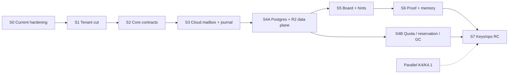
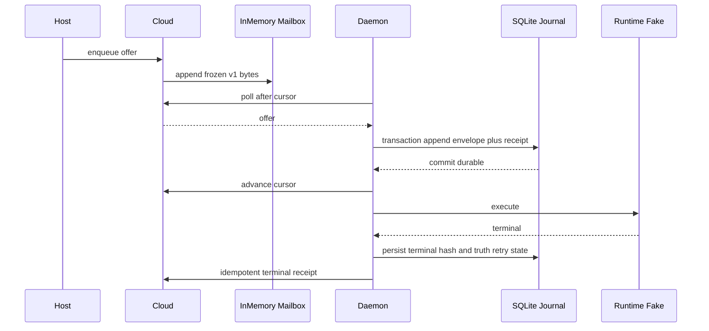

# Sprint 方案：BYOK Platform RAFT-Aligned Delivery

> **Status**: Draft
> **状态**：Draft（提案状态，尚未 Approved、未进入 Executing）/ Ready for contract projection
> **创建日期**：2026-08-07
> **仓库基线**：`Ancienttwo/byok-sdk@ff2a5d4`
> **架构依据**：`docs/architecture/sdk-architecture.md`、`ARCHITECTURE-PROPOSAL-byok-platform.md` §9.2、`docs/researches/tenant-isolation-decision.md` §7
> **RAFT 证据**：`docs/researches/raft-architecture-reference.md`
> **当前 workflow**：**非 Idle**。active plan 是 `plans/plan-20260805-1659-byok-keys-package.md`（Status: Executing），K0–K3 已完成，K4/K4.1 未完成。本 sprint 方案进入 Executing 前，必须先与该 active plan 的 worktree/allowed_paths 协调，不得在其收口前抢占同一 active contract 槽位
> **既有 K 线**：K0–K3 已完成；K4/K4.1 仍待执行，并作为独立跨仓库轨道继续
> **计划跨度**：S0–S7，共 8 个 delivery Sprint（S4 拆为 S4A/S4B）；不含跨团队等待时间
> **执行原则**：验收条件固定，日历可压缩或延长；不得通过减少安全/恢复测试来“按期完成”。本文件不含工期、人力或 story point 估算——排序只表达相对复杂度与依赖，不表达容量承诺

---

## Crosswalk：S0–S7 ↔ P0–P5 ↔ T0–T4

本 sprint 编号是交付批次，不是新的优先级体系。权威编号仍在 `ARCHITECTURE-PROPOSAL-byok-platform.md` §9.2（`:688-699`）与 `docs/researches/tenant-isolation-decision.md` §7（`:249-256`）。

| Sprint | ARCHITECTURE-PROPOSAL §9.2 | tenant-isolation §7 | 对应关系说明 |
| --- | --- | --- | --- |
| S0 | 不在 P 线 | — | 当前 runtime 已知缺口收口（capability honesty、task-level steer、`workspaceHint`）。P0–P5 是平台演进阶段，不覆盖既有 runtime 诚实性修复，故 S0 是 P 线之外的前置收口 |
| S1 | 提前吸收 P4（`:697`）的 `signNonce` domain separation，见下节 | **T0**（`:251`） | 租户 breaking cut。§9.2 的 T0 行（`:690`）标注“即刻可做，先于 P 线任何资料落库” |
| S2 | **P0**（`:692`） | **T1**（`:252`） | `@byok/core` 契约包：零实现、不改既有包、tenant-first port 签名 |
| S3 | **P1**（`:694`） | **T2**（`:253`） | `@byok/cloud` 无状态 handler + mailbox + durable local journal 端到端 |
| S4A / S4B | **P2**（`:695`） | **T3**（`:254`） | Postgres + R2 composition 与 `deploy/sql/` migration。S4A 落数据面 + conformance 套件，S4B 落 quota/reservation/GC（见 D-3） |
| S5 | **P3**（`:696`） | **T4**（`:255`） | board 5 态 + claim/`expectedStatus` CAS + `board_seq` + SSE/轮询 + 两级提示 |
| S6 | **P4**（`:697`），扣除已提前到 S1 的 `signNonce` 修复 | — | device proof 上行 + memory manifest/selector/CAS |
| S7 | **P5**（`:698`）**已移出本 sprint**；承接 §9.2 储备行 C1–C3（`:699`）与 K4（`:693`） | — | ops/release RC。P5（`@byok/keys` profile 持久化接 `TruthStore`）见 `tasks/todos.md` deferred 项 |

T 线与 P 线的耦合点保持 §7 原样：T1 挂 P0、T2 挂 P1、T3 挂 P2、T4 挂 P3；T0 独立于 P 线且先行。

---

## 对已决事项的显式改动

本 sprint 相对两份权威文件有三处实质改动（D-1/D-2/D-3），均为显式声明，不是静默重排；D-4 是 S0 执行期对本文件自身验收字面的显式修订。

### D-1：`signNonce` domain separation 由 P4 提前到 S1

- **原决策**：`ARCHITECTURE-PROPOSAL-byok-platform.md:697`，`signNonce` domain separation 修复列在 P4（device proof 上行）批次内。
- **改动**：移到 S1（story T-006），与 T0 的租户 breaking cut 同一批发布。
- **理由**：两者都是 pair/auth 面的 breaking change，且都要求双端同步。留在 P4 意味着 auth 面要 break 两次；合并到 S1 只 break 一次，且消除 R-016 类“修复被排到最后、随发布压力漏做”的风险——裸 nonce 无 domain separation 是当前源码的实存缺陷（`packages/server/src/auth.ts:155` + `http.ts:125`），不该等到 proof 批次才关。
- **影响**：S6 的依赖行显式声明依赖 S1 的 nonce domain separation；S1 的 rollback 面因此覆盖 nonce 格式（见 S1.5）。

### D-2：I1–I9 入口闸分期，supersede `ARCHITECTURE-PROPOSAL:694` 的字面闸门

- **原决策**：`ARCHITECTURE-PROPOSAL-byok-platform.md:694` 规定 P1 的前置闸是「T0/T1/T2 + **I1–I9 全绿**」。
- **改动**：S3（= P1）入口闸改为 I1/I2/I5/I7/I8/I9 全绿 + I4 的 InMemory 半套；I3 顺延到 S6 入口，I6 顺延到 S5 入口。**本节 supersede `:694` 的字面表述**，S7 的 RC 闸仍然要求 I1–I9 全绿（见 S7.4）。
- **原闸门字面不可满足的原因**（对照 `tenant-isolation-decision.md:237-240`）：
  - **I3**（proof 租户不符 / 重放 / skew）断言的对象是 device proof signer 与 verifier，这两者到 S6（P4）才存在。S3 时无签名面可测。
  - **I4**（store conformance 跨租户不变式）要求 “InMemory 与 SQL 后端跑同一份套件”。SQL 后端到 S4A（P2）才存在，S3 只能跑到 InMemory 一侧。
  - **I6**（`board_seq` 隔离）断言的对象是 board 的 SSE/轮询流与 per-tenant 序列，board 到 S5（P3）才存在。`tenant-isolation-decision.md:240` 自身也标注 “cloud board 测试（P3 併入矩陣）”，与「P1 全绿」互相矛盾。
- **补偿**：三条延后项各自写进承接 Sprint 的 acceptance criteria（S4A 的 I4 SQL 侧、S5 的 I6、S6 的 I3），且 S3 的 I1 路由矩阵必须自动扩展——新增路由未分类时测试自身失败，防止延后期内新增路由绕过矩阵。

### D-3：主生产 storage composition 已裁定为 Postgres + R2，D1 降为 optional post-Beta adapter

- **原决策**：本文件此前把 primary hosted SQL backend 列为 S4A 进入 Executing 前的待决项，默认 Postgres/S3 primary、D1/R2 由 S4B 做 parity，且 parity 是 RC 闸的硬依赖（原 §8 决策行、原 S4B、原 R-018）。**该记录保留**；本条是它的后继裁定，不是把它删掉。
- **改动**：`docs/architecture/sdk-architecture.md` §12.7 与 ADR-020 已裁定主生产组合为 **Postgres + R2**——Postgres 持 domain metadata、quota、usage、reservation 与 object manifest，R2 只持验证过 hash/size 的对象 bytes。选型闸随之取消：S4A 重切为 Postgres + R2 数据面，S4B 重切为 quota/reservation/GC，D1 降为可选 compatibility adapter，不进 Beta/RC 闸（见 S4B.8）。
- **理由**：跨后端 parity 的成本换来的是可移植性声明，而真正阻塞 hosted 上线的是容量安全——并发上传超卖、降级后超限、R2 orphan 累积。把 S4B 的预算从「证明第二后端能跑」换成「证明满额与清理不吃掉用户数据」，才是这一刀的实际收益。
- **影响**：Beta 闸新增 quota/reservation/GC 要求；RC 闸不再要求第二后端 parity；R-018 改述为 quota/GC 迟做的风险；§8 的 backend 选型行改记为已裁定。

### D-4：S0 的 golden 验收从「零变化」修订为「NDJSON 字节冻结 + frozen.json 一次 additive 重生成」

- **原决策**：S0.3 与 §10 exit criteria 要求「protocol golden 零变化」，S0 contract 全禁 `packages/protocol/**`。
- **触发事实**：S0 的 claim 时 capability 快照最初取自 WS `conn.hello.runtimes[]`，实测发现 long-poll-only daemon 从不发送 hello（唯一发送点 `ws-transport.ts:192`；`hub.ts` 纯 long-poll 分支不带 runtimes），快照恒 undefined，fail-closed gate 把整个 long-poll 部署面的 steer 永久禁用——这是行为回归（S0 前 Pi over long-poll steer 可用，5 条既有 E2E 为证），且 contract 的 Falsifier 字面触发。
- **改动**：capability 快照来源改为 `task.claim.capabilities`（additive optional 字段，`RuntimeCapabilitiesSchema` 复用），connection 层退回纯 discovery。据此修订 S0 的 golden 验收：`v1.envelopes.ndjson`（真实 v1 字节语料）保持字节冻结；`v1.frozen.json`（schema 指纹）按 freeze-guard 自身文档化的 additive 路径重生成一次，diff 限定在 `task.claim` 相关键并逐行 review。此为 §2.4「普通 optional field 可 additive 增加」许可条款的正常行使，不是 breaking 变更，`PROTOCOL_VERSION` 保持 1。
- **理由**：三条替代路线均被否决——long-poll 补 hello 注册（无连接生命周期可承载注册状态，server 重启后无重驱动触发器；且需放行 `DAEMON_TO_SERVER_TYPES` 刻意排除的 conn.hello，削弱 WS inbound gate；S3 stateless handler 下 connection-scoped 注册必废）；server 端静态 capability 表（GAP-001 在 server 侧原地复活，对自定义 adapter 按错误方向猜）；gate 拆出 S0（同样要改 contract，交付更少且留下 server 发送 runtime 接不住的 envelope）。gate 的输入必须与它裁决的对象（task）同生命周期。
- **影响**：S0 plan/contract 按此 amendment 扩权（仅 `TaskClaimPayloadSchema` additive + `v1.frozen.json` 重生成；`v1.envelopes.ndjson` 字节不变列入机检）；S0.3 的「protocol golden 零变化」按本条解读；long-poll 与 WS 的 protocol/product 验证不对称是本次的独立发现，记入 `tasks/todos.md` 另刀处理，不并入 S0。

---

## 0. 计划目标

本计划把当前 embedded SDK 演进为同时支持 self-hosted 与 hosted composition 的平台，而不破坏现有安全承诺：

1. 修复当前 capability honesty 与 task-level steer 缺口；
2. 在 durable cloud data 出现前完成 structural tenant cut；
3. 新建 protocol-free `@byok/core`；
4. 新建 stateless `@byok/cloud`；
5. 建立 mailbox → durable local journal → runtime → immutable truth 的可靠路径；
6. 建立 Postgres + R2、storage entitlement/usage/reservation、quota 与 cleanup compositions；
7. 建立 board/presence/activity；
8. 建立 device proof、memory manifest/CAS；
9. 保持 `@byok/keys` 独立，并完成 K4/K4.1；
10. 补齐 deterministic jitter、doctor、quarantine、release/runbook；
11. 全程保持 protocol v1 golden 不漂移。

### 0.1 非目标

本 program 不承诺：

- 复制 RAFT workspace/channel/message 产品；
- 引入 runtime yolo/bypass flags；
- 在 SDK 内实现 updater 或第二层 supervisor；
- 立即实现 credential proxy；
- semantic memory search/merge；
- kernel sandbox；
- live agent migration；
- 将 embedded `TaskHandle` 变成 hosted API；
- `@byok/keys` profile 持久化接 `TruthStore`（P5）——已移出，见 `tasks/todos.md`。

---

## 1. Program 组织

## 1.1 Workstreams

| Track | 名称 | 责任 | 依赖 |
| --- | --- | --- | --- |
| H | Current hardening | capability honesty、steer、workspaceHint、gates | 无 |
| T | Tenant/security | tenant identity、pair/auth、proof foundation | H 可并行部分 |
| C | Core contracts | protocol-free types/store ports/conformance | T identity model |
| P | Hosted platform | cloud handlers、mailbox、board、truth | C |
| L | Local reliability | journal、recovery、jitter、doctor | H/C |
| K | Key plane | K4/K4.1 aip swap、publish、host adapter | 独立；S7 integration 前完成 |
| O | Operations/release | Postgres migrations、R2 composition、quota/GC、runbook、release | P/L |

## 1.2 Critical path



S4B 不在 S5 的实现关键路径上：S5 只依赖 S4A 建立的 Postgres 语义与 conformance 套件，quota/reservation/GC 可与 S5 并行。但 S4B 是 **Beta 闸的硬依赖**——数据面能写不等于容量安全，没有 reservation 与 orphan GC 就不能对外声称 durable hosted storage（见 §12 Beta 闸）。

## 1.3 Merge 单元

每个 Sprint 至少一个 plan + contract；高风险 Sprint 可按可独立回滚的 vertical slice 拆 2–4 个 PR：

- PR-A：schema/contracts
- PR-B：implementation
- PR-C：composition/migration
- PR-D：docs/runbook

禁止把跨 Sprint 的未完成代码藏在默认启用路径。允许 feature flag，但 flag off 路径也必须通过测试。

---

## 2. Program-wide Definition of Ready

一个 Sprint 进入 Executing 前必须具备：

- [ ] 架构章节和 ADR 已存在；
- [ ] active plan、contract、review、notes 已建立；
- [ ] `allowed_paths` 明确，不与其他 active worktree 冲突（当前 K 线 active plan 未收口，尤其适用）；
- [ ] public API / schema / migration impact 已列出；
- [ ] rollback surface 已列出；
- [ ] dependency owner 已确认；
- [ ] security boundary 已标注；
- [ ] happy path、negative path、crash path测试清单已写；
- [ ] protocol golden 是否允许变化有明确答案；本 program 默认“不允许”；
- [ ] store/conformance fixture 可运行；
- [ ] external service 可由 fake/in-memory composition 替代；
- [ ] 未决产品问题不会在实现中临时猜答案。

---

## 3. Program-wide Definition of Done

每个 Sprint 的最低 gate：

```bash
pnpm -r run typecheck
pnpm -r run test
pnpm -r run build
repo-harness run check-task-workflow --strict
git diff --check
git diff --exit-code packages/protocol/src/__tests__/golden/
```

按改动追加：

```bash
pnpm run check:deploy-sql
repo-harness run verify-contract --contract <contract> --strict
```

文档追加：

- 全部 Mermaid fences 成功渲染；
- canonical architecture 唯一；
- 不存在 dangling references；
- CURRENT/TARGET/DEFERRED 与代码一致。

安全与恢复：

- negative tests 不能以 snapshot-only 代替；
- fail-closed 路径必须测试真实错误类型；
- crash drill 必须在指定边界注入；
- tenant matrix 必须自动枚举 route；
- secret/credential audit 不能只 grep source，需观察 child env/trace；
- reviewer 与 implementer 不得是同一执行上下文的自我批准。

---

## 4. Program 里程碑

| Sprint | 结果 | Release signal |
| --- | --- | --- |
| S0 | 当前 capability 与 steer 诚实；架构/计划 canonical | Embedded hardening baseline |
| S1 | structural tenant identity；pair/auth cut（含 nonce domain separation） | Multi-tenant identity foundation |
| S2 | `@byok/core` contracts + conformance skeleton | Platform contract alpha |
| S3 | in-memory hosted mailbox + SQLite local journal E2E | Hosted transport alpha |
| S4A | Postgres + R2 数据面 + 共用 conformance 套件 | Durable hosted data plane beta |
| S4B | quota/reservation 与 cloud cleanup/GC | Durable hosted storage beta |
| S5 | board + SSE/poll + presence/activity | Coordination beta |
| S6 | device proof + memory manifest/CAS | Signed truth candidate |
| S7 | keys 边界 + ops/release hardening | Platform release candidate |

---

## Sprint S0 — 架构收口与当前运行时 Hardening

> **目标**：在开始 hosted platform 前，修复当前源码已知的 capability dishonesty 与 unsafe steer，并把架构、验证、回滚边界变成单一事实源。
> **风险等级**：中；wire shape 不改，但 server/client 双端行为会变化
> **依赖**：无
> **可并行**：K4/K4.1 准备工作

### S0.1 Stories

| ID | Story | 相对复杂度 | 主要路径 |
| --- | --- | --- | --- |
| H-001 | canonical architecture 替换与 RAFT decision matrix | 低 | `docs/architecture/`, sprint plan |
| H-002 | runtime capability 由 adapter 实际能力生成 | 中 | `packages/client/src/adapters`, runtime info |
| H-003 | Claude confirm 对外报告 interactive approval | 低 | client/protocol capability consumer tests |
| H-004 | task record 保存 claimed runtime/capability snapshot | 中 | server store/hub, client task runner |
| H-005 | `steer` 只对该 task 的真实 runtime 开放 | 高 | server API/hub, client handler, typed errors |
| H-006 | unsupported steer 不冻结 cursor，不进入无限 replay | 中 | connection manager/redelivery tests |
| H-007 | `workspaceHint` ADR：接线、重命名或继续 reserved | 低 | architecture/protocol docs |
| H-008 | capability honesty contract tests | 低 | client/server integration tests |

### S0.2 设计要求

#### Capability source of truth

- `RuntimeAdapter.capabilities` 是唯一 runtime-level truth；
- `RuntimeInfo` 从 adapter 生成，不写第二份硬编码表；
- task claim 后记录 actual runtime；
- server 对 task 操作查询 task-level capability；
- connection-level capability 只用于 discovery，不用于 task authorization；
- unknown capability fail-closed。

#### Steer semantics

- Pi：mid-turn steer；
- Claude：不得把 stdin follow-up 冒充 mid-turn steer；
- Codex：不支持；
- server `steer(taskId)` 对 unsupported runtime 返回 stable typed error；
- client 收到理论上不可能的 steer，记录 protocol/authority error 并 ack/隔离，不得永久冻结 cursor；
- race：task terminal 与 steer 同时发生时，terminal 优先，steer 返回 conflict/not-running。

### S0.3 Acceptance criteria

- [x] Claude runtime info 的 interactive approval 与真实 confirm path 一致；
- [x] Pi running task steer 成功；
- [x] Claude/Codex running task steer 在 server 侧被拒，不发送 envelope；
- [x] 伪造 unsupported steer 到 client 不会卡住 cursor；
- [x] reconnect 后同一 envelope 不重复造成第二次 side effect；
- [x] `workspaceHint` 文档与 public API 不再声称未实现功能；
- [x] protocol golden 零变化；
- [x] 全仓 build/typecheck/test 通过；
- [x] architecture Mermaid 全部可渲染；
- [x] review 明确无 credential-isolation 变化。

### S0.4 Rollback

- capability generation 与 steer gate 分成独立 commits；
- rollback 不回退 canonical architecture 的事实修正；
- 如果 task store shape 改动造成兼容成本，保留 optional migration only in test fixture，不发布半接线字段；
- 任何 fallback 到“仍发送 steer，让 adapter 自己 throw”的方案视为 rollback 失败。

### S0.5 Demo

1. 列出三个 runtime capability；
2. Claude confirm approval 通过 local/remote 两条路径；
3. Pi steer 成功；
4. Claude/Codex steer 在 API 层被拒；
5. 注入 unsupported steer，cursor 继续推进。

---

## Sprint S1 — Structural Tenant Identity Cut

> **目标**：在任何 hosted durable data 落库前，使“无 tenant device”在类型、pairing、token、connection 与测试中不可表达；同一批完成 nonce domain separation（见「对已决事项的显式改动」D-1）。
> **风险等级**：高；pair/auth breaking change
> **依赖**：S0；protocol DTO 保持不变
> **对应**：`tenant-isolation-decision.md:251` 的 T0
> **可并行**：K4 实施，但不得修改同一安全文档而无 worktree 协调

### S1.1 Stories

| ID | Story | 相对复杂度 |
| --- | --- | --- |
| T-001 | `PairingCodeClaims {tenantId, productId}` | 中 |
| T-002 | redeem + device registration 原子语义 | 中 |
| T-003 | `DeviceRecord` required tenant/product | 中 |
| T-004 | access token claims 与 authenticated principal | 中 |
| T-005 | `conn.hello.productId` 等值检查 | 低 |
| T-006 | nonce signing domain separation 双端同步（P4 提前项） | 中 |
| T-007 | examples/basic 与 public server API 更新 | 低 |
| T-008 | I2/I5/I8/I9 测试 | 中 |
| T-009 | security docs + migration note | 低 |

### S1.2 API changes

目标 public API：

```ts
interface PairingCodeClaims {
  tenantId: string;
  productId: string;
}

createPairingCode(
  claims: PairingCodeClaims,
  options?: CreatePairingCodeOptions,
): PairingCodeInfo;

redeemPairingCode(code: string): PairingCodeClaims;
```

`PairRequest` DTO 不新增 tenant 字段。设备不能选择自己的 tenant。

Authenticated principal：

```ts
interface AuthenticatedDevice {
  deviceId: string;
  tenantId: TenantId;
  productId: string;
}
```

`keyId` / `keyEpoch` 不进 S1 的 principal：它们是 device proof 的语义，属于 S6 的 `DeviceProofEnvelopeV1` 保护字段（见 S6.2），在 proof 面存在前放进 principal 会造成永远为空的半接线字段。

在 `@byok/core` 尚未落地前，`TenantId` 用 server-local 定义；S2 再迁移到 shared contract，不允许提前让 server 依赖未存在包。

### S1.3 Test matrix

- valid code -> exact tenant/product device；
- code second redeem -> reject；
- expired code -> reject；
- code without claims cannot mint；
- bearer tenant/product vs registry mismatch -> reject；
- `conn.hello.productId` mismatch -> reject；
- revoked device -> challenge/token/connect reject；
- raw nonce signature no longer accepted；
- domain-prefixed signature accepted；
- golden unchanged；
- error response不区分 unknown/wrong tenant/revoked。

### S1.4 Acceptance criteria

- [x] TypeScript 无 optional/default tenant；
- [x] DeviceRegistry 无裸全局 device lookup public path；
- [x] pair code claims 在 redeem 时返回并进入 device record；
- [x] token 绑定 tenant/product/device；
- [x] product mismatch 在 connection registration 前拒绝；
- [x] nonce domain separation 双端同步；
- [x] examples 明确提供 tenant/product；
- [x] I2/I5/I8/I9 通过；
- [x] 无存量 migration 被伪造；release note 明确 breaking；
- [x] keys plane 零改动/零依赖。

### S1.5 Rollback

四包尚未形成 published compatibility contract 时，回滚为单 commit revert。若已发布 alpha，必须 bump pre-release 并提供强制 re-pair；不得同时接受 raw nonce 与 prefixed nonce 形成无限 dual mode。tenant cut 与 nonce domain separation 合并发布，回滚也必须整批回滚——只回滚其中一侧会留下签名格式与 device 行不一致的状态。

---

## Sprint S2 — `@byok/core` 契约与 Conformance Foundation

> **目标**：建立 protocol-free、Node-free 的平台契约层，以及所有后续 composition 共用的行为测试。
> **风险等级**：中；纯加性，但错误契约会向后传染
> **依赖**：S1 identity terminology
> **对应**：P0（`ARCHITECTURE-PROPOSAL:692`）+ T1（`tenant-isolation-decision.md:252`）
> **可并行**：K4/K4.1

### S2.1 Stories

| ID | Story | 相对复杂度 |
| --- | --- | --- |
| C-001 | scaffold `packages/core` | 低 |
| C-002 | branded `TenantId` + principals | 中 |
| C-003 | MailboxStore contracts | 中 |
| C-004 | BoardStore contracts + transition/CAS errors | 中 |
| C-005 | TruthStore + revision/immutability contracts | 中 |
| C-006 | Presence/Activity contracts | 低 |
| C-007 | Blob/Object metadata contracts | 低 |
| C-008 | StorageEntitlement/Usage/Reservation/Retention contracts | 中 |
| C-009 | DeviceProof schema/canonicalizer ports | 中 |
| C-010 | Capability declaration schema | 低 |
| C-011 | InMemory reference + conformance harness | 低 |

### S2.2 Core constraints tests

- package has no `@byok/protocol` dependency；
- package has no `node:` import；
- public API exports only contracts/schemas/errors/reference in-memory；
- every store method tenant-first；
- `TenantId` casts only in auth fixture/approved factory；
- board vocabulary contains no wire state names；
- presence vocabulary contains no board/wire names；
- terminal immutable behavior；
- revision conflict behavior；
- mailbox read does not ack；
- quota contract only accepts numeric entitlements, never plan names/prices；
- `committed + reserved <= hardLimit` and entitlement version CAS are deterministic；
- content hash format stable；
- canonical proof bytes deterministic across key insertion order。

### S2.3 Suggested files

```text
packages/core/
├── package.json
├── src/
│   ├── tenant.ts
│   ├── principals.ts
│   ├── mailbox.ts
│   ├── board.ts
│   ├── truth.ts
│   ├── presence.ts
│   ├── blob.ts
│   ├── quota.ts
│   ├── attestation.ts
│   ├── capabilities.ts
│   ├── errors.ts
│   ├── stores.ts
│   ├── in-memory/
│   └── index.ts
└── src/__tests__/
    ├── conformance/
    ├── tenant.test.ts
    ├── board.test.ts
    └── attestation.test.ts
```

### S2.4 Acceptance criteria

- [x] core build/package succeeds on Node 20/22（Node 20 leg via PR CI）；
- [x] source import scan proves protocol-free/Node-free；
- [x] tenant-first method inventory test（I7）；
- [x] board transitions and conflicts are deterministic；
- [x] terminal conflict returns existing snapshot；
- [x] memory/profile `expectedRev` semantics fixed；
- [x] quota/usage/reservation contract includes version CAS、no-overcommit invariant and stable errors；
- [x] proof canonicalization golden created outside protocol golden；
- [x] InMemory composition passes complete conformance；
- [x] no existing package runtime behavior changes；
- [x] architecture package graph updated from TARGET to partial CURRENT.

### S2.5 Rollback

Delete `packages/core` and workspace entry. No existing package may depend on core until its contract suite passes; dependency PRs merge after core PR.

---

## Sprint S3 — Hosted Mailbox + SQLite Durable Local Journal E2E

> **目标**：建立第一条 hosted vertical slice：stateless cloud handler → mailbox → existing daemon → SQLite durable local journal → runtime → terminal receipt，并证明本地积压不会无界增长，也不会在磁盘压力下静默丢任务。
> **风险等级**：很高；可靠性与本机磁盘安全核心
> **依赖**：S2
> **对应**：P1（`ARCHITECTURE-PROPOSAL:694`）+ T2（`tenant-isolation-decision.md:253`）
> **入口闸**：I1/I2/I5/I7/I8/I9 全绿 + I4 的 InMemory 半套。I3 顺延 S6、I6 顺延 S5——本闸门 supersede `ARCHITECTURE-PROPOSAL:694` 的「I1–I9 全绿」字面表述，理由见「对已决事项的显式改动」D-2
> **可并行**：K4；Postgres/R2 composition 不在本 Sprint

### S3.1 Stories

| ID | Story | 相对复杂度 |
| --- | --- | --- |
| P-001 | scaffold `@byok/cloud` | 低 |
| P-002 | auth middleware + TenantStores facade | 中 |
| P-003 | route inventory + I1 matrix skeleton | 中 |
| P-004 | in-memory pair/challenge/token handlers | 中 |
| P-005 | frozen-v1 events/messages/blob handlers | 高 |
| L-001 | `LocalTaskJournal` port + production `SqliteLocalTaskJournal` | 高 |
| L-002 | cursor ack only after SQLite transaction commit | 中 |
| L-003 | local storage usage、watermarks、分类 GC、WAL checkpoint/compaction | 高 |
| P-006 | `/byok/capabilities` | 低 |
| P-007 | E2E/crash/disk-pressure injection suite | 中 |

> L 轨编号顺移：本 Sprint 新增 L-003 后，S7 的 reliability hardening 四项由 L-003–L-006 顺移为 L-004–L-007。

### S3.2 Vertical slice



### S3.3 Journal contract

Minimum API:

```ts
interface LocalTaskJournal {
  appendEnvelope(record: ReceivedEnvelopeRecord): Promise<JournalReceipt>;
  recordAdmission(record: AdmissionRecord): Promise<void>;
  recordTransition(record: LocalTransitionRecord): Promise<void>;
  recordTerminal(record: LocalTerminalRecord): Promise<void>;
  listRecoverable(): Promise<RecoverableTask[]>;
  markRecovered(taskId: string, outcome: RecoveryOutcome): Promise<void>;
  measureUsage(): Promise<LocalStorageUsage>;
  listCleanupCandidates(now: Date, limit: number): Promise<CleanupCandidate[]>;
  markCleanupResult(result: CleanupResult): Promise<void>;
  compact(options: CompactOptions): Promise<CompactResult>;
}
```

Properties：

- SQLite `WAL`、`foreign_keys=ON`、ack-critical `synchronous=FULL`；
- envelope、idempotency receipt 与 cursor-advance eligibility 同一 transaction；
- single writer queue + bounded busy timeout；
- bounded record size；大 artifact/workspace 不进 SQLite；
- secure directory；
- idempotency by envelope/task transition id；
- corrupt DB/state quarantine；
- no full prompt/tool output by default；
- Windows path/security test；
- batch cleanup、WAL checkpoint、incremental vacuum 不阻塞 active task；
- file/JSONL compatibility adapter 不能在 hosted production 默认启用。

### S3.4 Crash and disk-pressure drills

Inject crash at：

1. before local append；
2. after SQLite commit, before ack；
3. after ack, before admission；
4. after claim, before runtime start；
5. after terminal local record, before cloud receipt；
6. after cloud receipt, before local completion mark。

Inject storage pressure at：

7. soft watermark；
8. hard watermark while idle；
9. hard watermark while a task is Running；
10. SQLite disk-full/IO error before commit；
11. large WAL requiring checkpoint；
12. cleanup worker crash after file delete but before metadata mark, and vice versa。

For each point assert no lost task, no duplicate side effect, stable recovery status, and no automatic deletion of protected/recovery data.

### S3.5 Acceptance criteria

- [ ] existing daemon runs against in-memory cloud using long-poll；
- [ ] frozen v1 bytes round-trip unchanged；
- [ ] ack watermark cannot advance before SQLite commit；
- [ ] crash matrix and disk-pressure matrix pass；
- [ ] local usage reports journal/cache/log/workspace/quarantine separately；
- [ ] soft pressure cleans only rebuildable/expired categories；
- [ ] hard pressure rejects new task admission but allows terminal flush、delete、export、doctor；
- [ ] unacked/running/recovery/quarantine records are never auto-deleted；
- [ ] WAL checkpoint/compaction behavior is bounded and observable；
- [ ] I1 route inventory contains every registered route，未分类路由使测试自身失败；
- [ ] tenant B cannot read/write tenant A fixture；
- [ ] `/capabilities` drives transport/feature selection；
- [ ] 404/405/501 sniffing absent；
- [ ] `@byok/cloud` handlers remain stateless；
- [ ] no cloud Running/session map；
- [ ] client still passes self-hosted server tests。

### S3.6 Rollback

Cloud package is additive. Client SQLite journal integration ships behind hosted composition/config until crash suite passes. Rollback disables hosted mode but preserves `daemon.db`、WAL、workspaces and recovery evidence; no rollback path converts back to a lossy file journal or deletes the database automatically.

---

## Sprint S4A — Postgres + R2 数据面与共用 Conformance 套件

> **目标**：把 S3 的 in-memory 行为搬到已裁定的主生产组合 **Postgres + R2** 上，并建立此后所有 composition 共用的 conformance 套件。
> **风险等级**：高；schema 与迁移一旦发布即难改
> **依赖**：S3
> **对应**：P2（`ARCHITECTURE-PROPOSAL:695`）+ T3（`tenant-isolation-decision.md:254`）的数据面部分
> **已裁定**：主生产 backend 为 Postgres + R2（见 §8 与 D-3）。本 Sprint 不再有 backend 选型闸；D1 只作为 optional post-Beta adapter，不阻塞任何闸门

### S4A.1 Stories

| ID | Story | 相对复杂度 |
| --- | --- | --- |
| O-001 | ordered Postgres migrations + schema ownership | 中 |
| O-002 | Postgres Mailbox/Device/Receipt stores | 高 |
| O-003 | Postgres Board/Truth/Presence stores | 高 |
| O-004 | R2 tenant-scoped object adapter + presign/hash/HEAD | 中 |
| O-005 | migration/domain conformance CI（套件本身在此定型） | 中 |
| O-006 | deployment env/runbook skeleton 实装 | 低 |

> O 轨编号顺移：S4 重切为数据面（S4A）与 quota/GC（S4B）后，O 轨按 S4A → S4B → S7 顺序重排；S7 的 operations 四项由 O-010–O-013 顺移为 O-013–O-016。

### S4A.2 Schema minimum

Domain / reliability：

- `device`
- `pairing_code`
- `auth_nonce`
- `task`
- `tenant_stream`
- `outbox`
- `device_stream`
- `inbound_dedup`
- `device_request_receipts`
- `attested_record`
- `device_presence`
- `activity_tail`

所有 domain table 使用 tenant-prefixed composite keys；nonce/presigned capability 即使随机，也在 row 内保存 tenant。R2 key 使用 `tenants/<tenantId>/objects/sha256/<hash>`，不做跨租户 dedupe。storage/quota 相关 schema 属 S4B（见 S4B.2）。

### S4A.3 Conformance dimensions（套件定义）

| Dimension | InMemory | Postgres + R2 |
| --- | --- | --- |
| tenant isolation | required | required |
| claim/status CAS | required | required |
| per-tenant seq | required | required |
| mailbox read/ack | required | required |
| terminal immutable | required | required |
| revision CAS | required | required |
| idempotency receipt | required | required |
| TTL cleanup | deterministic clock | SQL clock |
| transaction atomicity | simulated | native |

套件必须以 composition 为参数，新增 composition 只提供 factory，不改断言——这是 S4B 的 quota composition 与将来的 optional D1 adapter 都能不改测试就跑通的前提。

### S4A.4 Object tests

- same hash duplicate upload idempotent；
- size/hash/content type mismatch reject；
- tenant/resource-bound presign；
- expired presign；
- object exists before truth reference；
- range/large response limits；
- no key/path traversal；
- cross-tenant hash 不产生 existence oracle；
- R2 transient error/backoff/idempotency。

> reservation-bound presign、finalize crash 矩阵与 orphan tombstone 测试属 S4B（见 S4B.4）。

### S4A.5 Acceptance criteria

- [ ] migrations pass order check；
- [ ] fresh install + migrate-up；
- [ ] rollback strategy documented；destructive down migration not required；
- [ ] InMemory 与 Postgres + R2 两个 composition 跑同一份 domain/object contract suite；
- [ ] **I4 的 SQL 侧补齐**（S3 延后项，见 D-2）；
- [ ] no naked task/device/object index，也没有跨租户 object key；
- [ ] mailbox retention behavior documented；
- [ ] cross-tenant query plan cannot use a naked key path；
- [ ] Postgres optional RLS hardening documented but not relied upon；
- [ ] deploy/ no longer only `.gitkeep`；
- [ ] `pnpm run check:deploy-sql` 通过；
- [ ] secrets/environment sample excludes real keys。

### S4A.6 Rollback

Migrations are forward-only additive in this Sprint. Rollback application code can leave unused tables. No column/drop operation. No rollback path deletes R2 objects. Object prefixes versioned so old/new readers do not collide.

---

## Sprint S4B — Quota、Reservation 与 Cloud Cleanup

> **目标**：在 S4A 的数据面之上，建立免费/付费套餐可复用的数值 entitlement、原子 usage/reservation、超限保护、retention/dead-letter 与 R2 GC/reconciliation。
> **风险等级**：极高；Postgres/R2 跨系统一致性、并发超卖与用户数据删除风险
> **依赖**：S4A（数据面与 conformance 套件）
> **对应**：P2（`ARCHITECTURE-PROPOSAL:695`）的容量与清理部分
> **关键路径**：不阻塞 S5 的实现，但**是 Beta 闸的硬依赖**（见 §12）

### S4B.1 Stories

| ID | Story | 相对复杂度 |
| --- | --- | --- |
| O-007 | `StorageEntitlement` / `StorageUsage` contracts + control-plane sync | 中 |
| O-008 | transactional reservation/finalize/abort + 并发 quota enforcement | 高 |
| O-009 | retention/TTL jobs + mailbox expired/dead-letter 语义 | 中 |
| O-010 | R2 orphan tombstone/delete/reconcile worker | 高 |
| O-011 | quota/GC conformance + load/crash CI job（复用 S4A 套件，仅加维度） | 中 |
| O-012 | quota/cleanup metrics 与 support runbook | 中 |

### S4B.2 Schema minimum

Storage / quota：

- `storage_entitlement`
- `storage_usage`
- `storage_reservation`
- `object_manifest`
- `object_reference`
- `tenant_retention_policy`
- `cleanup_job` / `gc_cursor`

### S4B.3 Entitlement 与计量契约

SDK 只接受版本化数值 entitlement，代码里不出现 `free`、`pro`、价格或支付状态。至少验证：

- `hardLimitBytes`、`maxObjectBytes`、`maxInlineBytes`；
- `committedObjectBytes + committedInlineBytes + reservedBytes <= hardLimitBytes`；
- 同 tenant 同 hash 多 reference 只计一次；
- mailbox bytes、record count、rate limit 是独立的 operational limits；
- upgrade 即时扩容；downgrade 可进入 grace，但不自动删除 durable data；
- entitlement version CAS，旧版本更新不能覆盖新版本。

### S4B.4 Reservation 与 object 测试

- 100 个并发 reservation 在 limit 边界只有可容纳者成功，绝不超卖；
- same request/reservation id 幂等；
- size/hash/content type mismatch reject，且 reserved bytes 释放；
- tenant/resource/reservation-bound presign；
- expired/aborted reservation；
- upload succeeded but finalize crashed；
- finalize committed but response lost；
- truth reference removed 后进入 grace，不立即删除；
- orphan tombstone/delete/reconcile 的每个 crash point。

### S4B.5 Cleanup 与满额行为

自动清理仅允许：TTL hints/nonces/receipts、已 ack mailbox、expired reservation、R2 orphan。未 ack mailbox 过 retention 时进入显式 expired/dead-letter，不静默删除。durable truth/board/memory/profile/terminal 不因 quota 满而被自动删除。

Hard-limit behavior：

- reject new durable writes with stable `storage_quota_exceeded`；
- allow read/delete/export/usage/entitlement update；
- allow previously reserved upload/finalize；
- task admission must reserve `maxOutputBytes` before runtime start；
- downgrade over-limit uses grace then write suspension；
- small bounded failure metadata uses system reserve。

### S4B.6 Acceptance criteria

- [ ] quota concurrent reservation test proves no overcommit；
- [ ] usage cannot become negative or drift after retry/crash；
- [ ] entitlement version/downgrade grace behavior passes；
- [ ] hard limit rejects new durable writes while read/delete/export continue；
- [ ] durable user data is never auto-deleted to make room；
- [ ] mailbox retention/dead-letter behavior documented and tested；
- [ ] R2 orphan GC uses tombstone + grace + reconciliation；
- [ ] quota/usage/GC metrics 与 support runbook 存在；
- [ ] quota composition 复用 S4A 套件，domain 断言零改动。

### S4B.7 Rollback

Migrations are forward-only additive. Rollback application code may leave unused quota/object tables and R2 objects. No rollback automatically deletes objects or rewrites usage. A reconciliation command must be able to rebuild `storage_usage` from Postgres manifests before re-enabling writes.

### S4B.8 D1：optional post-Beta adapter

原 S4B 的「第二后端 D1/R2 parity」不再是必过闸门。主生产组合已裁定为 Postgres + R2（D-3），D1 降为**可选 compatibility adapter**：若将来要发布，它复用 S4A 定型的同一份 conformance 套件（断言零改动，只换 factory），并各自记录事务、时钟、批处理的语义差异到 runbook。它不进入 Beta 或 RC 闸，也不影响主线的容量、计费与 GC 语义；不做它不构成交付缺口。

---

## Sprint S5 — Board、SSE/Poll 与 Presence/Activity

> **目标**：建立共享协调面，并严格与 wire execution/truth 分离。
> **风险等级**：高；并发与 UI 语义
> **依赖**：S4A 的 Postgres semantics（不依赖 S4B）
> **对应**：P3（`ARCHITECTURE-PROPOSAL:696`）+ T4（`tenant-isolation-decision.md:255`）
> **入口闸**：I6 在本 Sprint 补齐（S3 延后项，见 D-2）
> **产品决策**：`closed` 继续采用“终止未验收”；admin override 单独 capability

### S5.1 Stories

| ID | Story | 相对复杂度 |
| --- | --- | --- |
| B-001 | board create/list/incremental | 中 |
| B-002 | claim/unclaim CAS + holder snapshot | 中 |
| B-003 | status expectedStatus CAS | 中 |
| B-004 | per-tenant `board_seq` | 中 |
| B-005 | SSE stream + Last-Event-ID | 中 |
| B-006 | poll fallback + explicit capability | 低 |
| B-007 | 120s reconciliation | 低 |
| B-008 | presence 5-level TTL | 低 |
| B-009 | activity tail + dropped | 低 |
| B-010 | I6 and concurrency suite | 低 |

### S5.2 Board invariants

- status 与 assignee 独立；
- claim 只有一个 winner；
- loser 收到 holder snapshot + observedAt；
- status update 不做 last-write-wins；
- terminal receipt最多自动推动到 `in_review`；
- `done` 需要 review acceptance；
- board title/channel 是 bounded producer labels；
- cloud 不从 instruction/result生成 title；
- board row 是当前状态，不另建容易漂移的 event table；
- `board_seq` 支持增量但不是完整历史；
- reconciliation 修复中间多次更新被压缩的问题。

### S5.3 SSE behavior

- `id: board_seq`
- heartbeat comment every bounded interval
- no transaction held across sleep
- periodic query returns connection to pool
- reconnect uses last event id
- idle watchdog
- full reconciliation event
- capability says no SSE -> first-class polling
- SSE temporary 5xx -> retry, not permanent downgrade
- auth/tenant revoked -> stop

### S5.4 Presence/activity bounds

- presence update ≤ configured minimum interval；
- activity batches reuse ProgressBatcher seam；
- per-task max events/bytes；
- dropped cumulative or batch explicit定义；
- TTL expiry tested with fake clock；
- stale hints never produce wire state；
- high write pressure can move to KV/DO without handler contract change。

### S5.5 Acceptance criteria

- [ ] 100 concurrent claim -> exactly one success；
- [ ] loser response includes holder snapshot；
- [ ] expectedStatus conflict returns current snapshot；
- [ ] A/B tenant streams never cross；
- [ ] **I6 通过**（S3 延后项）；
- [ ] SSE/poll pass same behavior suite；
- [ ] forced dropped stream event repaired by reconciliation；
- [ ] presence expiry removes hint；
- [ ] activity dropped visible；
- [ ] no RAFT-style status sniffing；
- [ ] board status vocabulary never leaks into wire state；
- [ ] I1 matrix auto-expands for new routes。

### S5.6 Rollback

Board routes can be disabled via capability/config while preserving rows. Do not rewrite wire task state to emulate board. SSE may be disabled independently, polling remains first-class.

---

## Sprint S6 — Device Proof、Truth Write 与 Memory Manifest/CAS

> **目标**：为上行事实建立 body-bound device provenance，并提供云端不做语义推导的 memory 读写。
> **风险等级**：很高；签名格式一旦发布即难改
> **依赖**：S5 + S1 nonce domain separation（D-1 提前项）+ S2 canonicalizer
> **对应**：P4（`ARCHITECTURE-PROPOSAL:697`），扣除已在 S1 完成的 `signNonce` domain separation
> **入口闸**：独立 security review；I3 在本 Sprint 补齐（S3 延后项，见 D-2）

### S6.1 Stories

| ID | Story | 相对复杂度 |
| --- | --- | --- |
| A-001 | freeze `device-proof-v1.golden.json` | 中 |
| A-002 | daemon proof signer | 中 |
| A-003 | cloud proof verifier/auth middleware | 高 |
| A-004 | request receipt replay/idempotency | 中 |
| A-005 | terminal immutable write | 中 |
| M-001 | memory/profile manifest endpoints | 中 |
| M-002 | local `MemorySelector` seam | 中 |
| M-003 | object fetch/hash/filter path | 低 |
| M-004 | snapshot `expectedRev` CAS | 低 |
| A-006 | I3 + adversarial signature suite | 低 |

### S6.2 Proof protected claims

至少覆盖：

- version
- tenantId
- productId
- deviceId
- keyId
- keyEpoch
- requestId
- operation
- resource
- method/path or stable operation id
- bodySha256
- bodySize
- issuedAt
- optional expiry/nonce policy

`keyId` / `keyEpoch` 的语义在此定义（S1 的 `AuthenticatedDevice` 不含这两个字段）：它们是签名密钥的标识与轮换代，由 proof 校验时对照 device row 判定，不是 pairing 时的 principal 属性。

禁止签名只覆盖 payload body 而不绑定 operation/resource；禁止信任 client claims 而不查询 device row。

### S6.3 Adversarial tests

- valid signature/wrong tenant；
- valid signature/wrong product；
- valid signature/revoked key；
- old key epoch；
- body altered after signing；
- resource/path altered；
- requestId exact replay；
- requestId different body；
- clock skew；
- key not found；
- malformed canonical number/string；
- different JSON key order；
- large body via object ref；
- terminal same hash replay；
- terminal different hash conflict。

### S6.4 Memory behavior

Read：

1. list manifest；
2. local selector chooses keys；
3. fetch selected bodies；
4. verify hash；
5. local filtering/distillation；
6. only filtered context enters runtime。

Write：

1. each key is full snapshot；
2. upload body/object；
3. sign metadata/hash；
4. `expectedRev` CAS；
5. conflict -> re-fetch manifest and local decision；
6. cloud never merge。

### S6.5 Acceptance criteria

- [ ] proof golden stable across Node/Workers runtime；
- [ ] all protected fields body/resource-bound；
- [ ] DB row is tenant/device authority；
- [ ] **I3 通过**（S3 延后项）；
- [ ] replay exact result idempotent；
- [ ] requestId/body mismatch conflict；
- [ ] terminal immutable；
- [ ] memory manifest contains metadata, not body；
- [ ] cloud source contains no embedding/semantic merge path；
- [ ] selector unit/integration tests；
- [ ] snapshot >1 MiB metric/revisit trigger documented；
- [ ] security review passes before capability default-on。

### S6.6 Rollback

Proof-enabled write routes remain capability-gated until production review. Do not introduce unsigned fallback. Rollback disables new write capability; existing signed records remain readable.

---

## Sprint S7 — Keys 边界、Operations 与 Release Candidate

> **目标**：确认 keys plane 与平台线的依赖边界，补齐 fleet reliability、doctor/quarantine、release/runbook，并形成 RC。
> **风险等级**：高；跨 package、跨 repo、发布与运维
> **依赖**：S6、S4B；K4/K4.1 必须完成
> **对应**：§9.2 储备行 C1–C3（`ARCHITECTURE-PROPOSAL:699`）与 K4（`:693`）。**P5（`:698`，`@byok/keys` profile 持久化接 `TruthStore`）已移出本 sprint**——见 `tasks/todos.md` deferred 项
> **可拆**：S7A integration / S7B operations

### S7.1 Stories

| ID | Story | 相对复杂度 |
| --- | --- | --- |
| K-401 | 完成 K4 publish/aip dependency swap | 独立 track |
| K-402 | K4.1 aip-side settings adapter | 独立 track |
| K-502 | default secret-store factory/data scope decisions | 中 |
| K-503 | generic testConnection 或 host adapter定案 | 低 |
| L-004 | deterministic reconnect jitter | 中 |
| L-005 | health window + crash budget | 中 |
| L-006 | local corrupt-state quarantine | 中 |
| L-007 | doctor/status/support bundle | 中 |
| O-013 | hosted/self-hosted runbooks | 中 |
| O-014 | release signing/updater responsibility contract | 低 |
| O-015 | load/reconnect/retention tests | 中 |
| O-016 | RC security/audit review | 低 |

> `@byok/keys` 的 profile 持久化接 `TruthStore`（原 K-501，即 `ARCHITECTURE-PROPOSAL:698` 的 P5）不在本 Sprint：它挂在 K4 之后，而 K4/K4.1 属于已封口的 K 线 active plan，不能由本 sprint 追加任务。**见 `tasks/todos.md` deferred 项**，触发条件是 K4/K4.1 收口且 `@byok/core` TruthStore 落地。

### S7.2 Keys integration boundary

允许：

- `keys -> core` 的 profile/truth contract（在上述 deferred 项被触发后才实现）；
- host injects `TruthStore` adapter；
- profile metadata/hash/revision 上云；
- secret 留在 OS credential store；
- conflict 由 local host/registry resolution；
- status 不泄露 secret。

禁止：

- `keys -> protocol`；
- `client/server/cloud -> keys`；
- provider secret进入 truth/object；
- cloud构造 provider client；
- dispatch daemon调用 key registry。

本 Sprint 的验收面是**边界本身**（依赖图不变式 + K4 golden parity），不是 profile 上云的实现。

### S7.3 Reliability hardening

#### Deterministic jitter

- stable seed；
- reconnect/upload/maintenance 分不同 domain seed；
- bounds test；
- fleet simulation；
- no jitter on explicit operator immediate retry unless documented。

#### Health/quarantine

- sliding failure window；
- degraded/recovering/healthy operational state，不复用 presence/wire；
- corrupt journal/store moved to timestamped quarantine；
- quarantine manifest records reason/hash/source path；
- doctor reports only；
- `doctor --fix` requires explicit confirmation/flag；
- no automatic destructive cleanup。

#### Support bundle

- config summary
- versions
- runtime detection
- recent structured events
- health snapshots
- crash/quarantine metadata
- hashes/sizes, not secrets/prompt bodies
- explicit redaction report

### S7.4 Release candidate gates

- [ ] K4 golden test in aip passes unchanged；
- [ ] 包依赖图 obeys dependency rules；
- [ ] all shipped compositions pass conformance（InMemory、Postgres + R2、self-hosted；optional D1 adapter 若已发布也在内）；
- [ ] **I1–I9 全部通过**——D-2 的分期到此闭合，RC 闸不接受任何延后项；
- [ ] crash drills pass；
- [ ] reconnect fleet simulation has bounded peak；
- [ ] credential-isolation audit passes；
- [ ] proof security review pass；
- [ ] production migration/runbook pass；
- [ ] support bundle redaction review；
- [ ] packageability/service smoke on macOS/Linux/Windows；
- [ ] protocol golden unchanged；
- [ ] changelog explains self-hosted/hosted semantic differences；
- [ ] architecture status updated to CURRENT/TARGET accurately。

### S7.5 Rollback

- hosted capabilities individually disableable；
- migrations additive；
- binary/update owned by host, rollback channel documented；
- quarantine data never deleted during rollback；
- proof/truth records backward readable；
- release tag only after independent audit.

---

## Parallel Track K4/K4.1 — `@byok/keys` 回接 aip-main-open

> **不纳入 S0–S6 critical path。** 它属于当前 active plan `plans/plan-20260805-1659-byok-keys-package.md`（Executing）的未完成任务，本 sprint 不重新定义其范围，只记录依赖：S7 的 keys 边界验收依赖其结果；`tasks/todos.md` 中移出的 P5 项也以其收口为触发条件。

### K4.1 Tasks

- [ ] diff `aip-main-open@c6a5385..HEAD` 相关文件；
- [ ] 决定 npm public vs GitHub Packages；
- [ ] publish exact package version；
- [ ] delete duplicated ported implementation；
- [ ] switch dependency；
- [ ] convert `instanceof LocalExecutionError` to structured code detection；
- [ ] preserve byte-compatible defaults via constructor injection；
- [ ] run `apps/local-agent/src/settings.test.ts` unchanged；
- [ ] create thin settings adapter for surfaces generic registry does not expose；
- [ ] settle default secret-store factory；
- [ ] settle local account data-scope manifest；
- [ ] decide generic `testConnection()` vs aip-only adapter；
- [ ] independent PR/rollback/release notes。

### K4.2 Stop conditions

- golden test requires edits to expected wire result；
- any change forces `client/server/protocol` to import `keys`；
- unprefixed legacy Keychain data handling remains unknown；
- profile SQLite migration cannot be made non-destructive；
- package publication provenance/signing not decided。

---

## 5. Cross-Sprint Security Matrix

| Control | S0 | S1 | S2 | S3 | S4A/S4B | S5 | S6 | S7 |
| --- | --- | --- | --- | --- | --- | --- | --- | --- |
| capability honesty | build | verify | contract | E2E | regression | board ops | proof ops | RC |
| tenant identity | prep | implement | type | handler | schema | stream | proof | audit |
| protocol freeze | gate | gate | gate | gate | gate | gate | gate | gate |
| credential isolation | regression | regression | graph | child env | deploy | hints | proof | audit |
| mailbox reliability | design | — | contract | implement | durable | regression | regression | load |
| truth immutability | design | — | contract | receipt stub | durable | terminal hook | implement | audit |
| storage quota / deletion safety | design | — | contract | 本机磁盘压力 | reservation + GC | regression | truth refs | audit |
| policy fail-closed | implement | regression | — | E2E | regression | regression | proof op | RC |
| updater trust | doc | — | — | — | deploy owner | — | — | runbook |

---

## 6. Cross-Sprint Test Matrix

| Test suite | Owner Sprint | 后续频率 |
| --- | --- | --- |
| protocol golden/freeze | existing/S0 | every PR |
| adapter capability contract | S0 | every client PR |
| task-level steer | S0 | every server/client PR |
| pairing tenant | S1 | every auth PR |
| nonce domain separation | S1 | every auth PR |
| core store conformance | S2 | every composition PR |
| route inventory/I1 | S3 | every cloud route PR |
| journal crash matrix | S3 | every client/cloud PR |
| 本机 SQLite journal cleanup/disk pressure | S3 | every client storage PR |
| Postgres domain store conformance（含 I4 SQL 侧） | S4A | CI |
| R2 object adapter contract | S4A | CI |
| Postgres + R2 reservation/quota/GC | S4B | CI/load/crash |
| board CAS concurrency | S5 | CI/load |
| SSE/poll parity | S5 | CI |
| board_seq 隔离/I6 | S5 | CI |
| proof adversarial/I3 | S6 | every proof PR |
| memory CAS | S6 | CI |
| reconnect fleet simulation | S7 | release |
| credential isolation audit | existing/S7 | release |
| package/service smoke | existing/S7 | release |

---

## 7. Risk Register

| ID | Risk | Likelihood | Impact | Owner Sprint | Mitigation |
| --- | --- | --- | --- | --- | --- |
| R-001 | current canonical docs 与代码继续漂移 | 中 | 中 | S0 | CI doc checks + snapshot metadata |
| R-002 | steer fix仍以 connection capability代替 task capability | 中 | 高 | S0 | claimed runtime snapshot + negative E2E |
| R-003 | tenant optional/default 偷渡 | 中 | 极高 | S1 | type/schema/SQL triple reject |
| R-004 | raw nonce compatibility 双模式永久存在 | 中 | 高 | S1 | single breaking cut，no silent fallback |
| R-005 | core import protocol/Node | 低 | 高 | S2 | source/package invariant tests |
| R-006 | journal ack ordering错误 | 中 | 极高 | S3 | crash injection + durable receipt |
| R-007 | handler漏 tenant | 中 | 极高 | S3+ | route inventory exhaustive matrix |
| R-008 | SQLite journal/WAL/cleanup 在磁盘压力下损坏，或删错 protected data | 中 | 极高 | S3 | crash+disk-full 矩阵、分类 allowlist、quarantine |
| R-009 | Postgres/R2 reservation finalize 漂移导致超卖、usage 泄漏或 orphan 累积 | 高 | 极高 | S4B | transactional reservation、幂等、reconciler |
| R-010 | board status与wire state混用 | 中 | 高 | S5 | vocabulary tests + separate modules |
| R-011 | SSE temporary error误判能力缺失 | 中 | 中 | S5 | explicit capabilities |
| R-012 | proof canonical bytes发布后变更 | 中 | 极高 | S6 | golden + independent review |
| R-013 | cloud开始做 semantic memory logic | 中 | 高 | S6 | source boundary/review checklist |
| R-014 | keys integration污染 dispatch依赖图 | 低 | 极高 | S7 | graph invariant |
| R-015 | reconnect herd | 高 | 中 | S7 | deterministic jitter simulation |
| R-016 | updater只有同源hash | 中 | 极高 | S7/host | signed manifest trust root |
| R-017 | K4跨仓库协作延误 | 高 | 中 | Parallel | independent critical path |
| R-018 | S4B 迟迟不做，Beta 只有数据面没有容量保护 | 中 | 极高 | S4B | quota/GC CI 常驻；Beta 闸把 S4B 列为硬依赖 |
| R-019 | feature flags掩盖未测试path | 中 | 中 | all | both on/off behavior tests |
| R-020 | support bundle泄露secret/prompt | 中 | 高 | S7 | allowlist + redaction audit |
| R-021 | D-2 的 I3/I4/I6 延后被遗忘，RC 闸才发现 | 中 | 高 | S4A/S5/S6 | 三条各自写入承接 Sprint 的 acceptance；S7.4 显式复核 |
| R-022 | 套餐降级后系统为腾空间自动删除 durable user data | 中 | 极高 | S4B | grace + write suspension；destructive cleanup 禁止 |
| R-023 | SQL outbox retention与ring语义混淆 | 高 | 中 | S4B | expired/dead-letter、runbook、metrics、explicit config |

---

## 8. Product/Architecture Decision Deadlines

| 决策 | Deadline | 默认选择 |
| --- | --- | --- |
| primary hosted storage composition | 已裁定（见 D-3） | Postgres + R2；D1 为 Beta 之后的 optional adapter |
| quota accounting unit | S4B planning day 1 | tenant R2 committed bytes + inline payload bytes；metadata 用 count/size limits |
| quota downgrade policy | S4B planning day 1 | 可配置 grace；之后 suspend new writes；never auto-delete durable truth |
| local storage watermarks | S3 planning day 1 | host 配置的 max bytes + min free bytes；soft/hard pressure |
| board admin force-unclaim | S5 planning | disabled unless explicit control capability |
| `closed` semantics | S5 planning | terminated/unaccepted |
| proof clock skew | S6 planning | 60 seconds, configurable within bounded range |
| memory snapshot threshold | S6 | metric at 1 MiB revisit |
| package registry | before K4 publish | public npm if licensing/policy permits |
| generic `testConnection()` | K4.1/S7 | add only if two hosts need it；否则 host adapter |
| updater implementation | S7 | host-owned；SDK only contract/runbook |
| keys profile 持久化接 TruthStore（P5） | K4/K4.1 收口后另立 plan | deferred，见 `tasks/todos.md` |
| credential proxy | post-RC | deferred until managed credential requirement |

No implementation PR may silently decide these after the deadline.

---

## 9. Suggested Repo-Harness Artifact Names

每个 Sprint 建议：

```text
plans/plan-20260807-<time>-s0-runtime-hardening.md
tasks/contracts/20260807-<time>-s0-runtime-hardening.contract.md
tasks/reviews/20260807-<time>-s0-runtime-hardening.review.md
tasks/notes/20260807-<time>-s0-runtime-hardening.notes.md
```

后续 slugs：

- `s1-tenant-identity-cut`
- `s2-byok-core-contracts`
- `s3-cloud-mailbox-local-journal`
- `s4a-postgres-r2-data-plane`
- `s4b-storage-quota-cleanup`
- `s5-board-presence-stream`
- `s6-device-proof-memory`
- `s7-keys-boundary-operations`

一个 worktree 同时只执行一个 active contract。当前 active plan 是 K 线（Executing），本 sprint 的任一 Sprint 投影前必须先确认不与其争抢 active contract 槽位；K4 使用独立 repo/worktree，不把跨仓库 allowed paths 塞进本仓库 contract。

---

## 10. Sprint S0 可立即投影的 Contract Outline

### Allowed paths

建议：

```yaml
allowed_paths:
  - docs/architecture/sdk-architecture.md
  - plans/sprints/20260807-byok-platform-raft-aligned.sprint.md
  - packages/client/src/**
  - packages/server/src/**
  - docs/protocol.md
  - docs/security.md
  - tasks/**
  - plans/**
```

明确禁止：

```yaml
forbidden_paths:
  - packages/keys/**
  - packages/protocol/src/__tests__/golden/**
  - deploy/**
```

`packages/keys/**` 的禁止在当前尤其重要：K 线 active plan 仍在 Executing，S0 contract 不得触及其 allowed paths。

若实现需要改 `packages/protocol` 非 golden 文件，先在 plan 中明确 additive capability 方案；不能用临时 widening 绕过 review。

### S0 exit criteria skeleton

```yaml
exit_criteria:
  - command: pnpm -r run typecheck
  - command: pnpm -r run test
  - command: pnpm -r run build
  - command: git diff --exit-code packages/protocol/src/__tests__/golden/
  - command: repo-harness run check-task-workflow --strict
  - behavior: Claude confirm is reported as interactive
  - behavior: Pi steer succeeds
  - behavior: Claude/Codex steer is rejected before envelope delivery
  - behavior: unsupported inbound steer cannot stall cursor
  - documentation: workspaceHint status is unambiguous
```

---

## 11. Progress Reporting

每 Sprint 状态更新使用同一格式：

| 字段 | 内容 |
| --- | --- |
| Goal | 一句可演示结果 |
| Done | merged behaviors，不列“写了代码” |
| Evidence | test/run/check artifact |
| Risks | 新增/关闭 |
| Scope change | contract amendment or new contract；不静默扩 |
| Next | 精确下一 task |
| Rollback | 当前可回退点 |
| Architecture delta | CURRENT/TARGET 标记变化 |

进度以 accepted behaviors 计，不以 LOC/commit 数量计，也不折算成点数或人日。

---

## 12. Program Release Gates

### Alpha（S3 完成）

- hosted in-memory E2E；
- SQLite local journal crash + disk-pressure matrix；
- structural tenant identity；
- capability honesty；
- protocol golden unchanged。

### Beta（S5 完成）

- Postgres + R2 durable composition（S4A）；
- tenant entitlement/usage/reservation、quota enforcement 与 orphan GC（S4B）；
- 本机 SQLite storage pressure/cleanup；
- board claim/status CAS；
- SSE/poll parity；
- presence/activity；
- multi-tenant route matrix。

### Release Candidate（S7 完成）

- device proof；
- immutable truth/memory CAS；
- quota/usage reconciler 与 no-destructive-cleanup audit；
- keys 边界不变式；
- deterministic jitter；
- doctor/quarantine；
- cross-platform packaging/service；
- security/audit review；
- production runbooks；
- K4 golden parity；
- no Pri-0/Pri-1 unresolved defects。

---

## 13. 最终成功标准

Program 完成时，必须可以演示：

1. SaaS 创建一个 tenant-bound board item；
2. 两台设备同时 claim，只有一台成功；
3. cloud 将 frozen-v1 offer 写入 mailbox；
4. daemon durable append 后才 ack；
5. 进程在任意 crash injection 点重启后任务不丢；
6. runtime policy 无法表达时任务在 claim 前 decline；
7. Claude approval 可本地或远端完成；
8. unsupported runtime 无法 steer，且 cursor 不 stall；
9. terminal 由 device proof 签名并 immutable 落库；
10. memory 通过 manifest、本地 selector、hash verify、revision CAS 读写；
11. tenant B 无法通过任何 route/store 观察 tenant A；
12. presence/activity 可丢但 dropped 可见，且不覆盖 truth；
13. `@byok/keys` secret 留在 OS store，dispatch plane 仍零依赖；
14. self-hosted 与 hosted 都通过各自 composition suite；
15. fleet reconnect 不形成同步峰值；
16. corrupt local state 被 quarantine；
17. release binary 的来源真实性不依赖同源 hash；
18. protocol v1 golden byte-for-byte 未变；
19. 架构文档对 CURRENT/TARGET/DEFERRED 的描述与代码一致；
20. 每个高风险行为都有独立 review、evidence 和 rollback；
21. 本地积压在配置的 storage policy 下保持有界，且不删除 protected/recovery data；
22. Postgres + R2 quota 在并发上传下不能超卖，满额也不会静默删除 durable user data。
