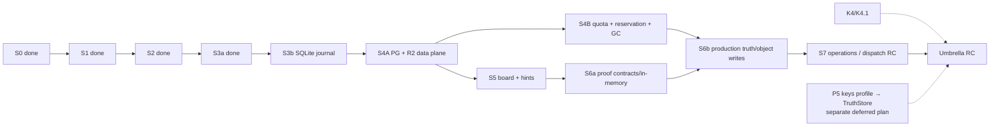

# BYOK 架构文档与 Sprint 方案审查报告

> 审查对象：
> - `sdk-architecture.md`（1,756 行，23 个 Mermaid block）
> - `20260807-byok-platform-raft-aligned.sprint.md`（1,374 行，2 个 Mermaid block）
>
> 审查维度：文档内自洽、两文档交叉一致、当前仓库事实、执行可投影性、可靠性、安全、Postgres + R2 储存语义。
>
> 结论：**Conditional Pass / 暂不建议直接投影 S3b contract。** 先收口本文 P0 项，再以 S3b 为下一执行切片。

---

## 1. 总体评价

### 架构文档

优点：

- CURRENT / TARGET / RAFT reference 已有明确区分意识。
- dispatch plane 与 key plane 的安全承诺分离得清楚。
- mailbox → local durable append → ack 的可靠性顺序正确且有 crash matrix。
- SQLite 本地积压、Postgres + R2、quota/reservation、tombstone/reconcile 已形成较完整闭环。
- tenant-first、immutable terminal、revision CAS、no semantic cloud merge 等核心不变量可执行性强。

主要问题：

- 当前事实快照和 package graph 已落后于正文自己描述的 S2/S3a 状态。
- 同一文档中 `core` 同时被写成“零 import、隔离”和“被 cloud 实际 import”。
- S7/P5 映射与 Sprint 文档冲突。
- 储存设计方向正确，但 SQLite driver、R2 hash authority、object lifecycle state machine 等仍未定到可以直接编码的程度。

### Sprint 方案

优点：

- 风险、回滚、negative/crash tests、tenant matrix、release gates 都写得比一般 Sprint 计划完整。
- D-1～D-5 把原提案的变更显式记录，没有静默重排。
- S3a/S3b、S4A/S4B 的拆刀方向合理。
- quota 满额不自动删 durable user data，是正确的产品/安全边界。

主要问题：

- 文档同时扮演 Draft、执行历史、当前进度和未来计划，生命周期混杂。
- 顶部 workflow 和 baseline 已过时。
- D-4 允许一次 schema fingerprint 更新，但全局门禁仍要求整个 golden 目录零差异。
- S3a/S3b 已宣布拆分，但 critical path、milestone、artifact naming 和下一 contract outline 仍以单个 S3/S0 表达。
- S6 的 production truth/memory write 没有依赖 S4B quota/reservation，违反架构自己的“所有 durable upload 先 reserve”不变量。

---

## 2. P0：投影下一 contract 前必须修复

### P0-1 当前事实快照、workflow 与基线失真

**位置**

- 架构：L3–L6，仍写 `a8c2732`。
- Sprint：L3–L12，仍写 `ff2a5d4`，并称 workflow 非 Idle、keys plan active。

**问题**

正文已经把 S2 和 S3a 标成完成，仓库最新状态也已归档 S3a；顶部元数据却停留在更早状态。后续 reviewer 无法判断哪个是权威事实。

**建议**

- 架构顶部改成：

```md
> Verified against: `main@8078519`（2026-08-07）
> Verification scope: CURRENT sections + package graph + completed-slice status
> Volatile workflow status: see `tasks/current.md`; not duplicated here
```

- Sprint 改为：

```md
> Program status: Partially Executed
> Completed: S0, S1, S2, S3a
> Next executable slice: S3b
> Current workflow: generated from `tasks/current.md`, not maintained manually here
```

- CI 增加“文档 snapshot SHA 不得早于最近一次 CURRENT 状态变更”的检查，或由脚本生成状态表。

### P0-2 `@byok/core` 当前状态自相矛盾，package 数量也错

**位置**

- 架构 L25：称 core “仓库内没有任何 import site”。
- 架构 L99：称五个 package。
- 架构 L127–L133：规模表没有 cloud。
- 架构 L145：仍称 core 零边。
- 架构 L934–L945：又明确 `cloud → core`、`cloud → protocol` 是真实边。

**问题**

S3a 之后 core 已被 cloud 接线；monorepo 也至少是六个 package。当前图和规模表会误导依赖审计。

**建议**

- core 状态改为：**已实现、已接线到 cloud；仍未接线到 client/server/keys**。
- package graph 加入 `@byok/cloud`，规模表重新从 live tree 计算 cloud 行。
- 把“零边”缩小为具体 invariant：
  - `core !→ protocol/node`
  - `client/server/keys !→ core`（当前）
  - `cloud → core/protocol`（当前）
- §12 标题不再称 core “隔离”，改为“core 已落地并由 cloud 消费”。

### P0-3 S7/P5 映射冲突

**位置**

- 架构 L1460–L1483：P5 = keys profile → TruthStore，且 S7 对应 P5。
- 架构图 L1498：`S7 truth/keys + release / P5`。
- Sprint L20–L29、L987–L1033：P5 已移出本 Sprint，S7 只做 keys boundary + operations/release。

**问题**

同一 program 有两套 release scope。它会直接影响 S7 contract、RC gate 和 K4 是否阻塞平台发布。

**建议裁定**

采用 Sprint 当前较明确的方案：

- S7 = operations/release RC + keys dependency boundary + K4 parity（如选择 umbrella RC）。
- P5 = **Deferred standalone plan**，触发条件为 K4/K4.1 完成且 TruthStore production composition 可用。
- 架构 crosswalk、Mermaid 和 `Keys -.-> P5` 标签同步修改。
- 明确两个 RC profile：
  1. **Dispatch Platform RC**：不被 K4 阻塞；
  2. **Umbrella BYOK RC**：要求 K4 golden parity。

否则一个独立跨仓库协作项会无意中阻塞整个 dispatch platform 发布。

### P0-4 Protocol golden 门禁互相矛盾

**位置**

- Sprint D-4（L63–L69）：允许 `v1.frozen.json` 因 additive `task.claim.capabilities` 重生成一次。
- Sprint L94、L180、L197、L289、L1079、L1283、L1321、L1370：仍要求 golden 全目录零变化或 byte-for-byte 不变。
- 架构 L247、L1614：只笼统写 golden 不漂移。

**问题**

历史上已经批准的 additive fingerprint change，会让未来 `git diff --exit-code packages/protocol/src/__tests__/golden/` 依据不同 base 得到不同结果。当前文字无法区分 wire bytes 与 schema fingerprint。

**建议建立双门禁**

1. **Wire corpus gate**：`v1.envelopes.ndjson` 永远 byte-for-byte 冻结。
2. **Schema fingerprint gate**：`v1.frozen.json` 只能经显式 additive amendment 更新；更新后，新 SHA 成为 baseline。
3. `PROTOCOL_VERSION` 仍为 1；breaking shape 必须升 major。
4. DoD 不再对整个历史目录做无基线的 blanket diff；改为检查：

```bash
cmp packages/protocol/src/__tests__/golden/v1.envelopes.ndjson \
    .ai/baselines/protocol-v1.envelopes.ndjson

repo-harness run verify-protocol-fingerprint \
  --baseline .ai/baselines/protocol-v1.frozen.sha256 \
  --allow-change-only-with tasks/contracts/<approved-amendment>
```

5. 最终成功标准改为：“wire corpus 不变；schema fingerprint 只包含已批准 additive delta”。

### P0-5 Sprint 生命周期混杂：Draft、历史和执行计划同时存在

**位置**

- Sprint L3–L12：Draft / Ready for contract projection。
- S0/S1/S2/S3a 大量 `[x]`，且 S3a 已完成。
- L1245 起仍提供已完成 S0 的 contract outline。

**问题**

reviewer 无法知道它是 proposal、program ledger，还是下一次可执行计划。继续往里追加会越来越难审。

**建议**

优先采用二文件模型：

- `plans/programs/byok-platform.program.md`：路线、crosswalk、已完成 evidence、风险和 release gates。
- `plans/plan-...-s3b-local-journal.md`：当前唯一可执行切片。

若坚持单文件，至少把状态改为 `Partially Executed`，每个 Sprint 增加：`Status / Merge SHA / Acceptance receipt / Next dependency`，并把 S0 contract outline 替换为 S3b outline。

### P0-6 S3a/S3b 只在说明和 checkbox 中拆开，依赖图仍未拆

**位置**

- Sprint D-5（L71–L77）已宣布拆分。
- Critical path L128–L149 仍只有 S3。
- Milestone L225–L237、Alpha L1315–L1321 仍写“S3 完成”。
- artifact names L1232–L1236 仍只有 `s3-cloud-mailbox-local-journal`。

**建议**

改为：

```text
S2 → S3a (done) → S3b → S4A
                         ├→ S4B
                         └→ S5
```

Alpha 明确在 **S3b** 后关闭。新增 `s3b-sqlite-local-journal` artifact slug，并把 GAP-015 落点统一为 S3b。

### P0-7 S4A 没有 object manifest，却要求 transactional truth reference

**位置**

- S4A schema L643–L658 不含 `object_manifest` / `object_reference`。
- S4A object tests L676–L688 要求“object exists before truth reference”。
- S4B L730–L740 才加入 manifest/reference。
- 架构 L1337–L1342 要求 truth 只引用 committed manifest。

**问题**

没有 Postgres manifest，S4A 无法把 R2 object existence 变成可交易、可审计的 truth prerequisite。仅靠 R2 HEAD 不是事务性引用模型。

**建议**

把以下两表移入 S4A：

- `object_manifest`
- `object_reference`

S4A 负责 object identity、committed state 和引用完整性；S4B 再增加 entitlement、usage、reservation、retention、GC cursor/tombstone。这样 S4B 是容量控制增强，不是补回 S4A 数据面的基本真相表。

### P0-8 S6 缺少对 S4B 的生产依赖

**位置**

- Critical path 只画 `S4B → S7`。
- S6 L882–L887 只依赖 S5/S1/S2。
- 架构 L1214、L1396–L1410 明确所有直接 R2 durable write 必须先 reservation。

**问题**

S6 要落 terminal/memory object，而生产写入不能绕过 S4B quota/reservation。否则 S6 的 acceptance 可能在一个违反架构不变量的临时路径上通过。

**建议**

选择其一：

- 简单方案：增加 `S4B → S6`，S6 直接依赖 S4B；
- 并行方案：拆 S6a（proof/schema/in-memory）与 S6b（production truth/object write），只有 S6b 依赖 S4B。

RC 前 production proof write capability 不得默认开启在无 reservation 的 composition 上。

---

## 3. P1：重要优化建议

### P1-1 S2 的“零实现”措辞错误

Sprint crosswalk L24 称 P0 “零实现”，但 S2 stories/acceptance 明确包含 InMemory reference implementation。改成：

> 零 production adapter；包含 reference-only InMemory implementation 与 conformance harness。

### P1-2 SQLite driver 和 runtime/packageability 尚未裁定

架构定义了 SQLite contract，但未指定：

- Node 20 下使用什么 driver；
- Node 22 `node:sqlite`、native addon 或 host-injected driver 的支持矩阵；
- Bun/SEA/Windows 的打包与 native binary 分发；
- schema migration、`user_version`、备份与恢复；
- 多进程 singleton/lock 和 network filesystem 禁止项。

S3b 进入 Executing 前必须新增 ADR。最低验收：Node 20/22、macOS/Linux/Windows、Bun/SEA package smoke；不能在 unsupported runtime 静默退回 JSONL。

### P1-3 Raw envelope 是敏感持久数据，隐私章节没有覆盖

SQLite journal 保存 raw envelope bytes，可能含 instruction/prompt；隐私章节只明确“不写日志/metrics”。建议新增 data classification：

- journal raw bytes 属 sensitive local content；
- 文件/DB 权限与 DACL；
- support bundle 明确排除；
- backup/export/redaction policy；
- retention 与用户删除语义；
- 是否提供 OS-key-backed column/database encryption，由 threat model 决定；
- 大 instruction 优先保持 blob ref，不复制完整 body。

### P1-4 本地 cleanup 需要正式两阶段删除协议

当前有 crash test，但未写清状态机。建议：

```text
eligible → quarantined/trash → grace_elapsed → deleting → deleted
                         ↘ cancel/restore
```

并定义 workspace ownership：

- `daemon_generated` 才可能自动删；
- `user_provided` 永不自动删；
- canonical path 必须在 daemon-owned root 内；
- 禁止 symlink/path traversal；
- file delete 与 SQLite metadata 更新均幂等；
- hard-pressure cleanup 也不能绕过 grace，除非只有 rebuildable cache。

### P1-5 本地 emergency reserve 未定义

“hard pressure 仍允许 terminal flush”在磁盘已满时不一定成立。建议预留一个受控的 emergency budget（例如预分配 reserve file 或独立 bounded journal reserve），专门保证：

- 最小 terminal/error metadata；
- recovery marker；
- clean shutdown state。

定义 reserve 耗尽后的 fail-closed 行为和告警。

### P1-6 R2 hash authority 不够明确，不能只写 HEAD/metadata

当前设计把 key 做成 SHA-256 content address，并在 finalize 写“HEAD/metadata 验 size/hash/type”。但必须明确 hash 是谁可信地计算并由 R2 保留。不能相信 uploader 自己写入的 custom metadata。

建议 S4A 在 ADR 中选定一种可证明路径：

1. 服务端/Worker 代理上传并在 `put` 时提交、校验 SHA-256；或
2. direct presigned PUT 后由可信服务流式 GET 并重新计算 full-object SHA-256，再把 manifest 标为 committed；或
3. 采用 R2 明确支持并可在 HEAD 中读取的受签 checksum 协议，且为 multipart 定义完整算法。

在该 ADR 完成前，`presign/hash/HEAD` 不应作为一个看似已闭合的 story 名称。S4A 可以先交付 server-side object adapter；public direct upload 到 S4B reservation/finalize 后再开放。

### P1-7 明确 object/reservation 状态机与 DB constraints

建议至少：

```text
reservation: reserved → upload_observed → finalized | aborted | expired
object:       staged → committed → delete_pending → deleted
reference:    active → released
```

关键约束：

- unique `(tenant_id, reservation_id)`；
- unique `(tenant_id, content_hash)`；
- finalize/abort CAS；
- DB time 决定 expiry；
- `delete_pending` 时禁止新 reference，或先 CAS 取消删除；
- worker 删除前再次检查 state/refcount；
- response loss 后 exact replay 返回原结果。

### P1-8 `storage_usage` 应是可重建投影，不是第二份真相

把 authority 写清：

- object manifest/reference/reservation rows 是事实；
- `storage_usage` 是事务维护的 materialized aggregate；
- reconciler 可从事实表重建；
- drift 指标必须可见；
- 超限裁决只在 usage row 锁定并确认版本后进行；
- 负值由 DB check constraint 禁止。

### P1-9 Quota 除 bytes 外必须有 count/rate 维度

仅限制 bytes 不能防止百万个零字节对象/引用/未完成 reservation。建议把 operational limits 形成正式契约：

- `maxObjectCount`
- `maxReferenceCount`
- `maxOpenReservations`
- `maxMailboxRows` / `mailboxLimitBytes`
- `maxRecordCountByKind`
- reservation/upload rate limit

价格仍归 host；这些是平台保护，不是 billing plan 名称。

### P1-10 logical quota 与供应商账单必须分开

明确：

- SDK quota 是 tenant logical usage；
- 不声称等于 R2/Postgres 实际账单；
- inline bytes 用确定的 UTF-8/canonical encoded length；
- object version、dedupe、pending delete 何时计费必须固定；
- `delete_pending` 在 R2 实际成功删除前仍算 committed，避免先减 quota 后留下孤儿。

### P1-11 Entitlement 控制面要补认证与审计语义

`PUT /admin/storage-entitlements/:tenantId` 应明确：

- 只接受 `ControlPlanePrincipal`；
- version CAS；
- `effectiveAt`、source/reason、actor；
- idempotency key；
- audit record；
- control plane unavailable 时 cloud 使用已持久 entitlement，不临时猜 free/pro。

### P1-12 Dead-letter 需要产品可操作面

“未 ack mailbox 过期进入 dead-letter”还需要定义：

- task/board 的可见状态；
- 是否可 requeue；
- 谁能 abandon；
- retention 与告警；
- 是否计入 mailbox quota；
- 不能把 dead-letter 自动映射成 wire Failed。

### P1-13 R2 tenant key 不建议直接使用业务 tenant ID

`tenants/<tenantId>/...` 可能把业务 ID 暴露给对象日志、运维控制台或 support tooling。建议使用不可读的 `tenantStorageNamespace`（随机 UUID 或 server-side 派生 opaque id），Postgres 负责 tenant→namespace 映射；仍保持 tenant-scoped、不跨租户 dedupe。

### P1-14 S4A/S4B 与 direct upload 的 capability 开关

S4A 可实现 R2 adapter，但在 S4B reservation/GC 完成前：

- direct upload/presign capability 默认 off；
- 只允许测试或 server-controlled internal write；
- 生产部署不得宣称 durable hosted storage ready。

这应进入 capability 和 release gate，而不只写在 prose。

### P1-15 `四套状态` 命名不准确

truth record 是一致性/版本模型，不是第四个状态机。建议标题改为：

> 三套状态词汇 + 一套 truth concurrency model

### P1-16 避免两套 P1/P2/P3 语义

架构前半用 P1/P2/P3 表示尽调层级，后半用 P0–P5 表示交付阶段，即使 §12.8 有解释，认知成本仍高。建议前者改为：

- Map：架构地图
- Trace：端到端链路
- Decision：设计裁定

### P1-17 source line references 易漂移

当前大量引用 `file.ts:line`。建议：

- current code 证据优先写 symbol + test name + verified commit；
- 只有冻结研究快照保留 line number；
- CI 对 referenced symbol/test existence 做轻量检查。

### P1-18 Release gate 应区分 dispatch RC 与 umbrella RC

当前 S7 依赖 K4，但 P5 又已移出。建议明确：

- Dispatch RC：S3b–S6 + operations gates；
- Full umbrella RC：额外要求 K4/K4.1 和 keys parity。

如此 K4 协作延误不会阻塞独立可发布的 hosted dispatch platform。

---

## 4. P2：文档与执行体验优化

1. 在架构开头加一页“当前状态矩阵”，列 package、CURRENT 状态、最后验证 SHA、下一 gap。
2. 把 1,700+ 行 canonical 文档拆成 index + current architecture + target platform + storage/retention + ADR ledger；canonical index 仍只有一个。
3. 每个 Sprint story 增加 `Owner / Depends on / Evidence / Rollback / Status`，减少在多章节追踪。
4. 稳定 story ID，不再写“编号顺移”；已发布计划的 ID 不应重编号。
5. S3b 单独给出 contract outline，删除或归档 S0 outline。
6. 增加 property/state-machine tests：reservation/GC、usage invariant、dead-letter、cleanup 两阶段状态机。
7. 增加 SQL constraints 清单：non-negative usage、state enum/check、tenant-prefixed unique、expiry/state CAS。
8. 增加 schema migration compatibility matrix：fresh install、N→N+1、interrupted migration、read-old/write-new、rollback app with additive schema。
9. 在 Mermaid 中用视觉样式区分 CURRENT / PARTIAL / TARGET / DEFERRED，而不是只靠段落文字。
10. Release gate 的“no Pri-0/Pri-1 unresolved”改为“无 release-scope Pri-0；所有 release-scope Pri-1 已关闭或有正式 accepted waiver”。

---

## 5. 建议的修订顺序

### Patch A：事实与治理收口（先做）

- 更新 SHA/workflow/status。
- 修正 core/cloud package graph、package count、scale table。
- 统一 S7/P5。
- 统一 protocol golden policy。
- 把 program 状态改为 Partially Executed。

### Patch B：把下一刀变成真正的 S3b plan

- critical path 拆 S3a/S3b。
- 新增 S3b contract outline。
- 决定 SQLite driver/runtime/package matrix。
- 完成本地 sensitive-data、emergency reserve、two-phase cleanup ADR。

### Patch C：修正 S4A/S4B 数据依赖

- object manifest/reference 移入 S4A。
- S4B 保留 entitlement/usage/reservation/GC。
- direct upload capability 在 S4B 前 default-off。
- 完成 R2 hash authority ADR。

### Patch D：修正 production dependency graph

- 增加 `S4B → S6b` 或直接 `S4B → S6`。
- 定义 dispatch RC 与 umbrella RC。
- P5 保持独立 deferred plan。

---

## 6. 建议后的关键路径



---

## 7. 最终审查裁定

- **架构方向**：通过。
- **本地 SQLite / cleanup 方向**：通过，但 driver、敏感数据和两阶段删除 ADR 未完成。
- **Postgres + R2 / quota 方向**：通过，但 object manifest 分层、可信 hash 验证和 S6 dependency 必须修。
- **文档事实一致性**：不通过，需先修 P0-1～P0-4。
- **Sprint 可直接投影性**：不通过，需先把 lifecycle 和 S3b contract 收口。
- **建议下一 contract**：`s3b-sqlite-local-journal`，但只能在 Patch A 与 SQLite ADR 完成后投影。

---

## 8. 验收裁定（2026-08-08）

**验收基线**：`main@880e69f`（2026-08-08）。核实方式：逐条对照两份被审文档与仓库实际状态——git 历史、`packages/` 源码、`tasks/archive/`。

### 8.1 总裁定更新

第 7 节的「暂不建议直接投影 S3b contract」已被事实超越：S3b 已于 2026-08-08 以 slug `s3b-local-journal` 执行完成并 merge（PR #22，`5a03c7f`），下一可执行切片为 **S4A**。

但审查指出的文档问题本身全部属实：两份文档在 PR #22 之后未再修订，P0-1～P0-8 以及抽查的 P1 各条在本验收基线下逐条核实成立。

### 8.2 P0 逐条裁定

| 条目 | 裁定 |
|------|------|
| P0-1 事实快照/workflow/基线失真 | 采纳，已落地（2026-08-08） |
| P0-2 core/cloud package graph 自相矛盾 | 采纳，已落地（2026-08-08） |
| P0-3 S7/P5 映射与 RC 定义冲突 | 采纳，已落地（2026-08-08） |
| P0-4 protocol golden policy 不一致 | 采纳，已落地（2026-08-08） |
| P0-5 program/plan 生命周期混杂 | 采纳，已落地（2026-08-08） |
| P0-6 S3a/S3b artifact naming 与 critical path | 采纳，已落地（2026-08-08） |
| P0-7 object manifest 分层与 hash authority | 采纳，已落地（2026-08-08） |
| P0-8 S6 缺 quota/reservation 依赖 | 采纳，已落地（2026-08-08） |

四处落地方式与审查建议不同：

1. **P0-1**：基线更新为 `880e69f`，而非审查建议的 `8078519`——HEAD 已前移。Completed 含 S3b，next slice = S4A。
2. **P0-5**：采单文件修正案（`Status: Executing` + `## PRD`/`## Backlog` 两段承载剩余 backlog；「部分执行」语义由文首各 sprint merge SHA 清单承载——harness 状态词表不接受 `Partially Executed`），未拆 program/plan 两个文件。S0 outline 替换为 **S4A** outline——审查建议的 S3b outline 已无意义，S3b 已交付。
3. **P0-6**：artifact slug 采实际已执行的 `s3a-cloud-mailbox` / `s3b-local-journal`，而非审查建议的 `s3b-sqlite-local-journal`。GAP-015 在 sprint 文档中无命中，该子项 no-op。
4. **P0-8**：采简单方案 `S4B → S6` 直接依赖，未拆 S6a/S6b。若 S6 需要并行推进再拆。

### 8.3 P1 裁定

- **P1-1、P1-15**：采纳，已落地。
- **P1-18**：采纳，已随 P0-3 落地（Dispatch Platform RC / Umbrella BYOK RC 双 profile）。
- **P1-16**：缓议。§12.8 已有两套 P 记号的解释，改名（Map/Trace/Decision）收益低于全文锚点漂移成本。
- **P1-2**：作为 S3b 投影门槛已过时（S3b 已交付）。SQLite driver / runtime / 打包矩阵的文档化缺口仍在，记账。
- **P1-3～P1-14、P1-17**：采纳为方向，不在本轮文档修订中落地，记账至 `tasks/todos.md`，落点为 S4A/S4B/S6 的 planning 与 contract 投影。注：`docs/researches/s4a-dataplane-design.md` 已在回应 P0-7/P1-6 方向；R2 hash authority 为待做决策，须先形成 ADR（该研究文档尚未覆盖该决策），并作为 S4A 投影前置。

### 8.4 P2 与 CI 自动化

- **P2（10 条）**：采纳为文档治理方向，记账，不本轮执行。
- **CI 自动化建议**（P0-1 的 snapshot 检查、P0-4 的 verify-protocol-fingerprint、P1-17 的 symbol existence 检查）：记账，待 harness checks 扩展时实作。

### 8.5 落地证据

修订落于 `docs/architecture/sdk-architecture.md` 与 sprint 文档 `plans/sprints/20260807-byok-platform-raft-aligned.sprint.md`（见其 D-8 修订记录），行级明细见 git 历史。
